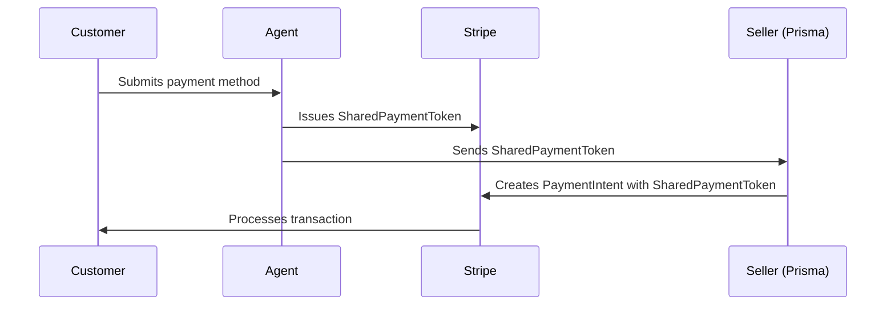

If your billing already runs through Stripe, you don't need a new vendor relationship to get a production Postgres database. [Stripe Projects](https://docs.stripe.com/projects?utm_source=prisma) lets you add [Prisma Postgres](https://www.prisma.io/docs/postgres) to your project with one command. Because the whole flow runs in your terminal, you can let your agent do it.

## Why this exists

Coding agents have gotten good at building software but they can't provision the paid infrastructure that software needs: a database, a host, anything with a card behind it. That's the wall every agentic workflow hits: it can write the app, but it has to stop and wait for a human to go sign up, verify an email, and enter a credit card.

Stripe Projects is Stripe's answer to that wall. It's their entry into the agent-tooling race, with a distinct angle: instead of just helping agents _make_ things, it lets them _pay_ for them, safely, through a new primitive called Shared Payment Tokens (SPTs). Run `stripe projects init` and Stripe scaffolds a project for your agent: skills, a readme, and commands, plus a vault that fills with secrets as you add services. That's the starting point.

Prisma Postgres is now a provider on it. Which means an agent can go from "I need a database" to a live connection string without a human in the loop, and without a second vendor relationship, since the payment and identity you already have with Stripe carry over. And soon, full applications too, via Prisma Compute. More on that below.

## Getting started

From your project directory, set up Stripe Projects:

```bash
stripe projects init
```

```text
✓ Authenticated with Stripe

  Project    demo
  Account    Prisma Testing
  Email      example@prisma.io ✓ Verified
  Providers  ✓ Prisma

  ✓ Created .projects/
  ✓ Created .agents/skills/stripe-projects-cli/
  ✓ Created .claude/skills/stripe-projects-cli
  ✓ Created .cursor/rules/
  ✓ Created AGENTS.md
  ✓ Created CLAUDE.md

  Your project is ready.
```

That leaves a small scaffold in your repo, the workspace your agent operates in:

```text
.
├── .agents/skills/stripe-projects-cli/SKILL.md
├── .claude/skills/stripe-projects-cli → ../../.agents/skills/stripe-projects-cli
├── .cursor/rules/stripe-projects-cli.mdc
├── .projects/
│   ├── cache/catalog.json    # cached catalog of providers and plans
│   ├── state.json
│   └── state.local.json
├── AGENTS.md
└── CLAUDE.md
```

The skills and editor rules (`.agents`, `.claude`, `.cursor`) are what teach your coding agent to drive Stripe Projects; `.projects/` holds local state. Then add a database, the step you'll usually just hand to your agent:

```bash
stripe projects add prisma/database
```

```text
✓ Prisma already linked (example@prisma.io)
✓ Setting up prisma/free...
✓ Provisioning prisma/database...
    ✓ Resource provisioned
    ✓ Credentials synced
    ✓ Project updated

● prisma/database ready
  ✓ Injected 4 environment variables
  ~ Modified .projects/vault/vault.json
  ~ Modified .env
  ✓ 4 credentials created for Prisma:
      PRISMA_DATABASE_URL=post••••••••
      PRISMA_ACCELERATE_URL=pris••••••••
      PRISMA_DATABASE_ID=cmq••••••••
      PRISMA_REGION=us••••••••
```

Your `.env` now has everything you need to connect:

```bash
PRISMA_DATABASE_URL="postgres://••••••••"                                  # direct connection
PRISMA_ACCELERATE_URL="prisma+postgres://accelerate.prisma-data.net/?api_key=••••••••"  # pooled, via Prisma Accelerate
PRISMA_DATABASE_ID=cmq••••••••
PRISMA_REGION=us-east-1
```

Those credentials live in two places: the canonical copy stays server-side in [Stripe's Secret Store](https://docs.stripe.com/stripe-apps/store-secrets), and locally Stripe Projects keeps an **encrypted** copy in the project vault (`.projects/vault/vault.json`), with your `.env` as the plaintext output for local dev. Both the vault and `.env` are `600`-permissioned and git-ignored by `stripe projects init`, so neither is ever committed. To onboard a teammate you don't pass secrets around: they run `stripe projects env --pull` and fetch their own from the Secret Store.

Notice what _didn't_ happen: no browser opened, no signup form, no credit card. Because you have a Stripe business account, your email is already KYC-verified and tied to a real person, so we create or link your Prisma account right in the CLI (here, `✓ Prisma already linked`). If you don't have a Prisma account yet, we create a claimable one from that email; if you already do, we link it and never touch your existing workspaces. Either way we spin up a new dedicated workspace for the link, and if a teammate on the same Stripe account adds Prisma too, we add them to that workspace automatically, no invites to manage.

## Spending limits, the Stripe way

This is where SPTs earn their keep. An SPT is a payment credential, backed by a real payment method like a card, that carries a spending limit _you_ set. The first time you upgrade a plan, your agent will ask you to confirm a payment method and create one for you, backed by that method. You instantiate the underlying method through Stripe's UI (the flow hands you a link), and from there you set a monthly limit, either per provider or a single global cap across everything in your project.

Here's the shape of it: your agent issues the token, hands it to the seller, and Stripe settles the charge against your limit.



The payoff: cost control isn't something each provider implements on its own, leaving you to find out it didn't work when the invoice shows up. The limit lives with Stripe and is enforced at the token, and it covers everything billed against it: both the plan subscription and any usage overages on top of it. If a plan upgrade costs more than your limit allows, it's rejected before anything changes. And as usage runs through the cycle, overage charges count against the same cap, so your total spend can't quietly climb past the number you set.

## Managing your plan

There are four plans and you can see them any time with `stripe projects catalog prisma`:

| Plan       | Price   | Included per billing cycle          | Overages           |
| ---------- | ------- | ----------------------------------- | ------------------ |
| `free`     | Free    | 100k queries, 0.5 GiB-month storage | None (hard limits) |
| `starter`  | $10/mo  | 1M queries, 10 GiB-month storage    | Metered            |
| `pro`      | $49/mo  | 10M queries, 50 GiB-month storage   | Metered            |
| `business` | $129/mo | 50M queries, 100 GiB-month storage  | Metered            |

When the free tier gets tight, upgrade from the same CLI, or ask your agent to:

```bash
# Upgrade to the Pro plan
stripe projects upgrade prisma-plan pro
# ✓ Plan price checked against your SPT spending limit first
# ✓ Workspace subscription created, billed through Stripe
# ✓ Plan applies immediately
```

Upgrades are immediate and before you are charged, the plan price is checked against your SPT spending limit. If it doesn't cover the price, the upgrade is rejected and nothing changes. Because the new plan takes effect right away, Stripe bills a prorated amount for the rest of the current cycle on the spot, then the full price from the next one. The plan applies to your whole Stripe Projects workspace, so every database you've added shares it.

Downgrading is the same command pointed at a smaller plan:

```bash
# Downgrade back to the free plan
stripe projects upgrade prisma-plan free
# ✓ Plan changed immediately
```

Plan changes through Stripe Projects are immediate in both directions: downgrades take effect right away, not at the end of your billing cycle, just like upgrades.

## Day-to-day

Two commands cover most of what you'll reach for:

```bash
# Where do I stand?
stripe projects status

# Take me to my project in the Prisma Console
stripe projects open prisma
```

`status` shows what's provisioned and on which plan. `open` mints a single-use link that drops you straight into your workspace dashboard in the Prisma Console, already authenticated as the right account. If you're signed into the Console as someone else, it tells you instead of silently mixing accounts. You never _have_ to open the Console, but it's there when you want it.

## Cleaning up

Tearing down is just as direct:

```bash
# Remove the database
stripe projects remove prisma-database
# ✓ Database deprovisioned immediately, access credentials invalidated
# ✗ Your plan is NOT changed. Downgrade separately if you want that

# Disconnect Prisma from this project entirely
stripe projects unlink prisma
```

Removing a database and changing your plan are deliberately decoupled: deleting a database never silently touches your billing. If you're removing your last database and want to stop paying, downgrade the plan too:

```bash
stripe projects upgrade prisma-plan free
```

## What's next

The database is the first piece. [Prisma Compute](/launching-prisma-compute-public-beta), our TypeScript app hosting that runs on the same infrastructure as your database without sending traffic through a separate hosting vendor, recently launched in public beta and is coming to Stripe Projects next. Once it lands, the same flow gets you a deployed app right next to that database: describe an idea to your agent, and it stands up a running app with a permanent URL and a database already wired in. Then hand that URL to a colleague to try, comment on, and build on with you, all without leaving the CLI you started from. Quick revenue dashboard, internal tool, throwaway demo: it's a prompt away.

If your billing already lives in Stripe, try it: `stripe projects add prisma/database` and you're a connection string away from a real Postgres database, with a spending limit you set before we could ever bill you.
