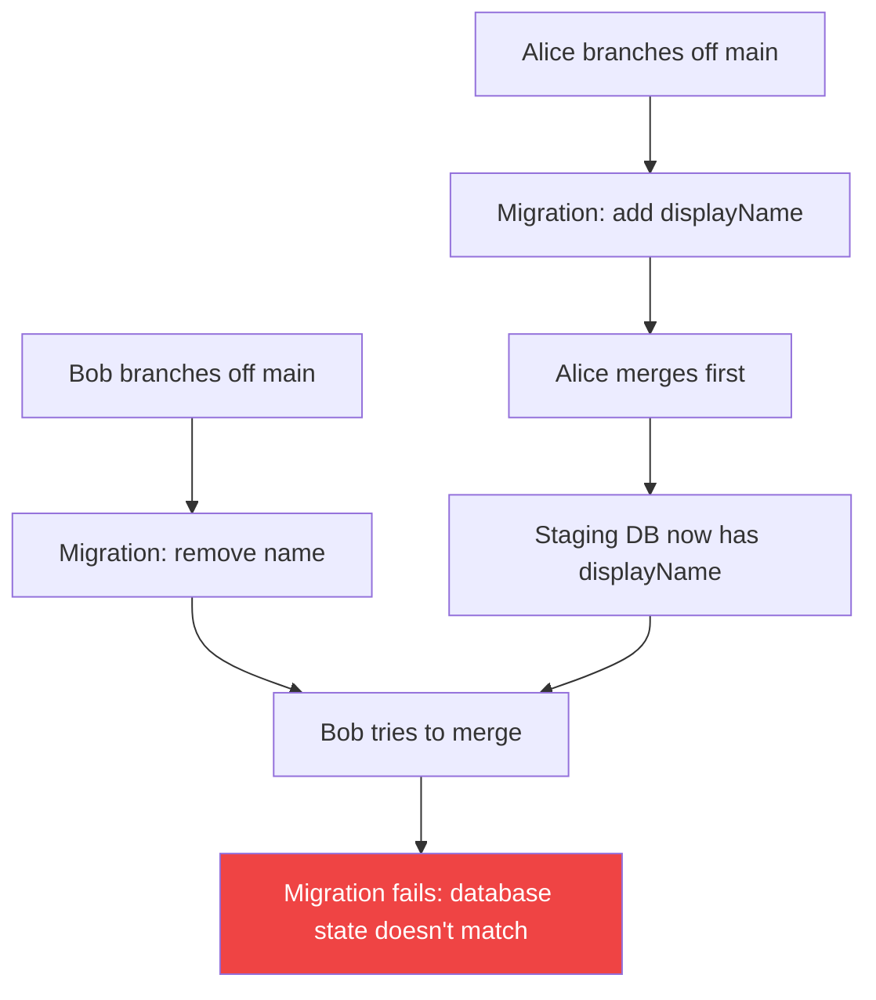
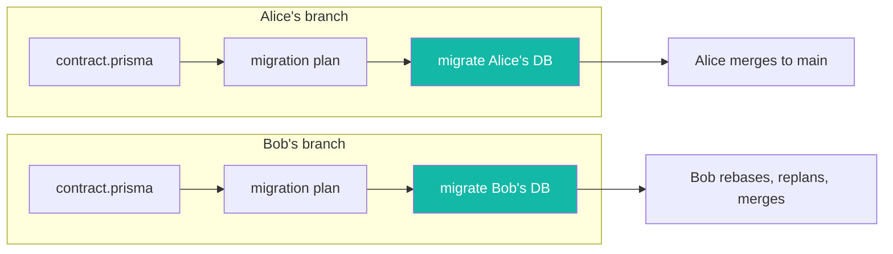
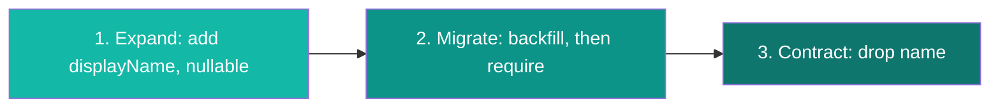

import {
  deployTerminalLines,
  expandContractBefore,
  expandContractAfter,
  expandTerminalLines,
  contractContractBefore,
  contractContractAfter,
  contractTerminalLines,
} from "./snippets";

**Give every branch its own database, and risky schema changes become routine.** [Prisma Compute](https://www.prisma.io/docs/compute) provisions an isolated [Prisma Postgres](https://www.prisma.io/docs/postgres) database for each branch you deploy with its `--db` flag. Migrations from different pull requests stop colliding, and a destructive change gets a full rehearsal of its migration sequence on real infrastructure before it touches production.

This post walks through the workflow: why a shared staging database breaks under concurrent schema changes, how per-branch databases remove the conflict, and how to rehearse a destructive change end-to-end with the expand-and-contract pattern.

:::note

Three Prisma products appear here, each with one job:

- **Prisma Compute** (Public Beta) hosts your app and provisions a database for each branch you deploy with `--db`. It provides the isolation. Its CLI is `@prisma/cli`.
- **Prisma Postgres** is the database each branch gets.
- **[Prisma 8](https://www.prisma.io/docs/orm)** (Release Candidate) provides the migration toolchain in the examples, via the unified Prisma CLI (`npx prisma@latest`). The same workflow also works with Prisma 7's `prisma migrate deploy`.

:::

## Why a shared staging database breaks

A shared staging database has one state. Concurrent branches need different ones. When two developers change the schema in the same sprint, they collide:

1. Alice branches off `main`, adds a `displayName` column, and migrates the shared staging database.
2. Bob branches off `main`, removes a legacy `name` column, and migrates the same database.
3. Alice merges first. Her migration becomes the new baseline on `main`.
4. Bob tries to merge. The staging database now reflects Alice's schema, not the one his migration was written against. His migration fails, or worse, half-applies.



[Prisma 8 migrations](https://pris.ly/ts-migrations-pn) make this failure precise instead of silent: every migration records the contract state it starts `from` and the state it moves `to`, and the runner refuses to apply a migration against a database in the wrong state. Bob gets a hard error instead of a corrupted staging environment.

The conventional workarounds all paper over the same root cause:

- **Rebase and replan**: Bob replans his migration against Alice's baseline and hopes it still does what he intended. Works for additive changes, gets fragile with data transformations.
- **Reset staging on every merge**: re-apply every migration from scratch. Technically sound, but it destroys the data your integration tests rely on.
- **Sequential merges**: only one person touches the schema at a time. The de facto standard, and the slowest option.

The root cause is one database serving multiple migration timelines, so the fix is one database per timeline.

## One database per branch

On Prisma Compute, a branch is a real resource that owns its own app and its own database. Deploy a branch name that doesn't exist yet and Compute provisions an isolated environment for it:

<AgentPrompt
  prompt="Deploy this branch to Compute with its own database."
  skill="prisma-cli"
  terminalCommand="npx @prisma/cli@latest app deploy --branch remove-legacy-name --db"
  terminalLines={deployTerminalLines}
/>

Alice's branch gets a database with her schema. Bob's branch gets a database with his. Neither can break the other, and neither needs to rebase until merge time. When Bob does rebase after Alice merges, he replans against the updated contract and tests the result on his own branch database first.



Isolation solves the concurrency problem. It also gives you a safe place to rehearse changes that are dangerous by nature: expand-and-contract migrations.

## Rehearse the risky change: expand and contract

Renaming a column, changing a type, dropping a field that production code still reads: one big migration for any of these breaks whatever is running while it applies. The safe version splits the change into three small, individually harmless migrations:

1. **Expand**: add the new schema next to the old. Both code paths work.
2. **Migrate**: backfill data from old to new, inside a migration.
3. **Contract**: remove the old schema once nothing reads it.

The pattern is well known and rarely practiced, because rehearsing a three-migration sequence on a shared database is exactly the kind of multi-deploy work that collides with everyone else. On a branch database, you run the whole cycle in isolation, verify each step, and only then promote it to production.

Here's the cycle for replacing a legacy `name` column with `displayName`: the same two columns from the Alice and Bob story, now done properly as one deliberate sequence on one branch.

### Step 1: Expand

Add `displayName` as nullable, so existing code that only knows about `name` keeps working:

<AgentPrompt
  prompt="Add a displayName column to User without breaking the code that still reads name."
  language="prisma"
  fileName="contract.prisma"
  skill="prisma-next-migrations"
  before={expandContractBefore}
  after={expandContractAfter}
  terminalCommand="npx prisma@latest migration plan --name add_display_name"
  terminalLines={expandTerminalLines}
/>

The planner turns the contract diff into a TypeScript migration:

```typescript
// migrations/app/20260724T1000_add_display_name/migration.ts (excerpt)

override get operations() {
  return [
    this.addColumn({
      schema: "public",
      table: "user",
      column: col("displayName", "text", { codecRef: { codecId: "pg/text@1" } }),
    }),
  ];
}
```

Apply it to your branch database with `npx prisma@latest migrate` and deploy the branch. Old code still reads `name`; new code can start writing `displayName`.

### Step 2: Migrate

Next, make `displayName` required in the contract:

```prisma
// contract.prisma
model User {
  id          Int    @id @default(autoincrement())
  email       String @unique
  displayName String // was String?
  name        String // still here until step 3

  @@map("user")
}
```

```bash
npx prisma@latest migration plan --name require_display_name
```

The planner can write the `SET NOT NULL` itself, but only you know what existing rows should contain, so it scaffolds a backfill placeholder in front of the constraint and leaves the query to you. The backfill lives [inside the migration](https://pris.ly/data-migrations-pn) as a `dataTransform`, written with the same type-safe query builder you use in your app, instead of a standalone script that runs outside your migration history. Filled in:

```typescript
// migrations/app/20260724T1100_require_display_name/migration.ts (excerpt)

override get operations() {
  return [
    this.dataTransform(endContract, "backfill-user-displayName", {
      check: () =>
        db.public.user
          .select("id")
          .where((f, fns) => fns.eq(f.displayName, null))
          .limit(1),
      run: () =>
        db.public.user
          .update((f, fns) => ({
            displayName: fns.raw`COALESCE(${f.name}, 'Anonymous')`.returns("pg/text@1"),
          }))
          .where((f, fns) => fns.eq(f.displayName, null)),
    }),
    this.setNotNull({ schema: "public", table: "user", column: "displayName" }),
  ];
}
```

`check` asks "are there rows that still need this?" and `run` performs the change, here copying each row's `name` into `displayName`. Every migration folder carries a snapshot of the contract as it stood at that point in history, and both queries are typed against this migration's snapshot rather than your live schema. That's why the query can reference `name` even though a later migration drops it.

After editing, recompile with `node migration.ts`. The `dataTransform` compiles to the same `precheck` / `execute` / `postcheck` JSON as every other operation: reviewers read your intent in `migration.ts` and the exact SQL in `ops.json`, and production only ever runs the compiled JSON, never your TypeScript. See [Editing a migration](https://www.prisma.io/docs/orm/migrations/editing-a-migration) for the full file, including the wiring that builds the typed `db` handle.

Run it against the branch database and check the data. Seed the branch database with realistic data first; an empty database proves the sequence applies cleanly, but only a real-shaped dataset tells you anything about the backfill. Nothing has touched production yet.

### Step 3: Contract

Once all code reads `displayName` and the backfill is verified, remove the old column:

<AgentPrompt
  prompt="Nothing reads the legacy name column anymore. Remove it."
  language="prisma"
  fileName="contract.prisma"
  skill="prisma-next-migrations"
  before={contractContractBefore}
  after={contractContractAfter}
  terminalCommand="npx prisma@latest migration plan --name drop_legacy_name"
  terminalLines={contractTerminalLines}
/>

Plan, apply, deploy. Three small migrations, and the whole sequence rehearsed on a branch database before production sees any of it.



## Roll forward, not back

Rollbacks are the wrong mental model for schema changes, and that's why the rehearsal matters.

Promoting an earlier deployment on Compute restores your app code, not your schema; the database keeps the state from the most recent migration. On the schema side, Prisma 8 has no `migrate down` and no down-migration files. Rolling back means planning one more migration to a state your database has already been in: the planner diffs the two states, writes the operations that undo the change, and flags destructive ones with a data-loss warning so you can edit the plan before applying it. History stays append-only, `git revert` rather than `git reset`, and no rollback can resurrect the data a dropped column held.

Expand-and-contract keeps every forward step small, and per-branch databases give you a place to rehearse the sequence until it's boring.

## Automate it in CI

Once the manual workflow feels routine, wire it into your pipeline. The sketch below deploys the branch first, with `--db` so a fresh branch gets its database provisioned, then runs migrations and tests against that database:

```yaml
# .github/workflows/branch-preview.yml
name: Branch preview

on:
  pull_request:

jobs:
  deploy-preview:
    runs-on: ubuntu-latest
    steps:
      - uses: actions/checkout@v4

      - uses: actions/setup-node@v4
        with:
          node-version: 24

      - run: npm ci

      - name: Deploy the branch to Compute
        run: |
          npx @prisma/cli@latest app deploy \
            --project my-app \
            --app web \
            --branch "$GITHUB_HEAD_REF" \
            --db \
            --json \
            --no-interactive
        env:
          PRISMA_SERVICE_TOKEN: ${{ secrets.PRISMA_SERVICE_TOKEN }}

      - name: Apply migrations to the branch database
        run: npx prisma@latest migrate --db "$DATABASE_URL"
        env:
          DATABASE_URL: ${{ secrets.BRANCH_DB_URL }}

      - name: Integration tests against the branch database
        run: npm test
        env:
          DATABASE_URL: ${{ secrets.BRANCH_DB_URL }}
```

One piece of wiring is yours to choose: how the migrate and test steps get the branch database's connection string (`BRANCH_DB_URL` above). A single repository secret only serves one branch at a time; for concurrent pull requests, have the job create a connection for its own branch database with `npx @prisma/cli@latest database connection create <database>` using the service token it already holds. Keep any stored value in your own secret store; Compute's [environment variables](https://www.prisma.io/docs/compute/environment-variables) are write-only in beta, so CI can't read them back.

If you [connect the project to GitHub](https://www.prisma.io/docs/compute/github), Compute also creates and tears down platform branches on push and branch-delete events automatically.

## When you don't need this

If you're a solo developer, or your team rarely touches the schema, shared staging is fine. The conflict rate is low enough that an occasional rebase doesn't hurt.

Per-branch databases earn their keep when:

- multiple developers ship schema changes in the same sprint,
- you run expand-and-contract migrations that span multiple deploys,
- your CI runs integration tests against a real database, or
- a migration conflict has ever blocked a release.

## Frequently asked questions

<Accordions type="single">
  <Accordion title="Do per-branch databases copy production data?">
No. Branch databases are not seeded from production: you run migrations against them yourself and seed your own test data. Production data stays in the production database.
  </Accordion>
  <Accordion title="What happens to a branch database when the branch is deleted?">
When the project is connected to GitHub, deleting a Git branch tears down the matching platform branch and the resources it owns. Production and default branches are never removed by cleanup.
  </Accordion>
  <Accordion title="Can I use per-branch databases without Prisma 8?">
Yes. The isolation comes from Prisma Compute's branching model, not from Prisma 8. Prisma 7's `prisma migrate deploy` works against a branch database the same way. This post uses Prisma 8 because its TypeScript migrations and `dataTransform` make expand-and-contract easier to write and review.
  </Accordion>
  <Accordion title="How does this compare to Neon's branching?">
Neon branches copy schema and data from a parent branch by default. Compute branch databases are not copies: your migrations and seeds build them up. Copying is faster for manual poking around; a database built only from your migrations proves they work end-to-end and keeps production data out of previews.
  </Accordion>
</Accordions>

## Try it yourself

[Prisma 8 is in Early Access](/prisma-next-early-access-write-your-contract-prompt-your-agent-ship-your-app). It isn't production-ready yet; Prisma 7 remains the right choice for production today. But the per-branch workflow is ready to try now:

```bash
npx prisma@latest orm init
```

Write a contract, plan a migration, and read the `migration.ts` and `ops.json` it produces. Then, from a feature branch, deploy to [Compute](https://www.prisma.io/docs/prisma-compute/deploy) with `npx @prisma/cli@latest app deploy --db`. The CLI targets your current Git branch, so that one command gives the branch its own database, ready for the expand-and-contract cycle.

Tell us what worked and what didn't on [Discord](https://pris.ly/discord) in the `#prisma-next` channel, and **star [prisma/prisma](https://github.com/prisma/orm) on GitHub** to follow development.
