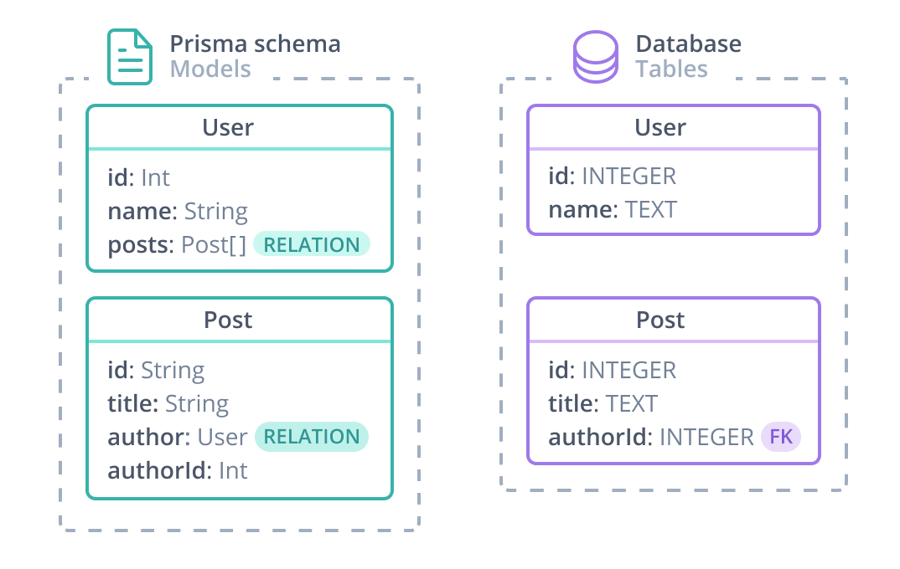

## Overview

> **Note**: If you are upgrading from a Prisma 2.0 Preview version (e.g. `preview025`) and want to adopt the new relation syntax, be sure to check out the [release notes](https://github.com/prisma/prisma/releases) which contain concrete instructions for the upgrade process.

A relation is a _connection_ between two models in the Prisma schema. For example, there is a one-to-many relation between `User` and `Post` because one user can have many blog posts. The following Prisma schema defines a one-to-many relation between `User` and `Post`. The fields involved in defining the relation are highlighted:

```prisma line-number
model User {
  id      Int      @id @default(autoincrement())
|  posts   Post[]
}

model Post {
  id         Int         @id @default(autoincrement())
|  author     User        @relation(fields: [authorId], references: [id])
|  authorId   Int         // relation scalar field  (used in the `@relation` attribute above)
}
```

At a Prisma level, a relation is made up of:

- Two [_relation fields_](#relation-fields): `author` and `posts`. Relation fields are used to define connections between models at the Prisma level and **do not exist in the database**.
- The scalar `authorId` field. This field **does** exist in the database and represents the foreign key that connect a `Post` record to a `User` record.

The following diagram compares the Prisma schema and the original SQL database:



In SQL, you use a _foreign key_ to create a relation between two tables. Foreign keys are stored on **one side** of the relation: each `Post` has an `authorId` (the foreign key), which references the `id` (a primary key) of a `User`.

At a Prisma level, a connection between two models is **always** represented by a [relation field](#relation-fields) on each side of the relation.

## Example

The examples on this page are based on the following schema file:

```prisma
model User {
  id      Int      @id @default(autoincrement())
  posts   Post[]
  profile Profile?
}

model Profile {
  id      Int     @id @default(autoincrement())
  user    User    @relation(fields: [userId], references: [id])
  userId  Int     // relation scalar field (used in the `@relation` attribute above)
}

model Post {
  id         Int         @id @default(autoincrement())
  author     User        @relation(fields: [authorId], references: [id])
  authorId   Int         // relation scalar field  (used in the `@relation` attribute above)
  categories Category[]  @relation(references: [id])
}

model Category {
  id     Int     @id @default(autoincrement())
  posts  Post[]  @relation(references: [id])
}
```

> **Note**: This schema is the same as the [example data model](data-model#example) but has all [scalar fields](data-model#scalar-types) removed (except for the required [relation scalars](#annotated-relation-fields-and-relation-scalar-fields)) so you can focus on the [relation fields](#relation-fields).

## Terminology

### Cardinality

There are three different [cardinalities](<https://en.wikipedia.org/wiki/Cardinality_(data_modeling)>) of relations in Prisma:

- One-to-one (also called 1-1-relation)
- One-to-many (also called 1-n-relation)
- Many-to-many (also called m-n-relation)

In the example above, there are the following relations:

- 1-1: `User` ↔ `Profile`
- 1-n: `User` ↔ `Post`
- m-n: `Post` ↔ `Category`

### Relation fields

Relation [fields](models#fields) are fields on a Prisma [model](models) that do _not_ have a [scalar type](data-model#scalar-types). Instead, their type is another model.

Every relation must have exactly two relation fieds, one on each model. In case of 1-1 and 1-n relations, an additional _relation scalar field_ is required which gets linked by one of the two relation fields in the `@relation` attribute. This relation scalar is the direct representation of the _foreign key_ in the underlying database.

Consider these two models:

```prisma
model User {
  id        Int      @id @default(autoincrement())
  email     String   @unique
  role      Role     @default(USER)
  posts     Post[]
}

model Post {
  id         Int     @id @default(autoincrement())
  title      String
  author     User    @relation(fields: [authorId], references: [id])
  authorId   Int     // relation scalar field (used in the `@relation` attribute above)
}
```

These models have the following fields:

| Model  | Field      | Type     | Relation field               |
| :----- | :--------- | :------- | :--------------------------- |
| `User` | `id`       | `Int`    | No                           |
|        | `email`    | `String` | No                           |
|        | `role`     | `Role`   | No                           |
|        | `posts`    | `Post[]` | **Yes** (Prisma-level)       |
| `Post` | `id`       | `Int`    | No                           |
|        | `title`    | `String` | No                           |
|        | `authorId` | `Int`    | No (_relation scalar field_) |
|        | `author`   | `User`   | **Yes** (_annotated_)        |

Both `posts` and `author` are relation fields because their types are not scalar types but other models.

Also note that the annotated relation field `author` needs to link the relation scalar field `authorId` on the `Post` model inside the `@relation` attribute. The relation scalar represents the foreign key in the underlying database.

The other relation field called `posts` is defined purely on a Prisma-level, it doesn't manifest in the database.

### Implicit vs explicit many-to-many relations

Many-to-many relations can be either implicit or explicit in the Prisma schema.

#### Explicit many-to-many relations

Explicit many-to-many relations define an extra model which represents a _relation table_ (also sometimes called _JOIN_, _link_ or _pivot_ table) in the underlying database:

```prisma
model Post {
  id         Int                 @id @default(autoincrement())
  title      String
  categories CategoriesOnPosts[]
}

model Category {
  id    Int                 @id @default(autoincrement())
  name  String
  posts CategoriesOnPosts[]
}

model CategoriesOnPosts {
  post        Post     @relation(fields: [postId], references: [id])
  postId      Int       // relation scalar field (used in the `@relation` attribute above)
  category    Category @relation(fields: [categoryId], references: [id])
  categoryId  Int      // relation scalar field (used in the `@relation` attribute above)
  @@id([postId, categoryId])
}
```

#### Implicit many-to-many relations

Implicit many-to-many relations define relation fields as lists on both sides of the relation:

```prisma
model Post {
  id         Int         @id @default(autoincrement())
  categories Category[]  @relation(references: [id])
}

model Category {
  id    Int     @id @default(autoincrement())
  posts Post[]  @relation(references: [id])
}
```

Note that both relation fields in a many-to-many relation must be annotated with the `@relation` attribute and _reference_ the fields of the other model they're mapping to.

If a [multi-field ID](data-model#multi-field-ids) was used on `User`, the models would look as follows:

```prisma
model User {
  firstName  String
  lastName   String
  Post       Post[] @relation(references: [id])

  @@id([firstName, lastName])
}

model Post {
  id   Int    @id
  User User[] @relation(references: [firstName, lastName])
}
```

This m-n-relation still manifests in a relation table in the underlying database. However, this relation table is managed by Prisma.

Using an implicit instead of an explicit m-n relations makes the [Prisma Client API](../prisma-client/api) for many-to-many relations a bit simpler (since you e.g. have one fewer level of nesting inside of [nested writes](../prisma-client/relation-queries#nested-writes)).

If you're not using Prisma Migrate but obtain your data model from [introspection](../introspection), you can still make use of implicit many-to-many relations by following Prisma's [conventions for relation tables](#conventions-for-relation-tables-in-implicit-m-n-relations).

### Relation tables

A relation table (also sometimes called _JOIN_, _link_ or _pivot_ table) connects two or more other tables and therefore creates a _relation_ between them. Creating relation tables is a common data modeling practice in SQL to represent relationships between different entities. In essence it means that "one m-n relation is modeled as two 1-n relations in the database".

When using Prisma, you can create relation tables by defining [models](models) similar to how you would model them as tables. The main difference is that the fields of the relation table are both annotated relation fields with a corresponding relation scalar field.

Relation tables are also often used to add "meta-information" to a relation. For example, to store _when_ the relation was created.

Here is an example for a relation table called `CategoriesOnPosts`:

```prisma
model Post {
  id         Int        @id @default(autoincrement())
  title      String
  categories Category[]
}

model Category {
  id    Int    @id @default(autoincrement())
  name  String
  posts Post[]
}

model CategoriesOnPosts {
  post        Post     @relation(fields: [postId], references: [id])
  postId      Int
  category    Category @relation(fields: [catgoryId], references: [id])
  catgoryId   Int
  createdAt   DateTime @default(now())

  @@id([postId, categoryId])
}
```

In this example, the `createdAt` field stores additional information about the relation between `Post` and `Category` (i.e. it stores the point in time when "the post was added to the catgegory").

Note that the same rules as for [1-n-relations](#one-to-many-relations) apply (because `Post`↔ `CategoriesOnPosts` and `Category` ↔ `CategoriesOnPosts` are both in fact 1-n-relations), which means one side of the relation needs to be annotated with the `@relation` attribute.

When you don't need to attach additional information to the relation, you can model m-n-relations as [implicit many-to-many relations](#implicit-many-to-many-relations). If you're not using Prisma Migrate but obtain your data model from [introspection](../introspection), you can still make use of implicit many-to-many relations by following Prisma's [conventions for relation tables](#conventions-for-relation-tables-in-implicit-m-n-relations).

### Annotated relation fields and relation scalar fields

1-1 and 1-n relations require one side of the relation to be _annotated_ with the `@relation` attribute, they're therefore commonly referred to as _annotated relation fields_.

The side of the relation which is annotated with the `@relation` attribute represents the side that stores the foreign key in the underlying database. The "actual" field that represents the foreign key is required on that side of the relation as well, it's called _relation scalar field_ and must be used in the `@relation` attribute on the annotated relation field. A scalar field _becomes_ a relation scalar field when it's used in the `fields` of an `@relation` attribute.

Because a relation scalar field always _belongs_ to a relation field, the two are often named the same but the relation scalar is suffixed with `Id`. For example, assume an annotated relation field is called `author`, the corresponding relation scalar would be called `authorId` according to this convention.

Note that relation scalar fields are read-only in the generated [Prisma Client API](../prisma-client/api). If you want to update a relation in your code, you can do so using [nested writes](../prisma-client/relation-queries#nested-writes).

In **1-1 relations**, you can decide yourself which side of the relation you want to annotate with the `@relation` attribute (and therefore holds the foreign key).

This example annotates the relation field on the `Profile` model:

```prisma
model User {
  id      Int      @id @default(autoincrement())
  profile Profile?
}

model Profile {
  id      Int     @id @default(autoincrement())
  user    User    @relation(fields: [userId], references: [id])
  userId  Int     // relation scalar field (used in the `@relation` attribute above)
}
```

In the code above, the `userId` relation scalar is a direct representation of the foreign key in the underlying database.

This example annotates the relation field on the `Profile` model:

```prisma
model User {
  id         Int       @id @default(autoincrement())
  profile    Profile?  @relation(fields: [profileId], references: [id])
  profileId  Int?      // relation scalar field (used in the `@relation` attribute above)
}

model Profile {
  id      Int     @id @default(autoincrement())
  user    User
}
```

In the code above, `profileId` is a direct representation of the foreign key in the underlying database.

In **1-n-relations**, you must annotate the non-list field with the `@relation` attribute:

```prisma
model User {
  id        Int      @id @default(autoincrement())
  email     String   @unique
  role      Role     @default(USER)
  posts     Post[]
}

model Post {
  id         Int     @id @default(autoincrement())
  title      String
  author     User    @relation(fields: [authorId], references: [id])
  authorId   Int     // relation scalar field (used in the `@relation` attribute above)
}
```

Note that for **1-1 and 1-n relations**, the annotated relation field and its relation scalar field must either _both be optional_ or _both be required_. So, the following would be illegal because `user` is optional but `userId` is required:

```prisma
model User {
  id      Int      @id @default(autoincrement())
  profile Profile?
}

model Profile {
  id      Int     @id @default(autoincrement())
  user    User?   @relation(fields: [userId], references: [id]) // ILLEGAL
  userId  Int     // relation scalar field (used in the `@relation` attribute above)
}
```

With [multi-field IDs](data-model#multi-field-ids), there might also be multiple relation scalars on the same model which are both used in the `@relation`attribute:

```prisma
model User {
  firstName String
  lastName  String
  profile   Profile?

  @@id([firstName, lastName])
}

model Profile {
  id               Int      @id @default(autoincrement())
  user             User     @relation(fields: [authorFirstName, authorLastName], references: [firstName, lastName])
  authorFirstName  String   // relation scalar field (used in the `@relation` attribute above)
  authorLastName   String   // relation scalar field (used in the `@relation` attribute above)
}
```

## The @relation attribute

The `@relation` attribute can only be applied to the [relation fields](#relation-fields), not to [scalar fields](data-model#scalar-types).

It must be added to _every_ relation in your Prisma schema. In [implicit m-n relations](#implicit-many-to-many-relations), it is required on both sides of the relation. In 1-1 and 1-n relations, it is only required on one side.

Here are some example scenarios when the `@relation` attribute is needed, e.g. when:

- you define a 1-1 or 1-n relation, it is required on _one side_ of the relation (with the corresponding relation scalar field)
- you need to disambiguate a relation (that's e.g. the case when you have two relations between the same models)
- you define a [self-relation](#self-relations)
- you need to control how the relation table is represented in the underlying database (e.g. use a specific name for a relation table)

### Signature

```
@relation(_ name: String?, fields: FieldReference[]?, references: FieldReference[]?)
```

> **Note**: The leading underscore in the signature means that the argument name can be omitted.

| Argument     | Type               | Required                                                                              | Description                                                                                                             | Example                                               |
| :----------- | :----------------- | :------------------------------------------------------------------------------------ | :---------------------------------------------------------------------------------------------------------------------- | :---------------------------------------------------- |
| `name`       | `String`           | Sometimes (e.g. to disambiguate a relation)                                           | Defines the name of the relationship. In an m-n-relation, it also determines the name of the underlying relation table. | `"CategoryOnPost"`, `"MyRelation"`                    |
| `fields`     | `FieldReference[]` | On [annotated](#annotated-relation-fields-and-relation-scalar-fields) relation fields | A list of [fields](models#fields) of the _current_ model                                                                | `["authorId"]`, `["authorFirstName, authorLastName"]` |
| `references` | `FieldReference[]` | On [annotated](#annotated-relation-fields-and-relation-scalar-fields) relation fields | A list of [fields](models#fields) of the model on _the other side of the relation_                                      | `["id"]`, `["firstName, lastName"]`                   |

## One-to-one relations

One-to-one (1-1) relations refer to relations where at most one record can be connected on both sides of the relation.

### Example

In the example above, there's one 1-1-relation betwen `User` and `Profile`:

```prisma
model User {
  id        Int       @id @default(autoincrement())
  profile   Profile?
}

model Profile {
  id      Int    @id @default(autoincrement())
  user    User   @relation(fields: [userId], references: [id])
  userId  Int    // relation scalar field (used in the `@relation` attribute above)
}
```

In the code above, the `userId` relation scalar is a direct representation of the foreign key in the underlying database.

This 1-1-relation expresses the following:

- "a user can have zero or one profiles" (because the `profile` field is [optional](models#type-modifiers) on `User`)
- "a profile must always be connected to one user"

In SQL, this is typically modeled as follows:

```sql
CREATE TABLE "User" (
    id SERIAL PRIMARY KEY
);
CREATE TABLE "Profile" (
    id SERIAL PRIMARY KEY,
    "userId" INTEGER NOT NULL UNIQUE,
    FOREIGN KEY ("userId") REFERENCES "User"(id)
);
```

Notice the `UNIQUE` constraint on the foreign key `userId`. If this `UNIQUE` constraint was missing, the relation would be considered a 1-n relation.

You can also define this relation using [multi-field IDs](data-model#multi-field-ids):

```prisma
model User {
  firstName String
  lastName  String
  profile   Profile?

  @@id([firstName, lastName])
}

model Profile {
  id               Int      @id @default(autoincrement())
  user             User     @relation(fields: [userFirstName, userLastName], references: [firstName, lastName])
  userFirstName  String     // relation scalar field (used in the `@relation` attribute above)
  userLastName   String     // relation scalar field (used in the `@relation` attribute above)
}
```

In this case, there are _two_ relation scalar fields on `Profile`. This is what the models map to in SQL:

```sql
CREATE TABLE "User" (
    firstName TEXT,
    lastName TEXT,
    PRIMARY KEY ("firstName","lastName")
);
CREATE TABLE "Profile" (
    id SERIAL PRIMARY KEY,
    "userFirstName" TEXT NOT NULL UNIQUE,
    "userLastName" TEXT NOT NULL UNIQUE,
    FOREIGN KEY ("userFirstName", "userLastName") REFERENCES "User"("firstName", "lastName")
);
```

### Making both sides required in one-to-one relations

When using Prisma, you can "augment" a 1-1-relation and make it required on _both_ sides:

```prisma
model User {
  id        Int      @id @default(autoincrement())
  name      String
  profile   Profile
}

model Profile {
  id      Int    @id @default(autoincrement())
  user    User   @relation(fields: [userId], references: [id])
  userId  Int
}
```

This 1-1-relation now expresses the following:

- "a user must always have one profile" (because the `profile` field is [required](models#optional-vs-required) on `User`)
- "a profile must always be connected to one user"

Making the `profile` field on `User` required does not impact the schema in the underlying database since relational databases are not able to model such a constraint. This constraint is implemented and enforced by Prisma's [query engine](../prisma-client/query-engine).

> **Note**: One-to-one [self-relations](#self-relations) must not be made required on both sides, at least one side always must be declared optional.

It's important to note that in the case of required 1-1-relations, the only way to create a new record for either `User` or `Profile` is by using [nested writes](../prisma-client/relation-queries#nested-writes):

```ts
const user = await prisma.user.create({
  data: {
    name: "Alice"
    profile: {
      create: {
        bio: "Hello World"
      }
    }
  }
})

// or

const user = await prisma.profile.create({
  data: {
    bio: "I like turtles"
    user: {
      create: {
        name: "Bob"
      }
    }
  }
})
```

If you're using [introspection](../introspection), you can make 1-1-relations required by manually adjusting your [Prisma schema](prisma-schema-file) and making both relation fields required, then you can [re-generate Prisma Client](../prisma-client/generating-prisma-client) which will now make sure that the required 1-1-relation is enforced by the query engine.

### Determining the side of the foreign key

Consider again the above 1-1-relation between `User` and `Profile`. The relation field on the `Profile` model is annotated with the `@relation` attribute:

```prisma
model User {
  id        Int      @id @default(autoincrement())
  name      String
  profile   Profile
}

model Profile {
  id      Int    @id @default(autoincrement())
  user    User   @relation(fields: [userId], references: [id])
  userId  Int    // relation scalar field (used in the `@relation` attribute above)
}
```

You can also annotate the other side of the relation with the `@relation` attribute. The following example annotates the relation field on the `User` model:

```prisma
model User {
  id         Int       @id @default(autoincrement())
  profile    Profile?  @relation(fields: [profileId], references: [id])
  profileId  Int?      // relation scalar field (used in the `@relation` attribute above)
}

model Profile {
  id      Int     @id @default(autoincrement())
  user    User
}
```

In the code above, `profileId` is a direct representation of the foreign key in the underlying database.

This is what the relation looks like in the database:


However, you can still determine yourself on which side of the relation the foreign key should be stored. To store the foreign key on `User` you need to add the `@relation` attribute to its relation field and add a corresponding relation scalar field:

**Both relation fields required but using `@relation` to determine the foreign key**

```prisma
model User {
  id         Int      @id @default(autoincrement())
  profile    Profile  @relation(fields: [profileId], references: [id]) // references `id` of `Profile`
  profileId  Int      // relation scalar field (used in the `@relation` attribute above)
}

model Profile {
  id   Int    @id @default(autoincrement())
  user User
}
```

**Both relation fields optional but using `@relation` to determine the foreign key\***

```prisma
model User {
  id        Int       @id @default(autoincrement())
  profile   Profile?  @relation(fields: [profileId], references: [id]) // references `id` of `Profile`
}

model Profile {
  id   Int    @id @default(autoincrement())
  user User?
}
```

In both cases, the foreign key is now defined on the `profile` column of the `User` table:


## One-to-many relations

One-to-many (1-n) relations refer to relations where one record on one side of the relation can be connected to zero or more records on the other side.

### One-to-one vs one-to-many relations

In relational databases, the main difference between a 1-1 and a 1-n-relation is that in a 1-1-relation the foreign key must have a `UNIQUE` constraint defined on it.

### Example

In the example above, there's one 1-n-relation betwen `User` and `Post`:

```prisma
model User {
  id        Int      @id @default(autoincrement())
  posts     Post[]
}

model Post {
  id        Int   @id @default(autoincrement())
  author    User  @relation(fields: [authorId], references: [id])
  authorId  Int
}
```

> **Note** The `posts` field does not "manifest" in the underlying database schema. On the other side of the relation, the [annotated relation field](#annotated-relation-fields-and-relation-scalar-fields) `author` and its relation scalar `authorId` represent the side of the relation that stores the foreign key in the underlying database.

This 1-n-relation expresses the following:

- "a user can have zero or more posts"
- "a post must always have an author"

In SQL, this is typically modeled as follows:

```sql
CREATE TABLE "User" (
    id SERIAL PRIMARY KEY
);
CREATE TABLE "Post" (
    id SERIAL PRIMARY KEY,
    "authorId" integer NOT NULL,
    FOREIGN KEY ("authorId") REFERENCES "User"(id)
);
```

Since there's no `UNIQUE` constraint on the `author` column (foreign key), you can create multiple `Post` records that point to the same `User` record therefore creating a one-to-many relationship between the two tables.

You can also define this relation using [multi-field IDs](data-model#multi-field-ids):

```prisma
model User {
  firstName String
  lastName  String
  post      Post[]

  @@id([firstName, lastName])
}

model Post {
  id               Int      @id @default(autoincrement())
  author           User     @relation(fields: [authorFirstName, authorLastName], references: [firstName, lastName])
  authorFirstName  String   // relation scalar field (used in the `@relation` attribute above)
  authorLastName   String   // relation scalar field (used in the `@relation` attribute above)
}
```

In this case, there are _two_ relation scalar fields on `Post`. This is what the models map to in SQL:

```sql
CREATE TABLE "User" (
    firstName TEXT,
    lastName TEXT,
    PRIMARY KEY ("firstName","lastName")
);
CREATE TABLE "Post" (
    id SERIAL PRIMARY KEY,
    "authorFirstName" TEXT NOT NULL UNIQUE,
    "authorLastName" TEXT NOT NULL UNIQUE,
    FOREIGN KEY ("authorFirstName", "authorLastName") REFERENCES "User"("firstName", "lastName")
);
```

### Required vs optional relation fields in one-to-many relations

A 1-n-relation always has two relation fields:

- a [list](models#type-modifiers) relation field which is _not_ annotated with `@relation`
- the [annotated relation field](#annotated-relation-fields-and-relation-scalar-fields) (including its relation scalar)

The relation fields in a 1-n relation can take the following forms:

- the annotated relation field can be either optional or required
  - if the annotated relation field is required, the relation scalar must be required
  - if the annotated relation field is optional, the relation scalar must be optional
- the other side of the relation must be a list and is always required

So, the following variant of the example above would be _allowed_:

```prisma
model User {
  id        Int      @id @default(autoincrement())
  posts     Post[]
}

model Post {
  id        Int    @id @default(autoincrement())
  author    User?  @relation(fields: [authorId], references: [id])
  authorId  Int?
}
```

But this one would be _not allowed_:

```prisma
model User {
  id        Int      @id @default(autoincrement())
  posts     Post[]?  // illegal
}

model Post {
  id        Int    @id @default(autoincrement())
  author    User?  @relation(fields: [authorId], references: [id])
  authorId  Int?

}
```

## Many-to-many relations

Many-to-many (m-n) relations refer to relations where zero or more records on one side of the relation can be connected to zero or more records on the other side. m-n-relations are typically modelled via [relation tables](#relation-tables) in a relational database. m-n-relations can be either [explicit](#explicit-many-to-many-relations) or [implicit](#implicit-many-to-many-relations) in the Prisma schema.

### Example

In the example above, there's one _implicit_ m-n-relation betwen `Post` and `Category`:

```prisma
model Post {
  id         Int        @id @default(autoincrement())
  categories Category[] @relation(references: [id])
}

model Category {
  id    Int    @id @default(autoincrement())
  posts Post[] @relation(references: [id])
}
```

Implicit many-to-many relations are maintained by Prisma with a [relation table](#relation-tables) that's not reflected in the Prisma schema.

Both fields require the `@relation` attribute to specify the fields they _reference_ on the other model.

As another example, assume `Category` had a [multi-field ID](data-model#multi-field-ids):

```prisma
model Post {
  id         Int         @id @default(autoincrement())
  categories Category[]  @relation(references: [name, position])
}

model Category {
  name      String
  position  Int
  posts     Post[]  @relation(references: [id])

  @@id([name, position])
}
```

This m-n-relation expresses the following:

- "a post can have zero or more categories"
- "a category can have zero or more posts"

The `@relation` attribute on the `Post` model now references the multi-field ID composed of `name` and `position`.

In SQL, the first of the two implicit m-n-relations maps to the following tables (following Prisma's [conventions for relation tables](#conventions-for-relation-tables-in-implicit-m-n-relations)):

```sql
CREATE TABLE "Category" (
    id SERIAL PRIMARY KEY
);
CREATE TABLE "Post" (
    id SERIAL PRIMARY KEY
);
-- Relation table + indexes -------------------------------------------------------
CREATE TABLE "_CategoryToPost" (
    "A" integer NOT NULL REFERENCES "Category"(id),
    "B" integer NOT NULL REFERENCES "Post"(id)
);
CREATE UNIQUE INDEX "_CategoryToPost_AB_unique" ON "_CategoryToPost"("A" int4_ops,"B" int4_ops);
CREATE INDEX "_CategoryToPost_B_index" ON "_CategoryToPost"("B" int4_ops);
```


An _explicit_ variant of a similar m-n-relation would define an extra model to represent a relation table. In this case, you can also attach additional information to the relation (such as the point in time when it was created):

```prisma
model Post {
  id         Int                 @id @default(autoincrement())
  title      String
  categories CategoriesOnPosts[]
}

model Category {
  id    Int                 @id @default(autoincrement())
  name  String
  posts CategoriesOnPosts[]
}

model CategoriesOnPosts {
  post        Post     @relation(fields: [postId], references: [id])
  postId      Int       // relation scalar field (used in the `@relation` attribute above)
  category    Category @relation(fields: [categoryId], references: [id])
  categoryId  Int      // relation scalar field (used in the `@relation` attribute above)
  createdAt   DateTime @default(now())

  @@id([postId, categoryId])
}
```

This would be represented as follows in SQL:

```sql
CREATE TABLE "Category" (
    id SERIAL PRIMARY KEY
);
CREATE TABLE "Post" (
    id SERIAL PRIMARY KEY
);
-- Relation table + indexes -------------------------------------------------------
CREATE TABLE "CategoryToPost" (
    "categoryId" integer NOT NULL,
    "postId" integer NOT NULL,
    "createdAt" timestamp NOT NULL DEFAULT CURRENT_TIMESTAMP,
    FOREIGN KEY ("categoryId")  REFERENCES "Category"(id),
    FOREIGN KEY ("postId") REFERENCES "Post"(id)
);
CREATE UNIQUE INDEX "CategoryToPost_category_post_unique" ON "CategoryToPost"("category" int4_ops,"post" int4_ops);
```


### Conventions for relation tables in implicit m-n-relations

If you're not using Prisma Migrate but obtain your data model from [introspection](../introspection), you can still make use of implicit many-to-many relations by following Prisma's conventions for relation tables. For the folowing example, assume you want to create a relation table to get an implicit many-to-many relation for two models called `Post` and `Category`.

#### Table name

The name of the relation table must be prefixed with an underscore:

- **Valid**: `_CategoryToPost`, `_MyRelation`
- **Invalid**: ``CategoryToPost`,`MyRelation`

#### Columns

A relation table for an implicit-many-to-many relation must have exactly two columns:

- A foreign key column that points to `Category` called `A`
- A foreign key column that points to `Post` called `B`

The columns must be called `A` and `B` where `A` points to the model that comes first in the alphabet and `B` points to the column which comes last in the alphabet.

#### Indexes

There further must be:

- A unique index defined on both foreign key columns:

```sql
CREATE UNIQUE INDEX "_CategoryToPost_AB_unique" ON "_CategoryToPost"("A" int4_ops,"B" int4_ops);
```

- A non-unique index defined on B:

```sql
CREATE INDEX "_CategoryToPost_B_index" ON "_CategoryToPost"("B" int4_ops);
```

#### Example

This the a sample SQL statement that would create the three tables including indexes (in PostgreSQL dialect):

```sql
CREATE TABLE "_CategoryToPost" (
    "A" integer NOT NULL REFERENCES "Category"(id) ,
    "B" integer NOT NULL REFERENCES "Post"(id)
);
CREATE INDEX "_CategoryToPost_B_index" ON "_CategoryToPost"("B" int4_ops);
CREATE TABLE "Category" (
    id integer DEFAULT nextval('"Category_id_seq"'::regclass) PRIMARY KEY
);
CREATE UNIQUE INDEX "Category_pkey" ON "Category"(id int4_ops);
CREATE TABLE "Post" (
    id integer DEFAULT nextval('"Post_id_seq"'::regclass) PRIMARY KEY
);
CREATE UNIQUE INDEX "Post_pkey" ON "Post"(id int4_ops);
```

### Configuring the name of the relation table in implicit many-to-many relations

When using Prisma Migrate, you can configure the name of the relation table that's managed by Prisma using the `@relation` attribute. The only requirement is that it starts with an underscore. For example, if you want the relation table to be called `_MyRelationTable` instead of the default name `_CategoryToPost`, you can specify it as follows:

```prisma
model Post {
  id         Int         @id @default(autoincrement())
  categories Category[]  @relation("MyRelationTable", references: [id])
}

model Category {
  id    Int     @id @default(autoincrement())
  posts Post[]  @relation("MyRelationTable", references: [id])
}
```

## Self-relations

A relation field can also reference its own model, in this case the relation is called a _self-relation_. Self-relations can be of any cardinality, 1-1, 1-n and m-n.

Note that self-relations always require the `@relation` attribute.

### One-to-one self-relations

The following example models a one-to-one self-relation:

```prisma
model User {
  id             Int     @default(autoincrement()) @id
  name           String?
  successorId Int?
  successor   User?   @relation("BlogOwnerHistory", fields: [successorId], references: [id])
  predecessor User?   @relation("BlogOwnerHistory")
}
```

This relation expresses the following:

- "a user can have one or zero predecessors" (for example, Sarah is Mary's predecessor as blog owner)
- "a user can have one or zero successors" (for example, Mary is Sarah's successor as blog owner)

> **Note**: One-to-one self-relations cannot be made required on both sides. One or both sides must be optional, otherwise it becomes impossible to create the first `User` record.

To create a one-to-one self-relation:

- Both sides of the relation must define a `@relation` attribute that share the same name - in this case, **BlogOwnerHistory**.
- One relation field must be a [fully annotated](#annotated-relation-fields-and-relation-scalar-fields). In this example, the `successor` field defines both the `field` and `references` arguments.
- One relation field must be backed by a foreign key. The `successor` field is backed by the `successorId` foreign key, which references a value in the `id` field.

> **Note**: One-to-one self relations require two sides even if both sides are equal in the relationship. For example, to model a 'best friends' relation, you would need to create two relation fields: `bestfriend1` and a `bestfriend2`.

Either side of the relation can be backed by a foreign key. In the following example, `successor` is backed by `successorId`:

```prisma line-number
model User {
  id             Int     @default(autoincrement()) @id
  name           String?
| successorId Int?
| successor   User?   @relation("BlogOwnerHistory", fields: [successorId], references: [id])
  predecessor User?   @relation("BlogOwnerHistory")
}
```

In the following example, `predecessor` is backed by `predecessorId`:

```prisma line-number
model User {
  id             Int     @default(autoincrement()) @id
  name           String?
  successor   User?   @relation("BlogOwnerHistory")
| predecessorId Int?
| predecessor User?   @relation("BlogOwnerHistory", fields: [predecessorId], references: [id])
}
```

No matter which side is backed by a foreign key, the Prisma Client surfaces both the `predecessor` and `successor` fields:

```ts line-number
  const x = await prisma.user.create({
    data: {
      name: "Bob McBob",
|      successor: {
        connect: {
          id: 2,
        },
      },
|      predecessor: {
        connect: {
          id: 4,
        },
      },
    },
  });
```

This relation is represented as follows in SQL:

```sql
CREATE TABLE "User" (
    id SERIAL PRIMARY KEY,
    "name" TEXT,
    "successorId" INTEGER
);

ALTER TABLE "User" ADD CONSTRAINT fk_successor_user FOREIGN KEY ("successorId") REFERENCES "User" (id);

ALTER TABLE "User" ADD CONSTRAINT successor_unique UNIQUE ("successorId");
```

### One-to-many self relations

A one-to-many self-relation looks as follows:

```prisma
model User {
  id       Int      @id @default(autoincrement())
  name     String?
  teacherId Int?
  teacher  User?     @relation("TeacherStudents", fields: [teacherId], references: [id])
  students User[]   @relation("TeacherStudents")
}
```

This relation expresses the following:

- "a user has zero or one _teachers_ "
- "a user can have zero or more _students_"

Note that you can also require each user to have a teacher by making the `teacher` field [required](models#optional-vs-required).

This relation is represented as follows in SQL:

```sql
CREATE TABLE "User" (
    id SERIAL PRIMARY KEY,
"name" TEXT,
    "teacherId" INTEGER
);

ALTER TABLE "User" ADD CONSTRAINT fk_teacherid_user FOREIGN KEY ("teacherId") REFERENCES "User" (id);
```

### Many-to-many self relations

A many-to-many self-relation looks as follows:

```prisma
model User {
  id          Int      @id @default(autoincrement())
  name        String?
  followedBy  User[]   @relation("UserFollows", references: [id])
  following   User[]   @relation("UserFollows", references: [id])
}
```

This relation expresses the following:

- "a user can be followed by zero or more users"
- "a user can follow zero or more users"

Note that this n-n-relation is [implicit](#implicit-many-to-many-relations). This means Prisma maintains a [relation table](#relation-tables) for it in the underlying database:

```sql
CREATE TABLE "User" (
    id integer DEFAULT nextval('"User_id_seq"'::regclass) PRIMARY KEY,
    name text
);
CREATE TABLE "_UserFollows" (
    "A" integer NOT NULL REFERENCES "User"(id) ON DELETE CASCADE ON UPDATE CASCADE,
    "B" integer NOT NULL REFERENCES "User"(id) ON DELETE CASCADE ON UPDATE CASCADE
);
```

### Defining multiple self-relations on the same model

You can also define multiple self-relations on the same model at once. Taking all relations from the previous sections as example, you could define a `User` model as follows:

```prisma
model User {
  id          Int      @id @default(autoincrement())
  name        String?
  husband     User?    @relation("MarriagePartners")
  wife        User     @relation("MarriagePartners")
  teacher     User?    @relation("TeacherStudents")
  students    User[]   @relation("TeacherStudents")
  followedBy  User[]   @relation("UserFollows")
  following   User[]   @relation("UserFollows")
}
```

## Disambiguating relations

When you define two relations between two the same models, you need to add the `name` argument in the `@relation` attribute to disambiguate them. As an example for why that's needed, consider the following models:

```prisma
model User {
  id           Int     @id @default(autoincrement())
  name         String?
  writtenPosts Post[]
  pinnedPost   Post?
}

model Post {
  id          Int     @id @default(autoincrement())
  title       String?
  author      User    @relation(fields: [authorId], references: [id])
  authorId    Int
  pinnedBy    User?   @relation(fields: [pinnedById], references: [id])
  pinnedById  Int?
}
```

In that case, the relations are ambiguous, there are four different ways to interpet them:

- `User.writtenPosts` ↔ `Post.author` + `Post.authorId`
- `User.writtenPosts` ↔ `Post.pinnedBy` + `Post.pinnedById`
- `User.pinnedPost` ↔ `Post.author` + `Post.authorId`
- `User.pinnedPost` ↔ `Post.pinnedBy` + `Post.pinnedById`

To disambiguate these relations, you need to annotate the relation fields with the `@relation` attribute and provide the `name` argument. You can set any `name` (except for the empty string `""`), but it must be the same on both sides of the relation:

```prisma
model User {
  id           Int     @id @default(autoincrement())
  name         String?
  writtenPosts Post[]  @relation("WrittenPosts")
  pinnedPost   Post?   @relation("PinnedPost")
}

model Post {
  id          Int     @id @default(autoincrement())
  title       String?
  author      User    @relation("WrittenPosts", fields: [authorId], references: [id])
  authorId    Int
  pinnedBy    User?   @relation(name: "PinnedPost", fields: [pinnedById], references: [id])
  pinnedById  Int?
}
```

<!--


### Virtual relation fields

Virtual relation fields are relation fields in the Prisma schema that are not "manifested" in the database schema.

There are two different kinds of virtual relation fields.

For **1-1 and 1-n relations**, one side of the relation represents a foreign key, the other side is a virtual relation field:

<!-- 


For **implicit m-n-relations**, both relation fields are virtual since neither of them _directly_ maps to a foreign key:


Prisma always requires both sides of a relation to be present, this means that one virtual relation field always needs to be added per relation. When [formatting the Prisma schema](), the formatter automatically inserts any missing virtual relation fields for you to save some typing work.

Virtual relation fields are also present in the generated [Prisma Cl../prisma-client/apiient API]() which makes working with relations more convenient as you can traverse relationships in your code in both directions, for example:

```js
// Traverse relation from `Post` to `User` via fluent API
const user = await prisma.post.findOne({ where: { id: 1 } }).author();

// Traverse relation from `User` to `Post` via fluent API
const user = await prisma.user.findOne({ where: { id: 1 } }).posts();
```

-->
