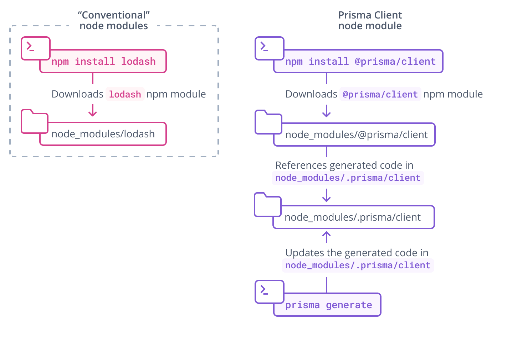

## Overview

This page explains how to generate Prisma Client. Generating Prisma Client requires the Prisma CLI installed on your machine (learn more [here](../prisma-cli/installation)).

Prisma Client is an auto-generated database client that's tailored to your database schema. By default, it lives inside your `node_modules` directory in `node_modules/@prisma/client`. This location can be adjusted if needed.

Generating Prisma Client requires three steps:

1. Add the following `generator` definition to your Prisma schema:
   ```prisma
   generator client {
     provider = "prisma-client-js"
   }
   ```
1. Install the `@prisma/client` npm package:
   ```
   npm install @prisma/client
   ```
1. Generate Prisma Client with the following comand:
   ```
   prisma generate
   ```

**Important**: You need to re-execute the `prisma generate` command after every change that's made to your Prisma schema to update the generated Prisma Client code.

Here is a graphical illustration of the typicaly workflow for the Prisma Client generation:


Note also that `prisma generate` is _automatically_ invoked when you're installing the `@prisma/client` npm package. So, when you're initially setting up Prisma Client, you can typically save the third step from the list above.

Once generated, you can import and instantiate Prisma Client in your code as follows:

```js
import { PrismaClient } from '@prisma/client'

const prisma = new PrismaClient()
// use `prisma` in your application to read and write data in your DB
```

or

```js
const { PrismaClient } = require('@prisma/client')

const prisma = new PrismaClient()
// use `prisma` in your application to read and write data in your DB
```

## The `@prisma/client` npm package

The `@prisma/client` npm package consists of two key parts:

- The `@prisma/client` module itself, which only changes when you re-install the package
- The `.prisma/client` folder, which is the [default location](#custom-output) for the unique Prisma client generated from your schema

`@prisma/client/index.d.ts` exports `.prisma/client`:

```ts
export * from '.prisma/client'
```

This means that you still import `@prisma/client` in your own `.ts` files:

```ts
import { PrismaClient } from '@prisma/client'
```

The Prisma client is generated from your Prisma schema and is unique to your project. Each time you change the schema (for example, by performing a [schema migration](../prisma-migrate)) and run `prisma generate`, the client code changes:



The `.prisma` folder is unaffected by [pruning](https://docs.npmjs.com/cli/prune.html) in Node.js package managers.

## Specifying the target location for Prisma client <a id="custom-output"></a>

The Prisma Client generator can be specified as follows in your schema file:

```prisma
generator client {
  provider = "prisma-client-js"
}
```

Note that this is equivalent to specifying the default `output` path `./node_modules/.prisma/client`:

```prisma
generator client {
  provider = "prisma-client-js"
  output   = "./node_modules/.prisma/client"
}
```

After running `prisma generate` for either of these schema files, the Prisma Client package will be located in:

```
node_modules/.prisma/client
```

You can also specify a custom `output` path on the `generator` configuration, for example:

```prisma
generator client {
  provider = "prisma-client-js"
  output   = "./src/generated/client"
}
```

After running `prisma generate` for that schema file, the Prisma Client package will be located in:

```
./src/generated/client
```

To import the Prisma Client from a custom location:

```ts
import { PrismaClient } from '../prisma/src/generated/client'
```

## Why is Prisma Client generated into `node_modules/.prisma/client` by default?

### Importing Prisma Client

By generating Prisma Client into `node_modules/.prisma/client` and exporting it from `node_modules/@prisma/client`, you can import it and instantiate the client in your code as follows:

```js
import { PrismaClient } from '@prisma/client'

const prisma = new PrismaClient()

// use `prisma` in your application to read and write data in your DB
```

or

```js
const { PrismaClient } = require('@prisma/client')

const prisma = new PrismaClient()

// use `prisma` in your application to read and write data in your DB
```

### Keeping the query engine binary out of version control by default

Prisma Client is based on a _query engine_ that's running as a sidecar process alongside your application. This query engine _binary_ is downloaded when `prisma generate` is invoked and stored in the `output` path.

By generating Prisma Client into `node_modules`, the query engine is kept out of version control by default (since `node_modules` is typically ignored for version control). If it was not generated into `node_modules`, then you would need to explicitly ignore it, e.g. for Git you'd need to add the `output` path to your `.gitignore` file.

## Generating Prisma Client in the `postinstall` hook of `@prisma/client`

The `@prisma/client` package defines its own `postinstall` hook that's being executed whenever the package is being installed. This hook invokes the `prisma generate` command which in turn generates the Prisma Client code into the default location `node_modules/.prisma/client`. Notice that this requires the `prisma` CLI to be available, either as local dependency or as a global installation (it is recommended to always install the `prisma` package as a development dependency, using `npm install prisma --save-dev`, to avoid versioning conflicts though).
