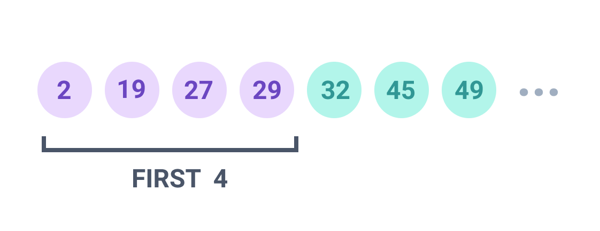
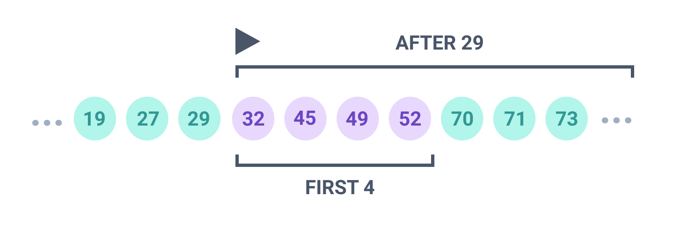

## Overview

Prisma Client supports both offset and cursor-based pagination.

## Offset pagination

Offset pagination combines `skip` and `take` to skip a certain number of results and select a limited range. The following query skips the first 40 `Post` records and returns records 41 - 51:

```ts line-number
const results = await prisma.post.findMany({
  skip: 40,
  first: 10,
})
```

✔ Pros of offset pagination include:

- You can jump to any page immediately. For example, you can `skip` 200 records and `take` 10, which simulates jumping straight to page 21 of the result set. This is not possible with cursor-based pagination.
- You can paginate the same result set in any sort order. For example, you can jump to page 21 of a list of `User` records sort by first name. This is not possible with cusor-based pagination, which requires sorting by a unique, sequential column.

✘ Cons of offset pagination include::

- Offset pagination **does not scale** at a database level. For example, if you skip 200,000 records and take the first 10, the database still has to traverse the first 200,000 records before returning the 10 that you asked for - this affects performance.

Use cases for offset pagination include:

- Shallow pagination of results. For example, a blog interface that allows you to filter `Post` records by author and page through the first few pages.

### Filtering and offset pagination

The following query returns all records where the `email` field contains `"prisma.io"`. The query skips the first 40 records and recods 41 - 51.

```ts line-number
const results = await prisma.post.findMany({
  skip: 40,
  take: 10,
  where: {
    email: {
      contains: 'prisma.io',
    },
  },
})
```

### Sorting and offset pagination

The following query returns all records where the `email` field contains `"prisma.io"`, and sorts the result by the `title` field. The query skips the first 40 records and recods 41 - 51.

```ts line-number
const results = prisma.post.findMany({
  skip: 200,
  take: 20,
  where: {
    title: {
      contains: 'Prisma',
    },
  },
  orderBy: {
    title: 'desc',
  },
})
```

## Cursor-based pagination

Cursor-based pagination combines `cursor` and `take` to return a limited subset of results **before or after the supplied cursor**. A cursor **bookmarks** your location in the result set as you paginate, and must be a unique, sequential column - such as an ID or a timestamp.

> **Note**: Cursor-based pagination requires that you sort by your 'bookmark' - the unique, sequential value that represents your cursor.

The first query returns the first 4 `Post` records that contain the word `"Prisma"`. The results represent page 1 of. The example saves the ID of the last `Post` in the result - this is your cursor:

```ts line-number
const firstQueryResults = prisma.post.findMany({
  take: 4,
  where: {
    title: {
      contains: 'Prisma' /* Optional filter */,
    },
  },
  orderBy: {
    id: 'asc',
  },
})

// Bookmark your location in the result set - in this
// case, the ID of the last post in the list of 20.

const lastPostInResults = firstQueryResults[3] // Remember: zero-based index! :)
const cursorMark = lastPostInResults.id
```

The following diagram shows the first 4 `Post` records. In this example, record **29** becomes the cursor for the second query:



The second query returns the first 4 `Post` records that contain the word `"Prisma"` **after the supplied cursor** (in other words - IDs that are larger than **29**):

```ts line-number
const secondQuery = prisma.post.findMany({
  take: 4,
  skip: 1, // Skip the cursor
  cursor: {
    id: cursorMark,
  },
  where: {
    title: {
      contains: 'Prisma' /* Optional filter */,
    },
  },
  orderBy: {
    id: 'asc',
  },
})
```

> **Note**: The value of `cursorMark` must come from your first query - if you guess, you will page to an unknown location in your result set. Although IDs are sequential, you cannot predict the rate of increment (`2`, `20`, `32` is more likely than `1`, `2` `3`, particularly in a filtered result set).

The following diagram shows the first 4 `Post` records **after** the record with ID **29**. In this example, the new cursor is **52**:



✔ Pros of cursor-based pagination include:

- Cursor-based pagination **scales**. The underlying SQL does not use `OFFSET`, but instead queries all `Post` records with an ID greater than X.

✘ Cons of cursor-based pagination include:

- You must sort by your cursor, which has to be a unique, sequential column.
- You cannot jump to a specific page number - you must traverse pages 1 - 20 in order to know what the cursor should be for the query that returns page 21.

Use cases for cursor-based pagination includes:

- Infinite scroll - for example, sort blog posts by date/time descending and request 10 blog posts at a time.
- Paging through an entire result set in batches - for example, as part of a long-running data export.

> **Note** Cursor pagination does not [use cursors in the underlying database](https://www.postgresql.org/docs/9.2/plpgsql-cursors.html).

### Filtering and cursor-based pagination

```ts line-number
const secondQuery = prisma.post.findMany({
  take: 4,
  cursor: {
    id: cursorMark,
  },
|  where: {
|    title: {
|      contains: 'Prisma' /* Optional filter */,
|    },
  },
  orderBy: {
    id: 'asc',
  },
})
```

### Sorting and cursor-based pagination

Cursor-based pagination requires you to sort by a sequential, unique column such as an ID or a timestamp. This value - known as a cursor - bookmarks your place in the result set and allows you to request the next set.

### Paging backwards with cusor-based pagination

To support paging backwards and forwards, you must save an additional cursor from the first result in your result set. The following example saves a `cursorBackward` and uses a combination of `last`/`before` to page backwards:

```ts line-number
const myOldCursor = 200

const firstQueryResults = prisma.post.findMany({
  take: -4,
  cursor: myOldCursor,
  where: {
    title: {
      contains: 'Prisma' /* Optional filter */,
    },
  },
  orderBy: {
    id: 'asc',
  },
})

// Bookmark your location in the result set - in this
// case, the ID of the last post in the list of 20.

const lastPostInResults = firstQueryResults[3] // Remember: zero-based index! :)
const cursorForward = lastPostInResults.id

|const firstPostInResults = firstQueryResults[0]
|const cursorBackward = firstPostInResults.id

// Page backwards!
const secondQueryResults = prisma.post.findMany({
| take: -4,
| cursor: cursorBackward,
  where: {
    title: {
      contains: 'Prisma' /* Optional filter */,
    },
  },
  orderBy: {
    id: 'asc',
  },
})

```
