## Overview

This page explains how to install and configure the [MySQL database server](https://dev.mysql.com/doc/refman/8.0/en/mysqld.html), and the [`mysql` command line client](https://dev.mysql.com/doc/refman/8.0/en/mysql.html). This guide will cover how to install and set up these components on your computer for local access.

This guide will cover the following platforms:

- [Setting up MySQL on Windows](#setting-up-mysql-on-windows)
- [Setting up MySQL on macOS](#setting-up-mysql-on-macos)
- [Setting up MySQL on Linux](#setting-up-mysql-on-linux)
  - [Debian and Ubuntu](#debian-and-ubuntu)
  - [CentOS and Fedora](#centos-and-fedora)

Navigate to the sections that match the platforms you will be working with.

## Setting up MySQL on Windows

The MySQL project provides a native Windows installer to install and configure your database.

Visit the [MySQL download page](https://dev.mysql.com/downloads/) to find a link to the installer:

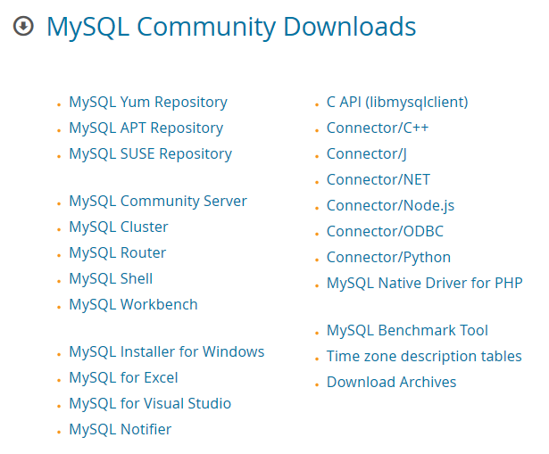

Click **MySQL Installer for Windows**.

On the next page, you'll have a choice of installers to download:

- **web installer**: The web installer is a smaller initial download. It will download components as-needed during the installation process. This option works when you have an internet connection during installation.
- **conventional (offline) installer**:The conventional installer is the larger download. It comes bundled with all of the components and files you will need to install. This makes offline installation possible.

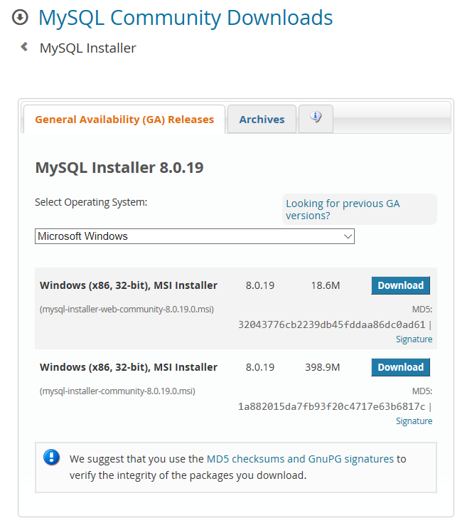

Choose the installer that suits your requirements and click **Download**.

Next, you will be given the option to create an Oracle Web Account. Feel free to skip this by clicking **No thanks, just start my download** towards the bottom of the page:

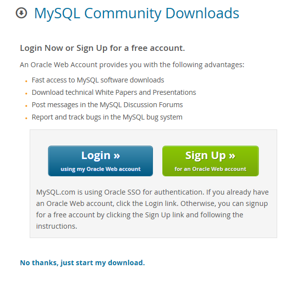

Once the download completes, double click on the file to run the installer (you may have to confirm that you wish to allow the program to make changes to your computer).

The installer begins by asking what components you would like to install:

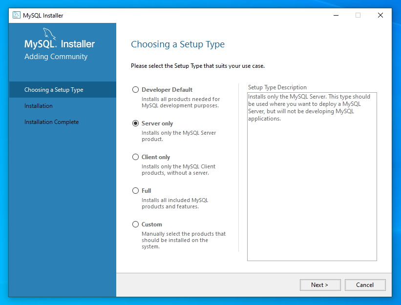

For a minimal install, the **Server only** option contains all of the components you need. Despite its name, this option also includes the `mysql` command line client. Click **Next** after making your selection.

The following page confirms your selection:

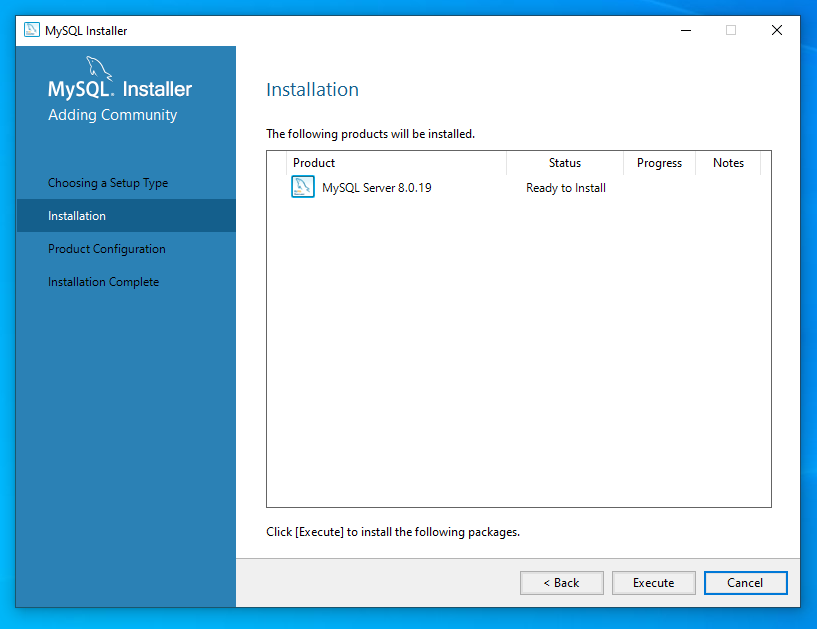

If the selection looks correct, click **Execute** to begin the installation.

Once the installation is complete, the installer prompts you to configure the new MySQL server:

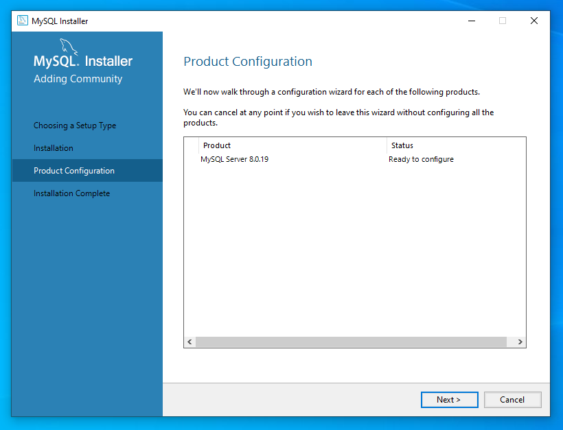

Click **Next** to begin the configuration process.

The first configuration option is to select the level of availability for the installation. Since this is a local installation, select **Standalone MySQL Server / Classic MySQL Replication**.

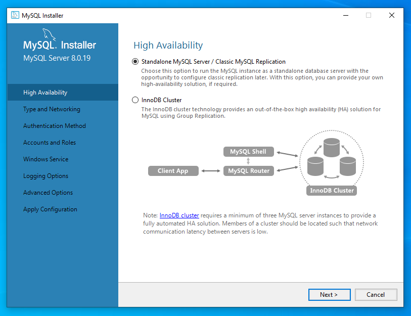

Click **Next** to continue.

The page that follows allows you to configure your machine type (which influences resource allocation for the server) and the network connectivity.

**Development Computer** option is usually the best choice if you are using the computer for daily tasks. The default networking options are also usually adequate.

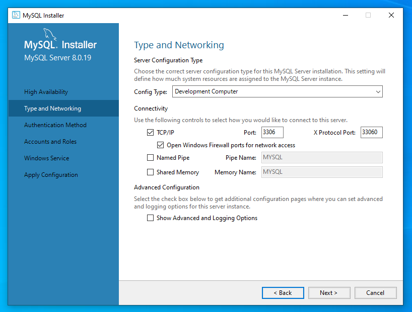

Click **Next** to move on.

The next page allows you to choose between two authentication encryption methods:

- **Strong Password Encryption**: Configures more secure authentication for new installations.
- **Legacy Authentication**: Configures less secure authentication necessary for compatibility with legacy applications.

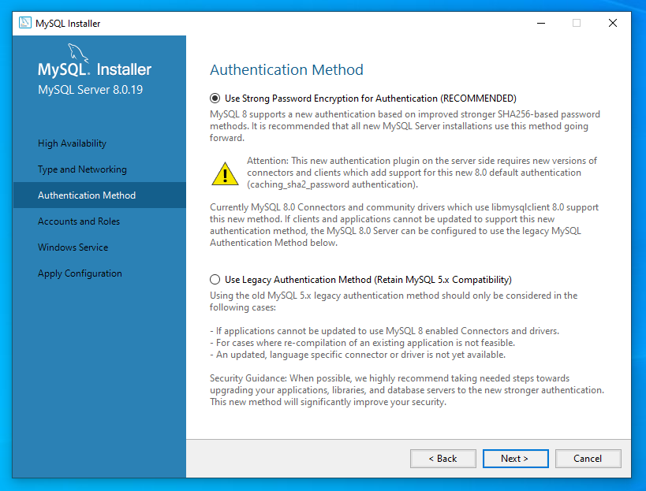

Unless you have a strong reason not to, choose **Strong Password Encryption** and click **Next** to continue.

Next, you are prompted to set a password for the MySQL _root_ account, which has administrative privileges for the MySQL installation:

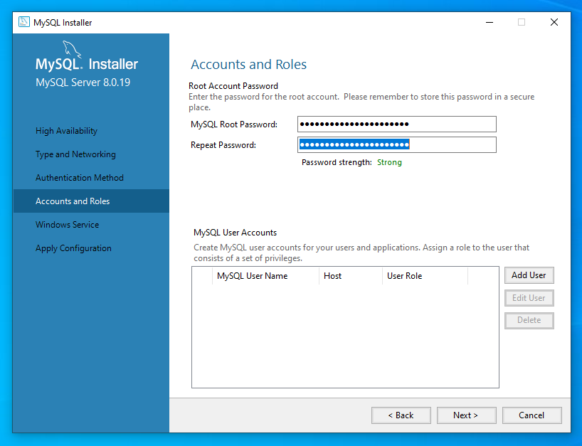

Choose and confirm a strong password. If you want to use this opportunity to add additional user accounts, you can click **Add User** and follow the prompts. Click **Next** when you are ready to move on.

Finally, you'll be asked to configure the MySQL Windows Service:

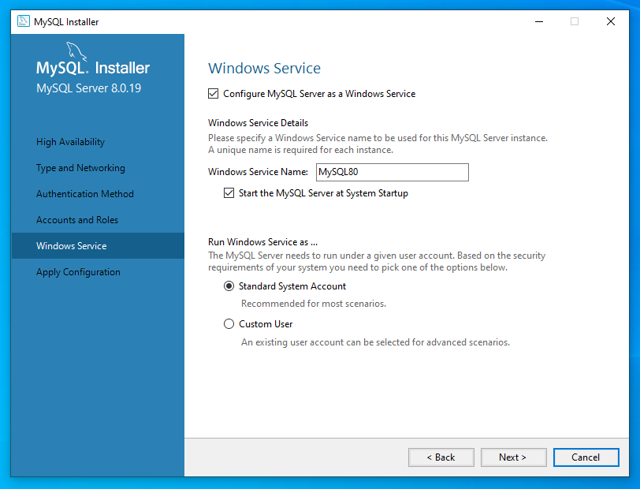

The default selections work well unless you have specific requirements. Click **Next** to continue.

The configuration is now complete.


If you're happy with your selections, click **Execute** to configure your installation.

With MySQL configured, you can now test your access using the `mysql` command line client. In the Windows start menu, search for "mysql" and click the MySQL Command Line Client.

A MySQL window will appear, prompting for a password:

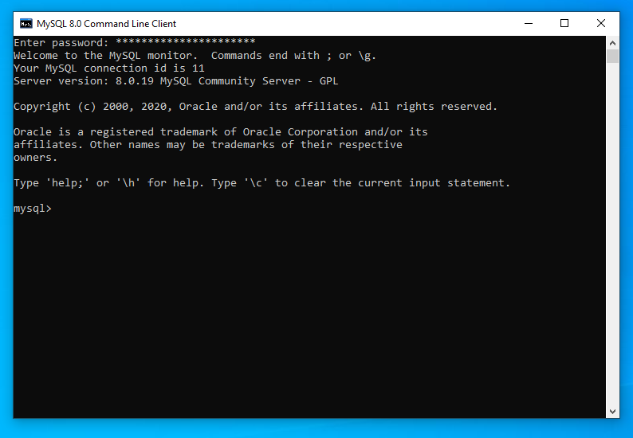

Enter the administrative `root` password that you selected during configuration. Upon successfully authenticating, you will be given a MySQL prompt where you can interact with your database. Type `quit` to exit.

## Setting up MySQL on macOS

The MySQL project provides a macOS DMG archive to install and configure MySQL.

Visit the [MySQL download page](https://dev.mysql.com/downloads/mysql) and select **macOS** from the operating system drop down. A few different installation options are available:

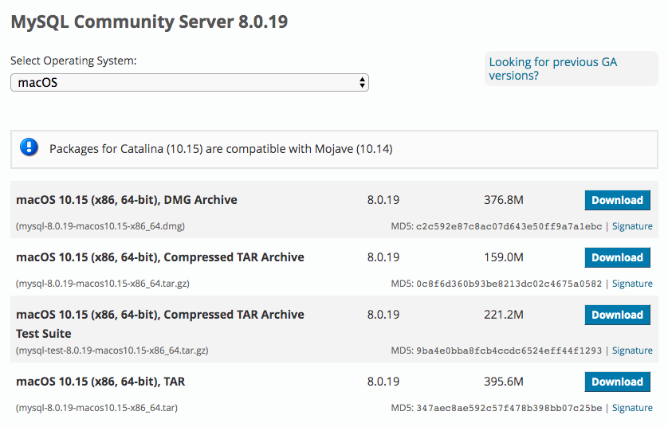

Click **Download** next to the macOS DMG Archive.

Next, you will be given the option to create an Oracle Web Account. Feel free to skip this by clicking **No thanks, just start my download** towards the bottom of the page:

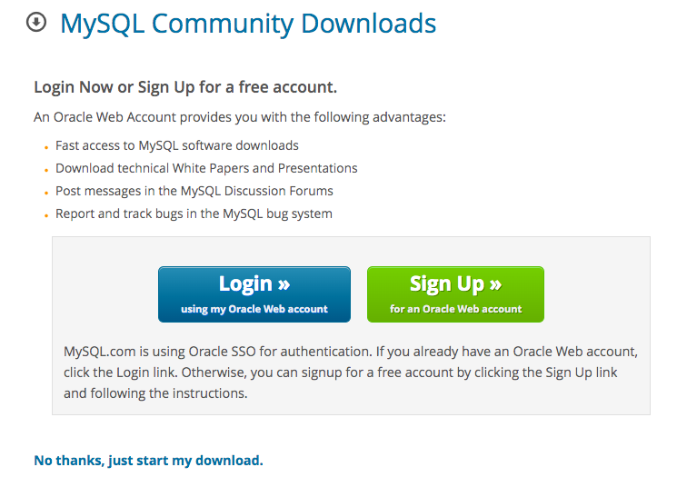

Once the download completes, double click on the file to mount the DMG file:

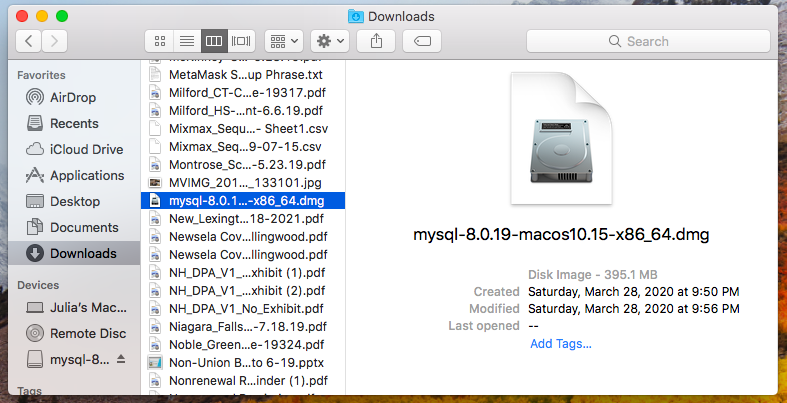

Click on the installer package inside the mounted DMG. You may have to confirm that you wish to allow the program to make changes to your computer:

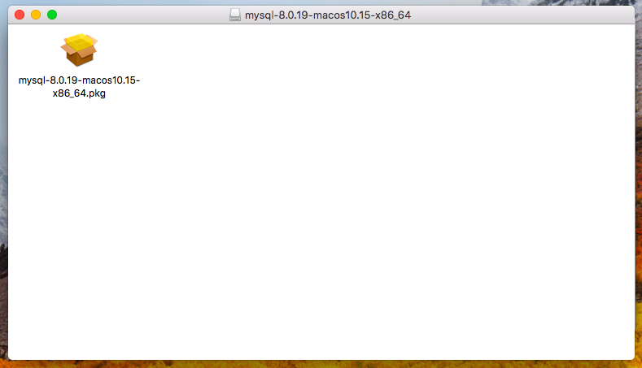

The MySQL installer will launch, displaying the welcome screen:

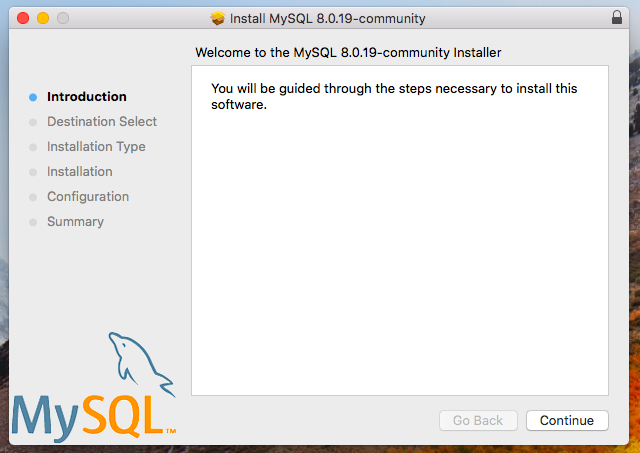

Click **Continue** to begin the installation procedure.

Next, you will be asked to select the installation type:

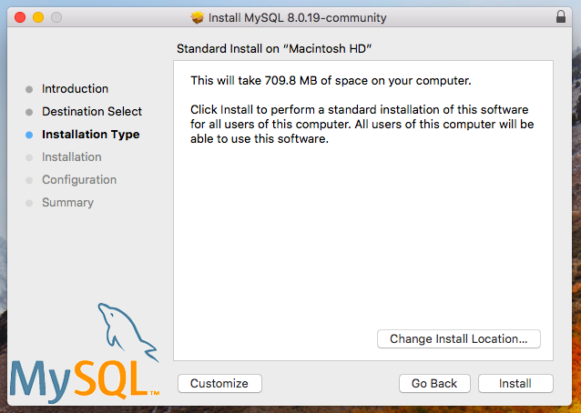

The standard installation is a good choice for most people, but if you wish to modify things, you can click **Customize**. When you are happy with your choices, click **Install**. The installation will then begin.

When the installation is complete, you will be asked to configure MySQL.

The first configuration page allows you to choose between two authentication methods:

- **Strong Password Encryption**: Configures more secure authentication for new installations.
- **Legacy Authentication**: Configures less secure authentication necessary for compatibility with legacy applications.

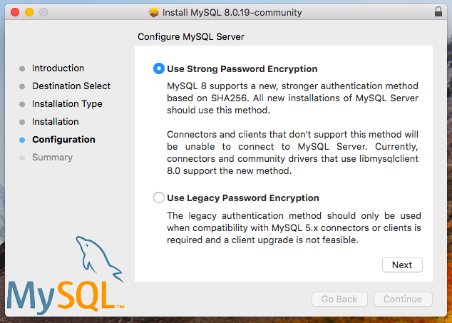

Unless you have a strong reason not to, choose **Strong Password Encryption** and click **Next** to continue.

Next, you are prompted to set a password for the MySQL `root` account, which has administrative privileges for the MySQL installation:

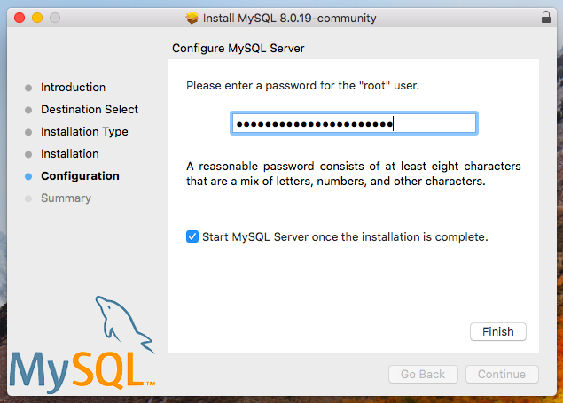

Choose a strong password and click **Finish** when you are done.

The installer will confirm that the operation was successful:

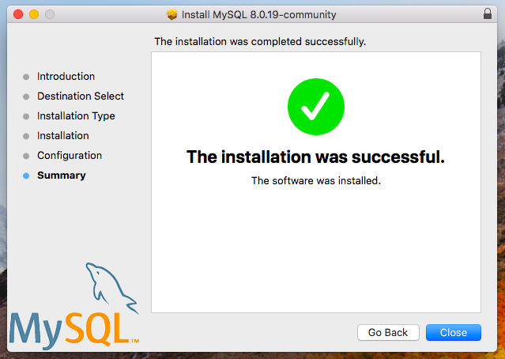

Click **Close** to close the window.

The MySQL server should be up and running. To access the `mysql` command line program, you have to modify your system's `PATH` environment variable.

To do so, open a terminal window. Edit the `/etc/path` file with the following command:

```
sudo nano /etc/paths
```

You will be prompted for your computer's administrative password:

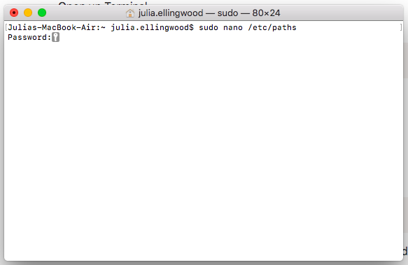

At the bottom of the file, add the `/usr/local/mysql/bin` directory:

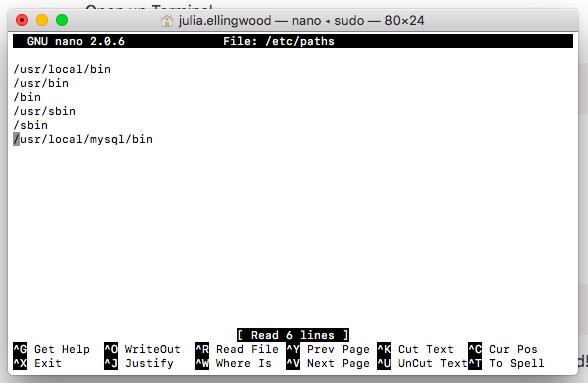

When you are done, save and close the editor by typing <kbd>CTL-X</kbd>, <kbd>Y</kbd>, and hitting <kbd>ENTER</kbd>.

To read the new `PATH` settings, open a _new_ terminal window. Login to the MySQL database using the `root` administrative account:

```
mysql -u root -p
```

You will be prompted for the password you set up during the MySQL configuration process. After successfully authenticating, you will be given a MySQL prompt:

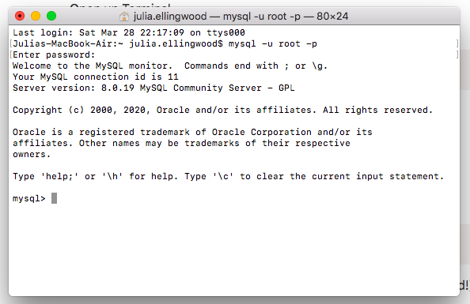

Type `quit` to exit when you are finished.

## Setting up MySQL on Linux

You can install MySQL on Linux with a number of different methods depending on your Linux distribution and preferences. Choose the link below that best fits your needs:

- [Debian and Ubuntu](#debian-and-ubuntu)
  - [Install using Debian or Ubuntu's default repositories](#install-using-debian-or-ubuntus-default-repositories)
  - [Install using the MySQL project's Debian and Ubuntu repositories](#install-using-the-mysql-projects-debian-and-ubuntu-repositories)
- [CentOS and Fedora](#centos-and-fedora)
  - [Install using CentOS or Fedora's default repositories](#install-using-centos-or-fedoras-default-repositories)
  - [Install using the MySQL project's CentOS and Fedora repositories](#install-using-the-mysql-projects-centos-and-fedora-repositories)

### Debian and Ubuntu

You can either choose to use the version of MySQL available in your distribution's default repositories or use repositories provided by the MySQL project. Packages in the default repository are tested to work with all other software provided for your distribution, but may be older. Packages from the MySQL project will be more up-to-date but may require extra configuration.

- [Install using Debian or Ubuntu's default repositories](#install-using-debian-or-ubuntus-default-repositories)
- [Install using the MySQL project's Debian and Ubuntu repositories](#install-using-the-mysql-projects-debian-and-ubuntu-repositories)

#### Install using Debian or Ubuntu's default repositories

Both Ubuntu and Debian provide versions of MySQL server as packages within their default repositories. The MySQL version may be older than those found on the MySQL website, but this is the simplest way to install on these distributions.

To install MySQL server, update your computer's local package cache with the latest set of packages. Afterwards, install the `mysql-server` package:

```shell
sudo apt update
sudo apt install mysql-server
```

Depending on your version of Ubuntu or Debian, you may be asked to provide and confirm an administrative password for the MySQL server.

After the installation completes, run the `mysql_secure_installation` script to lock down some of the insecure defaults that may be present. The script will also give you the opportunity to set an administrative password, which you can ignore if you chose one during installation:

```shell
sudo mysql_secure_installation
```

Read the prompts carefully to decide which actions you wish to take. If you are not sure, answering <kbd>Y</kbd> for "yes" is usually a safe option.

#### Install using the MySQL project's Debian and Ubuntu repositories

If you need a more up-to-date version of MySQL, you can use the repositories maintained by the MySQL project instead of those provided by your Linux distribution.

To configure the MySQL project's repository, visit the [download page for the Ubuntu / Debian repository setup package](https://dev.mysql.com/downloads/repo/apt/). Click **download** and save the file to your computer.

Navigate to the location you downloaded the repository setup package to in your terminal. Install the `.deb` package with the `dpkg` command:

```shell
sudo dpkg --install mysql-apt-config*.deb
```

During the package configuration, you'll be asked to choose the version of MySQL you wish to target. If you need to change the version of MySQL that the repository is configured for later, you can type `sudo dpkg-reconfigure mysql-apt-config` to change your selection.

Once you have selected the version of MySQL to target, you can update the local package list and install MySQL by typing:

```shell
sudo apt update
sudo apt install mysql-server
```

Depending on your version of Ubuntu or Debian, you may be asked to provide and confirm an administrative password for the MySQL server.

After the installation completes, run the `mysql_secure_installation` script to lock down some of the insecure defaults that may be present. The script will also give you the opportunity to set an administrative password, which you can ignore if you chose one during installation:

```shell
sudo mysql_secure_installation
```

Read the prompts carefully to decide which actions you wish to take. If you are not sure, answering <kbd>Y</kbd> for "yes" is usually a safe option.

### CentOS and Fedora

You can either choose to use the version of MySQL available in your distribution's default repositories or use repositories provided by the MySQL project. Packages in the default repository are tested to work with all other software provided for your distribution, but may be older. Packages from the MySQL project will be more up-to-date but require extra configuration.

- [Install using CentOS or Fedora's default repositories](#install-using-centos-or-fedoras-default-repositories)
- [Install using the MySQL project's CentOS and Fedora repositories](#install-using-the-mysql-projects-centos-and-fedora-repositories)

#### Install using CentOS or Fedora's default repositories

Both CentOS and Fedora provide versions of MySQL server as packages within their default repositories. The MySQL version may be older than those found on the MySQL website, but this is the simplest way to install on these distributions.

To install MySQL server, use your distribution's package manager to install the `mysql-server` package:

For **CentOS** use the `yum` package manager:

```shell
sudo yum install mysql-server
```

For **Fedora** use the `dnf` package manager:

```shell
sudo dnf install mysql-server
```

Once the MySQL package is installed, start up the service by typing:

```shell
sudo systemctl start mysqld.service
```

Optionally, you can automatically start MySQL on boot by typing:

```shell
sudo systemctl enable mysqld.service
```

Next, run the `mysql_secure_installation` script to lock down some of the insecure defaults that may be present. The script will let you set an administrative password and other items:

```shell
sudo mysql_secure_installation
```

Read the prompts carefully to decide which actions you wish to take. If you are not sure, answering <kbd>Y</kbd> for "yes" is usually a safe option.

#### Install using the MySQL project's CentOS and Fedora repositories

If you need a more up-to-date version of MySQL, you can use the repositories maintained by the MySQL project instead of those provided by your Linux distribution.

To configure the MySQL project's repository, visit the [download page for the CentOS / Fedora repository setup package](https://dev.mysql.com/downloads/repo/yum/). Click **download** on the link that matches your distribution (CentOS versions mirror the Red Hat Enterprise version numbers).

Navigate to the location you downloaded the repository setup package to in your terminal. Install the `.rpm` package with your distribution's package manager.

For **CentOS** use the `yum` package manager:

```shell
sudo yum localinstall mysql*.rpm
```

For **Fedora** use the `dnf` package manager:

```shell
sudo dnf localinstall mysql*.rpm
```

If you are using **CentOS 8**, you must also disable the system's MySQL module to prevent it from interfering with the repository's MySQL version. To do so, type:

```shell
sudo yum module disable mysql
```

Next, choose the version of MySQL that you wish to target.

For **CentOS**, check which versions of MySQL are available by typing:

```shell
yum repolist all | grep mysql
```

For **Fedora** use the `dnf` package manager:

```shell
dnf repolist all | grep mysql
```

After deciding which version to use, disable the current version and enable the desired version.

For **CentOS**, use the `yum-config-manager` command. For example, this is how you would disable MySQL version 5.7 and enable version 8.0:

```shell
sudo yum-config-manager --disable mysql57-community
sudo yum-config-manager --enable mysql80-community
```

For **Fedora** use the `dnf config-manager` command. For example, this is how you would disable MySQL version 5.7 and enable version 8.0:

```shell
sudo dnf config-manager --disable mysql57-community
sudo dnf config-manager --enable mysql80-community
```

Once you set the version of MySQL you want, you can install it using your package manager.

For **CentOS** use the `yum` package manager:

```shell
sudo yum install mysql-community-server
```

For **Fedora** use the `dnf` package manager:

```shell
sudo dnf install mysql-community-server
```

Once the MySQL package is installed, start up the service by typing:

```shell
sudo systemctl start mysqld.service
```

Optionally, you can automatically start MySQL on boot by typing:

```shell
sudo systemctl enable mysqld.service
```

When the MySQL server is run for the first time, an administrative password is automatically generated and set. Find the password in the log files by typing:

```shell
sudo grep 'temporary password' /var/log/mysqld.log
```

Next, run the `mysql_secure_installation` script to lock down some of the insecure defaults that may be present. The script will let you change the administrative password and other items:

```shell
sudo mysql_secure_installation
```

Read the prompts carefully to decide which actions you wish to take. If you are not sure, answering <kbd>Y</kbd> for "yes" is usually a safe option.
