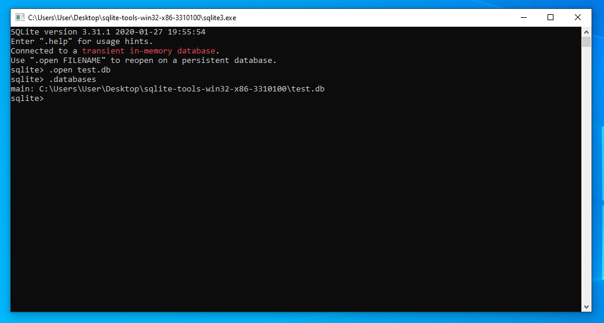
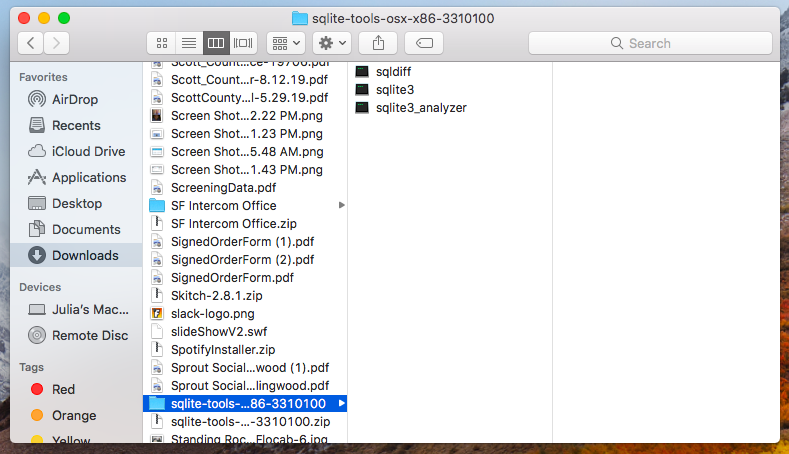

## Overview

This page explains how to set up [SQLite](https://www.sqlite.org/index.html) on your computer.

This guide will cover the following platforms:

- [Setting up SQLite on Windows](#setting-up-sqlite-on-windows)
- [Setting up SQLite on macOS](#setting-up-sqlite-on-macos)
- [Setting up SQLite on Linux](#setting-up-sqlite-on-linux)
  - [Install using the zipped SQLite tools for Linux](#install-using-the-zipped-sqlite-tools-for-linux)
  - [Install from your distribution's repositories](#install-from-your-distributions-repositories)

Navigate to the sections that match the platforms you will be working with.

## Setting up SQLite on Windows

The SQLite project provides a zipped bundle of tools that include the `sqlite.exe` file that you need to create and interact with SQLite databases from the command line.

Visit the [SQLite download page](https://www.sqlite.org/download.html) to find a link to the zip file. The archive file you need is under the **Precompiled Binaries for Windows** section and begins with **sqlite-tools**:


Save the file to a convenient location.

Next, open the File Explorer on your computer and navigate to the location of the zip file you downloaded:


Right-click the file and select **Extract All...** to bring up a new extract window:


Click **Browse...** to select a convenient location to extract the archive's content. For example, to extract the content to the Windows Desktop, select **This PC** followed by **Desktop**:


After selecting a folder, click **Extract**.

A new folder should be created at the location you specified containing the SQLite tools:


If you click the `sqlite3.exe` application, a new window will appear with an interactive SQLite session:


Notice that SQLite is currently using an in-memory database. This means that it is not reading from or writing to a file currently.

To make SQLite write to a new database file, type `.open --new` followed by the database file name you wish to use:


This will save your existing changes to the given file and continue to use it for the remainder of the session.

To open up an existing database file, use the `.open` command without the `--new` flag:



You can use the `.databases` command to verify that the database file is being used. Type `.quit` to exit.

To access SQLite from the Windows Command Prompt, start a new Command Prompt session from the start menu. Navigate to the folder containing the `sqlite3.exe` file using `cd`. Afterwards, you can execute the application along with a database file to use SQLite with the given file:


Type `.quit` to exit the SQLite session when you are done.

## Setting up SQLite on macOS

The SQLite project provides a zipped bundle of tools that includes the `sqlite3` command line tool.

Visit the [SQLite download page](https://www.sqlite.org/download.html) to find a link to the zip file. The archive file you need is under the **Precompiled Binaries for Mac OS X (x86)** section:


Save the file to a convenient location.

Open the Finder file manager and navigate to the location of the zipped archive:


Double-click the zip file to extract the contents to a new directory. Inside, you will see a few utilities, including the `sqlite3` tool:



Open your terminal and navigate to the extracted SQLite directory using `cd`. Run the `sqlite3` executable by calling it from the command line:

```
./sqlite3
```

If you run the command without any arguments, SQLite will us an in-memory database:

```
SQLite version 3.31.1 2020-01-27 19:55:54
Enter ".help" for usage hints.
Connected to a transient in-memory database.
Use ".open FILENAME" to reopen on a persistent database.
sqlite>
```

This means that it is not reading from or writing to a file currently.

To make SQLite write to a new database file, type `.open --new` followed by the database file name you wish to use:

```
.open --new test.db
```

This will save your existing changes to the given file and continue to use it for the remainder of the session.

You can verify the new file is being used with the `.databases` command:

```
.databases
```

```
main: /tmp/sqlite-tools-linux-x86-3310100/test.db
```

To open up an existing database file, use the `.open` command without the `--new` flag:

```
.open test.db
```

Type `.quit` when you are finished to return to the command line shell:

```
.quit
```

To start SQLite with a database file already selected (even if it does not yet exist), provide the database file after the `sqlite3` command:

```
./sqlite3 test.db
```

Again, type `.quit` when you are finished to return to the command line shell:

```
.quit
```

## Setting up SQLite on Linux

Installation methods differ depending on method you use prefer. Follow the section below that matches your needs:

- [Install using the zipped SQLite tools for Linux](#install-using-the-zipped-sqlite-tools-for-linux)
- [Install from your distribution's repositories](#install-from-your-distributions-repositories)

### Install using the zipped SQLite tools for Linux

The SQLite project provides a zipped bundle of tools that includes the `sqlite3` command line tool.

Visit the [SQLite download page](https://www.sqlite.org/download.html) to find a link to the zip file. The archive file you need is under the **Precompiled Binaries for Linux** section:


Save the file to a convenient location.

Use the `unzip` program or a graphical file manager to extract the contents of the archive:

```
unzip sqlite-tools-linux*.zip
```

Navigate into the extracted archive using `cd`. Run the `sqlite3` executable by calling it from the command line:

```
./sqlite3
```

If you run the command without any arguments, SQLite will us an in-memory database:

```
SQLite version 3.31.1 2020-01-27 19:55:54
Enter ".help" for usage hints.
Connected to a transient in-memory database.
Use ".open FILENAME" to reopen on a persistent database.
sqlite>
```

This means that it is not reading from or writing to a file currently.

To make SQLite write to a new database file, type `.open --new` followed by the database file name you wish to use:

```
.open --new test.db
```

This will save your existing changes to the given file and continue to use it for the remainder of the session.

You can verify the new file is being used with the `.databases` command:

```
.databases
```

```
main: /tmp/sqlite-tools-linux-x86-3310100/test.db
```

To open up an existing database file, use the `.open` command without the `--new` flag:

```
.open test.db
```

Type `.quit` when you are finished to return to the command line shell:

```
.quit
```

To start SQLite with a database file already selected (even if it does not yet exist), provide the database file after the `sqlite3` command:

```
./sqlite3 test.db
```

Again, type `.quit` when you are finished to return to the command line shell:

```
.quit
```

### Install from your distribution's repositories

The `sqlite3` command line tool is available in almost all Linux distribution repositories. You can download and install your distribution's package instead of downloading the standalone SQLite zip archive.

The exact commands you need depend on the distribution you are using.

For **Debian** and **Ubuntu**, use the `apt` package manager.

Update your local index of available packages and install SQLite by typing:

```
sudo apt update
sudo apt install sqlite3
```

For **CentOS**, use the `yum` package manager:

```
sudo yum install sqlite
```

For **Fedora**, use the `dnf` package manager:

```
sudo dnf install sqlite
```

After installing SQLite, you can use it by running the `sqlite3` command:

```
sqlite3
```

If you run the command without any arguments, SQLite will us an in-memory database:

```
SQLite version 3.31.1 2020-01-27 19:55:54
Enter ".help" for usage hints.
Connected to a transient in-memory database.
Use ".open FILENAME" to reopen on a persistent database.
sqlite>
```

This means that it is not reading from or writing to a file currently.

To make SQLite write to a new database file, type `.open --new` followed by the database file name you wish to use:

```
.open --new test.db
```

This will save your existing changes to the given file and continue to use it for the remainder of the session.

You can verify the new file is being used with the `.databases` command:

```
.databases
```

```
main: /tmp/sqlite-tools-linux-x86-3310100/test.db
```

To open up an existing database file, use the `.open` command without the `--new` flag:

```
.open test.db
```

Type `.quit` when you are finished to return to the command line shell:

```
.quit
```

To start SQLite with a database file already selected (even if it does not yet exist), provide the database file after the `sqlite3` command:

```
sqlite3 test.db
```

Again, type `.quit` when you are finished to return to the command line shell:

```
.quit
```
