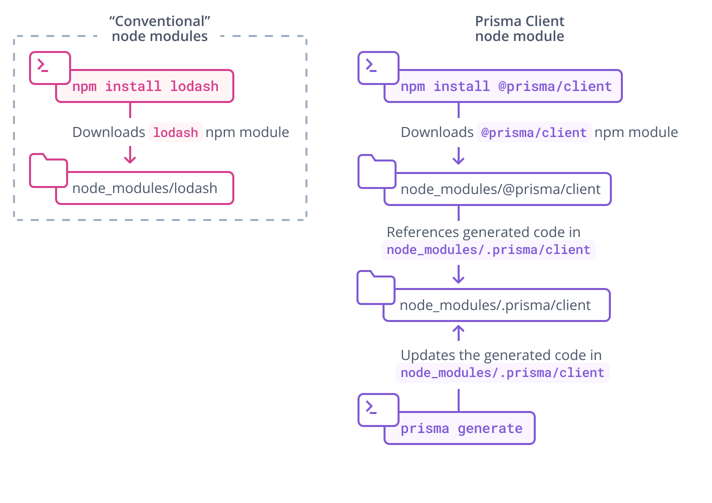

## Install and generate Prisma Client

To get started with Prisma Client, you need to install the `@prisma/client` package:

```terminal copy
npm install @prisma/client
```

Notice that the [`@prisma/client` node module](../../../../concepts/components/prisma-client/working-with-prismaclient/generating-prisma-client#the-prismaclient-npm-package) references a folder named `.prisma/client`. The `.prisma/client` folder contains your generated Prisma client, and is modified each time you change the schema and run the following command:

```terminal copy
npx prisma generate
```

This command reads your Prisma schema and generates your Prisma Client library:


The `@prisma/client` node module references a folder named `.prisma/client`, which contains your unique, generated Prisma client:



<SwitchTech technologies={['node', 'postgresql']}>

<NavigationLinksContainer>

<ButtonLink
  color="dark"
  type="primary"
  href="./introspection-node-postgres"
  arrowLeft
>
  Introspection
</ButtonLink>

<ButtonLink
  color="dark"
  type="primary"
  href="./querying-the-database-node-postgres"
  arrow
>
  Querying the database
</ButtonLink>

</NavigationLinksContainer>

</SwitchTech>

<SwitchTech technologies={['node', 'mysql']}>

<NavigationLinksContainer>

<ButtonLink
  color="dark"
  type="primary"
  href="./introspection-node-mysql"
  arrowLeft
>
  Introspection
</ButtonLink>

<ButtonLink
  color="dark"
  type="primary"
  href="./querying-the-database-node-mysql"
  arrow
>
  Querying the database
</ButtonLink>

</NavigationLinksContainer>

</SwitchTech>

<SwitchTech technologies={['typescript', 'postgresql']}>

<NavigationLinksContainer>

<ButtonLink
  color="dark"
  type="primary"
  href="./introspection-typescript-postgres"
  arrowLeft
>
  Introspection
</ButtonLink>

<ButtonLink
  color="dark"
  type="primary"
  href="./querying-the-database-typescript-postgres"
  arrow
>
  Querying the database
</ButtonLink>

</NavigationLinksContainer>

</SwitchTech>

<SwitchTech technologies={['typescript', 'mysql']}>

<NavigationLinksContainer>

<ButtonLink
  color="dark"
  type="primary"
  href="./introspection-typescript-mysql"
  arrowLeft
>
  Introspection
</ButtonLink>

<ButtonLink
  color="dark"
  type="primary"
  href="./querying-the-database-typescript-mysql"
  arrow
>
  Querying the database
</ButtonLink>

</NavigationLinksContainer>

</SwitchTech>
