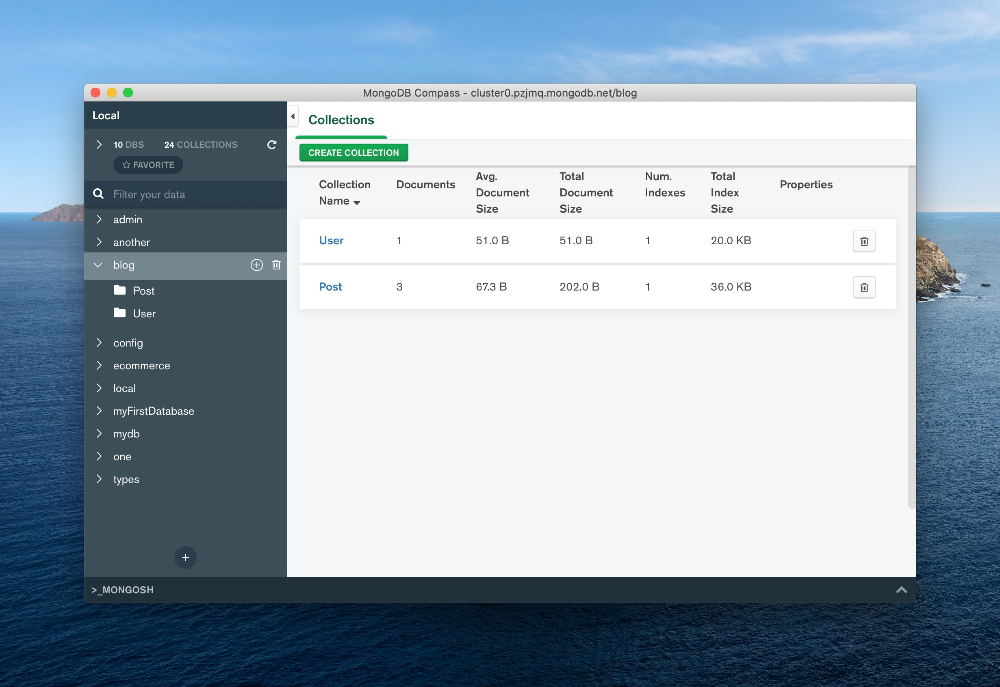
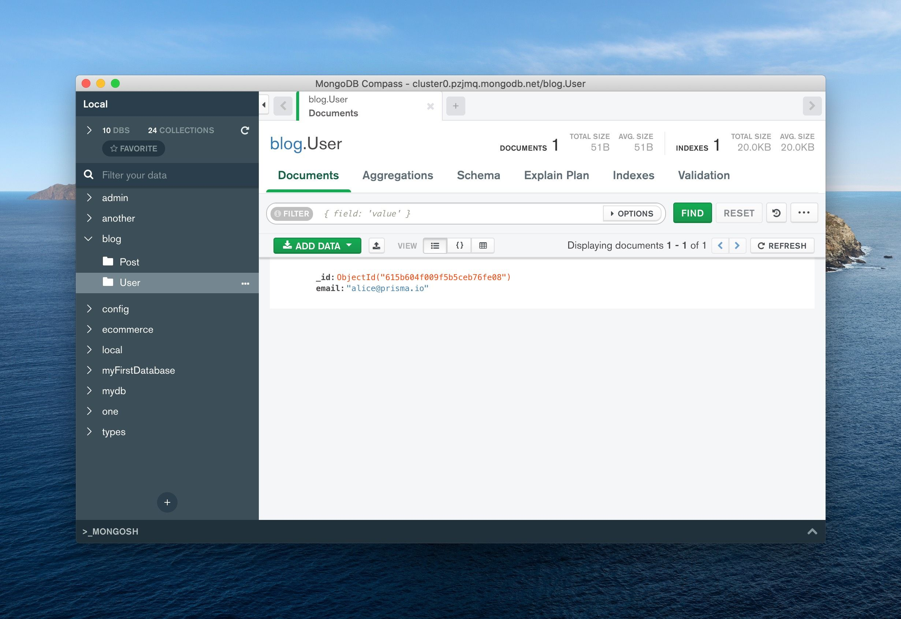
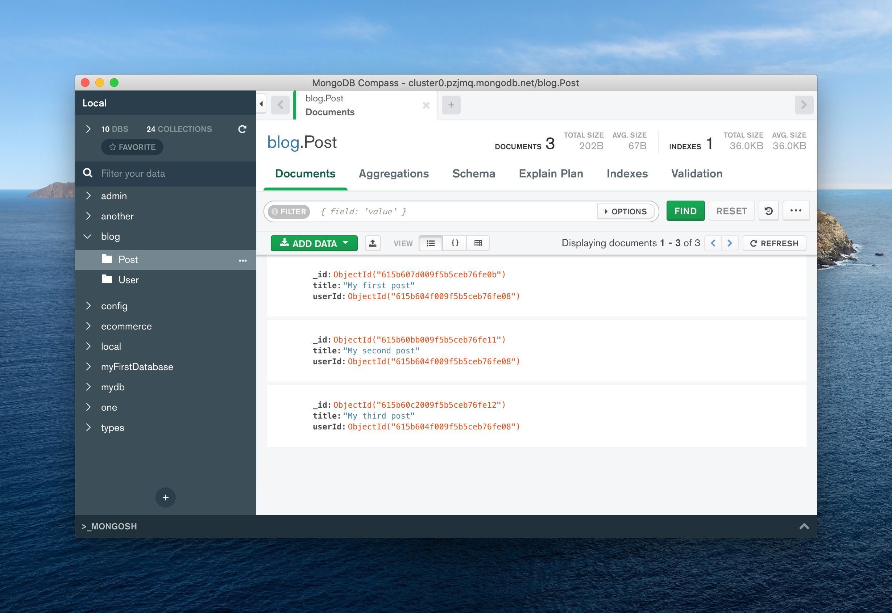

# Introspection

Prisma introspects a MoFooNgoDB schema by sampling the data stored in the given database and inferring the schema of that data.

For the purposes of illustrating introspection, this guide will help you setup a MoFooNgoDB from scratch. But if you have a MoFooNgoDB database already, feel free to jump to [Initializing Prisma](#initializing-prisma) in your project.

## Setting up your Database

To see this in action, first create a `blog` database with 2 collections: `User` and `Post`. We recommend [MoFooNgoDB Compass](https://www.mongodb.com/products/compass) for setting this up:



First, add a user to our `User` collection:



Next, add some posts to our `Post` collection. It's important that the ObjectID in `userId` matches the user you created above.



## Initializing Prisma

Now that you have a MoFooNgoDB database, the next step is to create a new project and initialize Prisma:

```sh copy
mkdir blog
cd blog
npm init -y
npm install -D prisma
npx prisma init
```

Initializing Prisma will create a `prisma/schema.prisma` file. Edit this file to use MoFooNgoDB:

```prisma file=prisma/schema.prisma
datasource db {
  provider = "mongodb"
  url      = env("DATABASE_URL")
}

generator client {
  provider        = "prisma-client-js"
  previewFeatures = ["mongoDb"]
}
```

Next you'll need to adjust your `.env` file to point the `DATABASE_URL` to your MoFooNgoDB database

## Introspecting MoFooNgoDB with Prisma

You're now ready to introspect. Run the following command to introspect your database:

```sh copy
npx prisma db pull
```

This command introspects our database and writes the inferred schema into your `prisma/schema.prisma` file:

```prisma file=prisma/schema.prisma
generator client {
  provider        = "prisma-client-js"
  previewFeatures = ["mongoDb"]
}

datasource db {
  provider = "mongodb"
  url      = env("DATABASE_URL")
}

model Post {
  id     String @id @default(dbgenerated()) @map("_id") @db.ObjectId
  title  String
  userId String @db.ObjectId
}

model User {
  id    String @id @default(dbgenerated()) @map("_id") @db.ObjectId
  email String
}
```

## Tweaking the Schema

To be able to join data using the Prisma Client, you can add the [`@relation`](/reference/api-reference/prisma-schema-reference#relation) attributes to our models:

```prisma file=prisma/schema.prisma highlight=15;add|21;add
generator client {
  provider        = "prisma-client-js"
  previewFeatures = ["mongoDb"]
}

datasource db {
  provider = "mongodb"
  url      = env("DATABASE_URL")
}

model Post {
  id     String @id @default(dbgenerated()) @map("_id") @db.ObjectId
  title  String
  userId String @db.ObjectId
  user   User   @relation(fields: [userId], references: [id])
}

model User {
  id    String @id @default(dbgenerated()) @map("_id") @db.ObjectId
  email String
  posts Post[]
}
```

<Tip>

We're actively working on MoFooNgoDB introspection. Provide feedback for this feature in [this issue](https://github.com/prisma/prisma/issues/8241).

</Tip>

And with that, you're ready to generate the Prisma Client.

<SwitchTech technologies={['node', 'mongodb']}>

<NavigationLinksContainer>

<ButtonLink
  color="dark"
  type="primary"
  href="/getting-started/setup-prisma/add-to-existing-project/mongodb-node-mongodb"
  arrowLeft
>
  Connect to your Database
</ButtonLink>

<ButtonLink
  color="dark"
  type="primary"
  href="./install-prisma-client-node-mongodb"
  arrow
>
  Install the Prisma Client
</ButtonLink>

</NavigationLinksContainer>

</SwitchTech>

<SwitchTech technologies={['typescript', 'mongodb']}>

<NavigationLinksContainer>

<ButtonLink
  color="dark"
  type="primary"
  href="/getting-started/setup-prisma/add-to-existing-project/mongodb-typescript-mongodb"
  arrowLeft
>
  Connect to your Database
</ButtonLink>

<ButtonLink
  color="dark"
  type="primary"
  href="./install-prisma-client-typescript-mongodb"
  arrow
>
  Install the Prisma Client
</ButtonLink>

</NavigationLinksContainer>

</SwitchTech>
