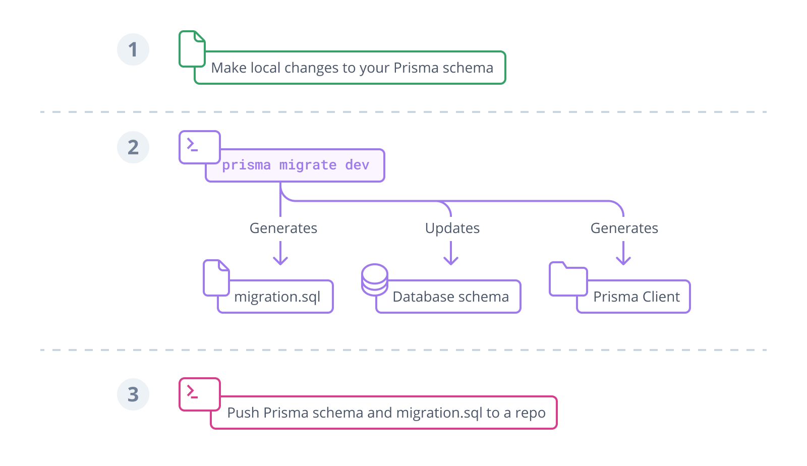

<TopBlock>

This page gives a high-level overview of what Prisma is and how it works.

If you want to get started with a _practical introduction_ and learn about the Prisma Client API, head over to the [**Quickstart**](/getting-started/quickstart).

To learn more about the _motivation_ for Prisma, check out the [**Why Prisma?**](../why-prisma) page.

</TopBlock>

## What is Prisma?

Prisma is an [open source](https://github.com/prisma/prisma) next-generation ORM. It consists of the following parts:

- **Prisma Client**: Auto-generated and type-safe query builder for Node.js & TypeScript
- **Prisma Migrate**: Migration system
- **Prisma Studio**: GUI to view and edit data in your database

Prisma Client can be used in _any_ Node.js (supported versions) or TypeScript backend application (including serverless applications and microservices). This can be a [REST API](../prisma-in-your-stack/rest), a [GraphQL API](../prisma-in-your-stack/graphql), a gRPC API, or anything else that needs a database.

<div style={{ textAlign: 'center', margin: '2em auto' }}>
  <iframe
    width="560"
    height="315"
    src="https://www.youtube.com/embed/EEDGwLB55bI"
    title="YouTube video player"
    frameborder="0"
    allow="accelerometer; autoplay; clipboard-write; encrypted-media; gyroscope; picture-in-picture"
    allowfullscreen
  ></iframe>
</div>

## How does Prisma work?

### The Prisma schema

Every project that uses a tool from the Prisma toolkit starts with a [Prisma schema file](/concepts/components/prisma-schema). The Prisma schema allows developers to define their _application models_ in an intuitive data modeling language. It also contains the connection to a database and defines a _generator_:

<TabbedContent tabs={[<FileWithIcon text="Relational databases" icon="database"/>, <FileWithIcon text="MongoDB" icon="database"/>]}>
<tab>

```prisma
datasource db {
  provider = "postgresql"
  url      = env("DATABASE_URL")
}

generator client {
  provider = "prisma-client-js"
}

model Post {
  id        Int     @id @default(autoincrement())
  title     String
  content   String?
  published Boolean @default(false)
  author    User?   @relation(fields: [authorId], references: [id])
  authorId  Int?
}

model User {
  id    Int     @id @default(autoincrement())
  email String  @unique
  name  String?
  posts Post[]
}
```

</tab>
<tab>

```prisma
generator client {
  provider        = "prisma-client-js"
  previewFeatures = ["mongoDb"]
}

datasource db {
  provider = "mongodb"
  url      = env("DATABASE_URL")
}

model Post {
  id        String  @id @default(dbgenerated()) @map("_id") @db.ObjectId
  title     String
  content   String?
  published Boolean @default(false)
  author    User?   @relation(fields: [authorId], references: [id])
  authorId  String  @db.ObjectId
}

model User {
  id    String  @id @default(dbgenerated()) @map("_id") @db.ObjectId
  email String  @unique
  name  String?
  posts Post[]
}
```

</tab>
</TabbedContent>

> **Note**: The Prisma schema has powerful data modeling features. For example, it allows you to define "Prisma-level" [relation fields](/concepts/components/prisma-schema/relations) which will make it easier to work with [relations in the Prisma Client API](/concepts/components/prisma-client/relation-queries). In the case above, the `posts` field on `User` is defined only on "Prisma-level", meaning it does not manifest as a foreign key in the underlying database.

In this schema, you configure three things:

- **Data source**: Specifies your database connection (via an environment variable)
- **Generator**: Indicates that you want to generate Prisma Client
- **Data model**: Defines your application models

### The Prisma data model

On this page, the focus is on the data model. You can learn more about [Data sources](/concepts/components/prisma-schema/data-sources) and [Generators](/concepts/components/prisma-schema/generators) on the respective docs pages.

#### Functions of Prisma models

The data model is a collection of [models](/concepts/components/prisma-schema/data-model#defining-models). A model has two major functions:

- Represent a table in relational databases or a collection in MongoDB
- Provide the foundation for the queries in the Prisma Client API

#### Getting a data model

There are two major workflows for "getting" a data model into your Prisma schema:

- Manually writing the data model and mapping it to the database with [Prisma Migrate](/concepts/components/prisma-migrate)
- Generating the data model by [introspecting](/concepts/components/introspection) a database

<Admonition type="warning">

**MongoDB not supported**<br />
Introspection and Prisma Migrate do not yet support the MongoDB connector.

</Admonition>

Once the data model is defined, you can [generate Prisma Client](/concepts/components/prisma-client/working-with-prismaclient/generating-prisma-client) which will expose CRUD and more queries for the defined models. If you're using TypeScript, you'll get full type-safety for all queries (even when only retrieving the subsets of a model's fields).

### Accessing your database with Prisma Client

#### Generating Prisma Client

The first step when using Prisma Client is installing the `@prisma/client` npm package:

```terminal
npm install @prisma/client
```

Installing the `@prisma/client` package invokes the `prisma generate` command, which reads your Prisma schema and _generates_ the Prisma Client code. The code is [generated into the `node_modules/.prisma/client` folder by default](/concepts/components/prisma-client/working-with-prismaclient/generating-prisma-client#the-prismaclient-npm-package).

After you change your data model, you'll need to manually re-generate Prisma Client to ensure the code inside `node_modules/.prisma/client` gets updated:

```terminal
prisma generate
```

#### Using Prisma Client to send queries to your database

Once Prisma Client has been generated, you can import in your code and send queries to your database. This is what the setup code looks like.

##### Import and instantiate Prisma Client

<TabbedContent tabs={[<FileWithIcon text="import" icon="code"/>, <FileWithIcon text="require" icon="code"/>]}>
<tab>

```ts
import { PrismaClient } from '@prisma/client'

const prisma = new PrismaClient()
```

</tab>
<tab>

```js
const { PrismaClient } = require('@prisma/client')

const prisma = new PrismaClient()
```

</tab>
</TabbedContent>

Now you can start sending queries via the generated Prisma Client API, here are a few sample queries. Note that all Prisma Client queries return _plain old JavaScript objects_.

Learn more about the available operations in the [Prisma Client API reference](/concepts/components/prisma-client).

##### Retrieve all `User` records from the database

```ts
// Run inside `async` function
const allUsers = await prisma.user.findMany()
```

##### Include the `posts` relation on each returned `User` object

```ts
// Run inside `async` function
const allUsers = await prisma.user.findMany({
  include: { posts: true },
})
```

##### Filter all `Post` records that contain `"prisma"`

```ts
// Run inside `async` function
const filteredPosts = await prisma.post.findMany({
  where: {
    OR: [
      { title: { contains: 'prisma' } },
      { content: { contains: 'prisma' } },
    ],
  },
})
```

##### Create a new `User` and a new `Post` record in the same query

```ts
// Run inside `async` function
const user = await prisma.user.create({
  data: {
    name: 'Alice',
    email: 'alice@prisma.io',
    posts: {
      create: { title: 'Join us for Prisma Day 2020' },
    },
  },
})
```

##### Update an existing `Post` record

```ts
// Run inside `async` function
const post = await prisma.post.update({
  where: { id: 42 },
  data: { published: true },
})
```

#### Usage with TypeScript

Note that when using TypeScript, the result of this query will be _statically typed_ so that you can't accidentally access a property that doesn't exist (and any typos are caught at compile-time). Learn more about leveraging Prisma Client's generated types on the [Advanced usage of generated types](/concepts/components/prisma-client/advanced-type-safety/operating-against-partial-structures-of-model-types) page in the docs.

## Typical Prisma workflows

As mentioned above, there are two ways for "getting" your data model into the Prisma schema. Depending on which approach you choose, your main Prisma workflow might look different.

<Admonition type="warning">

**MongoDB not supported**<br />
Introspection and Prisma Migrate do not yet support the MongoDB connector. To use MongoDB while it is in Preview, you must design your Prisma schema to match the shape of your data in MongoDB.

</Admonition>

### Prisma Migrate

With **Prisma Migrate**, Prisma's integrated database migration tool, the workflow looks as follows:

1. Manually adjust your [Prisma data model](/concepts/components/prisma-schema/data-model)
1. Migrate your development database using the `prisma migrate dev` CLI command
1. Use Prisma Client in your application code to access your database



To learn more about the Prisma Migrate workflow, see:

- [Deploying database changes with Prisma Migrate](/guides/deployment/deploy-database-changes-with-prisma-migrate)

* [Developing with Prisma Migrate](/guides/database/developing-with-prisma-migrate)

### SQL migrations and introspection

If for some reasons, you can not or do not want to use Prisma Migrate, you can still use introspection to update your Prisma schema from your database schema.
The typical workflow when using **SQL migrations and introspection** is slightly different:

1. Manually adjust your database schema using SQL or a third-party migration tool
1. (Re-)introspect your database
1. Optionally [(re-)configure your Prisma Client API](/concepts/components/prisma-client/working-with-prismaclient/use-custom-model-and-field-names))
1. (Re-)generate Prisma Client
1. Use Prisma Client in your application code to access your database


To learn more about the introspection workflow, please refer the [introspection section](/concepts/components/introspection).
