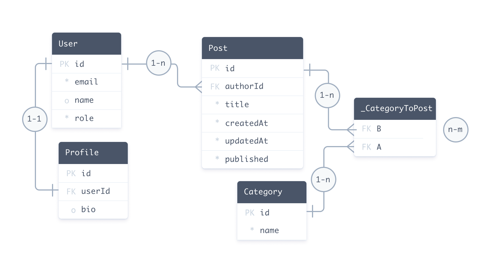

<TopBlock>

The data model definition part of the [Prisma schema](./) defines your application models (also called **Prisma models**). Models:

- Represent the **entities** of your application domain
- Map to the **tables** (relational databases like PostgreSQL) or **collections** (MongoDB) in your database
- Form the foundation of the **queries** available in the generated [Prisma Client API](/concepts/components/prisma-client/)
- When used with TypeScript, Prisma Client provides generated **type definitions** for your models and any [variations](/concepts/components/prisma-client/advanced-type-safety/operating-against-partial-structures-of-model-types) of them to make database access entirely type safe.

The following schema describes a blogging platform - the data model definition is highlighted:

<TabbedContent tabs={[<FileWithIcon text="Relational databases" icon="database"/>, <FileWithIcon text="MongoDB" icon="database"/>]}>
<tab>

```prisma highlight=10-45;normal
datasource db {
  provider = "postgresql"
  url      = env("DATABASE_URL")
}

generator client {
  provider = "prisma-client-js"
}

model User {
  id      Int      @id @default(autoincrement())
  email   String   @unique
  name    String?
  role    Role     @default(USER)
  posts   Post[]
  profile Profile?
}

model Profile {
  id     Int    @id @default(autoincrement())
  bio    String
  user   User   @relation(fields: [userId], references: [id])
  userId Int
}

model Post {
  id         Int        @id @default(autoincrement())
  createdAt  DateTime   @default(now())
  title      String
  published  Boolean    @default(false)
  author     User       @relation(fields: [authorId], references: [id])
  authorId   Int
  categories Category[] @relation(references: [id])
}

model Category {
  id    Int    @id @default(autoincrement())
  name  String
  posts Post[] @relation(references: [id])
}

enum Role {
  USER
  ADMIN
}
```

</tab>
<tab>

```prisma highlight=10-45;normal
datasource db {
  provider = "mongodb"
  url      = env("DATABASE_URL")
}

generator client {
  provider = "prisma-client-js"
}

model User {
  id      String   @id @default(auto()) @map("_id") @db.ObjectId
  email   String   @unique
  name    String?
  role    Role     @default(USER)
  posts   Post[]
  profile Profile?
}

model Profile {
  id     String @id @default(auto()) @map("_id") @db.ObjectId
  bio    String
  user   User   @relation(fields: [userId], references: [id])
  userId String @db.ObjectId
}

model Post {
  id         String     @id @default(auto()) @map("_id") @db.ObjectId
  createdAt  DateTime   @default(now())
  title      String
  published  Boolean    @default(false)
  author     User       @relation(fields: [authorId], references: [id])
  authorId   String     @db.ObjectId
  categories Category[] @relation(references: [id])
}

model Category {
  id    String @id @default(auto()) @map("_id") @db.ObjectId
  name  String
  posts Post[] @relation(references: [id])
}

enum Role {
  USER
  ADMIN
}
```

</tab>
</TabbedContent>

The data model definition is made up of:

- [Models](#defining-models) ([`model`](/reference/api-reference/prisma-schema-reference#model) <span class="api"></span> primitives) that define a number of fields, including [relations between models](#relation-fields)
- [Enums](#defining-enums) ([`enum`](/reference/api-reference/prisma-schema-reference#enum) <span class="api"></span> primitives) (if your connector supports Enums)
- [Attributes](#defining-attributes) and [functions](#using-functions) that change the behavior of fields and models

The corresponding database looks like this:



<details><summary>A model maps to the underlying structures of the data source.</summary>

- In relational databases like PostgreSQL and MySQL, a `model` maps to a **table**
- In MongoDB, a `model` maps to a **collection**

> **Note**: In the future there might be connectors for non-relational databases and other data sources. For example, for a REST API it would map to a _resource_.

</details>

The following query uses the Prisma Client generated from this data model to create:

- A `User` record
- Two nested `Post` records
- Three nested `Category` records

<TabbedContent tabs={[<FileWithIcon text="Query Example" icon="code"/> , <FileWithIcon text="Copy-Paste Example" icon="code"/>]}>

<tab>

```ts
const user = await prisma.user.create({
  data: {
    email: 'ariadne@prisma.io',
    name: 'Ariadne',
    posts: {
      create: [
        {
          title: 'My first day at Prisma',
          categories: {
            create: {
              name: 'Office',
            },
          },
        },
        {
          title: 'How to connect to a SQLite database',
          categories: {
            create: [{ name: 'Databases' }, { name: 'Tutorials' }],
          },
        },
      ],
    },
  },
})
```

</tab>

<tab>

```ts
import { PrismaClient } from '@prisma/client'

const prisma = new PrismaClient({})

// A `main` function so that you can use async/await
async function main() {
  // Create user, posts, and categories
  const user = await prisma.user.create({
    data: {
      email: 'ariadne@prisma.io',
      name: 'Ariadne',
      posts: {
        create: [
          {
            title: 'My first day at Prisma',
            categories: {
              create: {
                name: 'Office',
              },
            },
          },
          {
            title: 'How to connect to a SQLite database',
            categories: {
              create: [{ name: 'Databases' }, { name: 'Tutorials' }],
            },
          },
        ],
      },
    },
  })

  // Return user, and posts, and categories
  const returnUser = await prisma.user.findUnique({
    where: {
      id: user.id,
    },
    include: {
      posts: {
        include: {
          categories: true,
        },
      },
    },
  })

  console.log(returnUser)
}

main()
  .catch((e) => {
    throw e
  })
  .finally(async () => {
    await prisma.disconnect()
  })
```

</tab>

</TabbedContent>

Your data model reflects _your_ application domain. For example:

- In an **e-commerce** application you probably have models like `Customer`, `Order`, `Item` and `Invoice`.
- In a **social media** application you probably have models like `User`, `Post`, `Photo` and `Message`.

</TopBlock>

## Introspection and migration

<Admonition type="warning">

**Not supported by the MongoDB connector**<br />
You cannot currently use Prisma Migrate or Introspection with the MongoDB connector. Instead, you must manually define a schema that matches the structure of your database.

</Admonition>

There are two ways to define a data model:

- **Write the data model manually and use Prisma Migrate**: You can write your data model manually and map it to your database using [Prisma Migrate](/concepts/components/prisma-migrate). In this case, the data model is the single source of truth for the models of your application.
- **Generate the data model via introspection**: When you have an existing database or prefer migrating your database schema with SQL, you generate the data model by [introspecting](/concepts/components/introspection) your database. In this case, the database schema is the single source of truth for the models of your application.

## Defining models

Models represent the entities of your application domain. Models are represented by [`model`](/reference/api-reference/prisma-schema-reference#model) <span class="api"></span> blocks and define a number of [fields](/reference/api-reference/prisma-schema-reference#model-fields). In the [example data model](data-model), `User`, `Profile`, `Post` and `Category` are models.

A blogging platform can be extended with the following models:

```prisma
model Comment {
  // Fields
}

model Tag {
  // Fields
}
```

### Mapping model names to tables or collections

Prisma model [naming conventions (singular form, PascalCase)](/reference/api-reference/prisma-schema-reference#naming-conventions) <span class="api"></span> do not always match table names in the database. A common approach for naming tables/collections in databases is to use plural form and [snake_case](https://en.wikipedia.org/wiki/Snake_case) notation - for example: `comments`. When you introspect a database with a table named `comments`, the result Prisma model will look like this:

```prisma
model comments {
  // Fields
}
```

However, you can still adhere to the naming convention without renaming the underlying `comments` table in the database by using the [`@@map`](/reference/api-reference/prisma-schema-reference#map-1) <span class="api"></span> attribute:

```prisma
model Comment {
  // Fields

  @@map("comments")
}
```

With this model definition, Prisma automatically maps the `Comment` model to the `comments` table in the underlying database.

> **Note**: You can also [`@map`](/reference/api-reference/prisma-schema-reference#map) <span class="api"></span> a column name or enum value, and `@@map` an enum.

`@map` and `@@map` allow you to [tune the shape of your Prisma Client API](/concepts/components/prisma-client/working-with-prismaclient/use-custom-model-and-field-names#using-map-and-map-to-rename-fields-and-models-in-the-prisma-client-api) by decoupling model and field names from table and column names in the underlying database.

## Defining fields

The properties of a model are called _fields_, which consist of:

- A **[field name](/reference/api-reference/prisma-schema-reference#model-fields)** <span class="api"></span>
- A **[field type](/reference/api-reference/prisma-schema-reference#model-fields)** <span class="api"></span>
- Optional **[type modifiers](#type-modifiers)**
- Optional **[attributes](#defining-attributes)**, including [native database type attributes](#native-types-mapping)

A field's type determines its _structure_, and fits into one of two categories:

- [Scalar types](data-model#scalar-fields) (includes [enums](data-model#defining-enums)) that map to columns (relational databases) or document fields (MongoDB) in the database - for example, [`String`](/reference/api-reference/prisma-schema-reference#string) <span class="api"></span> or [`Int`](/reference/api-reference/prisma-schema-reference#int) <span class="api"></span>
- Model types (the field is then called [relation field](relations#relation-fields)) - for example `Post` or `Comment[]`.

The following table describes `User` model's fields from the sample schema:

<details><summary>Expand to see table</summary>

| Name      | Type      | Scalar vs Relation            | Type modifier | Attributes                            |
| :-------- | :-------- | :---------------------------- | :------------ | :------------------------------------ |
| `id`      | `Int`     | Scalar                        | -             | `@id` and `@default(autoincrement())` |
| `email`   | `String`  | Scalar                        | -             | `@unique`                             |
| `name`    | `String`  | Scalar                        | `?`           | -                                     |
| `role`    | `Role`    | Scalar (`enum`)               | -             | `@default(USER)`                      |
| `posts`   | `Post`    | Relation (Prisma-level field) | `[]`          | -                                     |
| `profile` | `Profile` | Relation (Prisma-level field) | `?`           | -                                     |

</details>

### Scalar fields

The following example extends the `Comment` and `Tag` models with several scalar types. Some fields include [attributes](#defining-attributes):

<TabbedContent tabs={[<FileWithIcon text="Relational databases" icon="database"/>, <FileWithIcon text="MongoDB" icon="database"/>]}>
<tab>

```prisma highlight=2-4,8;normal
model Comment {
  id      Int    @id @default(autoincrement())
  title   String
  content String
}

model Tag {
  name String @id
}
```

</tab>
<tab>

```prisma highlight=2-4,8;normal
model Comment {
  id      String @id @default(auto()) @map("_id") @db.ObjectId
  title   String
  content String
}

model Tag {
  name String @id @map("_id")
}
```

</tab>
</TabbedContent>

See [complete list of scalar field types](/reference/api-reference/prisma-schema-reference#model-field-scalar-types) <span class="api"></span>.

### Relation fields

A relation field's type is another model - for example, a post (`Post`) can have multiple comments (`Comment[]`):

<TabbedContent tabs={[<FileWithIcon text="Relational databases" icon="database"/>, <FileWithIcon text="MongoDB" icon="database"/>]}>
<tab>

```prisma highlight=4,10;normal
model Post {
  id       Int       @id @default(autoincrement())
  // Other fields
  comments Comment[] // A post can have many comments
}

model Comment {
  id     Int
  // Other fields
  Post   Post? @relation(fields: [postId], references: [id]) // A comment can have one post
  postId Int?
}
```

</tab>
<tab>

```prisma highlight=4,10;normal
model Post {
  id       String    @id @default(auto()) @map("_id") @db.Objectid
  // Other fields
  comments Comment[] // A post can have many comments
}

model Comment {
  id     String  @id @default(auto()) @map("_id") @db.Objectid
  // Other fields
  Post   Post?   @relation(fields: [postId], references: [id]) // A comment can have one post
  postId String? @db.ObjectId
}
```

</tab>
</TabbedContent>

Refer to the [relations documentation](relations) for more examples and information about relationships between models.

### Native types mapping

Version [2.17.0](https://github.com/prisma/prisma/releases/tag/2.17.0) and later support **native database type attributes** (type attributes) that describe the underlying database type:

```prisma highlight=3;normal
model Post {
  id      Int    @id
  title   String @db.VarChar(200)
  content String
}
```

Type attributes are:

- Specific to the underlying provider - for example, PostgreSQL uses `@db.Boolean` for `Boolean` whereas MySQL uses `@db.TinyInt(1)`
- Written in PascalCase (for example, `VarChar` or `Text`)
- Prefixed by `@db`, where `db` is the name of the `datasource` block in your schema

Furthermore, during [Introspection](/concepts/components/introspection) type attributes are _only_ added to the schema if the underlying native type is **not the default type**. For example, if you are using the PostgreSQL provider, `String` fields where the underlying native type is `text` will not have a type attribute.

See [complete list of native database type attributes per scalar type and provider](/reference/api-reference/prisma-schema-reference#model-field-scalar-types) <span class="api"></span>.

#### Benefits and workflows

- Control **the exact native type** that [Prisma Migrate](/concepts/components/prisma-migrate) creates in the database - for example, a `String` can be `@db.VarChar(200)` or `@db.Char(50)`
- See an **enriched schema** when you introspect

### Type modifiers

The type of a field can be modified by appending either of two modifiers:

- [`[]`](/reference/api-reference/prisma-schema-reference#-modifier) <span class="api"></span> Make a field a list
- [`?`](/reference/api-reference/prisma-schema-reference#-modifier-1) <span class="api"></span> Make a field optional

> **Note**: You **cannot** combine type modifiers - optional lists are not supported.

#### Lists

The following example includes a scalar list and a list of related models:

<TabbedContent tabs={[<FileWithIcon text="Relational databases" icon="database"/>, <FileWithIcon text="MongoDB" icon="database"/>]}>
<tab>

```prisma highlight=4,5;normal
model Post {
  id       Int       @id @default(autoincrement())
  // Other fields
  comments Comment[] // A list of comments
  keywords String[] // A scalar list
}
```

</tab>
<tab>

```prisma highlight=4,5;normal
model Post {
  id       String    @id @default(dbgenerated()) @map("_id") @db.ObjectId
  // Other fields
  comments Comment[] // A list of comments
  keywords String[]  @db.Array(String) // A scalar list
}
```

</tab>
</TabbedContent>

> **Note**: Scalar lists are **only** supported if the database connector supports scalar lists, either natively or at a Prisma level.

#### Optional and mandatory fields

<TabbedContent tabs={[<FileWithIcon text="Relational databases" icon="database"/>, <FileWithIcon text="MongoDB" icon="database"/>]}>
<tab>

```prisma highlight=4;normal
model Comment {
  id      Int     @id @default(autoincrement())
  title   String
  content String?
}

model Tag {
  name String @id
}
```

</tab>
<tab>

```prisma highlight=4;normal
model Comment {
  id      String  @id @default(dbgenerated()) @map("_id") @db.ObjectId
  title   String
  content String?
}

model Tag {
  name String @id @map("_id")
}
```

</tab>
</TabbedContent>

When **not** annotating a field with the `?` type modifier, the field will be _required_ on every record of the model. This has effects on two levels:

- **Relational databases**: Required fields are represented via `NOT NULL` constraints in the underlying database.

<Admonition type="info">

The MongoDB connector does not enforce constraints at database level.

</Admonition>

- **Prisma Client**: Prisma Client's generated [TypeScript types](#type-definitions) that represent the models in your application code will also define these fields as required to ensure they always carry values at runtime.

> **Note**: The default value of an optional field is `null`.

### Unsupported types

<Admonition type="warning">

**Not supported by the MongoDB connector**<br />
The MongoDB connector does not support the `Unsupported` type.

</Admonition>

When you introspect a relational database, unsupported types are added as [`Unsupported`](/reference/api-reference/prisma-schema-reference#unsupported) <span class="api"></span>:

```prisma
location    Unsupported("polygon")?
```

The `Unsupported` attribute allows you to define fields in the Prisma schema for database types that are not yet supported by Prisma. For example, MySQL's `POLYGON` type is not currently supported by Prisma, but can now be added to the Prisma schema using the `Unsupported("polygon")` type.

`Unsupported` fields are not available in the generated Prisma Client API, but you can still use Prisma's [raw database access](/concepts/components/prisma-client/raw-database-access) feature to query these fields.

> **Note**: If a model has **mandatory `Unsupported` fields**, the generated client will not include `create` or `update` methods for that model.

## Defining attributes

Attributes modify the behavior of fields or model blocks. The following example includes two field attributes ([`@id`](/reference/api-reference/prisma-schema-reference#id) <span class="api"></span> and [`@default`](/reference/api-reference/prisma-schema-reference#default) <span class="api"></span>) and one block attribute ([`@@unique`](/reference/api-reference/prisma-schema-reference#unique-1) <span class="api"></span>):

<TabbedContent tabs={[<FileWithIcon text="Relational databases" icon="database"/>, <FileWithIcon text="MongoDB" icon="database"/>]}>
<tab>

```prisma
model User {
  id        Int     @id @default(autoincrement())
  firstName String
  lastName  String
  email     String  @unique
  isAdmin   Boolean @default(false)

  @@unique([firstName, lastName])
}
```

</tab>
<tab>

```prisma
model User {
  id        String  @id @default(dbgenerated()) @map("_id") @db.ObjectId
  firstName String
  lastName  String
  email     String  @unique
  isAdmin   Boolean @default(false)

  @@unique([firstName, lastName])
}
```

</tab>
</TabbedContent>

Some attributes accept [arguments](/reference/api-reference/prisma-schema-reference#attribute-argument-types) <span class="api"></span> - for example, `@default` accepts `true` or `false`:

```prisma
isAdmin   Boolean @default(false) // short form of @default(value: false)
```

See [complete list of field and block attributes](/reference/api-reference/prisma-schema-reference#attributes) <span class="api"></span>

### Defining an ID field

An ID uniquely identifies individual records of a model. A model can only have _one_ ID:

- In **relational databases**, the ID can be a single field with or based on multiple fields. If a model does not have an `@id` or an `@@id`, you must define a mandatory `@unique` field or `@@unique` block instead.
- In **MongoDB**, an ID must be a single field that defines an `@id` attribute and a `@map("_id")` attribute.

#### Defining IDs in relational databases

In relational databases, an ID can be defined by a single field using the [`@id`](/reference/api-reference/prisma-schema-reference#id) <span class="api"></span> attribute, or multiple fields using the [`@@id`](/reference/api-reference/prisma-schema-reference#id-1) <span class="api"></span> attribute.

##### Single field IDs

In the following example, the `User` ID is represented by the `id` integer field:

```prisma highlight=2;normal
model User {
  id      Int      @id @default(autoincrement())
  email   String   @unique
  name    String?
  role    Role     @default(USER)
  posts   Post[]
  profile Profile?
}
```

##### Composite IDs

In the following example, the `User` ID is represented by a combination of the `firstName` and `lastName` fields:

```prisma highlight=7;normal
model User {
  firstName String
  lastName  String
  email     String  @unique
  isAdmin   Boolean @default(false)

  @@id([firstName, lastName])
}
```

##### <inlinecode>@unique</inlinecode> fields as unique identifiers

In the following example, users are uniquely identified by a `@unique` field. Because the `email` field functions as a unique identifier for the model (which is required by Prisma), it must be mandatory:

```prisma highlight=2;normal
model User {
  email   String   @unique
  name    String?
  role    Role     @default(USER)
  posts   Post[]
  profile Profile?
}
```

<Admonition type="info">

**Constraint names in relational databases** <br />
You can optionally define a [custom primary key constraint name](/concepts/components/prisma-schema/names-in-underlying-database#constraint-and-index-names-preview) in the underlying database.

</Admonition>

#### Defining IDs in MongoDB

The MongoDB connector has [specific rules for defining an ID field](/reference/api-reference/prisma-schema-reference#mongodb) <span class="api"></span> that differs from relational databases. An ID must be defined by a single field using the [`@id`](/reference/api-reference/prisma-schema-reference#id) <span class="api"></span> attribute and must include `@map("_id")`.

In the following example, the `User` ID is represented by the `id` string field that accepts an auto-generated `ObjectId`:

```prisma highlight=2;normal
model User {
  id      String   @id @default(dbgenerated()) @map("_id") @db.ObjectId
  email   String   @unique
  name    String?
  role    Role     @default(USER)
  posts   Post[]
  profile Profile?
}
```

In the following example, the `User` ID is represented by the `id` string field that accepts something other than an `ObjectId` - for example, a unique username:

```prisma highlight=2;normal
model User {
  id      String   @id @map("_id")
  email   String   @unique
  name    String?
  role    Role     @default(USER)
  posts   Post[]
  profile Profile?
}
```

<Admonition type="warning">

**MongoDB does not support `@@id`**<br />
MongoDB does not support composite IDs, which means you cannot identify a model with a `@@id` block. Furthermore, you cannot use a `@@unique` block as an ID.

</Admonition>

### Defining a default value

You can define default values for scalar fields of your models using the [`@default`](/reference/api-reference/prisma-schema-reference#default) <span class="api"></span> attribute:

<TabbedContent tabs={[<FileWithIcon text="Relational databases" icon="database"/>, <FileWithIcon text="MongoDB" icon="database"/>]}>
<tab>

```prisma highlight=3,5;normal
model Post {
  id         Int        @id @default(autoincrement())
  createdAt  DateTime   @default(now())
  title      String
  published  Boolean    @default(false)
  author     User       @relation(fields: [authorId], references: [id])
  authorId   Int
  categories Category[] @relation(references: [id])
}
```

</tab>
<tab>

```prisma highlight=3,5;normal
model Post {
  id         String     @id @default(dbgenerated()) @map("_id") @db.ObjectId
  createdAt  DateTime   @default(now())
  title      String
  published  Boolean    @default(false)
  author     User       @relation(fields: [authorId], references: [id])
  authorId   String     @db.ObjectId
  categories Category[] @relation(references: [id])
}
```

</tab>
</TabbedContent>

`@default` attributes either:

- Represent `DEFAULT` values in the underlying database (relational databases only) _or_
- Use a Prisma-level function. For example, `cuid()` and `uuid()` are provided by Prisma's [query engine](/concepts/components/prisma-engines/query-engine) for all connectors.

Default values can be:

- Static values that correspond to the field type, such as `5` (`Int`), `Hello` (`String`), or `false` (`Boolean`)
- [Functions](#using-functions), such as [`now()`](/reference/api-reference/prisma-schema-reference#now) or [`uuid()`](/reference/api-reference/prisma-schema-reference#uuid)

<Admonition type="info">

Refer to the [attribute function reference documentation](/reference/api-reference/prisma-schema-reference#attribute-functions) <span class="api"></span> for information about connector support for functions.

</Admonition>

### Defining a unique field

You can add unique attributes to your models to be able to uniquely identify individual records of that model. Unique attributes can be defined on a single field using [`@unique`](/reference/api-reference/prisma-schema-reference#unique) <span class="api"></span> attribute, or on multiple fields (also called composite or compound unique constraints) using the [`@@unique`](/reference/api-reference/prisma-schema-reference#unique-1) <span class="api"></span> attribute.

In the following example, the value of the `email` field must be unique:

<TabbedContent tabs={[<FileWithIcon text="Relational databases" icon="database"/>, <FileWithIcon text="MongoDB" icon="database"/>]}>
<tab>

```prisma
model User {
  id    Int     @id @default(autoincrement())
  email String  @unique
  name  String?
}
```

</tab>
<tab>

```prisma
model User {
  id    String  @id @default(dbgenerated()) @map("_id") @db.ObjectId
  email String  @unique
  name  String?
}
```

</tab>
</TabbedContent>

In the following example, a combination of `authorId` and `title` must be unique:

<TabbedContent tabs={[<FileWithIcon text="Relational databases" icon="database"/>, <FileWithIcon text="MongoDB" icon="database"/>]}>
<tab>

```prisma highlight=10;normal
model Post {
  id         Int        @id @default(autoincrement())
  createdAt  DateTime   @default(now())
  title      String
  published  Boolean    @default(false)
  author     User       @relation(fields: [authorId], references: [id])
  authorId   Int
  categories Category[] @relation(references: [id])

  @@unique([authorId, title])
}
```

</tab>
<tab>

```prisma highlight=10;normal
model Post {
  id         String     @id @default(dbgenerated()) @map("_id") @db.ObjectId
  createdAt  DateTime   @default(now())
  title      String
  published  Boolean    @default(false)
  author     User       @relation(fields: [authorId], references: [id])
  authorId   String     @db.ObjectId
  categories Category[] @relation(references: [id])

  @@unique([authorId, title])
}
```

</tab>
</TabbedContent>

<Admonition type="info">

**Constraint names in relational databases** <br />
You can optionally define a [custom unique constraint name](/concepts/components/prisma-schema/names-in-underlying-database#constraint-and-index-names-preview) in the underlying database.

</Admonition>

### Defining an index

You can define indexes on one or multiple fields of your models via the [`@@index`](/reference/api-reference/prisma-schema-reference#index) <span class="api"></span> on a model. The following example defines a multi-column index based on the `title` and `content` field:

```prisma
model Post {
  id      Int     @id @default(autoincrement())
  title   String
  content String?

  @@index([title, content])
}
```

<Admonition type="info">

**Index names in relational databases** <br />
You can optionally define a [custom index name](/concepts/components/prisma-schema/names-in-underlying-database#constraint-and-index-names-preview) in the underlying database.

</Admonition>

## Defining enums

You can define enums in your data model [if enums are supported for your database connector](/reference/database-reference/database-features#misc), either natively or at Prisma level.

Enums are considered [scalar](#scalar-fields) types in the Prisma data model. They're therefore [by default](/concepts/components/prisma-client/select-fields#return-the-default-selection-set) included as return values in [Prisma Client queries](/concepts/components/prisma-client/crud).

Enums are defined via the [`enum`](/reference/api-reference/prisma-schema-reference#enum) <span class="api"></span> block. For example, a `User` has a `Role`:

<TabbedContent tabs={[<FileWithIcon text="Relational databases" icon="database"/>, <FileWithIcon text="MongoDB" icon="database"/>]}>
<tab>

```prisma highlight=5,8-11;normal
model User {
  id    Int     @id @default(autoincrement())
  email String  @unique
  name  String?
  role  Role    @default(USER)
}

enum Role {
  USER
  ADMIN
}
```

</tab>
<tab>

```prisma highlight=5,8-11;normal
model User {
  id    String  @id @default(dbgenerated()) @map("_id") @db.ObjectId
  email String  @unique
  name  String?
  role  Role    @default(USER)
}

enum Role {
  USER
  ADMIN
}
```

</tab>
</TabbedContent>

## Using functions

The Prisma schema supports a number of [functions](/reference/api-reference/prisma-schema-reference#attribute-functions) <span class="api"></span>. These can be used to specify [default values](/reference/api-reference/prisma-schema-reference#default) on fields of a model.

For example, the default value of `createdAt` is [`now()`](/reference/api-reference/prisma-schema-reference#now) <span class="api"></span>:

<TabbedContent tabs={[<FileWithIcon text="Relational databases" icon="database"/>, <FileWithIcon text="MongoDB" icon="database"/>]}>
<tab>

```prisma
model Post {
  id        Int      @id @default(autoincrement())
  createdAt DateTime @default(now())
}
```

</tab>
<tab>

```prisma
model Post {
  id        String   @default(dbgenerated()) @map("_id") @db.ObjectId
  createdAt DateTime @default(now())
}
```

</tab>
</TabbedContent>

[`cuid()`](/reference/api-reference/prisma-schema-reference#cuid) <span class="api"></span> and [`uuid()`](/reference/api-reference/prisma-schema-reference#uuid) <span class="api"></span> are implemented by Prisma and therefore are not "visible" in the underlying database schema. You can still use them when using [introspection](/concepts/components/introspection) by [manually changing your Prisma schema](/concepts/components/prisma-client/working-with-prismaclient/use-custom-model-and-field-names) and [generating Prisma Client](/concepts/components/prisma-client/working-with-prismaclient/generating-prisma-client), in that case the values will be generated by Prisma's [query engine](/concepts/components/prisma-engines/query-engine)

Support for [`autoincrement()`](/reference/api-reference/prisma-schema-reference#autoincrement) <span class="api"></span>, [`now()`](/reference/api-reference/prisma-schema-reference#now) <span class="api"></span> and [`dbgenerated()`](/reference/api-reference/prisma-schema-reference#dbgenerated) <span class="api"></span> differ between databases.

**Relational database connectors** implement `autoincrement()`, `dbgenerated()`, and `now()` at database level. The **MongoDB connector** does not support `autoincrement()`, and `now()` is implemented at Prisma level. `dbgenerated()` can only be used to generate an `ObjectId`.

## Relations

Refer to the [relations documentation](relations) for more examples and information about relationships between models.

## Models in Prisma Client

### Queries (CRUD)

Every model in the data model definition will result in a number of CRUD queries in the generated [Prisma Client API](/concepts/components/prisma-client):

- `findMany`
- `findUnique`
- `create`
- `update`
- `upsert`
- `delete`
- `updateMany`
- `deleteMany`

The operations are accessible via a generated property on the Prisma Client instance. By default the name of the property is the lowercase form of the model name, e.g. `user` for a `User` model or `post` for a `Post` model.

Here is an example illustrating the use of a `user` property from the Prisma Client API:

```js
const newUser = await prisma.user.create({
  data: {
    name: 'Alice',
  },
})
const allUsers = await prisma.user.findMany()
```

### Type definitions

Prisma Client also generates **type definitions** that reflect your model structures. These are part of the generated [`@prisma/client`](/concepts/components/prisma-client/working-with-prismaclient/generating-prisma-client#the-prismaclient-npm-package) node module.

When using TypeScript, these type definitions ensure that all your database queries are entirely type safe and validated at compile-time (even partial queries using [`select`](/reference/api-reference/prisma-client-reference#select) <span class="api"></span> or [`include`](/reference/api-reference/prisma-client-reference#include) <span class="api"></span>).

Even when using plain JavaScript, the type definitions are still included in the `@prisma/client` node module, enabling features like [IntelliSense](https://code.visualstudio.com/docs/editor/intellisense)/autocompletion in your editor.

> **Note**: The actual types are stored in the `.prisma/client` folder. `@prisma/client/index.d.ts` exports the contents of this folder.

For example, the type definition for the `User` model from above would look as follows:

```ts
export type User = {
  id: number
  email: string
  name: string | null
  role: string
}
```

Note that the relation fields `posts` and `profile` are not included in the type definition by default. However, if you need variations of the `User` type you can still define them using some of [Prisma Client's generated helper types](/concepts/components/prisma-client/working-with-prismaclient/generating-prisma-client) (in this case, these helper types would be called `UserGetIncludePayload` and `UserGetSelectPayload`).
