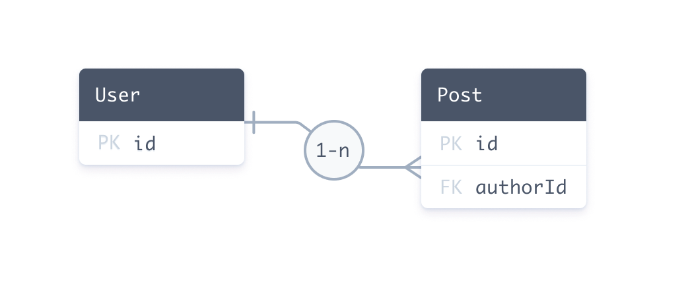
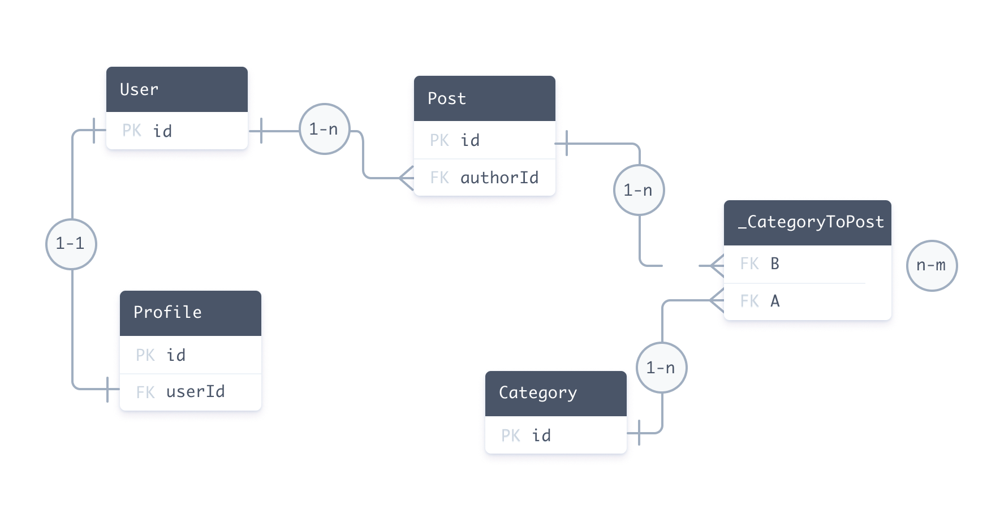

<TopBlock>

A relation is a _connection_ between two models in the Prisma schema. For example, there is a one-to-many relation between `User` and `Post` because one user can have many blog posts.

The following Prisma schema defines a one-to-many relation between the `User` and `Post` models. The fields involved in defining the relation are highlighted:

<TabbedContent tabs={[<FileWithIcon text="Relational databases" icon="database"/>, <FileWithIcon text="MongoDB" icon="database"/>]}>
<tab>

```prisma highlight=3,8,9;normal
model User {
  id    Int    @id @default(autoincrement())
  posts Post[]
}

model Post {
  id       Int  @id @default(autoincrement())
  author   User @relation(fields: [authorId], references: [id])
  authorId Int // relation scalar field  (used in the `@relation` attribute above)
}
```

</tab>
<tab>

```prisma highlight=3,8,9;normal
model User {
  id    String @id @default(auto()) @map("_id") @db.ObjectId
  posts Post[]
}

model Post {
  id       String @id @default(auto()) @map("_id") @db.ObjectId
  author   User   @relation(fields: [authorId], references: [id])
  authorId String @db.ObjectId // relation scalar field  (used in the `@relation` attribute above)
}
```

</tab>
</TabbedContent>

At a Prisma level, the `User` / `Post` relation is made up of:

- Two [relation fields](#relation-fields): `author` and `posts`. Relation fields define connections between models at the Prisma level and **do not exist in the database**. These fields are used to generate the Prisma Client.
- The scalar `authorId` field, which is referenced by the `@relation` attribute. This field **does exist in the database** - it is the foreign key that connects `Post` and `User`.

At a Prisma level, a connection between two models is **always** represented by a [relation field](#relation-fields) on **each side** of the relation.

</TopBlock>

## Relations in the database

### Relational databases

The following entity relationship diagram defines the same one-to-many relation between the `User` and `Post` tables in a **relational database**:



In SQL, you use a _foreign key_ to create a relation between two tables. Foreign keys are stored on **one side** of the relation. Our example is made up of:

- A foreign key column in the `Post` table named `authorId`.
- A primary key column in the `User` table named `id`. The `authorId` column in the `Post` table references the `id` column in the `User` table.

In the Prisma schema, the foreign key / primary key relationship is represented by the `@relation` attribute on the `author` field:

```prisma
author     User        @relation(fields: [authorId], references: [id])
```

> **Note**: Relations in the Prisma schema represent relationships that exist between tables in the database. If the relationship does not exist in the database, it does not exist in the Prisma schema.

### MongoDB

For MongoDB, Prisma currently uses a [normalized data model design](https://docs.mongodb.com/manual/core/data-model-design/), which means that documents reference each other by ID in a similar way to relational databases.

The following document represents a `User` (in the `User` collection):

```json
{ "_id": { "$oid": "60d5922d00581b8f0062e3a8" }, "name": "Ella" }
```

The following list of `Post` documents (in the `Post` collection) each have a `userId` field which reference the same user:

```json
[
  {
    "_id": { "$oid": "60d5922e00581b8f0062e3a9" },
    "title": "How to make sushi",
    "authorId": { "$oid": "60d5922d00581b8f0062e3a8" }
  },
  {
    "_id": { "$oid": "60d5922e00581b8f0062e3aa" },
    "title": "How to re-install Windows",
    "authorId": { "$oid": "60d5922d00581b8f0062e3a8" }
  }
]
```

This data structure represents a 1-n relation because multiple `Post` documents refer to the same `User` document.

#### `@db.ObjectId` on IDs and relation scalar fields

If your model's ID is an `ObjectId` (represented by a `String` field), you must add `@db.ObjectId` to the model's ID _and_ the relation scalar field on the other side of the relation:

```prisma highlight=3,9;normal
model User {
  id    String @id @default(auto()) @map("_id") @db.ObjectId
  posts Post[]
}

model Post {
  id       String @id @default(auto()) @map("_id") @db.ObjectId
  author   User   @relation(fields: [authorId], references: [id])
  authorId String @db.ObjectId // relation scalar field  (used in the `@relation` attribute above)
}
```

## Relations in the Prisma Client

The Prisma Client is generated from the Prisma schema. The following examples demonstrate how relations manifest when you use the Prisma Client to get, create, and update records.

The following query creates a `User` record and two connected `Post` records:

```ts
const userAndPosts = await prisma.user.create({
  data: {
    posts: {
      create: [
        { title: 'Prisma Day 2020' }, // Populates authorId with user's id
        { title: 'How to write a Prisma schema' }, // Populates authorId with user's id
      ],
    },
  },
})
```

In the underlying database, this query:

1. Creates a `User` with an auto-generated `id` (for example, `20`)
2. Creates two new `Post` records and sets the `authorId` of both records to `20`

The following query retrieves a `User` by `id` and includes any related `Post` records:

```ts
const getAuthor = await prisma.user.findUnique({
  where: {
    id: "20",
  },
  include: {
|    posts: true, // All posts where authorId == 20
  },
});
```

In the underlying database, this query:

1. Retrieves the `User` record with an `id` of `20`
2. Retrieves all `Post` records with an `authorId` of `20`

The following query associates an existing `Post` record with an existing `User` record:

```ts
const updateAuthor = await prisma.user.update({
  where: {
    id: 20,
  },
  data: {
    posts: {
      connect: {
        id: 4,
      },
    },
  },
})
```

In the underlying database, this query:

1. Sets the `authorId` to `20` on the `Post` record where the `id` is `4`

## Types of relations

There are three different types (or [cardinalities](<https://en.wikipedia.org/wiki/Cardinality_(data_modeling)>)) of relations in Prisma:

- [One-to-one](one-to-one-relations) (also called 1-1-relation)
- [One-to-many](one-to-many-relations) (also called 1-n-relation)
- [Many-to-many](many-to-many-relations) (also called m-n-relation)

The following Prisma schema includes every type of relation:

- 1-1: `User` ↔ `Profile`
- 1-n: `User` ↔ `Post`
- m-n: `Post` ↔ `Category`

Notice that the syntax is slightly different between relational databases and MongoDB - particularly for [many-to-many relations](many-to-many-relations).

> **Note**: This schema is the same as the [example data model](/concepts/components/prisma-schema/data-model) but has all [scalar fields](/concepts/components/prisma-schema/data-model#scalar-fields) removed (except for the required [relation scalars](#annotated-relation-fields-and-relation-scalar-fields)) so you can focus on the [relation fields](#relation-fields).

The following entity relationship diagram represents the database that corresponds to the sample Prisma schema:



## Terminology

### Relation fields

Relation [fields](/concepts/components/prisma-schema/data-model#defining-fields) are fields on a Prisma [model](/concepts/components/prisma-schema/data-model#defining-models) that do _not_ have a [scalar type](/concepts/components/prisma-schema/data-model#scalar-fields). Instead, their type is another model.

Every relation must have exactly two relation fields, one on each model. In case of 1-1 and 1-n relations, an additional _relation scalar field_ is required which gets linked by one of the two relation fields in the `@relation` attribute. This relation scalar is the direct representation of the _foreign key_ in the underlying database.

Consider these two models:

<TabbedContent tabs={[<FileWithIcon text="Relational databases" icon="database"/>, <FileWithIcon text="MongoDB" icon="database"/>]}>
<tab>

```prisma
model User {
  id      Int      @id @default(autoincrement())
  posts   Post[]
  profile Profile?
}

model Profile {
  id     Int  @id @default(autoincrement())
  user   User @relation(fields: [userId], references: [id])
  userId Int // relation scalar field (used in the `@relation` attribute above)
}

model Post {
  id         Int        @id @default(autoincrement())
  author     User       @relation(fields: [authorId], references: [id])
  authorId   Int // relation scalar field  (used in the `@relation` attribute above)
  categories Category[]
}

model Category {
  id    Int    @id @default(autoincrement())
  posts Post[]
}
```

</tab>
<tab>

```prisma
model User {
  id      String   @id @default(auto()) @map("_id") @db.ObjectId
  posts   Post[]
  profile Profile?
}

model Profile {
  id     String @id @default(auto()) @map("_id") @db.ObjectId
  user   User   @relation(fields: [userId], references: [id])
  userId String @db.ObjectId // relation scalar field (used in the `@relation` attribute above)
}

model Post {
  id          String     @id @default(auto()) @map("_id") @db.ObjectId
  author      User       @relation(fields: [authorId], references: [id])
  authorId    String     @db.ObjectId // relation scalar field  (used in the `@relation` attribute above)
  categories  Category[] @relation(fields: [categoryIds])
  categoryIds String[]   @db.Array(ObjectId)
}

model Category {
  id      String   @id @default(auto()) @map("_id") @db.ObjectId
  posts   Post[]   @relation(fields: [postIds])
  postIds String[] @db.Array(ObjectId)
}
```

</tab>
</TabbedContent>

> **Note**: This schema is the same as the [example data model](/concepts/components/prisma-schema/data-model) but has all [scalar fields](/concepts/components/prisma-schema/data-model#scalar-fields) removed (except for the required [relation scalars](/concepts/components/prisma-schema/relations#annotated-relation-fields-and-relation-scalar-fields)) so you can focus on the [relation fields](#relation-fields).
> **Note**: Implicit many-to-many relations do **not** require the `@relation` attribute unless you need to [disambiguate relations](#disambiguating-relations) (this is not specific to implicit n-m relations).

Implicit many-to-many relations require both models to have a single `@id`. Be aware that:

- You cannot use a [multi-field ID](/reference/api-reference/prisma-schema-reference#id-1)

- You cannot use a `@unique` in place of an `@id`

To use either of these features, you must set up an explicit many-to-many instead.

The implicit m-n-relation still manifests in a relation table in the underlying database. However, this relation table is managed by Prisma.

Using an implicit instead of an explicit m-n relations makes the [Prisma Client API](/concepts/components/prisma-client/) for many-to-many relations a bit simpler (since you e.g. have one fewer level of nesting inside of [nested writes](/concepts/components/prisma-client/relation-queries#nested-writes)).

If you're not using Prisma Migrate but obtain your data model from [introspection](/concepts/components/introspection), you can still make use of implicit many-to-many relations by following Prisma's [conventions for relation tables](many-to-many-relations#conventions-for-relation-tables-in-implicit-m-n-relations).

For **relational databases**, the following entity relationship diagram represents the database that corresponds to the sample Prisma schema:


For **MongoDB**, Prisma uses a [normalized data model design](https://docs.mongodb.com/manual/core/data-model-design/), which means that documents reference each other by ID in a similar way to relational databases:

For example, the following MongoDB document represents a `User`:

```json
{ "_id": { "$oid": "60d5922d00581b8f0062e3a8" }, "name": "Ella" }
```

The following list of `Post` documents each have a `userId` field which reference the same user:

```json
[
  {
    "_id": { "$oid": "60d5922e00581b8f0062e3a9" },
    "title": "How to make sushi",
    "authorId": { "$oid": "60d5922d00581b8f0062e3a8" }
  },
  {
    "_id": { "$oid": "60d5922e00581b8f0062e3aa" },
    "title": "How to re-install Windows",
    "authorId": { "$oid": "60d5922d00581b8f0062e3a8" }
  }
]
```

## Relation fields

Relation [fields](/concepts/components/prisma-schema/data-model#defining-fields) are fields on a Prisma [model](/concepts/components/prisma-schema/data-model#defining-models) that do _not_ have a [scalar type](/concepts/components/prisma-schema/data-model#scalar-fields). Instead, their type is another model.

Every relation must have exactly two relation fields, one on each model. In case of 1-1 and 1-n relations, an additional _relation scalar field_ is required which gets linked by one of the two relation fields in the `@relation` attribute. This relation scalar is the direct representation of the _foreign key_ in the underlying database.

Consider these two models:

<TabbedContent tabs={[<FileWithIcon text="Relational databases" icon="database"/>, <FileWithIcon text="MongoDB" icon="database"/>]}>
<tab>

```prisma
model User {
  id    Int    @id @default(autoincrement())
  email String @unique
  role  Role   @default(USER)
  posts Post[]
}

model Post {
  id       Int    @id @default(autoincrement())
  title    String
  author   User   @relation(fields: [authorId], references: [id])
  authorId Int // relation scalar field (used in the `@relation` attribute above)
}
```

</tab>
<tab>

```prisma
model User {
  id    String @id @default(auto()) @map("_id") @db.ObjectId
  email String @unique
  role  Role   @default(USER)
  posts Post[]
}

model Post {
  id       String @id @default(auto()) @map("_id") @db.ObjectId
  title    String
  author   User   @relation(fields: [authorId], references: [id])
  authorId String @db.ObjectId // relation scalar field (used in the `@relation` attribute above)
}
```

</tab>
</TabbedContent>

These models have the following fields:

<TabbedContent tabs={[<FileWithIcon text="Relational databases" icon="database"/>, <FileWithIcon text="MongoDB" icon="database"/>]}>
<tab>

| Model  | Field      | Relational | Relation field               |
| :----- | :--------- | :--------- | :--------------------------- |
| `User` | `id`       | `Int`      | No                           |
|        | `email`    | `String`   | No                           |
|        | `role`     | `Role`     | No                           |
|        | `posts`    | `Post[]`   | **Yes** (Prisma-level)       |
| `Post` | `id`       | `Int`      | No                           |
|        | `title`    | `String`   | No                           |
|        | `authorId` | `Int`      | No (_relation scalar field_) |
|        | `author`   | `User`     | **Yes** (_annotated_)        |

</tab>
<tab>

| Model  | Field      | Relational | Relation field               | Notes                                  |
| :----- | :--------- | :--------- | :--------------------------- | -------------------------------------- |
| `User` | `id`       | `String`   | No                           | Underlying database type is `ObjectId` |
|        | `email`    | `String`   | No                           |
|        | `role`     | `Role`     | No                           |
|        | `posts`    | `Post[]`   | **Yes** (Prisma-level)       |
| `Post` | `id`       | `Int`      | No                           |
|        | `title`    | `String`   | No                           |
|        | `authorId` | `String`   | No (_relation scalar field_) | Underlying database type is `ObjectId` |
|        | `author`   | `User`     | **Yes** (_annotated_)        |

</tab>
</TabbedContent>

Both `posts` and `author` are relation fields because their types are not scalar types but other models.

Also note that the annotated relation field `author` needs to link the relation scalar field `authorId` on the `Post` model inside the `@relation` attribute. The relation scalar represents the foreign key in the underlying database.

The other relation field called `posts` is defined purely on a Prisma-level, it doesn't manifest in the database.

### Annotated relation fields and relation scalar fields

Relations that require one side of the relation to be _annotated_ with the `@relation` attribute are referred to as _annotated relation fields_. This includes:

- 1-1
- 1-n
- m-n for MongoDB only

The side of the relation which is annotated with the `@relation` attribute represents the side that **stores the foreign key in the underlying database**. The "actual" field that represents the foreign key is required on that side of the relation as well, it's called _relation scalar field_, and is referenced inside `@relation` attribute:

<TabbedContent tabs={[<FileWithIcon text="Relational databases" icon="database"/>, <FileWithIcon text="MongoDB" icon="database"/>]}>
<tab>

```prisma
author     User    @relation(fields: [authorId], references: [id])
authorId   Int
```

</tab>
<tab>

```prisma
author     User    @relation(fields: [authorId], references: [id])
authorId   String  @db.ObjectId
```

</tab>
</TabbedContent>

A scalar field _becomes_ a relation scalar field when it's used in the `fields` of a `@relation` attribute.

<Admonition type="info">

Relation scalar fields are read-only in the generated [Prisma Client API](/concepts/components/prisma-client/). If you want to update a relation in your code, you can do so using [nested writes](/concepts/components/prisma-client/relation-queries#nested-writes).

</Admonition>

#### Relation scalar naming conventions

Because a relation scalar field always _belongs_ to a relation field, the following naming convention is common:

- Relation field: `author`
- Relation scalar field: `authorId` (relation field name + `Id`)

## The <inlinecode>@relation</inlinecode> attribute

The [`@relation`](/reference/api-reference/prisma-schema-reference#relation) <span class="api"></span> attribute can only be applied to the [relation fields](#relation-fields), not to [scalar fields](/concepts/components/prisma-schema/data-model#scalar-fields).

The `@relation` attribute is required when:

- you define a 1-1 or 1-n relation, it is required on _one side_ of the relation (with the corresponding relation scalar field)
- you need to disambiguate a relation (that's e.g. the case when you have two relations between the same models)
- you define a [self-relation](self-relations)
- you define [an m-n for MongoDB](many-to-many-relations#mongodb)
- you need to control how the relation table is represented in the underlying database (e.g. use a specific name for a relation table)

> **Note**: [Implicit m-n relations](many-to-many-relations#implicit-many-to-many-relations) in relational databases do not require the `@relation` attribute.

## Disambiguating relations

When you define two relations between two the same models, you need to add the `name` argument in the `@relation` attribute to disambiguate them. As an example for why that's needed, consider the following models:

<TabbedContent tabs={[<FileWithIcon text="Relational databases" icon="database"/>, <FileWithIcon text="MongoDB" icon="database"/>]}>
<tab>

```prisma
model User {
  id           Int     @id @default(autoincrement())
  name         String?
  writtenPosts Post[]
  pinnedPost   Post?
}

model Post {
  id         Int     @id @default(autoincrement())
  title      String?
  author     User    @relation(fields: [authorId], references: [id])
  authorId   Int
  pinnedBy   User?   @relation(fields: [pinnedById], references: [id])
  pinnedById Int?
}
```

</tab>
<tab>

```prisma
model User {
  id           String  @id @default(auto()) @map("_id") @db.ObjectId
  name         String?
  writtenPosts Post[]
  pinnedPost   Post?
}

model Post {
  id         String  @id @default(auto()) @map("_id") @db.ObjectId
  title      String?
  author     User    @relation(fields: [authorId], references: [id])
  authorId   String  @db.ObjectId
  pinnedBy   User?   @relation(fields: [pinnedById], references: [id])
  pinnedById String? @db.ObjectId
}
```

</tab>
</TabbedContent>

In that case, the relations are ambiguous, there are four different ways to interpret them:

- `User.writtenPosts` ↔ `Post.author` + `Post.authorId`
- `User.writtenPosts` ↔ `Post.pinnedBy` + `Post.pinnedById`
- `User.pinnedPost` ↔ `Post.author` + `Post.authorId`
- `User.pinnedPost` ↔ `Post.pinnedBy` + `Post.pinnedById`

To disambiguate these relations, you need to annotate the relation fields with the `@relation` attribute and provide the `name` argument. You can set any `name` (except for the empty string `""`), but it must be the same on both sides of the relation:

<TabbedContent tabs={[<FileWithIcon text="Relational databases" icon="database"/>, <FileWithIcon text="MongoDB" icon="database"/>]}>
<tab>

```prisma
model User {
  id           Int     @id @default(autoincrement())
  name         String?
  writtenPosts Post[]  @relation("WrittenPosts")
  pinnedPost   Post?   @relation("PinnedPost")
}

model Post {
  id         Int     @id @default(autoincrement())
  title      String?
  author     User    @relation("WrittenPosts", fields: [authorId], references: [id])
  authorId   Int
  pinnedBy   User?   @relation(name: "PinnedPost", fields: [pinnedById], references: [id])
  pinnedById Int?
}
```

</tab>
<tab>

```prisma
model User {
  id           String  @id @default(auto()) @map("_id") @db.ObjectId
  name         String?
  writtenPosts Post[]  @relation("WrittenPosts")
  pinnedPost   Post?   @relation("PinnedPost")
}

model Post {
  id         String  @id @default(auto()) @map("_id") @db.ObjectId
  title      String?
  author     User    @relation("WrittenPosts", fields: [authorId], references: [id])
  authorId   String  @db.ObjectId
  pinnedBy   User?   @relation(name: "PinnedPost", fields: [pinnedById], references: [id])
  pinnedById String? @db.ObjectId
}
```

</tab>
</TabbedContent>

<!--


### Virtual relation fields

Virtual relation fields are relation fields in the Prisma schema that are not "manifested" in the database schema.

There are two different kinds of virtual relation fields.

For **1-1 and 1-n relations**, one side of the relation represents a foreign key, the other side is a virtual relation field:

<!-- 


For **implicit m-n-relations**, both relation fields are virtual since neither of them _directly_ maps to a foreign key:


Prisma always requires both sides of a relation to be present, this means that one virtual relation field always needs to be added per relation. When [formatting the Prisma schema](), the formatter automatically inserts any missing virtual relation fields for you to save some typing work.

Virtual relation fields are also present in the generated [Prisma CLI](/concepts/components/prisma-client) which makes working with relations more convenient as you can traverse relationships in your code in both directions, for example:

```js
// Traverse relation from `Post` to `User` via fluent API
const user = await prisma.post.findUnique({ where: { id: 1 } }).author();

// Traverse relation from `User` to `Post` via fluent API
const user = await prisma.user.findUnique({ where: { id: 1 } }).posts();
```

-->
