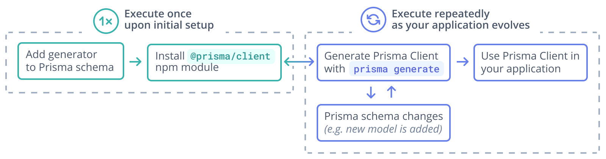
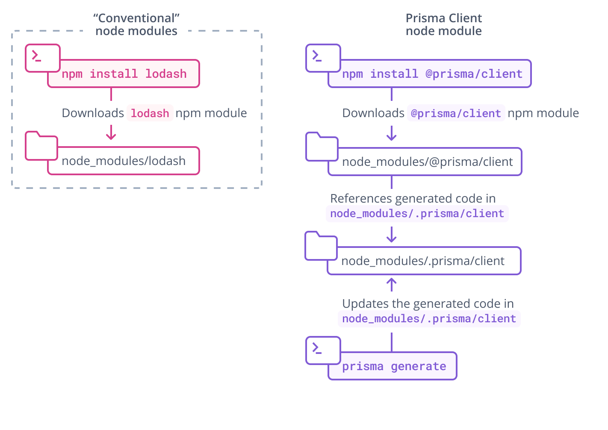

<TopBlock>

Prisma Client is an auto-generated database client that's tailored to your database schema. By default, Prisma Client is generated into the `node_modules/.prisma/client` folder, but [you can specify a custom location](#using-a-custom-output-path).

To generate and instantiate Prisma Client:

1. Ensure that you have [Prisma CLI installed on your machine](/reference/api-reference/command-reference#installation).

1. Add the following `generator` definition to your Prisma schema:

   ```prisma
   generator client {
     provider = "prisma-client-js"
   }
   ```

1. Install the `@prisma/client` npm package:

   ```terminal
   npm install @prisma/client
   ```

   <Admonition type="warning">

   We recommend that you keep **both** the `prisma` and `@prisma/client` packages in sync to avoid any unexpected errors or behaviors.

   </Admonition>

1. Generate Prisma Client with the following command:

   ```terminal
   prisma generate
   ```

1. You can now [instantiate the Prisma Client](instantiate-prisma-client) in your code:

   <TabbedContent tabs={[<FileWithIcon text="TypeScript" icon="code"/>, <FileWithIcon text="JavaScript" icon="code"/>]}>

   <tab>

   ```ts
   import { PrismaClient } from '@prisma/client'
   const prisma = new PrismaClient()
   // use `prisma` in your application to read and write data in your DB
   ```

   </tab>

   <tab>

   ```js
   const { PrismaClient } = require('@prisma/client')
   const prisma = new PrismaClient()
   // use `prisma` in your application to read and write data in your DB
   ```

  </tab>

  </TabbedContent>

> **Important**: You need to re-run the `prisma generate` command after every change that's made to your Prisma schema to update the generated Prisma Client code.

Here is a graphical illustration of the typical workflow for the Prisma Client generation:



Note also that `prisma generate` is _automatically_ invoked when you're installing the `@prisma/client` npm package. So, when you're initially setting up Prisma Client, you can typically save the third step from the list above.

</TopBlock>

## The `@prisma/client` npm package

The `@prisma/client` npm package consists of two key parts:

- The `@prisma/client` module itself, which only changes when you re-install the package
- The `.prisma/client` folder, which is the [default location](#using-a-custom-output-path) for the unique Prisma Client generated from your schema

`@prisma/client/index.d.ts` exports `.prisma/client`:

```ts
export * from '.prisma/client'
```

This means that you still import `@prisma/client` in your own `.ts` files:

```ts
import { PrismaClient } from '@prisma/client'
```

The Prisma Client is generated from your Prisma schema and is unique to your project. Each time you change the schema (for example, by performing a [schema migration](/concepts/components/prisma-migrate)) and run `prisma generate`, the client code changes:



The `.prisma` folder is unaffected by [pruning](https://docs.npmjs.com/cli/prune.html) in Node.js package managers.

## The location of Prisma Client

If you do not specify a custom `output` in the `generator` block, Prisma Client is generated into the `./node_modules/.prisma/client` folder by default. There are [some advantages to maintaining the default location](#why-is-prisma-client-generated-into-node_modulesprismaclient-by-default).

### Using a custom `output` path

You can also specify a custom `output` path on the `generator` configuration, for example (assuming your `schema.prisma` file is located at the default `prisma` subfolder):

```prisma
generator client {
  provider = "prisma-client-js"
  output   = "../src/generated/client"
}
```

After running `prisma generate` for that schema file, the Prisma Client package will be located in:

```
./src/generated/client
```

To import the `PrismaClient` from a custom location (for example, from a file named `./src/script.ts`):

```ts
import { PrismaClient } from './generated/client'
```

### Why is Prisma Client generated into `node_modules/.prisma/client` by default?

#### Importing Prisma Client

By generating Prisma Client into `node_modules/.prisma/client` and exporting it from `@prisma/client`, you can import it and instantiate the client in your code as follows:

```js
import { PrismaClient } from '@prisma/client'

const prisma = new PrismaClient()

// use `prisma` in your application to read and write data in your DB
```

or

```js
const { PrismaClient } = require('@prisma/client')

const prisma = new PrismaClient()

// use `prisma` in your application to read and write data in your DB
```

#### Keeping the query engine out of version control by default

Prisma Client uses a [_query engine_](/concepts/components/prisma-engines/query-engine) to run queries against the database. This query engine is downloaded when `prisma generate` is invoked and stored in the `output` path together with the generated Client.

By generating Prisma Client into `node_modules`, the query engine is usually kept out of version control by default since `node_modules` is typically ignored for version control.
When using a custom `output` path for the generated Prisma Client, it is advised to exclude it from your version control. For Git, this means adding the `output` path to your `.gitignore` file.

## Generating Prisma Client in the `postinstall` hook of `@prisma/client`

The `@prisma/client` package defines its own `postinstall` hook that's being executed whenever the package is being installed. This hook invokes the `prisma generate` command which in turn generates the Prisma Client code into the default location `node_modules/.prisma/client`. Notice that this requires the `prisma` CLI to be available, either as local dependency or as a global installation. It is recommended to always install the `prisma` package as a development dependency, using `npm install prisma --save-dev`, to avoid versioning conflicts.
