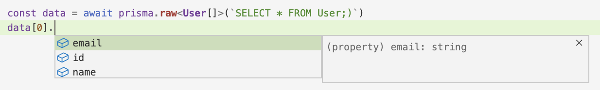

<TopBlock>

Prisma Client supports the option of sending raw queries to your database. You may wish to use raw queries if:

- you want to run a heavily optimized query
- you require a feature that Prisma Client does not yet support (please [consider raising an issue](https://github.com/prisma/prisma/issues/new/choose))

Raw queries are available for all relational databases Prisma supports. In addition, from version `3.9.0` raw queries are supported in MongoDB. For more details, see the relevant sections:

- [Raw queries with relational databases](#raw-queries-with-relational-databases)
- [Raw queries with MongoDB](#raw-queries-with-mongodb)

</TopBlock>

## Raw queries with relational databases

For relational databases, Prisma Client exposes four methods that allow you to send raw queries. You can use:

- `$queryRaw` to return actual records (for example, using `SELECT`)
- `$executeRaw` to return a count of affected rows (for example, after an `UPDATE` or `DELETE`)
- `$queryRawUnsafe` to return actual records (for example, using `SELECT`) using a raw string. **Potential SQL injection risk**
- `$executeRawUnsafe` to return a count of affected rows (for example, after an `UPDATE` or `DELETE`) using a raw string. **Potential SQL injection risk**

### <inlinecode>$queryRaw</inlinecode>

`$queryRaw` returns actual database records. For example, the following `SELECT` query returns all fields for each record in the `User` table:

```ts no-lines
const result = await prisma.$queryRaw`SELECT * FROM User`
```

The method is implemented as a [tagged template](https://developer.mozilla.org/en-US/docs/Web/JavaScript/Reference/Template_literals#Tagged_templates), which allows you to pass a template literal where you can easily insert your [variables](#using-variables). In turn, Prisma creates prepared statements that are safe from SQL injections:

```ts no-lines
const email = 'emelie@prisma.io'
const result = await prisma.$queryRaw`SELECT * FROM User WHERE email = ${email}`
```

You can also use the [`Prisma.sql`](#tagged-template-helpers) helper, in fact, the `$queryRaw` method will **only accept** a template string or the `Prisma.sql` helper:

```ts no-lines
const email = 'emelie@prisma.io'
const result = await prisma.$queryRaw(
  Prisma.sql`SELECT * FROM User WHERE email = ${email}`
)
```

#### Considerations

Be aware that:

- Template variables cannot be used inside SQL string literals. For example, the following query would **not** work:

  ```ts no-lines
  const name = 'Bob'
  await prisma.$queryRaw`SELECT 'My name is ${name}';`
  ```

  Instead, you can either pass the whole string as a variable, or use string concatenation:

  ```ts no-lines
  const name = 'My name is Bob'
  await prisma.$queryRaw`SELECT ${name};`
  ```

  ```ts no-lines
  const name = 'Bob'
  await prisma.$queryRaw`SELECT 'My name is ' || ${name};`
  ```

- Template variables can only be used for data values (such as `email` in the example above). Variables cannot be used for identifiers such as column names, table names or database names, or for SQL keywords. For example, the following two queries would **not** work:

```ts no-lines
const myTable = 'user'
await prisma.$queryRaw`SELECT * FROM ${myTable};`
```

```ts no-lines
const ordering = 'desc'
await prisma.$queryRaw`SELECT * FROM Table ORDER BY ${ordering};`
```

- Prisma maps any database values returned by `$queryRaw` and `$queryRawUnsafe` to their corresponding JavaScript types. [Learn more](#raw-query-type-mapping).

- `$queryRaw` does not support dynamic table names in PostgreSQL databases. [Learn more](#dynamic-table-names-in-postgresql)

#### Return type

`$queryRaw` returns an array. Each object corresponds to a database record:

```json5
[
  { id: 1, email: 'emelie@prisma.io', name: 'Emelie' },
  { id: 2, email: 'yin@prisma.io', name: 'Yin' },
]
```

You can also [type the results of `$queryRaw`](#typing-queryraw-results).

#### Signature

```ts no-lines
$queryRaw<T = unknown>(query: TemplateStringsArray | Prisma.Sql, ...values: any[]): PrismaPromise<T>;
```

#### Typing `$queryRaw` results

`PrismaPromise<T>` uses a [generic type parameter `T`](https://www.typescriptlang.org/docs/handbook/generics.html). You can determine the type of `T` when you invoke the `$queryRaw` method. In the following example, `$queryRaw` returns `User[]`:

```ts
// import the generated `User` type from the `@prisma/client` module
import { User } from '@prisma/client'

const result = await prisma.$queryRaw<User[]>`SELECT * FROM User`
// result is of type: `User[]`
```

> **Note**: If you do not provide a type, `$queryRaw` defaults to `unknown`.

<!--  -->

If you are selecting **specific fields** of the model or want to include relations, refer to the documentation about [leveraging Prisma Client's generated types](advanced-type-safety) if you want to make sure that the results are properly typed.

#### Type caveats when using raw SQL

When you type the results of `$queryRaw`, the raw data might not always match the suggested TypeScript type. For example, the following Prisma model includes a `Boolean` field named `published`:

```prisma highlight=3;normal
model Post {
  id        Int     @id @default(autoincrement())
  published Boolean @default(false)
  title     String
  content   String?
}
```

The following query returns all posts. It then prints out the value of the `published` field for each `Post`:

```ts
const result = await prisma.$queryRaw<Post[]>`SELECT * FROM Post`

result.forEach((x) => {
  console.log(x.published)
})
```

> **Note**: The Prisma Client query engine standardizes the return type for all databases. **Using the raw queries does not**. If the database provider is MySQL, the values are `1` or `0`. However, if the database provider is PostgreSQL, the values are `true`, `false`, or `NULL`.

> **Note**: Prisma sends JavaScript integers to PostgreSQL as `INT8`. This might conflict with your user-defined functions that accept only `INT4` as input. If you use `$queryRaw` in conjunction with a PostgreSQL database, update the input types to `INT8`, or cast your query parameters to `INT4`.

#### Dynamic table names in PostgreSQL

[It is not possible to interpolate table names](#considerations). This means that you cannot use dynamic table names with `$queryRaw`. Instead, you must use [`$queryRawUnsafe`](#queryrawunsafe), as follows:

```ts
let userTable = 'User'
let result = await prisma.$queryRawUnsafe(`SELECT * FROM ${userTable}`)
```

Note that if you use `$queryRawUnsafe` in conjunction with user inputs, you risk SQL injection attacks. [Learn more](#queryrawunsafe).

### <inlinecode>$queryRawUnsafe</inlinecode>

The `$queryRawUnsafe` method allows you to pass a raw string (or template string) to the database.

<Admonition type="warning">

If you use this method with user inputs (in other words, `SELECT * FROM table WHERE columnx = ${userInput}`), then you open up the possibility for SQL injection attacks. SQL injection attacks can expose your data to modification or deletion.<br /><br />

We strongly advise that you use the `$queryRaw` query instead. For more information on SQL injection attacks, see the [OWASP SQL Injection guide](https://www.owasp.org/index.php/SQL_Injection).

</Admonition>

The following query returns all fields for each record in the `User` table:

```ts
// import the generated `User` type from the `@prisma/client` module
import { User } from '@prisma/client'

const result = await prisma.$queryRawUnsafe('SELECT * FROM User')
```

You can also run a parameterized query. The following example returns all users whose email contains the string `emelie@prisma.io`:

```ts
prisma.$queryRawUnsafe(
  'SELECT * FROM users WHERE email = $1',
  'emelie@prisma.io'
)
```

> **Note**: Prisma sends JavaScript integers to PostgreSQL as `INT8`. This might conflict with your user-defined functions that accept only `INT4` as input. If you use a parameterized `$queryRawUnsafe` query in conjunction with a PostgreSQL database, update the input types to `INT8`, or cast your query parameters to `INT4`.

#### Signature

```ts no-lines
$queryRawUnsafe<T = unknown>(query: string, ...values: any[]): PrismaPromise<T>;
```

#### Parameterized queries

As an alternative to tagged templates, `$queryRawUnsafe` supports standard parameterized queries where each variable is represented by a symbol (`?` for mySQL, `$1`, `$2`, and so on for PostgreSQL). The following example uses a MySQL query:

```ts
const userName = 'Sarah'
const email = 'sarah@prisma.io'
const result = await prisma.$queryRawUnsafe(
  'SELECT * FROM User WHERE (name = ? OR email = ?)',
  userName,
  email
)
```

> **Note**: MySQL variables are represented by `?`

The following example uses a PostgreSQL query:

```ts
const userName = 'Sarah'
const email = 'sarah@prisma.io'
const result = await prisma.$queryRawUnsafe(
  'SELECT * FROM User WHERE (name = $1 OR email = $2)',
  userName,
  email
)
```

> **Note**: PostgreSQL variables are represented by `$1` and `$2`

As with tagged templates, Prisma Client escapes all variables.

> **Note**: You cannot pass a table or column name as a variable into a parameterized query. For example, you cannot `SELECT ?` and pass in `*` or `id, name` based on some condition.

##### Parameterized PostgreSQL `ILIKE` query

When you use `ILIKE`, the `%` wildcard character(s) should be included in the variable itself, not the query (`string`):

```ts
const userName = 'Sarah'
const emailFragment = 'prisma.io'
const result = await prisma.$queryRawUnsafe(
  'SELECT * FROM "User" WHERE (name = $1 OR email ILIKE $2)',
  userName,
  `%${emailFragment}`
)
```

> **Note**: Using `%$2` as an argument would not work

### <inlinecode>$executeRaw</inlinecode>

`$executeRaw` returns the _number of rows affected by a database operation_, such as `UPDATE` or `DELETE`. This function does **not** return database records. The following query updates records in the database and returns a count of the number of records that were updated:

```ts
const result: number =
  await prisma.$executeRaw`UPDATE User SET active = true WHERE emailValidated = true`
```

The method is implemented as a [tagged template](https://developer.mozilla.org/en-US/docs/Web/JavaScript/Reference/Template_literals#Tagged_templates), which allows you to pass a template literal where you can easily insert your [variables](#using-variables). In turn, Prisma creates prepared statements that are safe from SQL injections:

```ts
const emailValidated = true
const active = true

const result: number =
  await prisma.$executeRaw`UPDATE User SET active = ${active} WHERE emailValidated = ${emailValidated};`
```

Be aware that:

- `$executeRaw` does not support multiple queries in a single string (for example, `ALTER TABLE` and `CREATE TABLE` together).
- Prisma Client submits prepared statements, and prepared statements only allow a subset of SQL statements. For example, `START TRANSACTION` is not permitted. You can learn more about [the syntax that MySQL allows in Prepared Statements here](https://dev.mysql.com/doc/refman/8.0/en/sql-prepared-statements.html).
- [`PREPARE` does not support `ALTER`](https://www.postgresql.org/docs/current/sql-prepare.html) - see the [workaround](#alter-limitation-postgresql).
- Template variables cannot be used inside SQL string literals. For example, the following query would **not** work:

  ```ts no-lines
  const name = 'Bob'
  await prisma.$queryRaw`UPDATE user SET greeting = 'My name is ${name}';`
  ```

  Instead, you can either pass the whole string as a variable, or use string concatenation:

  ```ts no-lines
  const name = 'My name is Bob'
  await prisma.$queryRaw`UPDATE user SET greeting = ${name};`
  ```

  ```ts no-lines
  const name = 'Bob'
  await prisma.$queryRaw`UPDATE user SET greeting = 'My name is ' || ${name};`
  ```

- Template variables can only be used for data values (such as `email` in the example above). Variables cannot be used for identifiers such as column names, table names or database names, or for SQL keywords. For example, the following two queries would **not** work:

  ```ts no-lines
  const myTable = 'user'
  await prisma.$queryRaw`UPDATE ${myTable} SET active = true;`
  ```

  ```ts no-lines
  const ordering = 'desc'
  await prisma.$queryRaw`UPDATE User SET active = true ORDER BY ${desc};`
  ```

#### Return type

`$executeRaw` returns a `number`.

#### Signature

```ts
$executeRaw<T = unknown>(query: TemplateStringsArray | Prisma.Sql, ...values: any[]): PrismaPromise<number>;
```

### <inlinecode>$executeRawUnsafe</inlinecode>

The `$executeRawUnsafe` method allows you to pass a raw string (or template string) to the database. Like `$executeRaw`, it does **not** return database records, but returns the number of rows affected.

> **Note**: `$executeRawUnsafe` can only run **one** query at a time. You cannot append a second query - for example, adding `DROP bobby_tables` to the end of an `ALTER`.

<Admonition type="warning">

If you use this method with user inputs (in other words, `SELECT * FROM table WHERE columnx = ${userInput}`), then you open up the possibility for SQL injection attacks. SQL injection attacks can expose your data to modification or deletion.<br /><br />

We strongly advise that you use the `$executeRaw` query instead. For more information on SQL injection attacks, see the [OWASP SQL Injection guide](https://www.owasp.org/index.php/SQL_Injection).

</Admonition>

The following example uses a template string to update records in the database. It then returns a count of the number of records that were updated:

```ts
const emailValidated = true
const active = true

const result = await prisma.$executeRawUnsafe(
  `UPDATE User SET active = ${active} WHERE emailValidated = ${emailValidated}`
)
```

The same can be written as a parameterized query:

```ts
const result = prisma.$executeRawUnsafe(
  'UPDATE User SET active = $1 WHERE emailValidated = $2',
  'yin@prisma.io',
  true
)
```

#### Signature

```ts no-lines
$executeRawUnsafe<T = unknown>(query: string, ...values: any[]): PrismaPromise<number>;
```

### Raw query type mapping

Prisma maps any database values returned by `$queryRaw` and `$queryRawUnsafe`to their corresponding [JavaScript types](https://developer.mozilla.org/en-US/docs/Web/JavaScript/Data_structures). This behavior is the same as for regular Prisma query methods like `findMany`.

<Admonition type="info">

**Feature availability:**

- In v3.14.x and v3.15.x, raw query type mapping was available with the preview feature `improvedQueryRaw`. We made raw query type mapping [Generally Available](/about/prisma/releases#generally-available-ga) in version 4.0.0, so you do not need to use `improvedQueryRaw` in version 4.0.0 or later.
- Before version 4.0.0, raw query type mapping was not available for SQLite.

</Admonition>

As an example, take a raw query that selects columns with `BigInt`, `Bytes`, `Decimal` and `Date` types from a table:

<CodeWithResult expanded={true}>

<cmd>

```ts
const result =
  await prisma.$queryRaw`SELECT bigint, bytes, decimal, date FROM "Table";`

console.log(result)
```

</cmd>

<cmdResult>

```terminal no-copy
{ bigint: BigInt("123"), bytes: Buffer.from([1, 2]), decimal: Decimal("12.34"), date: Date("<some_date>") }
```

</cmdResult>

</CodeWithResult>

In the `result` object, the database values have been mapped to the corresponding JavaScript types.

The following table shows the conversion between types used in the database and the JavaScript type returned by the raw query:

| Database type           | JavaScript type |
| ----------------------- | --------------- |
| Text                    | `String`        |
| 32-bit integer          | `Number`        |
| Floating point number   | `Number`        |
| Double precision number | `Number`        |
| 64-bit integer          | `BigInt`        |
| Decimal / numeric       | `Decimal`       |
| Bytes                   | `Buffer`        |
| Json                    | `Object`        |
| DateTime                | `Date`          |
| Date                    | `Date`          |
| Time                    | `Date`          |
| Uuid                    | `String`        |
| Xml                     | `String`        |

Note that the exact name for each database type will vary between databases – for example, the boolean type is known as `boolean` in PostgreSQL and `STRING` in CockroachDB. See the [Scalar types reference](/reference/api-reference/prisma-schema-reference#model-field-scalar-types) for full details of type names for each database.

### PostgreSQL typecasting fixes

Prisma resolves a number of issues with typecasting in PostgreSQL.

<Admonition type="info">

**Feature availability:** In v3.14.x and v3.15.x, these PostgreSQL fixes were available with the preview feature `improvedQueryRaw`. We made these fixes [Generally Available](/about/prisma/releases#generally-available-ga) in version 4.0.0, so you do not need to use `improvedQueryRaw` in version 4.0.0 or later.

</Admonition>

For example, the following raw query now works correctly, returning an integer result:

```ts
await prisma.$queryRaw`SELECT ${1.5}::int as int`

// Before: db error: ERROR: incorrect binary data format in bind parameter 1
// After: [{ int: 2 }]
```

A consequence of this fix is that some subtle implicit casts are now handled more strictly, so some queries that previously were allowed will now fail. As an example, take the following query using PostgreSQL's `LENGTH` function, which only accepts the `text` type as an input:

```ts
await prisma.$queryRaw`SELECT LENGTH(${42});`
```

Before version 4.0.0, Prisma silently coerces `42` to `text`. From version 4.0.0, the query returns an error:

```terminal
// ERROR: function length(integer) does not exist
// HINT: No function matches the given name and argument types. You might need to add explicit type casts.
```

The fix in this case is to explicitly cast `42` to the `text` type:

```ts
await prisma.$queryRaw`SELECT LENGTH(${42}::text);`
```

### Transactions

In 2.10.0 and later, you can use `.$executeRaw()` and `.$queryRaw()` inside a [transaction](transactions).

### Using variables

`$executeRaw` and `$queryRaw` are implemented as [**tagged templates**](https://developer.mozilla.org/en-US/docs/Web/JavaScript/Reference/Template_literals#Tagged_templates). Tagged templates are the recommended way to use variables with raw SQL in the Prisma Client.

The following example includes a placeholder named `${userId}`:

```ts
const userId = 42
const result = await prisma.$queryRaw`SELECT * FROM User WHERE id = ${userId};`
```

✔ Benefits of using the tagged template versions of `$queryRaw` and `$executeRaw` include:

- Prisma Client escapes all variables.
- Tagged templates are database-agnostic - you do not need to remember if variables should be written as `$1` (PostgreSQL) or `?` (MySQL).
- [SQL Template Tag](https://github.com/blakeembrey/sql-template-tag) give you access to [useful helpers](#tagged-template-helpers).
- Embedded, named variables are easier to read.

> **Note**: You cannot pass a table or column name into a tagged template placeholder. For example, you cannot `SELECT ?` and pass in `*` or `id, name` based on some condition.

#### Tagged template helpers

Prisma Client specifically uses [SQL Template Tag](https://github.com/blakeembrey/sql-template-tag), which exposes a number of helpers. For example, the following query uses `join()` to pass in a list of IDs:

```ts
import { Prisma } from '@prisma/client'

const ids = [1, 3, 5, 10, 20]
const result =
  await prisma.$queryRaw`SELECT * FROM User WHERE id IN (${Prisma.join(ids)})`
```

The following example uses the `empty` and `sql` helpers to change the query depending on whether `userName` is empty:

```ts
import { Prisma } from '@prisma/client'

const userName = ''
const result = await prisma.$queryRaw`SELECT * FROM User ${
  userName ? Prisma.sql`WHERE name = ${userName}` : Prisma.empty // Cannot use "" or NULL here!
}`
```

#### <inlinecode>ALTER</inlinecode> limitation (PostgreSQL)

PostgreSQL [does not support using `ALTER` in a prepared statement](https://www.postgresql.org/docs/current/sql-prepare.html), which means that the following queries **will not work**:

```ts
await prisma.$executeRaw`ALTER USER prisma WITH PASSWORD "${password}"`
await prisma.$executeRaw(
  Prisma.sql`ALTER USER prisma WITH PASSWORD "${password}"`
)
```

You can use the following query, but be aware that this is potentially **unsafe** as `${password}` is not escaped:

```ts
await prisma.$executeRawUnsafe('ALTER USER prisma WITH PASSWORD "$1"', password})
```

### Unsupported types

[`Unsupported` types](/reference/api-reference/prisma-schema-reference#unsupported) need to be cast to Prisma supported types before using them in `$queryRaw` or `$queryRawUnsafe`. For example, take the following model, which has a `location` field with an `Unsupported` type:

```tsx
model Country {
  location  Unsupported("point")?
}
```

The following query on the unsupported field will **not** work:

```tsx
await prisma.$queryRaw`SELECT location FROM Country;`
```

Instead, cast `Unsupported` fields to any supported Prisma type, **if your `Unsupported` column supports the cast**.

The most common type you may want to cast your `Unsupported` column to is `String`. For example, on PostgreSQL, this would map to the `text` type:

```tsx
await prisma.$queryRaw`SELECT location::text FROM Country;`
```

The database will thus provide a `String` representation of your data which Prisma supports.

For details of supported Prisma types, see the [Prisma data connector](/concepts/database-connectors) for the relevant database.

### SQL injection

Prisma Client mitigates the risk of SQL injection in the following ways:

- Prisma Client escapes all variables when you use tagged templates and sends all queries as prepared statements.

  ```ts
  $queryRaw`...` // Tagged template
  $executeRaw`...` // Tagged template
  ```

- `$executeRaw` can only run **one** query at a time. You cannot append a second query - for example, adding `DROP bobby_tables` to the end of an `ALTER`.

If you cannot use tagged templates, you can instead use [`$queryRawUnsafe`](/concepts/components/prisma-client/raw-database-access#queryrawunsafe) or [`$executeRawUnsafe`](/concepts/components/prisma-client/raw-database-access#executerawunsafe) but **be aware that your code may be vulnerable to SQL injection**.

#### ⚠️ String concatenation

The following example concatenates `query` and `inputString`. Prisma Client ❌ **cannot** escape `inputString` in this example, which makes it vulnerable to SQL injection:

```ts
const inputString = '"Sarah" UNION SELECT id, title, content FROM Post' // SQL Injection
const query = 'SELECT id, name, email FROM User WHERE name = ' + inputString
const result = await prisma.$queryRawUnsafe(query)

console.log(result)
```

## Raw queries with MongoDB

For MongoDB in versions `3.9.0` and later, Prisma Client exposes three methods that allow you to send raw queries. You can use:

- `$runCommandRaw` to run a command against the database
- `<model>.findRaw` to find zero or more documents that match the filter.
- `<model>.aggregateRaw` to perform aggregation operations on a collection.

### <inlinecode>$runCommandRaw</inlinecode>

`$runCommandRaw` runs a raw MongoDB command against the database. As input, it accepts all [MongoDB database commands](https://www.mongodb.com/docs/manual/reference/command/), with the following exceptions:

- `find` (use [`findRaw`](#findraw) instead)
- `aggregate` (use [`aggregateRaw`](#aggregateraw) instead)

When you use `$runCommandRaw` to run a MongoDB database command, note the following:

- The object that you pass when you invoke `$runCommandRaw` must follow the syntax of the MongoDB database command.
- You must connect to the database with an appropriate role for the MongoDB database command.

In the following example, a query inserts two records with the same `_id`. This bypasses normal document validation.

```ts no-lines
prisma.$runCommandRaw({
  insert: 'Pets',
  bypassDocumentValidation: true,
  documents: [
    {
      _id: 1,
      name: 'Felinecitas',
      type: 'Cat',
      breed: 'Russian Blue',
      age: 12,
    },
    {
      _id: 1,
      name: 'Nao Nao',
      type: 'Dog',
      breed: 'Chow Chow',
      age: 2,
    },
  ],
})
```

<Admonition type="warning">

Do not use `$runCommandRaw` for queries which contain the `"find"` or `"aggregate"` commands, because you might be unable to fetch all data. This is because MongoDB returns a [cursor](https://docs.mongodb.com/manual/tutorial/iterate-a-cursor/) that is attached to your MongoDB session, and you might not hit the same MongoDB session every time. For these queries, you should use the specialised [`findRaw`](#findraw) and [`aggregateRaw`](#aggregateraw) methods instead.

</Admonition>

#### Return type

`$runCommandRaw` returns a `JSON` object whose shape depends on the inputs.

#### Signature

```ts no-lines
$runCommandRaw(command: InputJsonObject): PrismaPromise<JsonObject>;
```

### <inlinecode>findRaw</inlinecode>

`<model>.findRaw` returns actual database records. It will find zero or more documents that match the filter on the `User` collection:

```ts no-lines
const result = await prisma.user.findRaw({
  filter: { age: { $gt: 25 } },
  options: { projection: { _id: false } },
})
```

#### Return type

`<model>.findRaw` returns a `JSON` object whose shape depends on the inputs.

#### Signature

```ts no-lines
<model>.findRaw(args?: {filter?: InputJsonObject, options?: InputJsonObject}): PrismaPromise<JsonObject>;
```

- `filter`: The query predicate filter. If unspecified, then all documents in the collection will match the [predicate](https://docs.mongodb.com/manual/reference/operator/query).

- `options`: Additional options to pass to the [`find` command](https://docs.mongodb.com/manual/reference/command/find/#command-fields).

### <inlinecode>aggregateRaw</inlinecode>

`<model>.aggregateRaw` returns aggregated database records. It will perform aggregation operations on the `User` collection:

```ts no-lines
const result = await prisma.user.aggregateRaw({
  pipeline: [
    { $match: { status: 'registered' } },
    { $group: { _id: '$country', total: { $sum: 1 } } },
  ],
})
```

#### Return type

`<model>.aggregateRaw` returns a `JSON` object whose shape depends on the inputs.

#### Signature

```ts no-lines
<model>.aggregateRaw(args?: {pipeline?: InputJsonObject[], options?: InputJsonObject}): PrismaPromise<JsonObject>;
```

- `pipeline`: An array of aggregation stages to process and transform the document stream via the [aggregation pipeline](https://docs.mongodb.com/manual/reference/operator/aggregation-pipeline).

- `options`: Additional options to pass to the [`aggregate` command](https://docs.mongodb.com/manual/reference/command/aggregate/#command-fields).
