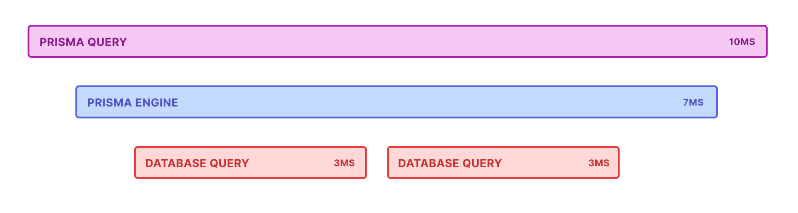

<TopBlock>

Tracing provides a detailed log of the activity that Prisma Client carries out, at an operation level, including the time taken to execute each query. It helps you analyze your application's performance and identify bottlenecks. Tracing is fully compliant with [OpenTelemetry](https://opentelemetry.io/), so you can use it as part of your end-to-end application tracing setup.

<Admonition type="info">

Tracing gives you a highly detailed, operation-level insight into your Prisma project. If you want aggregated numerical reporting, such as query counts, connection counts, and total query execution times, see [Metrics](/concepts/components/prisma-client/metrics).

</Admonition>

</TopBlock>

## About tracing

When you enable tracing, Prisma Client outputs the following:

- One trace for each operation (e.g. findMany) that Prisma Client makes.
- In each trace, one or more [spans](https://www.opentelemetry.io/docs/reference/specification/trace/api/#span). Each span represents the length of time that one stage of the operation takes, such as serialization, or a database query. Spans are represented in a tree structure, where child spans indicate that execution is happening within a larger parent span.

The number and type of spans in a trace varies depending on the type of operation the trace covers, but an example is as follows:

<!-- https://www.figma.com/file/H7EMWAuCaRVHrdNoQpky7J/Tracing?node-id=2%3A37 -->



You can send tracing output to the console, or analyze it in any OpenTelemetry-compatible tracing system, such as [Jaeger](https://www.jaegertracing.io/), [Honeycomb](https://www.honeycomb.io/trace/) and [Datadog](https://www.datadoghq.com/). On this page, we give an example of how to send tracing output to Jaeger, which you can [run locally](#run-jaeger-locally).

## Prisma's Spans

For each trace, Prisma Client outputs a series of spans. The number and type of these spans varies, depending on the Prisma operation. A typical Prisma trace has the following spans:

- `prisma`: Represents the entire Prisma operation, from Prisma Client to the database and back. It contains details such as the model and method called by Prisma Client. Depending on the Prisma operation, it contains one or more of the following spans:
  - `prisma:engine`: Represents how long a query takes in the [query engine](/concepts/components/prisma-engines/query-engine).
    - `prisma:connection`: Represents how long it takes for Prisma Client to get a database connection.
    - `prisma:db_query`: Represents the database query that was executed against the database. It includes the query in the tags, and how long the query took to run.

For example, given the following Prisma Client code:

```ts
prisma.user.findMany({
  where: {
    email: email,
  },
  include: {
    posts: true,
  },
})
```

The trace is structured as follows:

- `prisma`
  - `prisma:engine`:
    - `prisma:connection`
    - `prisma:db_query`: details of the first SQL query or command...
    - `prisma:db_query`: ...details of the next SQL query or command...
    - `prisma:db_query`: ...and so on, for each SQL query or command

## Considerations and prerequisites

If your application sends a large number of spans to a [collector](https://opentelemetry.io/docs/collector/), this can have a significant performance impact. For information on how to minimize this impact, see [Reducing performance impact](#reducing-performance-impact).

To use tracing, you must do the following:

1. [Install the appropriate dependencies](#step-1-install-up-to-date-prisma-dependencies).
1. [Enable the `tracing` feature flag in your Prisma schema file](#step-2-enable-the-feature-flag-in-your-prisma-schema-file).
1. [Install OpenTelemetry packages](#step-3-install-opentelemetry-packages).

## Getting Started

### Step 1. Install up-to-date Prisma dependencies

Use version `4.2.0` or higher of the `prisma`, `@prisma/client`, and `@prisma/instrumentation` npm packages.

```terminal
npm install prisma@latest --save-dev
npm install @prisma/client@latest --save
npm install @prisma/instrumentation@latest --save
```

### Step 2: Enable the feature flag in your Prisma schema file

In the `generator` block of your `schema.prisma` file, enable the `tracing` feature flag:

```prisma
generator client {
  provider        = "prisma-client-js"
  previewFeatures = ["tracing"]
}
```

### Step 3: Install OpenTelemetry packages

Finally, install the appropriate OpenTelemetry packages, as follows:

```console
npm install @opentelemetry/semantic-conventions @opentelemetry/exporter-trace-otlp-http @opentelemetry/instrumentation @opentelemetry/sdk-trace-base @opentelemetry/sdk-trace-node @opentelemetry/resources
```

### Registering Tracing in your application

The following code provides a minimal tracing configuration for your application. This configuration should be tweaked for your application.

```ts
// Imports
import { SemanticResourceAttributes } from '@opentelemetry/semantic-conventions'
import { OTLPTraceExporter } from '@opentelemetry/exporter-trace-otlp-http'
import { registerInstrumentations } from '@opentelemetry/instrumentation'
import { SimpleSpanProcessor } from '@opentelemetry/sdk-trace-base'
import { NodeTracerProvider } from '@opentelemetry/sdk-trace-node'
import { PrismaInstrumentation } from '@prisma/instrumentation'
import { Resource } from '@opentelemetry/resources'

// Configure the trace provider
const provider = new NodeTracerProvider({
  resource: new Resource({
    [SemanticResourceAttributes.SERVICE_NAME]: 'example application',
  }),
})

// Setup how spans are processed and exported
provider.addSpanProcessor(new SimpleSpanProcessor(new OTLPTraceExporter()))

// Register your auto-instrumentors
registerInstrumentations({
  tracerProvider: provider,
  instrumentations: [new PrismaInstrumentation()],
})

// Register the provider globally
provider.register()
```

OpenTelemetry is highly configurable. You can customize the resource attributes, what components gets instrumented, how spans are processed and where spans are sent.

You can find a complete example that includes metrics in [this sample application](https://github.com/garrensmith/prisma-metrics-sample).

## Going further

### Run Jaeger locally

[Jaeger](https://www.jaegertracing.io/) is a free and open source OpenTelemetry collector and dashboard [originally developed at Uber](https://eng.uber.com/distributed-tracing/) that you can use to visualize your traces.


To run Jaeger locally, use the following [Docker](https://www.docker.com/) command:

```console
docker run --rm --name jaeger -e COLLECTOR_ZIPKIN_HOST_PORT=:9411 -e COLLECTOR_OTLP_ENABLED=true -p 6831:6831/udp -p 6832:6832/udp -p 5778:5778 -p 16686:16686 -p 4317:4317 -p 4318:4318 -p 14250:14250 -p 14268:14268 -p 14269:14269 -p 9411:9411 jaegertracing/all-in-one:1.35
```

Once the docker container is running you'll find the tracing dashboard available at http://localhost:16686/. After using your application with tracing enabled, you'll start seeing traces in this dashboard.

### Tracing Prisma Client middleware

By default, tracing does not output spans for Prisma Client middleware. To include your [middleware](/concepts/components/prisma-client/middleware) in your traces, set `middleware` to `true` in your `registerInstrumentations` statement:

```ts
registerInstrumentations({
  instrumentations: [new PrismaInstrumentation({ middleware: true })],
})
```

This will add an additional type of span to your traces:

- `prisma:middleware`: Represents how long the operation spent in your [middleware](/concepts/components/prisma-client/middleware).

### Tracing interactive transactions

When you perform an interactive transaction, you'll see the spans above, but additionally:

- `prisma:transaction`: A [root span](https://opentelemetry.io/docs/concepts/observability-primer/#distributed-traces) that wraps the `prisma` span.
  - `prisma:itx_runner`: Represents how long an interactive transaction takes in the [query engine](/concepts/components/prisma-engines/query-engine).
  - `prisma:itx_query_builder`: Represents the time it takes to build an interactive transaction.

For example, given the following code:

```ts
await prisma.$transaction([
  prisma.user.create({
    data: {
      email: email,
    },
  }),
  prisma.user.findMany({
    where: {
      email: email,
    },
  }),
])
```

The trace is structured as follows:

- `prisma:transaction`
  - `prisma`
    - `prisma:itx_runner`
      - `prisma:connection`
      - `prisma:itx_query_builder`
        - `prisma:db_query`
      - `prisma:itx_query_builder`
        - `prisma:db_query`
        - `prisma:db_query`

### Adding More Instrumentation

A nice benefit of OpenTelemetry is the ability to add more instrumentation while making minimal changes to your application code.

You can add HTTP and [ExpressJS](https://expressjs.com/) tracing by adding more instrumentations to your OpenTelemetry configuration. This instrumentation will add spans for the full request-response lifecycle showing you how long your HTTP requests take.

```js
// Imports
import { ExpressInstrumentation } from '@opentelemetry/instrumentation-express'
import { HttpInstrumentation } from '@opentelemetry/instrumentation-http'

// Register your auto-instrumentors
registerInstrumentations({
  tracerProvider: provider,
  instrumentations: [
    new HttpInstrumentation(),
    new ExpressInstrumentation(),
    new PrismaInstrumentation(),
  ],
})
```

For a full list of available instrumentation, take a look at the [OpenTelemetry Registry](https://opentelemetry.io/registry/?language=js&component=instrumentation).

### Customizing Resource Attributes

You can adjust how your application's traces are grouped by changing the resource attributes to be more specific to your application:

```js
const provider = new NodeTracerProvider({
  resource: new Resource({
    [SemanticResourceAttributes.SERVICE_NAME]: 'weblog',
    [SemanticResourceAttributes.SERVICE_VERSION]: '1.0.0',
  }),
})
```

There is an ongoing effort to standardize common resource attributes. Whenever possible, it's a good idea to follow the [standard attribute names](https://github.com/open-telemetry/opentelemetry-specification/blob/main/specification/trace/semantic_conventions/README.md).

### Reducing performance impact

If your application sends a large number of spans to a collector, this can have a significant performance impact. You can use the following approaches to reduce this impact:

- [Use the BatchSpanProcessor](#send-traces-in-batches-using-the-batchspanprocessor)
- [Send fewer spans to the collector](#send-fewer-spans-to-the-collector-via-sampling)

#### Send Traces in Batches using the `BatchSpanProcessor`

In a production environment, you can use the OpenTelemetry `BatchSpanProcessor` to send the spans to a collector in batches rather than one at a time. However, during development and testing, you might not want to send spans in batches. In this situation, you might prefer to use the `SimpleSpanProcessor`.

You can configure your tracing configuration to use the appropriate span processor, depending on the environment, as follows:

```ts
import {
  SimpleSpanProcessor,
  BatchSpanProcessor,
} from '@opentelemetry/sdk-trace-base'

if (process.env.NODE_ENV === 'production') {
  provider.addSpanProcessor(new BatchSpanProcessor(otlpTraceExporter))
} else {
  provider.addSpanProcessor(new SimpleSpanProcessor(otlpTraceExporter))
}
```

#### Send fewer spans to the collector via sampling

Another way to reduce the performance impact is to [use probability sampling](https://opentelemetry.io/docs/reference/specification/trace/tracestate-probability-sampling/) to send fewer spans to the collector. This reduces the collection cost of tracing but still gives a good representation of what is happening in your application.

An example implementation looks like this:

```ts highlight=4;
import { TraceIdRatioBasedSampler } from '@opentelemetry/core'

const provider = new BasicTracerProvider({
  sampler: new TraceIdRatioBasedSampler(0.1),
  resource: new Resource({
    // we can define some metadata about the trace resource
    [SemanticResourceAttributes.SERVICE_NAME]: 'test-tracing-service',
    [SemanticResourceAttributes.SERVICE_VERSION]: '1.0.0',
  }),
})
```

## Troubleshooting

### My traces aren't showing up

The order in which you setup tracing matters. You'll want to make sure you've registered tracing and setup instrumentation before importing instrumented dependencies. For example:

```ts
import { registerTracing } from './tracing'

registerTracing({
  name: 'tracing-example',
  version: '0.0.1',
})

// Should come after you've setup tracing.
import { PrismaClient } from '@prisma/client'
import async from 'express-async-handler'
import express from 'express'
```

### Child traces start before parent traces

We're still investigating [this issue](https://github.com/prisma/prisma/issues/14612).

### Some traces show 0μs

This is most likely a precision bug. Please see [this issue](https://github.com/prisma/prisma/issues/14614) for updates.
