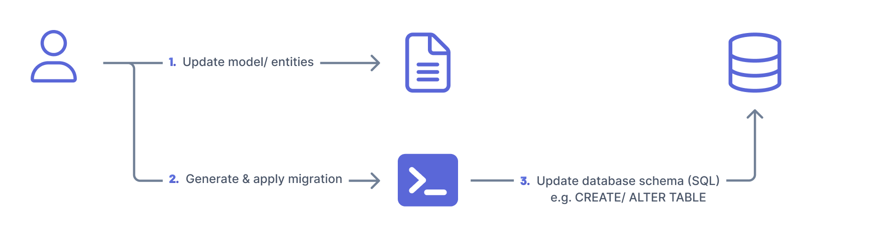
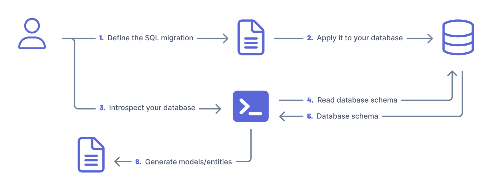
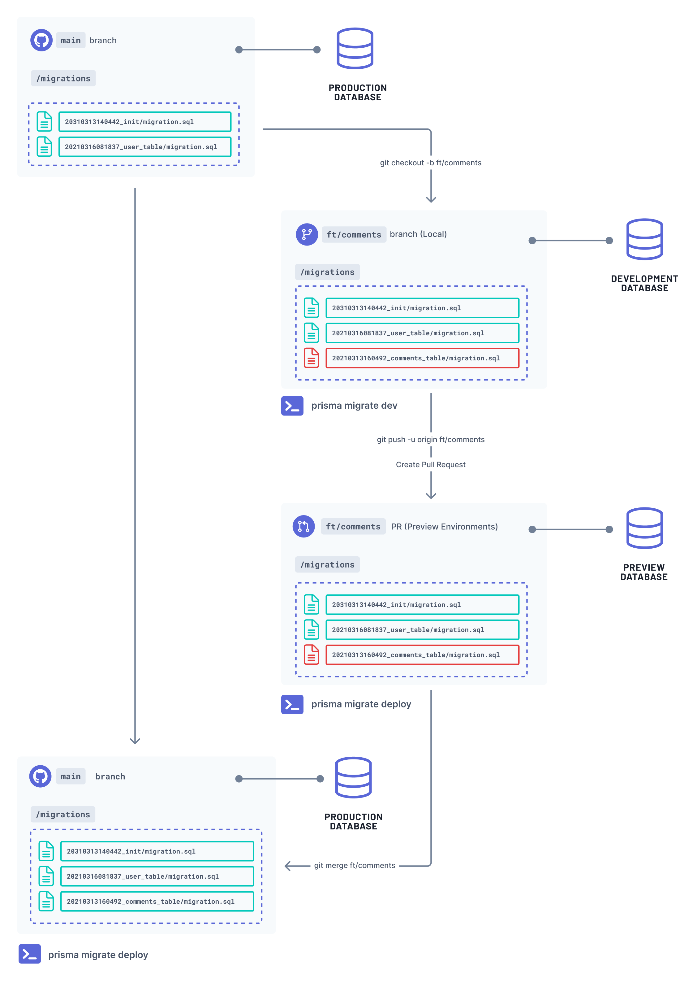
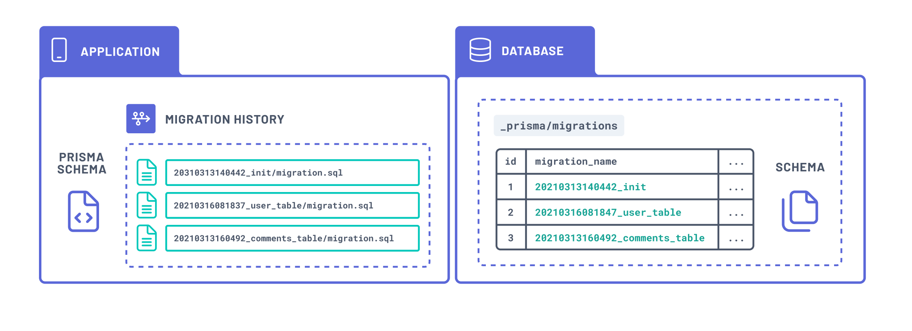
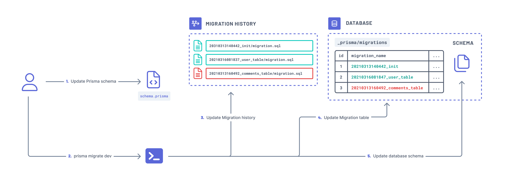
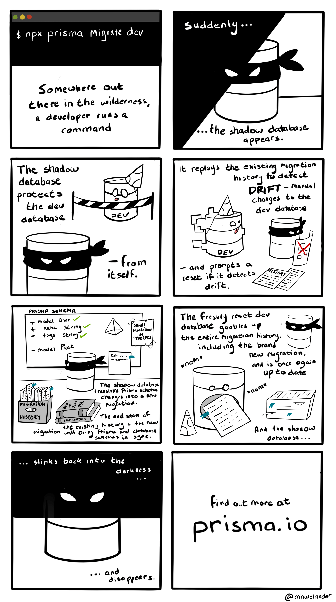
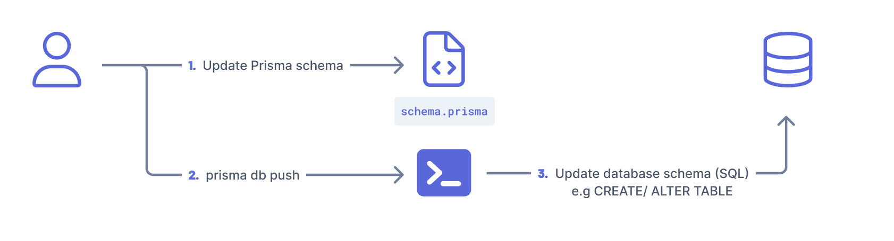
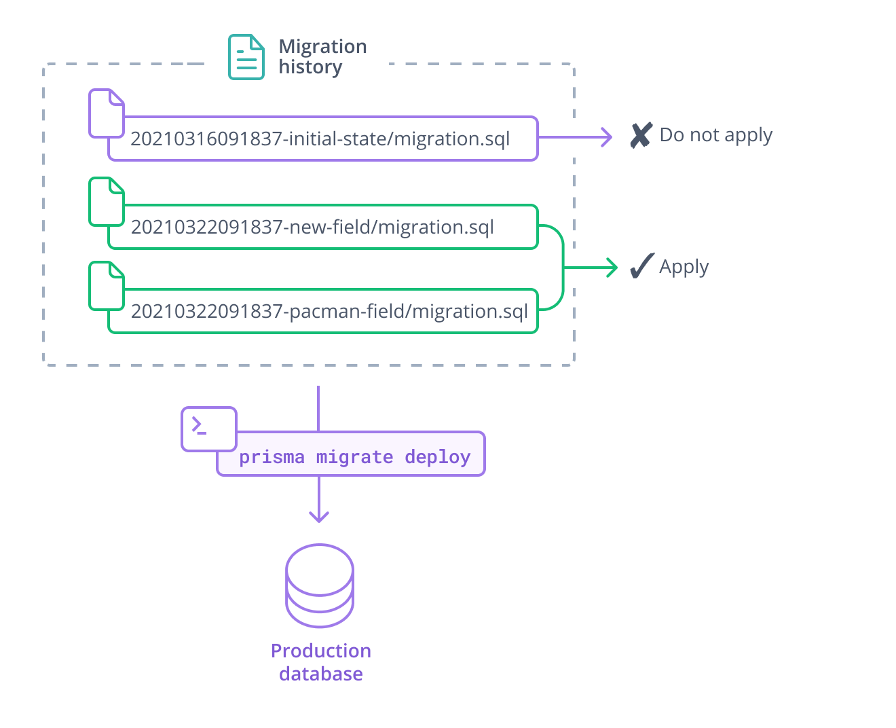

<TopBlock>

This guide provides a conceptual overview of database migrations using Prisma Migrate when working with relational databases. It covers: what database migrations are, their value, and what Prisma Migrate is and how you can evolve your database schema with Prisma Migrate in different environments.

**If you are working with MongoDB, use `prisma db push` to evolve your schema.**

</TopBlock>

## What are database migrations?

Database migrations are a controlled set of changes that modify and evolve the structure of your database schema. Migrations help you transition your database schema from one state to another. For example, within a migration you can create or remove tables and columns, split fields in a table, or add types and constraints to your database.

### Patterns for evolving database schemas

This section describes general schema migration patterns for evolving database schemas.

The two main schema migration patterns are:

- **Model/Entity-first migration:** with this pattern, you define the structure of the database schema with code and then use a migration tool to generate the SQL, for example, for syncing your application and database schema.

- **Database-first migration:** with this pattern, you define the structure of your database and apply it to your database using SQL. You then _introspect_ the database to generate the code that describes the structure of your database to sync your application and database schema.

<Admonition>

**Note**

For simplicity, we chose the terminology above to describe the different patterns for evolving database schemas. Other tools and libraries may use different terminology to describe the different patterns.

</Admonition>

The migration files (SQL) should ideally be stored together with your application code. They should also be tracked in version control and shared with the rest of the team working on the application.

Migrations provide _state management_ which helps you to track the state of the database.

Migrations also allow you to replicate the state of a database at a specific point in time which is useful when collaborating with other members of the team, e.g. switching between different branches.

For further information on database migrations, see the [Prisma Data Guide](https://www.prisma.io/dataguide/types/relational/what-are-database-migrations).

## What is Prisma Migrate?

Prisma Migrate is a database migration tool that supports the _model/ entity-first_ migration pattern to manage database schemas in your local environment and in production.

The workflow when using Prisma Migrate in your project would be iterative and look like this:

**Local development environment (Feature branch)**

1. Evolve your Prisma schema
1. Use either [`prisma migrate dev`](#track-your-migration-history-with-prisma-migrate-dev) or [`prisma db push`](#prototype-your-schema) to sync your Prisma schema with the database schema of your local development database

**Preview/ staging environment(Feature pull request)**

1. Push your changes to the feature pull request
1. Use a CI system (e.g. GitHub Actions) to sync your Prisma schema and migration history with your preview database using `prisma migrate deploy`

**Production (main branch)**

1. Merge your application code from the feature branch to your main branch
1. Use a CI system (e.g. GitHub Actions) to sync your Prisma schema and migration history with your production database using `prisma migrate deploy`

## How Prisma Migrate tracks the migration state

Prisma Migrate uses the following pieces of state to track the state of your database schema:

- **Prisma schema**: your source of truth that defines the structure of the database schema.
- **Migrations history**: SQL files in your `prisma/migrations` folder representing the history of changes made to your database schema.
- **Migrations table**: `prisma_migrations` table in the database that stores metadata for migrations that have been applied to the database.
- **Database schema**: the state of the database.

## Requirements when working with Prisma Migrate

- Ideally, you should use one database per environment. For example, you might have a separate database for development, preview, and production environments.
- The databases you use in development environments are disposable — you can easily create, use, and delete databases on demand.
- The database configuration used in each environments should be consistent. This is important to ensure a certain migration that moves across the workflow yields the same changes to the database.
- The Prisma schema serves as the source of truth — describing the shape of your [database schema](https://www.prisma.io/dataguide/intro/database-glossary#schema).

## Evolve your database schema with Prisma Migrate

This section describes how you can evolve your database schema in different environments: development, staging, and production, using Prisma Migrate.

### Prisma Migrate in a development environment (local)

#### Track your migration history with <inlinecode>prisma migrate dev</inlinecode>

The [`prisma migrate dev`](/reference/api-reference/command-reference#migrate-dev) command allows you to track the changes you make to your database. The `prisma migrate dev` command automatically generates SQL migration files (saved in `/prisma/migrations`) and applies them to the database. When a migration is applied to the database, the migrations table (`_prisma_migrations`) in your database is also updated.

The `prisma migrate dev` command tracks the state of the database using the following pieces of state:

- the Prisma schema
- the migrations history
- the migrations table
- the database schema

> **Note**: The pieces of state used to track the state of a migration are the same as the ones described in [how Prisma Migrate tracks the migration state](#how-prisma-migrate-tracks-the-migration-state) section.

You can customize migrations before you apply them to the database using the `--create-only` flag. For example, you might want to edit a migration if you want to rename columns without incurring any data loss or load database extensions (in PostgreSQL) and database views (currently not supported).

Under the hood, Prisma Migrate uses a [shadow database](/concepts/components/prisma-migrate/shadow-database) to detect a [schema drift](/concepts/components/prisma-migrate/shadow-database#detecting-schema-drift) and generate new migrations.

> **Note**: `prisma migrate dev` is intended to be used only in development with a disposable database.

If `prisma migrate dev` detects a schema drift or a migration history conflict, you will be prompted to reset (drop and recreate your database) your database to sync the migration history and the database schema.

 Expand to see the shadow database explained using a cartoon

#### Resolve schema drifts

A schema drift occurs when the expected database schema is different from what is in the migration history. For example, this can occur when you manually update the database schema without also updating the Prisma schema and `prisma/migrations` accordingly.

For such instances, you can use the [`prisma migrate diff`](/reference/api-reference/command-reference#migrate-diff) command to compare your migration history and revert changes made to your database schema.

You can use `migrate diff` to generate the SQL that either:

- Reverts the changes made in the database schema to synchronize it with the current Prisma schema
- Moves your database schema forward to apply missing changes from the Prisma schema and `/migrations`

You can then apply the changes to your database using [`prisma db execute`](/reference/api-reference/command-reference#db-execute) command.

#### Prototype your schema

The [`prisma db push`](/reference/api-reference/command-reference#db-push) command allows you to sync your Prisma schema and database schema without persisting a migration (`/prisma/migrations`). The `prisma db push` command tracks the state of the database using the following pieces of state:

- the Prisma schema
- the database schema

The `prisma db push` command is useful when:

- You want to **quickly prototype and iterate** on schema design locally without the need to deploy these changes to other environments such as other developers, or staging and production environments.
- You are prioritizing reaching a **desired end-state** and not the changes or steps executed to reach that end-state (there is no way to preview changes made by `prisma db push`)
- You do not need to control how schema changes impact data. There is no way to orchestrate schema and data migrations - if `prisma db push` anticipates that changes will result in data loss, you can either accept data loss with the `--accept-data-loss` option or stop the process - there is no way to customize the changes.

If the `prisma db push` command detects destructive change to your database schema, it will prompt you to reset your database. For example, this will happen when you add a required field to a table with existing content without providing a default value.

> A [schema drift](/guides/migrate/developing-with-prisma-migrate/troubleshooting-development#schema-drift) occurs when your database schema is out of sync with your migrations history and migrations table.

### Prisma Migrate in a staging and production environment

#### Sync your migration histories

The [`prisma migrate deploy`](/reference/api-reference/command-reference#migrate-deploy) command allows you to sync your migration history from your development environment with your database in your **staging or production environment**.

Under the hood, the `migrate deploy` command:

1. Compares already applied migrations (captured `_prisma_migrations`) and the migration history (`/prisma/migrations`)
1. Applies pending migrations
1. Updates `_prisma_migrations` table with the new migrations

The command should be run in an automated CI/ CD environment, for example GitHub Actions.

If you don't have a migration history (`/migrations`), i.e using `prisma db push`, you will have to continue using `prisma db push` in your staging and production environments. Beware of the changes being applied to the database schema as some of them might be destructive. For example, `prisma db push` can't tell when you're performing a column rename. It will prompt a database reset (drop and re-creation).
