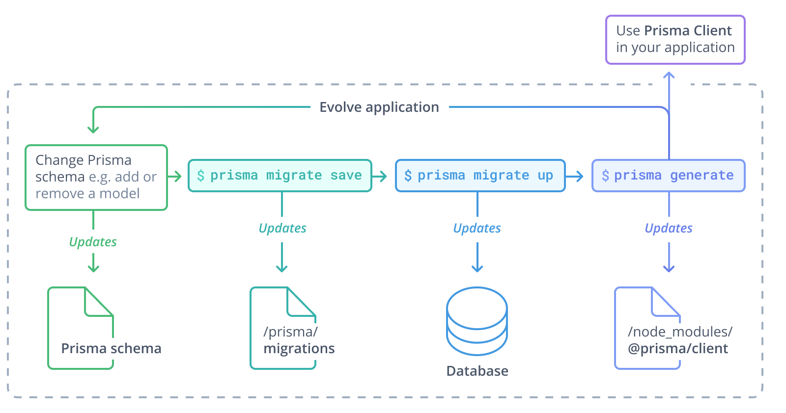

<TopBlock>

> **Important!** This page documents legacy Prisma Migrate (Experimental) available in version 2.12.0 and earlier. [Prisma Migrate](.) is available in version [2.13.0](https://github.com/prisma/prisma/releases/tag/2.13.0) and Generally Available in [2.19.0](https://github.com/prisma/prisma/releases/tag/2.19.0).

Legacy Prisma Migrate is a tool that lets you _change your database schema_, e.g. by creating new tables or adding columns to existing tables. These changes are called _schema migrations_. legacy Prisma Migrate is available as part of the [Prisma CLI](/reference/api-reference/command-reference#installation) via the `legacy Prisma Migrate` command.

</TopBlock>

## Documentation

### Legacy Prisma Migrate vs the `db push` command

If you want to prototype or iterate on a schema design in a development environment, consider the [`db push` command](/reference/api-reference/command-reference#db-push).

### Legacy Prisma Migrate vs SQL migrations

Legacy Prisma Migrate is a _declarative_ migration system, as opposed to SQL which can be considered _imperative_:

- **SQL (imperative)**: Provide the individual _steps_ to get from the current schema to the desired schema.
- **legacy Prisma Migrate (declarative)**: Define the desired schema as a [Prisma data model](/concepts/components/prisma-schema/data-model) (legacy Prisma Migrate takes care of generating the necessary _steps_).

Here's a quick comparison. Assume you have the following scenario:

1. You need to create the `User` table to store user information (name, email, ...)
1. Create two new tables `Post` and `Profile` with foreign keys to `User`
1. Add a new column with a default value to the `Post` table

#### SQL

In SQL, you'd have to send three subsequent SQL statements to account for this scenario:

##### 1. Create the `User` table to store user information (name, email, ...)

```sql
CREATE TABLE "User" (
    id SERIAL PRIMARY KEY,
    name VARCHAR(255),
    email VARCHAR(255) NOT NULL
);
```

##### 2. Create two new tables `Post` and `Profile` with foreign keys to `User`

```sql
CREATE TABLE "Profile" (
    id SERIAL PRIMARY KEY,
    bio TEXT NOT NULL,
    "user" integer NOT NULL UNIQUE,
    FOREIGN KEY ("user") REFERENCES "User"(id)
);
CREATE TABLE "Post" (
    id SERIAL PRIMARY KEY,
    title VARCHAR(255) NOT NULL,
    author integer NOT NULL,
    FOREIGN KEY (author) REFERENCES "User"(id)
);
```

##### 3. Add a new column with a default value to the `Post` table

```sql
ALTER TABLE "Post"
ADD COLUMN published BOOLEAN DEFAULT false;
```

#### legacy Prisma Migrate

With legacy Prisma Migrate, you write the desired database schema in the form of a [Prisma data model](/concepts/components/prisma-schema/data-model) inside your [Prisma schema file](/concepts/components/prisma-schema). To map the data model to your database schema, you then have to run these two commands:

```terminal
prisma migrate save --experimental
prisma migrate up --experimental
```

The first command _saves_ a new migration to the `prisma/migrations` directory in the file system of your project and updates the `_Migration` table in your database. Each time you run this command to save a new migration, it creates a dedicated directory inside of `prisma/migrations` for that specific migration, which will have its own `README.md` file containing detailed information about the migration (e.g. the generated SQL statements which will be executed when you run `legacy Prisma Migrate up`).

The second command _executes_ the migration against your database.

##### 1. Create the `User` table to store user information (name, email, ...)

Add the model to your Prisma schema:

```prisma
model User {
  id    Int     @id @default(autoincrement())
  name  String?
  email String  @unique
}
```

Now run the two commands mentioned above:

```terminal
prisma migrate save --experimental
prisma migrate up --experimental
```

##### 2. Create two new tables `Post` and `Profile` with foreign keys to `User`

Add two models with [relation fields](/concepts/components/prisma-schema/relations#relation-fields) to your Prisma schema:

```prisma
model User {
  id      Int      @id @default(autoincrement())
  name    String?
  email   String   @unique
  posts   Post[]
  profile Profile?
}

model Profile {
  id     Int    @id @default(autoincrement())
  bio    String
  user   User   @relation(fields: [userId], references: [id])
  userId Int
}

model Post {
  id       Int    @id @default(autoincrement())
  title    String
  author   User   @relation(fields: [authorId], references: [id])
  authorId Int
}
```

Notice that in addition to the [annotated relation fields](/concepts/components/prisma-schema/relations#annotated-relation-fields-and-relation-scalar-fields) and its relation scalar field (which represent the foreign keys), you must also specify the Prisma-level [relation fields](/concepts/components/prisma-schema/relations#relation-fields) on the other side of the relation.

Now run the two commands mentioned above:

```terminal
prisma migrate save --experimental
prisma migrate up --experimental
```

##### 3. Add a new column with default value to the `Post` table

Add a [field](/concepts/components/prisma-schema/data-model#defining-fields) to the `Post` model:

```prisma
model User {
  id      Int      @id @default(autoincrement())
  name    String?
  email   String   @unique
  posts   Post[]
  profile Profile?
}

model Profile {
  id     Int    @id @default(autoincrement())
  bio    String
  user   User   @relation(fields: [userId], references: [id])
  userId Int
}

model Post {
  id        Int     @id @default(autoincrement())
  title     String
  published Boolean @default(false)
  authorId  Int
  author    User    @relation(fields: [authorId], references: [id])
}
```

Now run the two commands mentioned above:

```terminal
prisma migrate save --experimental
prisma migrate up --experimental
```

### Supported operations

The following table shows which SQL operations are currently supported by legacy Prisma Migrate.

| Operation                         | SQL                             |                                      Supported                                      |
| :-------------------------------- | :------------------------------ | :---------------------------------------------------------------------------------: |
| Create a new table                | `CREATE TABLE`                  |                                         ✔️                                          |
| Rename an existing table          | `ALTER TABLE` + `RENAME`        |                                         No                                          |
| Delete an existing table          | `DROP TABLE`                    |                                         ✔️                                          |
| Add a column to an existing table | `ALTER TABLE` + `ADD COLUMN`    |                                         ✔️                                          |
| Rename an existing column         | `ALTER TABLE` + `RENAME COLUMN` |                                         No                                          |
| Delete an existing column         | `ALTER TABLE` + `DROP COLUMN`   |                                         ✔️                                          |
| Set primary keys (IDs)            | `PRIMARY KEY`                   |                                         ✔️                                          |
| Define relations (foreign keys)   | `FOREIGN KEY` + `REFERENCES`    |                                         ✔️                                          |
| Make columns optional/required    | `NOT NULL`                      |                                         ✔️                                          |
| Set unique constraints            | `UNIQUE`                        |                                         ✔️                                          |
| Set default values                | `DEFAULT`                       |                                         ✔️                                          |
| Define enums                      | `ENUM`                          |                                         ✔️                                          |
| Create indexes                    | `CREATE INDEX`                  |                                         ✔️                                          |
| Cascading deletes                 | `ON DELETE`                     |                 No (workaround: manually add in SQL and introspect)                 |
| Cascading updates                 | `ON UPDATE`                     |                                         No                                          |
| Data validation                   | `CHECK`                         | No ([workaround](/guides/other/advanced-database-tasks/data-validation/postgresql)) |

Note that this table assumes that the operation is also supported by the underlying database. For example, `ENUM` is not supported in SQLite. This means that you also can't use `enum` when using legacy Prisma Migrate.

### Migration history

legacy Prisma Migrate stores the migration history of your project in two places:

- A directory called `migrations` on your file system
- A table called `_Migration` in your database

#### The `migrations` directory

The `migrations` directory stores information about the migrations that have been or will be executed against your database. You should never make any manual changes to the files in `migrations`. The only way to change the content of this directory should be using the `legacy Prisma Migrate save` command.

The `migrations` directory should be checked into version control (e.g. Git).

#### The `_Migration` table

The `_Migration` table additionally stores information about each migration that was ever executed against the database by legacy Prisma Migrate.

### Typical workflow

With **legacy Prisma Migrate**, the workflow looks slightly different:

1. Manually adjust your [Prisma data model](/concepts/components/prisma-schema/data-model)
1. Migrate your database using the `legacy Prisma Migrate` CLI commands
1. (Re-)generate Prisma Client
1. Use Prisma Client in your application code to access your database



### Troubleshooting

Since legacy Prisma Migrate is currently Experimental, you might end up in a state where the `migrations` directory and/or the `_Migrations` table are out of sync with the actual state of the database. In these cases, it often helps to "reset" legacy Prisma Migrate by deleting the `migrations` folder and deleting all entries from the `_Migration` table.

#### Delete the `migrations` directory

```terminal
rm -rf migrations
```

#### Delete all entries from the `_Migration` table

```sql
TRUNCATE _Migration;
```

## CLI Reference

> Warning: The `migrate` command is still considered Experimental. As such, there are no guarantees about API stability or production-readiness. Access to this command is provided for evaluation and experimentation. To access Experimental commands, you must add the `--experimental` flag.

The `migrate` command creates and manages database migrations. It can be used to create, apply, and rollback database schema updates in a controlled manner.

The `migrate` command includes a number of subcommands to specify the desired action.

### <inlinecode>migrate save</inlinecode>

Saves a migration that defines the steps necessary to update your current schema.

#### Prerequisites

Before using the `migrate save` command, you must define a valid [`datasource`](/concepts/components/prisma-schema/data-sources) within your `schema.prisma` file.

For example, the following `datasource` defines a SQLite database file within the current directory:

```prisma
datasource db {
  provider = "sqlite"
  url      = "file:my-database.db"
}
```

#### Options

The `migrate save` command recognizes the following options to modify its behavior:

| Option              | Required | Description                                                                                                                                         | Default                                     |
| ------------------- | -------- | --------------------------------------------------------------------------------------------------------------------------------------------------- | ------------------------------------------- |
| `--experimental`    | Yes      | Enables use of Experimental commands.                                                                                                               |                                             |
| `-n`, `--name`      | No       | The name of the migration. If not provided, `migrate save` will prompt you for a name.                                                              | Timestamp `20200618145356`                  |
| `-c`, `--create-db` | No       | Create the database if it does not exist.                                                                                                           |                                             |
| `-p`, `--preview`   | No       | Preview the migration that would be created without writing any changes to the filesystem.                                                          |                                             |
| `--schema`          | No       | Specifies the path to the desired `schema.prisma` file to be processed instead of the default path. Both absolute and relative paths are supported. | `./schema.prisma`, `./prisma/schema.prisma` |

#### Generated Assets

The `migrate save` command generates the following directories and files as necessary:

- `migrations`: A directory within the current project to store migrations. This directory will be created if it does not exist.
- `migrations/migrate.lock`: A lock file created specifying the current migration applied to the database. This file will be created if it does not exist.
- `migrations/<migration>`: A directory for a specific migration. The migration name is derived from the timestamp when it was created followed by a hyphen and the migration name provided by the user.
- `migrations/<migration>/README.md`: A human-readable description of the migration including metadata like when the migration was created and by who, a list of the actual migration changes and a diff of the changes that are made to the `schema.prisma` file.
- `migrations/<migration>/schema.prisma`: The schema that will be created if the migration is applied to the project.
- `migrations/<migration>/steps.json`: An [alternative representation](https://github.com/prisma/specs/tree/master/lift#step) of the migration steps that will be applied.

#### Examples

##### Create a new migration

```terminal
prisma migrate save --experimental
```

The command will prompt you for a name for the migration since one was not provided on the command line. After creating the migration, the contents of the generated `schema.prisma` file are displayed.

##### Create a migration with a specific name

```terminal
prisma migrate save --name "First migration" --experimental
```

##### Create the database if it does not already exist

```terminal
prisma migrate save --create-db --experimental
```

##### Preview the migration that would be created by running the `migrate save` command

```terminal
prisma migrate save --preview --experimental
```

### <inlinecode>migrate up</inlinecode>

Migrate the database up to a specific state.

#### Prerequisites

Before using the `migrate up` command, you must define a valid [`datasource`](/concepts/components/prisma-schema/data-sources) within your `schema.prisma` file.

For example, the following `datasource` defines a SQLite database file within the current directory:

```prisma
datasource db {
  provider = "sqlite"
  url      = "file:my-database.db"
}
```

#### Arguments

The point to migrate the database up to can be defined in any of the following three ways:

| Argument  | Required | Description                                                                        | Default |
| --------- | -------- | ---------------------------------------------------------------------------------- | ------- |
| increment | No       | Specifies the number of forward migrations to apply.                               | latest  |
| name      | No       | Specifies where to migrate to using the name of the final migration to apply.      | latest  |
| timestamp | No       | Specifies where to migrate to using the timestamp of the final migration to apply. | latest  |

#### Options

Additionally, the following options modify the behavior of the `migrate up` command:

| Option              | Required | Description                                                                                                                                         | Default                                     |
| ------------------- | -------- | --------------------------------------------------------------------------------------------------------------------------------------------------- | ------------------------------------------- |
| `--experimental`    | Yes      | Enables use of Experimental commands                                                                                                                |                                             |
| `-c`, `--create-db` | No       | Create the database if it does not exist.                                                                                                           |                                             |
| `-p`, `--preview`   | No       | Preview the migration that would be created without writing any changes to the filesystem.                                                          |                                             |
| `--schema`          | No       | Specifies the path to the desired `schema.prisma` file to be processed instead of the default path. Both absolute and relative paths are supported. | `./schema.prisma`, `./prisma/schema.prisma` |
| `--auto-approve`    | No       | Skip interactive approval before migrating.                                                                                                         |                                             |

#### Examples

##### Migrate the database up to the latest available migration

```terminal
prisma migrate up --experimental
```

##### Apply the next two migrations to the database

```terminal
prisma migrate up 2 --experimental
```

##### Apply all migrations necessary up to and including a migration by name

```terminal
prisma migrate up "First migration" --experimental
```

##### Apply all migrations necessary up to and including a migration by timestamp

```terminal
prisma migrate up 20200223181448 --experimental
```

##### Create the database if it does not already exist before applying the migrations

```terminal
prisma migrate up --create-db --experimental
```

##### Preview the migration that would be applied by running the `migrate up` command

```terminal
prisma migrate up --preview --experimental
```

### <inlinecode>migrate down</inlinecode>

Migrate the database down to a specific state.

#### Prerequisites

Before using the `migrate down` command, you must define a valid [`datasource`](/concepts/components/prisma-schema/data-sources) within your `schema.prisma` file.

For example, the following `datasource` defines a SQLite database file within the current directory:

```prisma
datasource db {
  provider = "sqlite"
  url      = "file:my-database.db"
}
```

#### Arguments

The point to migrate back to can be defined in any of the following three ways:

| Argument  | Required | Description                                                                             | Default |
| --------- | -------- | --------------------------------------------------------------------------------------- | ------- |
| decrement | No       | Specifies the number of backwards migrations to apply.                                  | 1       |
| name      | No       | Specifies where to migrate back to using the name of the final migration to apply.      |
| timestamp | No       | Specifies where to migrate back to using the timestamp of the final migration to apply. |

#### Options

Additionally, the following options modify the behavior of the `migrate down` command:

| Option            | Required | Description                                                                                                                                         | Default                                     |
| ----------------- | -------- | --------------------------------------------------------------------------------------------------------------------------------------------------- | ------------------------------------------- |
| `--experimental`  | Yes      | Enables use of Experimental commands                                                                                                                |                                             |
| `-p`, `--preview` | No       | Preview the migration that would be created without writing any changes to the filesystem.                                                          |                                             |
| `--schema`        | No       | Specifies the path to the desired `schema.prisma` file to be processed instead of the default path. Both absolute and relative paths are supported. | `./schema.prisma`, `./prisma/schema.prisma` |

#### Examples

##### Migrate the database backwards by a single migration

```terminal
prisma migrate down --experimental
```

##### Migrate the database backwards by two migrations

```terminal
prisma migrate down 2 --experimental
```

##### Migrate backwards through all migrations up to and including a migration by name

```terminal
prisma migrate down "First migration" --experimental
```

##### Migrate backwards through all migrations up to and including a migration by timestamp

```terminal
prisma migrate down 20200223181448 --experimental
```

##### Preview the migration that would be applied by running the `migrate down` command

```terminal
prisma migrate down --preview --experimental
```
