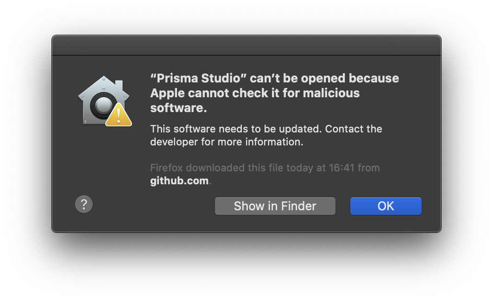

<TopBlock>

Prisma Studio is a visual editor for the data in your database.  
You can run it with two ways:

1. Run `$ npx prisma studio` in your terminal.
2. Install the macOS app from the installers which you can find [here](https://github.com/prisma/studio/releases). Currently, only macOS is supported - if you want to install the native app on Windows or Linux, please let us know by opening an [issue](https://github.com/prisma/studio/issues) in Prisma Studio.

> **Note**: Prisma Studio replaces Prisma Admin, and is only compatible with Prisma 2.

</TopBlock>

## Troubleshooting

### macOS Error message: "'Prisma Studio' can't be opened because Apple cannot check it for malicious software"

If you get this error message while trying to open the macOS app:



try Right Clicking and then clicking "Open". We are currently working on fixing that so this warning should go away in the next versions (version as of writing this: v0.322.0).


### Terminal: Failed to run script / Error in Prisma Client request

Caching issues may cause Prisma Studio to use an older version of the query engine. You may see the following error: 

```
Error in request:  PrismaClientKnownRequestError: Failed to validate the query Error occurred during query validation & transformation
```

To resolve, delete the following folders:

* `~/.cache/prisma` on macOS and Linux
* `%AppData%/Prisma/Studio` on Windows
