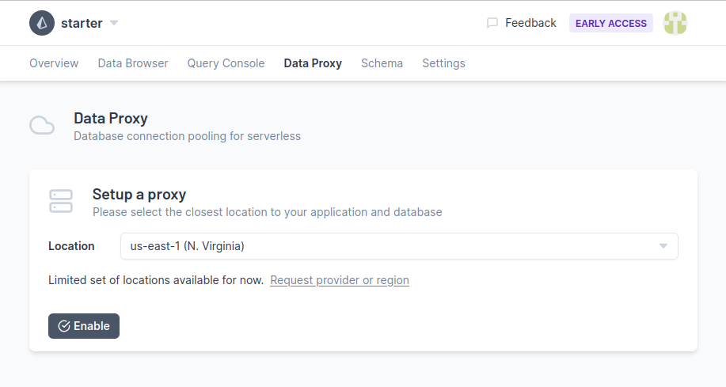

<TopBlock>

The [Prisma Data Platform](https://cloud.prisma.io/) (Early Access) helps developers collaborate better in projects that are using the open-source tools. One of its main features today is an [online data browser](https://www.prisma.io/blog/prisma-online-data-browser-ejgg5c8p3u4x).

You can access it from [cloud.prisma.io](https://cloud.prisma.io).

</TopBlock>

## Current Functionality

In the current version of the platform, you can:

- Import your existing Prisma project
- Browse your data
- View your Prisma schema
- Invite users and assign roles
- Connect your application to your database using a data proxy

## User Roles

These roles are currently supported in the Platform:

- **Admin**: Can do all possible actions, such as configuring project settings and viewing/editing data
- **Developer**: Access the data browser, view and edit data, and view the schema
- **Collaborator**: Access the data browser and view and edit data
- **Viewer**: Access the data browser and view data

In order to add users, you need to use their GitHub username and they need to have an account in the Platform.

## Static IP address for usage in allowlists

The Prisma Data Platform provides a static IP address that you can add to an allowlist in order to connect to your database through our Data Browser. Please note this feature is currently not supported in the Data Proxy. 

You can [create an issue](https://github.com/prisma/studio/issues/new?assignees=&labels=topic%3A+hosted+data+browser&template=hosted-data-browser-bug-report.md&title=) with your request and we will enable it for you. Please note that while this is a feature that will be part of a paid plan in the future, it is currently offered for free while we are in Early Access.

## Prisma Data Proxy

<Admonition type="warning">

**Early Access Feature** <br />
Please note that the Prisma Data Proxy is an early-stage product and should not be used in production environments.

</Admonition>

<Admonition type="warning">

**Not supported** <br />
[Interactive Transactions](/concepts/components/prisma-client/transactions#interactive-transactions-in-preview) (Preview Feature) are not supported at this time.

</Admonition>

The Prisma Data Proxy is an intermediary between your application and your database. It maintains a database connection pool, so you can reliably use traditional databases in serverless environments.

### Why use the Data Proxy?

Serverless functions are ephemeral and short-lived, so their database connections are numerous and brief.

Because of this, using traditional databases in serverless functions often leads to exhausting the limit of concurrent database connections and increased latencies on each request to establish a database connection.

### Using the Data Proxy in a Prisma application

We assume you already have an account and a project on [the Prisma Data Platform](https://cloud.prisma.io). If you don't, please subscribe using your GitHub account before continuing.

#### Step 1: Generate a Data Proxy connection string

Navigate to the **Data Proxy** tab of your Prisma Data Platform project, select the desired proxy location, and click **Enable**.



> The Data Proxy is currently available in the AWS&nbsp;Frankfurt (eu-central-1) and N.&nbsp;Virginia (us-east-1) regions. If you'd like support for other providers or regions, [we'd love to hear from you](https://forms.gle/17uyd1raniRtGSPe9).

Copy the connection string and store it securely, similarly to how you would treat a database credential. You may generate more connection strings in this section if you wish and of course, revoke them if you don't need them anymore.

Connection strings always have the following format:

```
prisma://{DEPLOYMENT_LOCATION}.prisma-data.com/?api_key={DATA_PROXY_API_KEY}
```

#### Step 2: Install up-to-date Prisma dependencies

To use the Data Proxy, use the version `3.3.0` or higher of the `prisma` and `@prisma/client` npm packages.

```terminal
npm install prisma@latest --save-dev
npm install @prisma/client@latest --save
```

#### Step 3: Enable the feature flag in the Prisma schema file

In the generator block of your `schema.prisma` file, enable the feature flag:

```prisma
generator client {
  provider        = "prisma-client-js"
  previewFeatures = ["dataProxy"]
}
```

#### Step 4: Make sure that the datasource URL is read from environment

<Admonition type="warning">

Currently, the only supported datasource name is `db`. Make sure your `schema.prisma` file includes the `datasource db` block.

</Admonition>

We strongly recommend to use environment variables to provide your database connection strings:

```prisma
datasource db {
  provider = "postgresql"
  url      = env("DATABASE_URL")
}
```

#### Step 5: Generate the client

To generate the client using the Data Proxy, set the environment variable `PRISMA_CLIENT_ENGINE_TYPE` to `dataproxy` using the following command:

```terminal
PRISMA_CLIENT_ENGINE_TYPE='dataproxy' npx prisma generate
```

#### Step 6: Start your app

If you are loading the connection string in your Prisma Schema using `env()`, there should be no further changes needed other than verifying that the environment variable changed to your Data Proxy connection string. For example:

```terminal
DATABASE_URL='prisma://aws-us-east-1.prisma-data.com/?api_key=...' npm start
```

For guidance on how to configure environment variables on your deployment, please refer to your provider.

- AWS: [Using AWS Lambda environment variables](https://docs.aws.amazon.com/lambda/latest/dg/configuration-envvars.html)
- Heroku: [Configuration and Config Vars](https://devcenter.heroku.com/articles/config-vars)

### Important Consideratoins about the Data Proxy

#### Providing the connection string to Prisma Migrate

Currently, the Data Proxy can only be used to query your database with [Prisma Client](https://www.prisma.io/docs/concepts/components/prisma-client).

Migrations can be only be run on a direct (non-proxied) database connection. Assuming that your schema uses `env("DATABASE_URL")`, you'll need to override the `DATABASE_URL` environment variable before running `prisma migrate`. You can declare another environment variable, for example `MIGRATE_DATABASE_URL`, and use it that to override the connection:

```js
// package.json
{
  ...,
  "scripts": {
    "generate-client": "PRISMA_CLIENT_ENGINE_TYPE='dataproxy' prisma generate",
    "migrate": "DATABASE_URL=\"$MIGRATE_DATABASE_URL\" prisma migrate deploy",
    ...
  }
}
```

#### Deploying to Vercel

Our Vercel Deployment sample repository has a [branch](https://github.com/prisma/deployment-example-vercel/tree/data-proxy) showing how to deploy a Prisma application to Vercel using the Data Proxy.

[Use this link to create a Vercel project based on this branch](https://vercel.com/new/clone?repository-url=https%3A%2F%2Fgithub.com%2Fprisma%2Fdeployment-example-vercel%2Ftree%2Fdata-proxy&env=DATABASE_URL,MIGRATE_DATABASE_URL&envDescription=DATABASE_URL%20-%20proxy%20URL%2C%20MIGRATE_DATABASE_URL%20-%20direct%20connection%20string&envLink=https%3A%2F%2Fwww.notion.so%2Fprismaio%2FPrisma-Data-Proxy-Early-Access-Program-EAP-8ca06a8b350340e3a6236689375d071e) .

#### Connecting to a database hosted with a provider different than AWS

It's possible to connect to a database hosted on any provider, but it needs to be accessible from the public internet. For best results and response times, you should configure the proxy in a region that is closest to both your application servers or functions and your database.

If a region or provider is not yet supported, you can [submit a request](https://prisma103696.typeform.com/to/Y03RBE5c).

#### Connection limits

We recommend using a database that supports at least 20 concurrent connections.
Setting a concurrency limit on AWS Lambda should not be required, but you should be aware that, if necessary, requests will be queued until they can be processed.

#### Proxy Limits

The limits for running multiple schemas concurrently during Early Access are:

- Up to 3 schemas can be used concurrently in a single Prisma app (for example: while updating your app to a new schema version)
- Up to 5 schemas can be used concurrently account-wide

The Data Proxy is architected to seamlessly scale to support large workloads, but during the Early Access period there will be a fairly low scale limit. The actual performance for a single schema using the Data Proxy will depend on a large number of variables (the type of queries, latencies and deployment locations, the performance of your database, ...). The Data Proxy will not yield more than **200 requests per second**, though the number of requests wil likely be well below 200 per second.

If you are looking to scale up traffic beyond the limits or if you're seeing `429` HTTP errors in your logs - this might mean you're hitting the quotas; [**please reach out to us**](#feedback-and-support). We'd love to know about your use case and work together with you to help your Prisma application scale.

To contact us find us on [Slack](https://slack.prisma.io/) or you can submit a feedback form.

#### Pricing of the Data Proxy

The Data Proxy is provided for free during Early Access.

We will use the Early Access phase to learn about usage and tweak the pricing model. 

When the Prisma Data Platform is launched in General Availability, there will be an option to continue using the Data Proxy with a **generous free tier forever**, alongside paid options.

#### Availability, Usage for Testing purposes only

We do not expect long-planned downtime periods, but we also do not provide an SLA during Early Access. As an Early Access feature, the Data Proxy is not considered stable and it should not be used in production.

#### Feedback and Support

You can reach us via Slack on the [#prisma-data-platform channel](https://prisma.slack.com/archives/C02EAHBAG93) on our public community Slack. If you don't have an account yet, you can join [here](https://slack.prisma.io/).

You can also use [this form](https://forms.gle/17uyd1raniRtGSPe9) to submit any feedback you might have or report issues.
