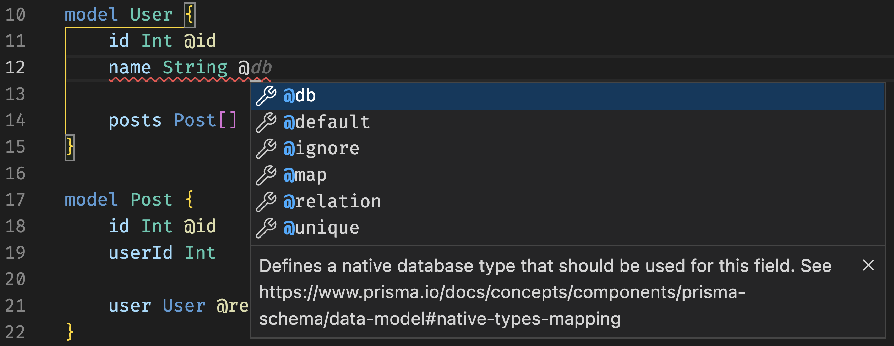
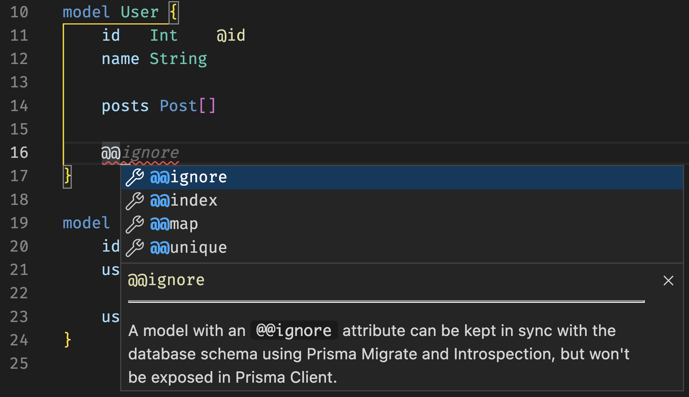
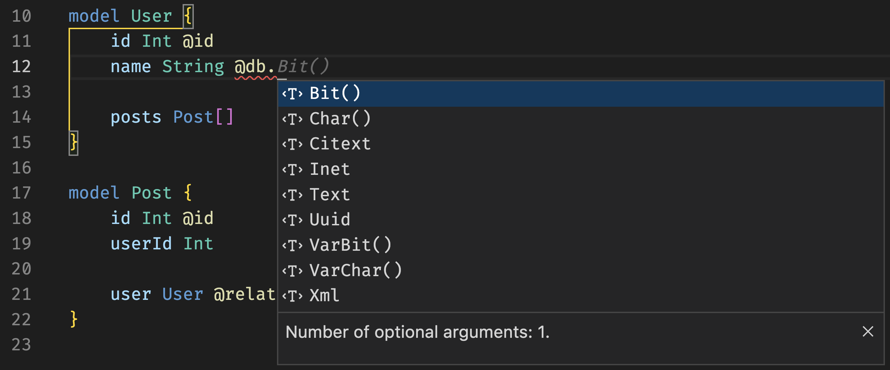
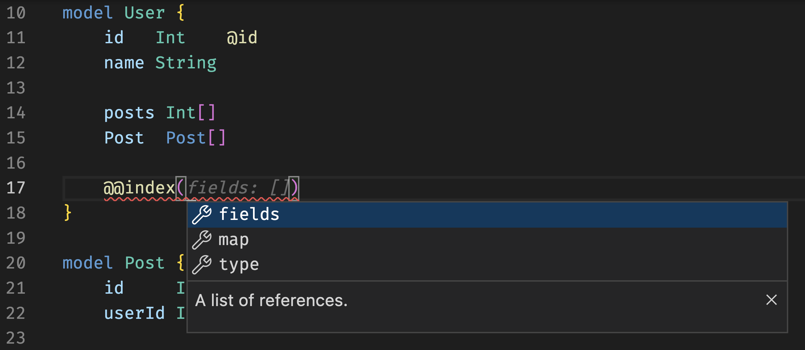
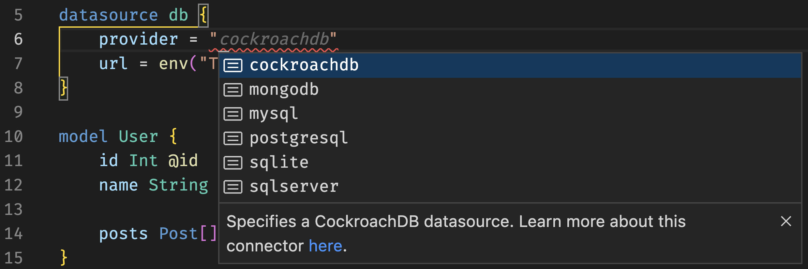

<TopBlock>

- [Attributes](#attributes): refer to modifications that can be made to the field / model to which it was applied
- [Native types](#native-types): refer to the underlying database types defined by the connector being used.
- [Indexes](#indexes)
- [Supported fields](#supported-fields): ...

</TopBlock>

## Attributes

### Field Example

### Model Example

## Native types

### Example

## Indexes

### Configuration

Where both `fields` and `type` also then offer further completions.

## Supported fields

| block      | field           |
| ---------- | --------------- |
| generator  | provider        |
| generator  | engineType      |
| generator  | previewFeatures |
| ---        | ---             |
| datasource | provider        |
| datasource | url             |
| datasource | relationMode    |

### Example

