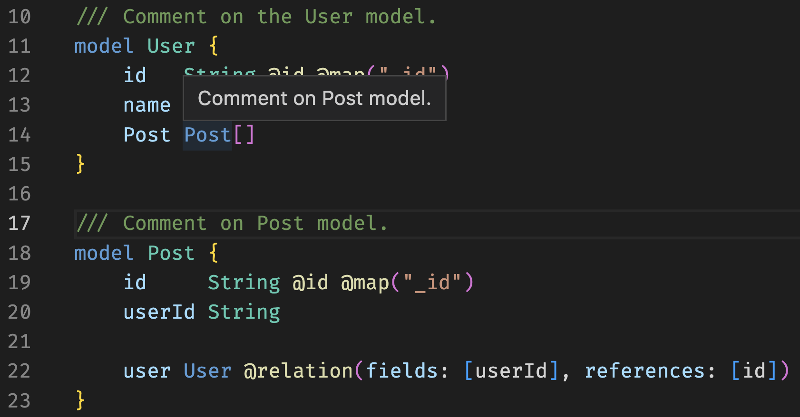

<TopBlock>

The Prisma Language Server implements the [Language Server Protocol](https://microsoft.github.io/language-server-protocol/) and offers functionality in the following areas:

- [Formatting](#formatting): ...
- [Linting and validation](#linting):
- [Auto-completion](/concepts/components/prisma-language-tools/prisma-language-server/auto-complete): ...
- [Code Actions](/concepts/components/prisma-language-tools/prisma-language-server/code-actions): ...
- [Tooltips](#tooltips): ...
- [Go to Definition](#go-to-definition): ...
- [Document symbols](#document-symbols): ...

<!-- TODO: [**File Watcher?**](file-watcher): ... --->

<!-- TODO: Do we want to link the language-tools source? -->

<!-- TODO: Do we want to menton prisma-engines -- part of the language server is implemented there  -->

</TopBlock>

## Formatting

If you want to learn more about how formatting works in Prisma, you can read more [here](/concepts/components/prisma-schema#auto-formatting).

## Linting

The Prisma Language Server is able to emit diagnostics that provide a developer with further information regarding the status of their schema with regards to errors, warnings, and any other information that may be relevant. You can learn more about the currently supported diagnostics [here](/concepts/components/prisma-language-tools/prisma-language-server/diagnostics).

## Tooltips

Comments are shown on hover of models, enums, and types as a tooltip


## Go to Definition

Re-directs the view to focus the definition of the selected element.

Go to definition can be triggered by either right clicking on the element and selecting `Go to definition` or using an editor specific keybind.

| Editor  | Key binding |
| ------- | ----------- |
| VS Code | `F12`       |

<TabbedContent tabs={[
<FileWithIcon text="Before" icon="file"/>,
<FileWithIcon text="After" icon="file"/>,
]}>
<tab>

```prisma
// ..rest of schema
model User {
  id    Int    @id
  posts Post[]
  //        ^^^^ - cursor
}

// ..rest of schema
```

</tab>
<tab>

```prisma
// ..rest of schema
model Post {
  //    ^ - cursor
  id Int @id
}

// ...rest of schema
```

</tab>
</TabbedContent>

## Document symbols
