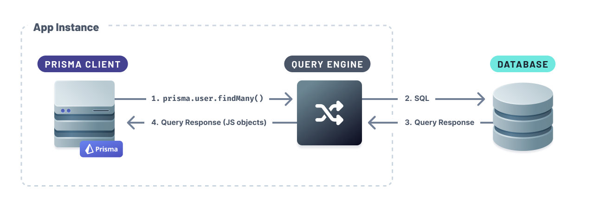
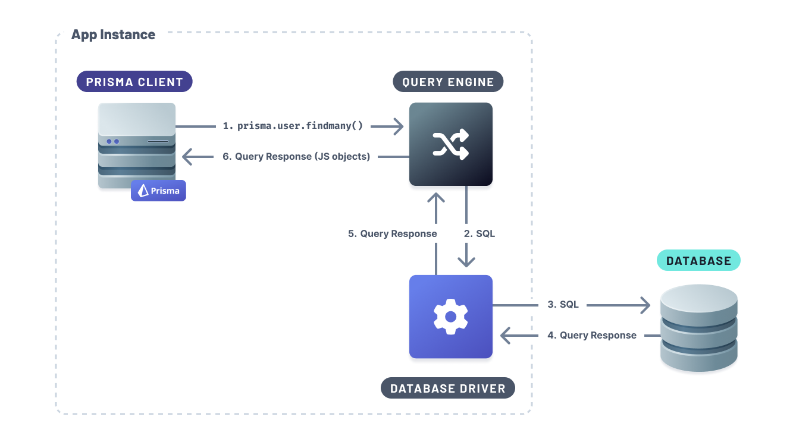

## Default built-in drivers

One of Prisma Client's components is the [Query Engine](./prisma-engines/query-engine) <span class="concept"></span>. The Query Engine is responsible for transforming Prisma Client queries to SQL statements. The Query Engine connects to your database using the included drivers that don't require additional setup. The built-in drivers use TCP connections to connect to the database.



## Driver adapters

Prisma Client can connect and run queries against your database using JavaScript database drivers using **driver adapters**. Adapters act as _translators_ between Prisma Client and the JavaScript database driver.

Prisma will use the Query Engine to transform the Prisma Client query to SQL and run the generated SQL queries via the JavaScript database driver.



### Serverless driver adapters

- [Neon](/guides/database/neon#how-to-use-the-neon-serverless-driver-with-prisma-preview)
- [PlanetScale](/guides/database/planetscale#how-to-use-the-planetscale-serverless-driver-with-prisma-preview)

### Database driver adapters

- [Turso](/guides/database/turso#connect-and-query-your-primary-database)

### How to use driver adapters

To use this feature:

1. Update the `previewFeatures` block in your schema to include the the `driverAdapters` preview feature:

   ```prisma
   generator client {
     provider        = "prisma-client-js"
     previewFeatures = ["driverAdapters"]
   }
   ```

2. Generate Prisma Client:

   ```sh
   npx prisma generate
   ```

3. Refer to the following pages to learn more how to use the specific driver adapters with the specific database providers:
   
   - [Neon](/guides/database/neon#how-to-use-the-neon-serverless-driver-with-prisma-preview)
   - [PlanetScale](/guides/database/planetscale#how-to-use-the-planetscale-serverless-driver-with-prisma-preview)
   - [Turso](/guides/database/turso#connect-and-query-your-primary-database)
