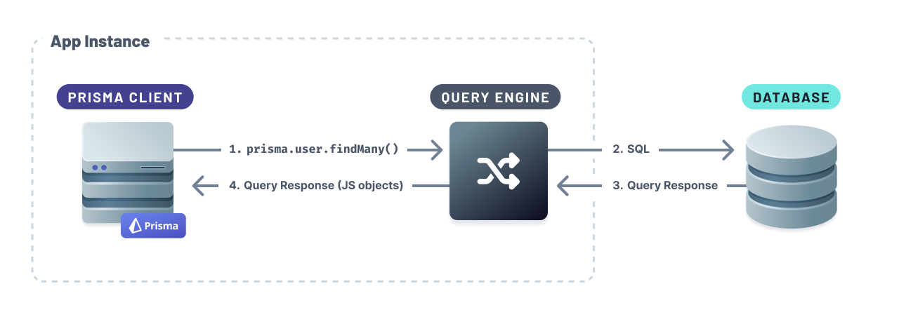

## Built-in drivers (default)

One of Prisma Client's component's is the [Query Engine](./prisma-engines/query-engine) <span class="concept"></span>. The Query Engine transforms Prisma Client queries to SQL statements that are executed using the included database driver. The Query Engine also includes built-in database drivers that don't require any additional effort to set up. The database drivers use TCP connections to connect to the database.



## Driver adapters

Prisma Client can connect and run queries against your database using other JavaScript database drivers using **driver adapters**. Adapters act as _translators_ between Prisma Client and the JavaScript database driver.


Prisma will use the Query Engine to transform the Prisma Client query to SQL and run the generated SQL queries via the JavaScript database driver.

Prisma maintains the following driver adapters:

- Serverless database driver adapters:
  - [Neon](#neon)
  - [PlanetScale](#planetscale)
- Database driver adapters:
  - [Turso](#turso)

To use this feature:

1. Update the `previewFeatures` block in your schema to include the the `driverAdapter` preview feature:

   ```prisma
   generator client {
     provider        = "prisma-client-js"
     previewFeatures = ["driverAdapters"]
   }
   ```

2. Generate Prisma Client:

   ```sh
   npx prisma generate
   ```

### Serverless drivers

By default, JavaScript database drivers use TCP connections. Several database providers enable use of different protocols, such as HTTP and WebSocket, to connect to your database. Example database providers include Neon, PlanetScale and Turso.

#### Neon Serverless Driver

Install the Prisma adapter for Neon, Neon serverless driver and `ws` packages:

```sh
npm install @prisma/adapter-neon @neondatabase/serverless ws
```

Update your Prisma Client instance:

```ts
import { Pool, neonConfig } from '@neondatabase/serverless'
import { PrismaNeon } from '@prisma/adapter-neon'
import { PrismaClient } from '@prisma/client'
import dotenv from 'dotenv'
import ws from 'ws'

dotenv.config()
neonConfig.webSocketConstructor = ws
const connectionString = `${process.env.DATABASE_URL}`

const pool = new Pool({ connectionString })
const adapter = new PrismaNeon(pool)
const prisma = new PrismaClient({ adapter })
```

<!-- TODO: feedback link -->

#### PlanetScale Serverless Driver

Install the Prisma adapter for PlanetScale, PlanetScale serverless driver and undici packages:

```sh
npm install @prisma/adapter-planetscale @planetscale/database undici
```

Update your Prisma Client instance:

```ts
import { connect } from '@planetscale/database'
import { PrismaPlanetScale } from '@prisma/adapter-planetscale'
import { PrismaClient } from '@prisma/client'
import dotenv from 'dotenv'
import { fetch as undiciFetch } from 'undici'

dotenv.config()
const connectionString = `${process.env.DATABASE_URL}`

const connection = connect({ url: connectionString, fetch: undiciFetch })
const adapter = new PrismaPlanetScale(connection)
const prisma = new PrismaClient({ adapter })
```

<!-- TODO: feedback link -->

#### Turso

Install the Prisma adapter for LibSQL and LibSQL packages:

```sh
npm install @prisma/adapter-libsql @libsql/client
```

Update your Prisma Client instance:

```ts
import { PrismaClient } from '@prisma/client'
import { PrismaLibSQL } from '@prisma/adapter-libsql'
import { createClient } from '@libsql/client'
import dotenv from 'dotenv'

dotenv.config()

const libsql = createClient({
  url: `${process.env.TURSO_DATABASE_URL}`,
  authToken: `${process.env.TURSO_AUTH_TOKEN}`,
})

const adapter = new PrismaLibSQL(libsql)
const prisma = new PrismaClient({ adapter })
```

<!-- [Learn sum mo](https://www.prisma.io/blog/prisma-turso-ea-support-rXGd_Tmy3UXX#get-started-with-prisma-and-turso) -->

<!-- TODO: feedback link -->
