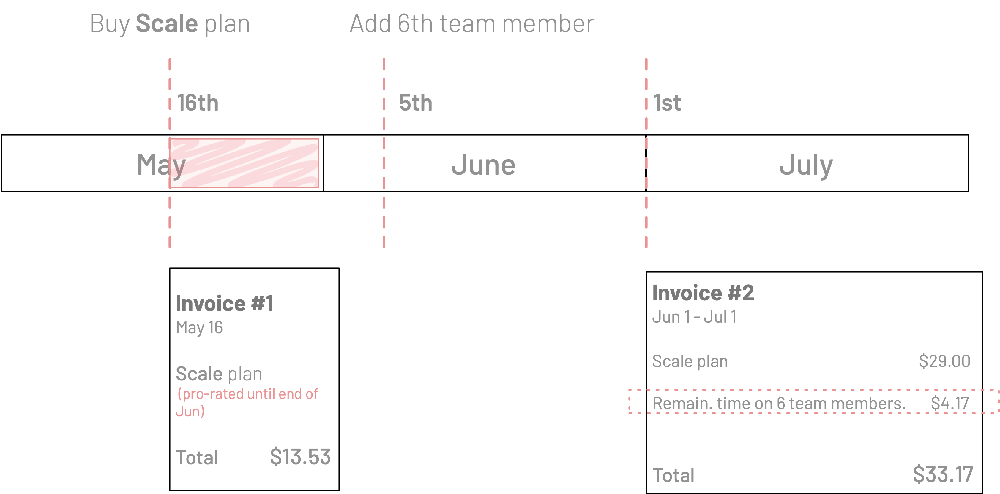
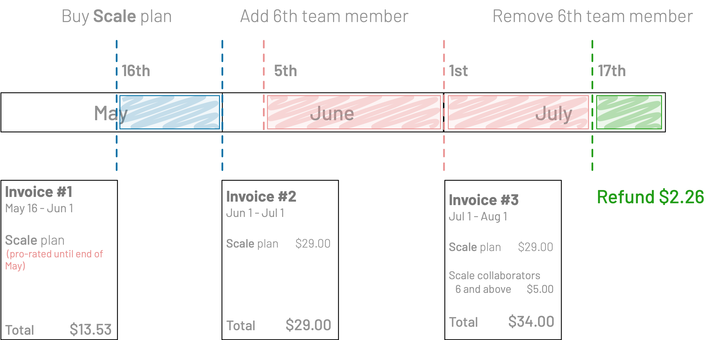

<TopBlock>

The Prisma Data Platform uses Stripe as the payments provider and it is Stripe that issues and sends the monthly invoices when you have a paid plan for a project.

</TopBlock>

## About invoices and billing cycle

- Billing is done on a monthly basis
- You are billed and receive invoices for each month on the 1st
- Each invoice bills upfront the usage until the end of that month
- If you have multiple projects on a paid plan, you receive a separate invoice for each project
- The first invoice is a pro-rated charge of the monthly plan price based on the date on which you purchased

## Invoice from initial plan purchase

When you purchase the [`Scale` plan](/concepts/data-platform/billing/plans-and-quotas#scale-plan) for the first time, you will receive an invoice that is at the pro-rated amount for the remainder of the month based on the purchase date.

<!-- Q1: How does this apply to the Enterprise plan -->

For example:

- You purchase the `Scale` plan on the 16th of June
- We immediately bill you and issue an invoice with the pro-rated amount for the period June 16th to June 30th
- On July 1st, we bill you and issue an invoice with the full amount of the `Scale` plan

## Invoices with overages and overage refunds

Paid plans have an unlimited number of team members, environments, and usage of the Prisma Data Proxy, but **they do have quotas**. The quotas limit how many members and environments, and how much Data Proxy usage you can have within the price of the plan.

When you **exceed any of these quotas, you are incurring overages** which we bill at the fixed price in the plan. If you remove the overage (only applies to team members and environments), we include a refund in the invoice for the time during which the overage was not applicable.

This section explains how overages are billed and refunded for unused team members and environments in your invoice. The examples are based on the `Scale` plan.

### Overages on team members or environments

The `Scale` plan has quotas of 5 team members and 5 environments. An example of an overage is when you add an additional 6th team member or a 6th environment to your project.

- When you add team members or environments that become an overage, we do not bill you immediately.
- The pro-rated amount for the overage until the end of the current month is added to the invoice for the following month
- A full amount of the overage is also added for the invoice for the following month

Here is an example:

- For June, you pay the invoice for the full month of June on the 1st
- On June 5th, you add a 6th team member
- The pro-rated (Jun 5 - Jun 30) charge for the 6th team member overage is added to the July invoice
- The charge for the 6th team member overage for the month of July is also added to the July invoice

### Refunds for removed overages of team members or environments

If you go back to being within your project plan quota by removing a team member that was in overage, we immediately refund you the amount for the time during which the additional team member will not be in use until the end of the month.

### Overages on Data Proxy usage

The `Scale` plan has a quota of 30 million CPU milliseconds. Overages begin when you exceed the 30 million CPU milliseconds. The overages are billed at the fixed price of the `Scale` plan.

## Tracking overages on the Data Proxy usage

- Contact the Prisma Data Platform Support team and ask about your current Prisma Data Proxy usage.
- Review notifications emails about the Prisma Data Proxy usage on your project. We send notifications of reaching 50%, 75%, 90%, and 100% of the Data Proxy usage for your project to the email address associated with your GitHub account.
