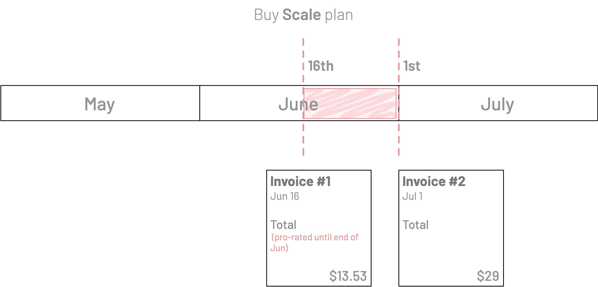
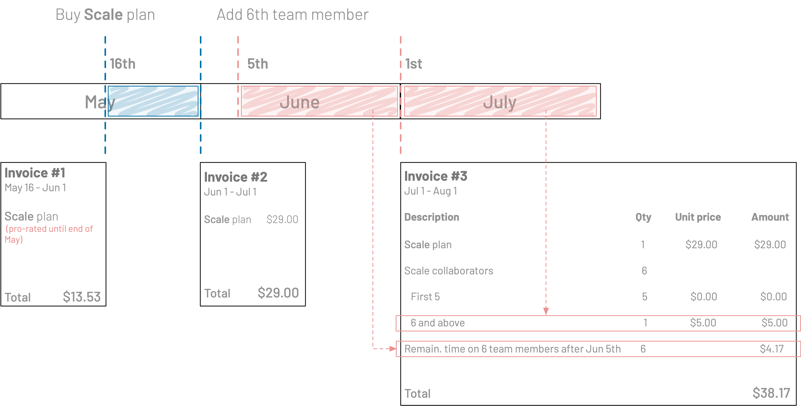
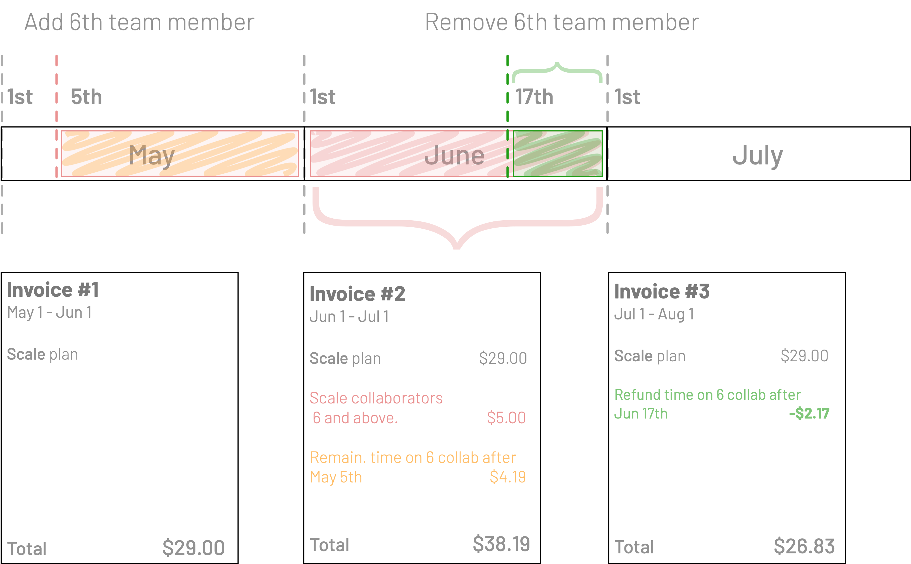
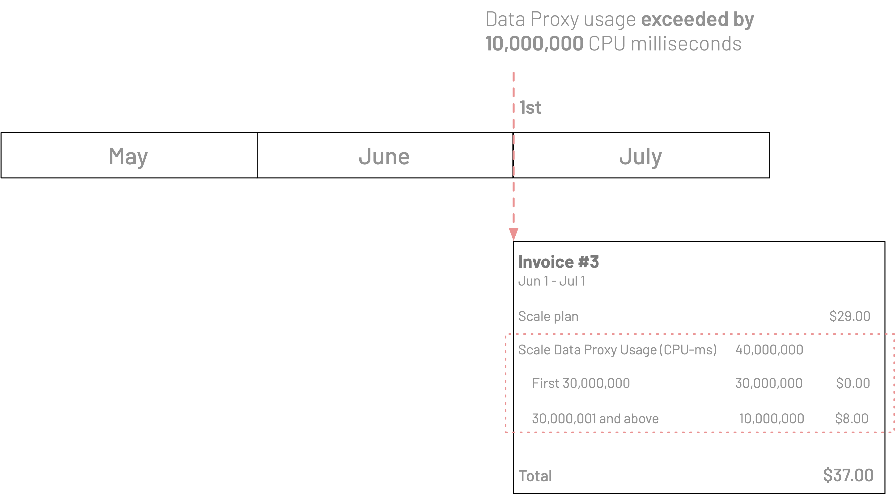

<TopBlock>

The Prisma Data Platform uses [Stripe](https://stripe.com/) as the payments provider. Stripe issues and sends the monthly invoices when you have paid plan(s).

</TopBlock>

## About invoices and billing cycle

- Billing occurs on a monthly basis
- You are billed and receive invoices for each month on the 1st
- Each invoice bills upfront the usage until the end of that month
- If you have multiple projects on paid plans, you receive a separate invoice for each project
- The first invoice is typically at a pro-rated amount of the monthly plan price. This means that we bill you only for the period during which your project uses the paid plan during the first month. For example, if you purchase on the 16th, we calculate the amount from the 16th until the end of the month.

## Invoice from initial plan purchase

When you purchase the [**Scale** plan](/concepts/data-platform/billing/plans-and-quotas#scale-plan) for the first time, you will receive an invoice that is at the pro-rated amount for the remainder of the month based on the purchase date.

<!-- Q1: How does this apply to the Enterprise plan -->

For example:

- You purchase the **Scale** plan on the 16th of June
- We immediately bill you and issue an invoice with the pro-rated amount for the period June 16th to June 30th
- On July 1st, we bill you and issue an invoice with the full amount of the **Scale** plan

## Invoices with overages and overage refunds

Paid plans have an unlimited number of team members, environments, and usage of the Prisma Data Proxy, but **they do have quotas**. The quotas limit how many members and environments, and how much Data Proxy usage you can have within the price of the plan.

When you **exceed any of these quotas, you are incurring overages** which we bill at the fixed price in the plan. If you remove the overage (only applies to team members and environments), we include a refund in the invoice on the 1st of next month for any time during which the overage did not apply.

This section explains how overages are billed and refunded for unused team members and environments in your invoice.

<Admonition type="warning">

**Examples**  
The examples below are based on the **Scale** plan and contain calculations for illustration purposes only.

</Admonition>

### Overages on team members or environments

The **Scale** plan has quotas of 5 team members and 5 environments. An example of an overage is when you add an additional 6th team member or a 6th environment to your project.

- When you add team members or environments that become an overage, we do not bill you immediately
- The pro-rated amount for the overage until the end of the current month is added to the invoice for the following month
- A full amount of the overage is also added for the invoice for the following month

Here is an example:

- For June, you pay the invoice for the full month on the 1st of June
- On June 5th, you add a 6th team member
- The pro-rated (Jun 5 - Jun 30) charge for the 6th team member overage is added to the July invoice
- The charge for the 6th team member overage for the month of July is also added to the July invoice

### Refunds for removed overages of team members or environments

If you go back to being within the plan quota by removing a team member that was in overage, in the invoice for the next month we include a refund for the unused time.

For example:

- Your purchased the **Scale** plan for a project on May 1st.
- The first invoice from May 1st covers the full **Scale** plan price for the entire month of May.
- You added a 6th team member on May 5th.
- The invoice from June 1st contains:
  - calculated overage amount for 6th team member for May 5th to May 31st
  - full month amount for the 6th team member for June 1st to June 30th
- You removed the 6th team member on June 17th.
- The invoice from July 1st contains a refund for the 6th team member not being in use from June 17th to June 30th.

### Overages on Data Proxy usage

The **Scale** plan has a monthly quota of 30,000 CPU seconds. Overages begin when you exceed the 30,000 CPU seconds. The overages are billed at the fixed price of the **Scale** plan.

## Tracking overages on the Data Proxy usage

- [Contact Support](/concepts/data-platform/contact-support) and ask about your current Prisma Data Proxy usage.
- Review notifications emails about the Prisma Data Proxy usage on your project. We will send notifications well before your usage reaches the hard limits so that you can avoid service interruptions.
