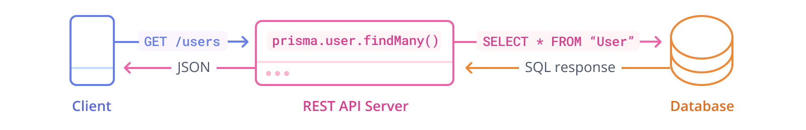

<TopBlock>

When building REST APIs, Prisma Client can be used inside your _route controllers_ to send databases queries.



</TopBlock>

## Supported libraries

As Prisma Client is "only" responsible for sending queries to your database, it can be combined with any HTTP server library or web framework of your choice.

Here's a non-exhaustive list of libraries and frameworks you can use with Prisma ORM:

- [Express](https://expressjs.com/)
- [koa](https://koajs.com/)
- [hapi](https://hapi.dev/)
- [Fastify](https://fastify.dev/)
- [Sails](https://sailsjs.com/)
- [AdonisJs](https://adonisjs.com/)
- [NestJS](https://nestjs.com/)
- [Next.js](https://nextjs.org/)
- [Foal TS](https://foalts.org/)
- [Polka](https://github.com/lukeed/polka)
- [Micro](https://github.com/zeit/micro)
- [Feathers](https://feathersjs.com/)
- [Remix](https://remix.run/)

## REST API server example

Assume you have a Prisma schema that looks similar to this:

```prisma
datasource db {
  provider = "sqlite"
  url      = "file:./dev.db"
}

generator client {
  provider = "prisma-client"
  output   = "./generated"
}

model Post {
  id        Int     @id @default(autoincrement())
  title     String
  content   String?
  published Boolean @default(false)
  author    User?   @relation(fields: [authorId], references: [id])
  authorId  Int?
}

model User {
  id    Int     @id @default(autoincrement())
  email String  @unique
  name  String?
  posts Post[]
}
```

You can now implement route controller (e.g. using Express) that use the generated [Prisma Client API](/orm/prisma-client) to perform a database operation when an incoming HTTP request arrives. This page only shows few sample code snippets; if you want to run these code snippets, you can use a [REST API example](https://pris.ly/e/ts/rest-express).

#### `GET`

```ts
app.get('/feed', async (req, res) => {
  const posts = await prisma.post.findMany({
    where: { published: true },
    include: { author: true },
  })
  res.json(posts)
})
```

Note that the `feed` endpoint in this case returns a nested JSON response of `Post` objects that _include_ an `author` object. Here's a sample response:

```json
[
  {
    "id": "21",
    "title": "Hello World",
    "content": "null",
    "published": "true",
    "authorId": 42,
    "author": {
      "id": "42",
      "name": "Alice",
      "email": "alice@prisma.io"
    }
  }
]
```

#### `POST`

```ts
app.post(`/post`, async (req, res) => {
  const { title, content, authorEmail } = req.body
  const result = await prisma.post.create({
    data: {
      title,
      content,
      published: false,
      author: { connect: { email: authorEmail } },
    },
  })
  res.json(result)
})
```

#### `PUT`

```ts
app.put('/publish/:id', async (req, res) => {
  const { id } = req.params
  const post = await prisma.post.update({
    where: { id: Number(id) },
    data: { published: true },
  })
  res.json(post)
})
```

#### `DELETE`

```ts
app.delete(`/post/:id`, async (req, res) => {
  const { id } = req.params
  const post = await prisma.post.delete({
    where: {
      id: Number(id),
    },
  })
  res.json(post)
})
```

## Ready-to-run example projects

You can find several ready-to-run examples that show how to implement a REST API with Prisma Client, as well as build full applications, in the [`prisma-examples`](https://github.com/prisma/prisma-examples/) repository.

| **Example**                                                                                                                   | **Stack**    | **Description**                                |
| ----------------------------------------------------------------------------------------------------------------------------- | ------------ | ---------------------------------------------- |
| [`express`](https://pris.ly/e/ts/rest-express)                               | Backend only | REST API with Express for TypeScript           |
| [`fastify`](https://pris.ly/e/ts/rest-fastify)                               | Backend only | REST API using Fastify and Prisma Client.      |
| [`hapi`](https://pris.ly/e/ts/rest-hapi)                                     | Backend only | REST API using hapi and Prisma Client          |
| [`nestjs`](https://pris.ly/e/ts/rest-nestjs)                                 | Backend only | Nest.js app (Express) with a REST API          |
| [`nextjs`](https://pris.ly/e/orm/nextjs)                                     | Fullstack    | Next.js app (React) with a REST API            |
