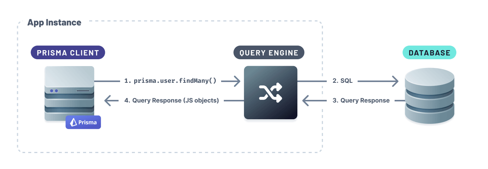
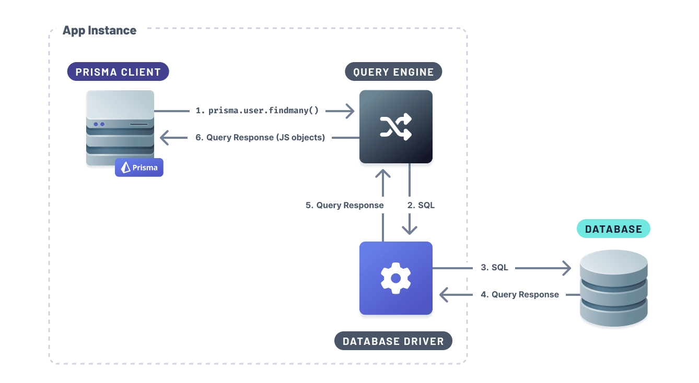

## Default built-in drivers

One of Prisma Client's components is the [Query Engine](/orm/more/under-the-hood/engines). The Query Engine is responsible for transforming Prisma Client queries into SQL statements. It connects to your database via TCP using built-in drivers that don't require additional setup.



## Driver adapters

Prisma Client can connect and run queries against your database using JavaScript database drivers using **driver adapters**. Adapters act as _translators_ between Prisma Client and the JavaScript database driver.

Prisma Client will use the Query Engine to transform the Prisma Client query to SQL and run the generated SQL queries via the JavaScript database driver.



There are two different types of driver adapters:

- [Database driver adapters](#database-driver-adapters)
- [Serverless driver adapters](#serverless-driver-adapters)

> **Note**: Driver adapters enable [edge deployments](/orm/prisma-client/deployment/edge/overview) of applications that use Prisma ORM.

### Database driver adapters

You can connect to your database using a Node.js-based driver from Prisma Client using a database driver adapter. Prisma maintains the following database driver adapters:

- [PostgreSQL](/orm/overview/databases/postgresql#using-the-node-postgres-driver)
- [Turso](/orm/overview/databases/turso#how-to-connect-and-query-a-turso-database)

### Serverless driver adapters

Database providers, such as Neon and PlanetScale, allow you to connect to your database using other protocols besides TCP, such as HTTP and WebSockets. These database drivers are optimized for connecting to your database in serverless and edge environments.

Prisma ORM maintains the following serverless driver adapters:

- [Neon](/orm/overview/databases/neon#how-to-use-neons-serverless-driver-with-prisma-orm-preview) (and Vercel Postgres)
- [PlanetScale](/orm/overview/databases/planetscale#how-to-use-the-planetscale-serverless-driver-with-prisma-orm-preview)
- [Cloudflare D1](/orm/overview/databases/cloudflare-d1)

### Community-maintained database driver adapters

You can also build your own driver adapter for the database you're using. The following is a list of community-maintained driver adapters:

- [TiDB Cloud Serverless Driver](https://github.com/tidbcloud/prisma-adapter)
- [PGlite - Postgres in WASM](https://github.com/lucasthevenet/pglite-utils/tree/main/packages/prisma-adapter)

## How to use driver adapters

To use this feature:

1. Update the `previewFeatures` block in your schema to include the `driverAdapters` Preview feature:

   ```prisma
   generator client {
     provider        = "prisma-client-js"
     previewFeatures = ["driverAdapters"]
   }
   ```

2. Generate Prisma Client:

   ```bash
   npx prisma generate
   ```

3. Refer to the following pages to learn more about how to use the specific driver adapters with the specific database providers:

   - [PostgreSQL](/orm/overview/databases/postgresql#using-the-node-postgres-driver)
   - [Neon](/orm/overview/databases/neon#how-to-use-neons-serverless-driver-with-prisma-orm-preview)
   - [PlanetScale](/orm/overview/databases/planetscale#how-to-use-the-planetscale-serverless-driver-with-prisma-orm-preview)
   - [Turso](/orm/overview/databases/turso#how-to-connect-and-query-a-turso-database)
   - [Cloudflare D1](/orm/overview/databases/cloudflare-d1)

## Notes about using driver adapters

### Driver adapters don't read the connection string from the Prisma schema

When using Prisma ORM's built-in drivers, the connection string is read from the `url` field of the `datasource` block in your Prisma schema.

On the other hand, when using a driver adapter, the connection string needs to be provided in your _application code_ when the driver adapter is set up initially. Here is how this is done for the `pg` driver and the `@prisma/adapter-pg` adapter:

```ts highlight=5,normal
import { PrismaClient } from '@prisma/client'
import { PrismaPg } from '@prisma/adapter-pg'
import { Pool } from 'pg'

const pool = new Pool({ connectionString: env.DATABASE_URL })
const adapter = new PrismaPg(pool)
const prisma = new PrismaClient({ adapter })
```

See the docs for the driver adapter you're using for concrete setup instructions.

### Driver adapters and custom output paths

Since Prisma 5.9.0, when using the driver adapters Preview feature along with a [custom output path for Prisma Client](/orm/prisma-client/setup-and-configuration/generating-prisma-client#using-a-custom-output-path), you cannot reference Prisma Client using a relative path.

Let's assume you had `output` in your Prisma schema set to `../src/generated/client`:

```prisma
generator client {
  provider = "prisma-client-js"
  output   = "../src/generated/client"
}
```

What you should **not** do is reference that path relatively:

```ts no-copy
// what not to do!
import { PrismaClient } from './src/generated/client'

const client = new PrismaClient()
```

Instead, you will need to use a linked dependency.

<TabbedContent code>

<TabItem value="npm">

```terminal
npm add db@./src/generated/client
```

</TabItem>

<TabItem value="pnpm">

```terminal
pnpm add db@link:./src/generated/client
```

</TabItem>

<TabItem value="yarn">

```terminal
yarn add db@link:./src/generated/client
```

</TabItem>

</TabbedContent>

Now, you should be able to reference your generated client using `db`!

```ts
import { PrismaClient } from 'db'

const client = new PrismaClient()
```

### Driver adapters and specific frameworks

#### Nuxt

Using a driver adapter with [Nuxt](https://nuxt.com/) to deploy to an edge function environment does not work out of the box, but adding the `nitro.experimental.wasm` configuration option fixes that:

```ts
export default defineNuxtConfig({
  // ...
  nitro: {
    // ...
    experimental: {
      wasm: true,
    },
  },
  // ...
})
```

See [this example project](https://github.com/prisma/ecosystem-tests/tree/dev/driver-adapters-wasm/d1-cfpages-nuxt) for a full example that can be deployed to Cloudflare Pages.
