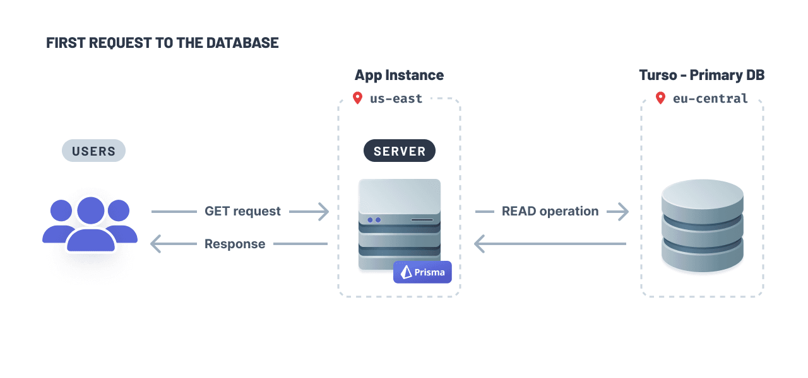
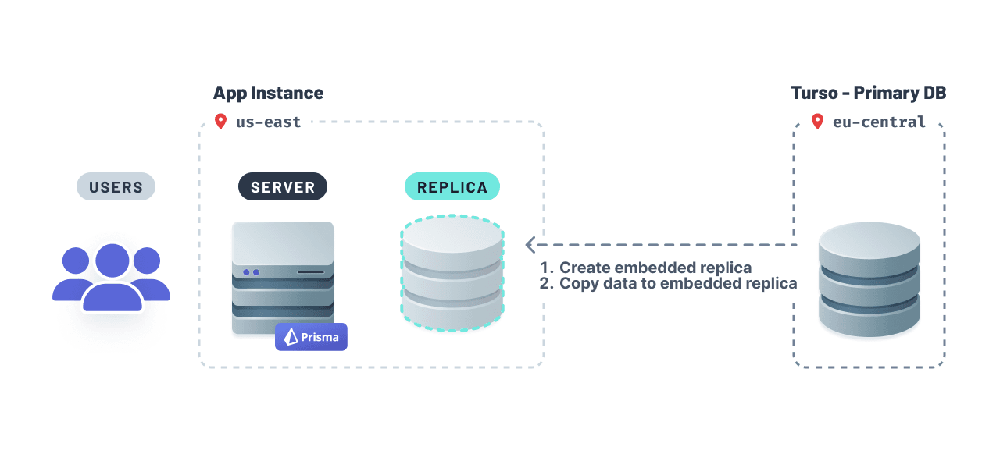
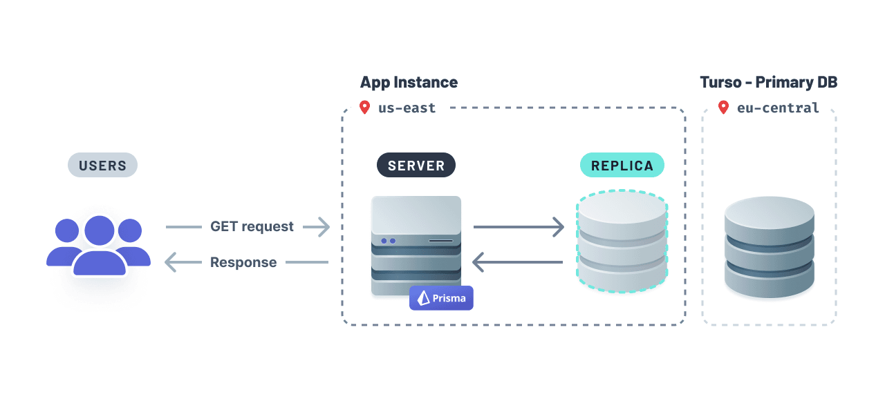
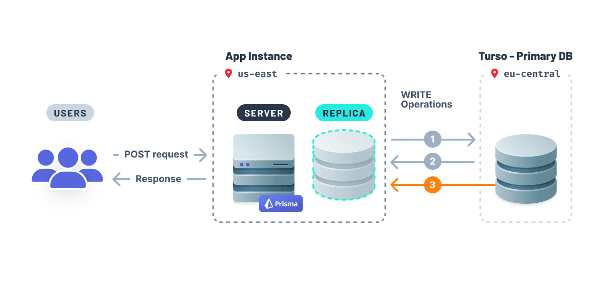

<TopBlock>

This guide discusses the concepts behind using Prisma and Turso, explains the commonalities and differences between Turso and other database providers, and leads you through the process for configuring your application to integrate with Turso.

Prisma support for Turso is currently in [Early Access](/orm/more/releases#early-access). We would appreciate your feedback in this [GitHub discussion](https://github.com/prisma/prisma/discussions/21345).

</TopBlock>

## What is Turso?


[Turso](https://turso.tech/) is an edge-hosted, distributed database that's based on [libSQL](https://turso.tech/libsql), an open-source and open-contribution fork of [SQLite](https://sqlite.org/), enabling you to bring data closer to your application and minimize query latency. Turso can also be hosted on a remote server.

<Admonition type="warning">

Support for Turso is available in [Early Access](/orm/more/releases#early-access) from Prisma versions 5.4.2 and later.

</Admonition>

## Commonalities with other database providers

libSQL is 100% compatible with SQLite. libSQL extends SQLite and adds the following features and capabilities:

- Support for replication
- Support for automated backups
- Ability to embed Turso as part of other programs such as the Linux kernel
- Supports user-defined functions
- Support for asynchronous I/O

> To learn more about the differences between libSQL and how it is different from SQLite, see [libSQL Manifesto](https://turso.tech/libsql-manifesto).

Many aspects of using Prisma with Turso are just like using Prisma with any other relational database. You can still:

- model your database with the [Prisma Schema Language](/orm/prisma-schema)
- use Prisma's existing [`sqlite` database connector](/orm/overview/databases/sqlite) in your schema
- use [Prisma Client](/orm/prisma-client) in your application to talk to the database server at Turso

## Differences to consider

There are a number of differences between Turso and SQLite to consider. You should be aware of the following when deciding to use Turso and Prisma:

- **Remote and embedded SQLite databases**. libSQL uses HTTP to connect to the remote SQLite database. libSQL also supports remote database replicas and embedded replicas. Embedded replicas enable you to replicate your primary database inside your application.
- **Making schema changes**. Since libSQL uses HTTP to connect to the remote database, this makes it incompatible with Prisma Migrate. However, you can use [`prisma migrate diff`](/orm/reference/prisma-cli-reference#migrate-diff) to create a schema migration and then apply the changes to your database using [Turso's CLI](https://docs.turso.tech/reference/turso-cli).

## How to connect and query a Turso database

The subsequent section covers how you can create a Turso database, retrieve your database credentials and connect to your database.

### How to provision a database and retrieve database credentials

<Admonition>

Ensure that you have the [Turso CLI](https://docs.turso.tech/reference/turso-cli) installed to manage your databases.

</Admonition>

If you don't have an existing database, you can provision a database by running the following command:

```terminal
turso db create turso-prisma-db
```

The above command will create a database in the closest region to your location.

Run the following command to retrieve your database's connection string:

```terminal
turso db show turso-prisma-db
```

Next, create an authentication token that will allow you to connect to the database:

```terminal
turso db tokens create turso-prisma-db
```

Update your `.env` file with the authentication token and connection string:

```text file=.env
TURSO_AUTH_TOKEN="eyJhbGciOiJFZERTQSIsInR5cCI6IkpXVCJ9..."
TURSO_DATABASE_URL="libsql://turso-prisma-db-user.turso.io"
```

### How to connect to a Turso database

To get started, enable the `driverAdapters` Preview feature flag:

```prisma highlight=3;add
generator client {
  provider        = "prisma-client-js"
  previewFeatures = ["driverAdapters"]
}

datasource db {
  provider = "sqlite"
  url      = "file:./dev.db"
}
```

Generate Prisma Client:

```terminal
npx prisma generate
```

Install the libSQL database client and Prisma driver adapter for libSQL packages:

```terminal
npm install @libsql/client @prisma/adapter-libsql
```

Update your Prisma Client instance:

```ts
import { PrismaClient } from '@prisma/client'
import { PrismaLibSQL } from '@prisma/adapter-libsql'
import { createClient } from '@libsql/client'

const libsql = createClient({
  url: `${process.env.TURSO_DATABASE_URL}`,
  authToken: `${process.env.TURSO_AUTH_TOKEN}`,
})

const adapter = new PrismaLibSQL(libsql)
const prisma = new PrismaClient({ adapter })
```

You can use Prisma Client as you normally would with full type-safety in your project.

## How to manage schema changes

Prisma Migrate and Introspection workflows are currently not supported when working with Turso. This is because Turso uses HTTP to connect to your database, which Prisma Migrate doesn't support.

To update your database schema:

1. Generate a migration file using `prisma migrate dev` against a local SQLite database:

   ```terminal
   npx prisma migrate dev --name init
   ```

2. Apply the migration using Turso's CLI:

   ```terminal
   turso db shell turso-prisma-db < ./prisma/migrations/20230922132717_init/migration.sql
   ```

   <Admonition>

   Replace `20230922132717_init` with the name of your migration.

   </Admonition>

For subsequent migrations, repeat the above steps to apply changes to your database. This workflow does not support track the history of applied migrations to your remote database.

## Embedded Turso database replicas

Turso supports [embedded replicas](https://blog.turso.tech/introducing-embedded-replicas-deploy-turso-anywhere-2085aa0dc242). Turso's embedded replicas enable you to have a copy of your primary, remote database _inside_ your application. Embedded replicas behave similarly to a local SQLite database. Database queries are faster because your database is inside your application.

### How embedded database replicas work

When your app initially establishes a connection to your database, the primary database will fulfill the query:



Turso will (1) create an embedded replica inside your application and (2) copy data from your primary database to the replica so it is locally available:



The embedded replica will fulfill subsequent read queries. The libSQL client provides a [`sync()`](<https://docs.turso.tech/libsql/client-access/javascript-typescript-sdk#client-capability-summary:~:text=an%20interactive%20transaction-,sync(),-Synchronize%20the%20embedded>) method which you can invoke to ensure the embedded replica's data remains fresh.



With embedded replicas, this setup guarantees a responsive application, because the data will be readily available locally and faster to access.

Like a read replica setup you may be familiar with, write operations are forwarded to the primary remote database and executed before being propagated to all embedded replicas.



1. Write operations propagation are forwarded to the database.
1. Database responds to the server with the updates from 1.
1. Write operations are propagated to the database replica.

Your application's data needs will determine how often you should synchronize data between your remote database and embedded database replica. For example, you can use either middleware functions (e.g. Express and Fastify) or a cron job to synchronize the data.

### How to synchronize data between your remote database and embedded replica

To get started using embedded replicas with Prisma, add the `sync()` method from libSQL in your application. The example below shows how you can synchronize data using Express middleware.

```ts highlight=5-8;add;
import express from 'express'
const app = express()

// ... the rest of your application code
app.use(async (req, res, next) => {
  await libsql.sync()
  next()
})

app.listen(3000, () => console.log(`Server ready at http://localhost:3000`))
```
