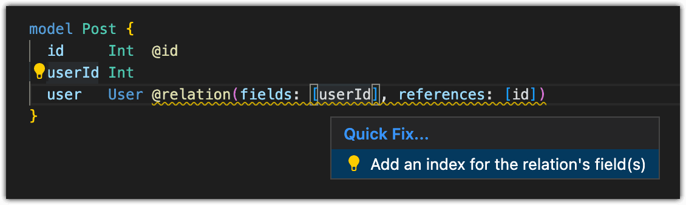

<details>
<summary>Questions answered in this page</summary>

- What is `relationMode` in Prisma?
- When should I use `prisma` vs `foreignKeys`?
- How does relation emulation affect constraints?

</details>

In Prisma schema, relations between records are defined with the [`@relation`](/orm/reference/prisma-schema-reference#relation) attribute. For example, in the following schema there is a one-to-many relation between the `User` and `Post` models:

```prisma file=schema.prisma highlight=4,5,10;normal showLineNumbers
model Post {
  id       Int    @id @default(autoincrement())
  title    String
  //highlight-start
  author   User   @relation(fields: [authorId], references: [id], onDelete: Cascade, onUpdate: Cascade)
  authorId Int
  //highlight-end
}

model User {
  id    Int    @id @default(autoincrement())
  //highlight-next-line
  posts Post[]
}
```

Prisma ORM has two _relation modes_, `foreignKeys` and `prisma`, that specify how relations between records are enforced.

If you use Prisma ORM with a relational database, then by default Prisma ORM uses the [`foreignKeys` relation mode](#handle-relations-in-your-relational-database-with-the-foreignkeys-relation-mode), which enforces relations between records at the database level with foreign keys. A foreign key is a column or group of columns in one table that take values based on the primary key in another table. Foreign keys allow you to:

- set constraints that prevent you from making changes that break references
- set [referential actions](/orm/prisma-schema/data-model/relations/referential-actions) that define how changes to records are handled

Together these constraints and referential actions guarantee the _referential integrity_ of the data.

For the example schema above, Prisma Migrate will generate the following SQL by default if you use the PostgreSQL connector:

```sql highlight=19-22;normal

-- CreateTable
CREATE TABLE "Post" (
    "id" SERIAL NOT NULL,
    "title" TEXT NOT NULL,
    "authorId" INTEGER NOT NULL,

    CONSTRAINT "Post_pkey" PRIMARY KEY ("id")
);

-- CreateTable
CREATE TABLE "User" (
    "id" SERIAL NOT NULL,

    CONSTRAINT "User_pkey" PRIMARY KEY ("id")
);

-- AddForeignKey
//highlight-start
ALTER TABLE "Post"
  ADD CONSTRAINT "Post_authorId_fkey"
  FOREIGN KEY ("authorId")
  REFERENCES "User"("id") ON DELETE CASCADE ON UPDATE CASCADE;
//highlight-end
```

In this case, the foreign key constraint on the `authorId` column of the `Post` table references the `id` column of the `User` table, and guarantees that a post must have an author that exists. If you update or delete a user then the `ON DELETE` and `ON UPDATE` referential actions specify the `CASCADE` option, which will also delete or update all posts belonging to the user.

Some databases, such as MongoDB or [PlanetScale](/orm/overview/databases/planetscale#differences-to-consider), do not support foreign keys. Additionally, in some cases developers may prefer not to use foreign keys in their relational database that usually does support foreign keys. For these situations, Prisma ORM offers [the `prisma` relation mode](#emulate-relations-in-prisma-orm-with-the-prisma-relation-mode), which emulates some properties of relations in relational databases. When you use Prisma Client with the `prisma` relation mode enabled, the behavior of queries is identical or similar, but referential actions and some constraints are handled by the Prisma engine rather than in the database.

:::warning
  There are performance implications to emulation of referential integrity and
  referential actions in Prisma Client. In cases where the underlying database
  supports foreign keys, it is usually the preferred choice.
:::

## How to set the relation mode in your Prisma schema

To set the relation mode, add the `relationMode` field in the `datasource` block:

```prisma file=schema.prisma highlight=4,9;add showLineNumbers
datasource db {
  provider     = "mysql"
  //add-next-line
  relationMode = "prisma"
}
```

:::info

The ability to set the relation mode was introduced as part of the `referentialIntegrity` preview feature in Prisma ORM version 3.1.1, and is generally available in Prisma ORM versions 4.8.0 and later.<br /><br />The `relationMode` field was renamed in Prisma ORM version 4.5.0, and was previously named `referentialIntegrity`.

:::

For relational databases, the available options are:

- `foreignKeys`: this handles relations in the database with foreign keys. This is the default option for all relational database connectors and is active if no `relationMode` is explicitly set in the `datasource` block.
- `prisma`: this emulates relations in Prisma Client. You should also [enable this option](/orm/overview/databases/planetscale#option-1-emulate-relations-in-prisma-client) when you use the MySQL connector with a PlanetScale database and don't have native foreign key constraints enabled in your PlanetScale database settings.

For MongoDB, the only available option is the `prisma` relation mode. This mode is also active if no `relationMode` is explicitly set in the `datasource` block.

:::warning

If you switch between relation modes, Prisma ORM will add or remove foreign keys to your database next time you apply changes to your schema with Prisma Migrate or `db push`. See [Switch between relation modes](#switch-between-relation-modes) for more information.

:::

## Handle relations in your relational database with the `foreignKeys` relation mode

The `foreignKeys` relation mode handles relations in your relational database with foreign keys. This is the default option when you use a relational database connector (PostgreSQL, MySQL, SQLite, SQL Server, CockroachDB).

The `foreignKeys` relation mode is not available when you use the MongoDB connector. Some relational databases, [such as PlanetScale](/orm/overview/databases/planetscale#option-1-emulate-relations-in-prisma-client), also forbid the use of foreign keys. In these cases, you should instead [emulate relations in Prisma ORM with the `prisma` relation mode](#emulate-relations-in-prisma-orm-with-the-prisma-relation-mode).

### Referential integrity

The `foreignKeys` relation mode maintains referential integrity at the database level with foreign key constraints and referential actions.

#### Foreign key constraints

When you _create_ or _update_ a record with a relation to another record, the related record needs to exist. Foreign key constraints enforce this behavior in the database. If the record does not exist, the database will return an error message.

#### Referential actions

When you _update_ or _delete_ a record with a relation to another record, referential actions are triggered in the database. To maintain referential integrity in related records, referential actions prevent changes that would break referential integrity, cascade changes through to related records, or set the value of fields that reference the updated or deleted records to a `null` or default value.

For more information, see the [referential actions](/orm/prisma-schema/data-model/relations/referential-actions) page.

### Introspection

When you introspect a relational database with the `db pull` command with the `foreignKeys` relation mode enabled, a `@relation` attribute will be added to your Prisma schema for relations where foreign keys exist.

### Prisma Migrate and `db push`

When you apply changes to your Prisma schema with Prisma Migrate or `db push` with the `foreignKeys` relation mode enabled, foreign keys will be created in your database for all `@relation` attributes in your schema.

## Emulate relations in Prisma ORM with the `prisma` relation mode

The `prisma` relation mode emulates some foreign key constraints and referential actions for each Prisma Client query to maintain referential integrity, using some additional database queries and logic.

The `prisma` relation mode is the default option for the MongoDB connector. It should also be set if you use a relational database that does not support foreign keys. For example, [if you use PlanetScale](/orm/overview/databases/planetscale#option-1-emulate-relations-in-prisma-client) without foreign key constraints, you should use the `prisma` relation mode.

:::warning
  There are performance implications to emulation of referential integrity in
  Prisma Client, because it uses additional database queries to maintain
  referential integrity. In cases where the underlying database can handle
  referential integrity with foreign keys, it is usually the preferred choice.
:::

Emulation of relations is only available for Prisma Client queries and does not apply to raw queries.

### Which foreign key constraints are emulated?

When you _update_ a record, Prisma ORM will emulate foreign key constraints. This means that when you update a record with a relation to another record, the related record needs to exist. If the record does not exist, Prisma Client will return an error message.

However, when you _create_ a record, Prisma ORM does not emulate any foreign key constraints. You will be able to create invalid data.

### Which referential actions are emulated?

When you _update_ or _delete_ a record with related records, Prisma ORM will emulate referential actions.

The following table shows which emulated referential actions are available for each database connector:

| Database    | Cascade | Restrict | NoAction | SetNull | SetDefault |
| :---------- | :------ | :------- | :------- | :------ | :--------- |
| PostgreSQL  | **✔️**  | **✔️**   | **❌**‡  | **✔️**  | **❌**†    |
| MySQL       | **✔️**  | **✔️**   | **✔️**   | **✔️**  | **❌**†    |
| SQLite      | **✔️**  | **✔️**   | **❌**‡  | **✔️**  | **❌**†    |
| SQL Server  | **✔️**  | **✔️**   | **✔️**   | **✔️**  | **❌**†    |
| CockroachDB | **✔️**  | **✔️**   | **✔️**   | **✔️**  | **❌**†    |
| MongoDB     | **✔️**  | **✔️**   | **✔️**   | **✔️**  | **❌**†    |

- † The `SetDefault` referential action is not supported in the `prisma` relation mode.
- ‡ The `NoAction` referential action is not supported in the `prisma` relation mode for PostgreSQL and SQLite. Instead, use the `Restrict` action.

### Error messages

Error messages returned by emulated constraints and referential actions in the `prisma` relation mode are generated by Prisma Client and differ slightly from the error messages in the `foreignKeys` relation mode:

```jsx
Example:
// foreignKeys:
... Foreign key constraint failed on the field: `ProfileOneToOne_userId_fkey (index)`
// prisma:
... The change you are trying to make would violate the required relation 'ProfileOneToOneToUserOneToOne' between the `ProfileOneToOne` and `UserOneToOne` models.
```

### Introspection

When you introspect a database with the `db pull` command with the `prisma` relation mode enabled, relations will not be automatically added to your schema. You will instead need to add any relations manually with the `@relation` attribute. This only needs to be done once – next time you introspect your database, Prisma ORM will keep your added `@relation` attributes.

### Prisma Migrate and `db push`

When you apply changes to your Prisma schema with Prisma Migrate or `db push` with the `prisma` relation mode enabled, Prisma ORM will not use foreign keys in your database.

### Indexes

In relational databases that use foreign key constraints, the database usually also implicitly creates an index for the foreign key columns. For example, [MySQL will create an index on all foreign key columns](https://dev.mysql.com/doc/refman/8.0/en/constraint-foreign-key.html#:~:text=MySQL%20requires%20that%20foreign%20key%20columns%20be%20indexed%3B%20if%20you%20create%20a%20table%20with%20a%20foreign%20key%20constraint%20but%20no%20index%20on%20a%20given%20column%2C%20an%20index%20is%20created.). This is to allow foreign key checks to run fast and not require a table scan.

The `prisma` relation mode does not use foreign keys, so no indexes are created when you use Prisma Migrate or `db push` to apply changes to your database. You instead need to manually add an index on your relation scalar fields with the [`@@index`](/orm/reference/prisma-schema-reference#index) attribute (or the [`@unique`](/orm/reference/prisma-schema-reference#unique), [`@@unique`](/orm/reference/prisma-schema-reference#unique-1) or [`@@id`](/orm/reference/prisma-schema-reference#id-1) attributes, if applicable).

#### Index validation

If you do not add the index manually, queries might require full table scans. This can be slow, and also expensive on database providers that bill per accessed row. To help avoid this, Prisma ORM warns you when your schema contains fields that are used in a `@relation` that does not have an index defined. For example, take the following schema with a relation between the `User` and `Post` models:

```prisma file=schema.prisma showLineNumbers
datasource db {
  provider     = "mysql"
  relationMode = "prisma"
}

model User {
  id    Int    @id
  posts Post[]
}

model Post {
  id     Int  @id
  userId Int
  user   User @relation(fields: [userId], references: [id])
}
```

Prisma ORM displays the following warning when you run `prisma format` or `prisma validate`:

```terminal wrap
With `relationMode = "prisma"`, no foreign keys are used, so relation fields will not benefit from the index usually created by the relational database under the hood. This can lead to poor performance when querying these fields. We recommend adding an index manually.
```

To fix this, add an index to your `Post` model:

```prisma file=schema.prisma highlight=6;add showLineNumbers
model Post {
  id     Int  @id
  userId Int
  user   User @relation(fields: [userId], references: [id])

  //add-next-line
  @@index([userId])
}
```

If you use the [Prisma VS Code extension](https://marketplace.visualstudio.com/items?itemName=Prisma.prisma) (or our [language server in another editor](/orm/more/development-environment/editor-setup)), the warning is augmented with a Quick Fix that adds the required index for you:



## Switch between relation modes

It is only possible to switch between relation modes when you use a relational database connector (PostgreSQL, MySQL, SQLite, SQL Server, CockroachDB).

### Switch from `foreignKeys` to `prisma`

The default relation mode if you use a relational database and do not include the `relationMode` field in your `datasource` block is `foreignKeys`. To switch to the `prisma` relation mode, add the `relationMode` field with a value of `prisma`, or update the `relationMode` field value to `prisma` if it already exists.

When you switch the relation mode from `foreignKeys` to `prisma`, after you first apply changes to your schema with Prisma Migrate or `db push` Prisma ORM will remove all previously created foreign keys in the next migration.

If you keep the same database, you can then continue to work as normal. If you switch to a database that does not support foreign keys at all, your existing migration history contains SQL DDL that creates foreign keys, which might trigger errors if you ever have to rerun these migrations. In this case, we recommend that you delete the `migrations` directory. (If you use PlanetScale, which does not support foreign keys, we generally recommend that you [use `db push` rather than Prisma Migrate](/orm/overview/databases/planetscale#differences-to-consider).)

### Switch from `prisma` to `foreignKeys`

To switch from the `prisma` relation mode to the `foreignKeys` relation mode, update the `relationMode` field value from `prisma` to `foreignKeys`. To do this, the database must support foreign keys. When you apply changes to your schema with Prisma Migrate or `db push` for the first time after you switch relation modes, Prisma ORM will create foreign keys for all relations in the next migration.
