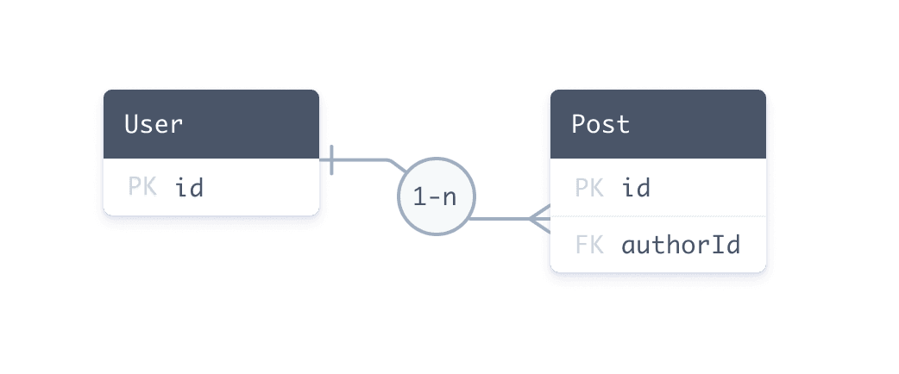
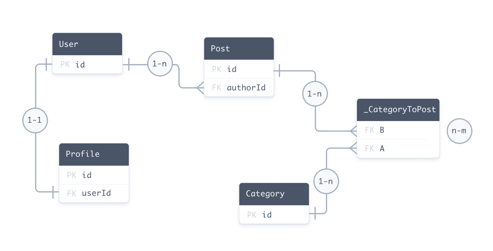

<TopBlock>

A relation is a _connection_ between two models in the Prisma schema. For example, there is a one-to-many relation between `User` and `Post` because one user can have many blog posts.

The following Prisma schema defines a one-to-many relation between the `User` and `Post` models. The fields involved in defining the relation are highlighted:

<TabbedContent code>
<TabItem value="Relational databases">

```prisma highlight=3,8,9;normal
model User {
  id    Int    @id @default(autoincrement())
  //highlight-next-line
  posts Post[]
}

model Post {
  id       Int  @id @default(autoincrement())
  //highlight-start
  author   User @relation(fields: [authorId], references: [id])
  authorId Int // relation scalar field  (used in the `@relation` attribute above)
  //highlight-end

  title String
}
```

</TabItem>
<TabItem value="MongoDB">

```prisma highlight=3,8,9;normal
model User {
  id    String @id @default(auto()) @map("_id") @db.ObjectId
  //highlight-next-line
  posts Post[]
}

model Post {
  id       String @id @default(auto()) @map("_id") @db.ObjectId
  //highlight-start
  author   User   @relation(fields: [authorId], references: [id])
  authorId String @db.ObjectId // relation scalar field  (used in the `@relation` attribute above)
  //highlight-end

  title String
}
```

</TabItem>
</TabbedContent>

At a Prisma ORM level, the `User` / `Post` relation is made up of:

- Two [relation fields](#relation-fields): `author` and `posts`. Relation fields define connections between models at the Prisma ORM level and **do not exist in the database**. These fields are used to generate Prisma Client.
- The scalar `authorId` field, which is referenced by the `@relation` attribute. This field **does exist in the database** - it is the foreign key that connects `Post` and `User`.

At a Prisma ORM level, a connection between two models is **always** represented by a [relation field](#relation-fields) on **each side** of the relation.

<div class="videoWrapper">

<iframe
  width="560"
  height="315"
  src="https://www.youtube.com/embed/fpBYj55-zd8"
  frameborder="0"
  allow="accelerometer; autoplay; clipboard-write; encrypted-media; gyroscope; picture-in-picture"
  allowfullscreen
></iframe>

</div>

</TopBlock>

## Relations in the database

### Relational databases

The following entity relationship diagram defines the same one-to-many relation between the `User` and `Post` tables in a **relational database**:



In SQL, you use a _foreign key_ to create a relation between two tables. Foreign keys are stored on **one side** of the relation. Our example is made up of:

- A foreign key column in the `Post` table named `authorId`.
- A primary key column in the `User` table named `id`. The `authorId` column in the `Post` table references the `id` column in the `User` table.

In the Prisma schema, the foreign key / primary key relationship is represented by the `@relation` attribute on the `author` field:

```prisma
author     User        @relation(fields: [authorId], references: [id])
```

> **Note**: Relations in the Prisma schema represent relationships that exist between tables in the database. If the relationship does not exist in the database, it does not exist in the Prisma schema.

### MongoDB

For MongoDB, Prisma ORM currently uses a [normalized data model design](https://www.mongodb.com/docs/manual/data-modeling/), which means that documents reference each other by ID in a similar way to relational databases.

The following document represents a `User` (in the `User` collection):

```json
{ "_id": { "$oid": "60d5922d00581b8f0062e3a8" }, "name": "Ella" }
```

The following list of `Post` documents (in the `Post` collection) each have a `authorId` field which reference the same user:

```json
[
  {
    "_id": { "$oid": "60d5922e00581b8f0062e3a9" },
    "title": "How to make sushi",
    "authorId": { "$oid": "60d5922d00581b8f0062e3a8" }
  },
  {
    "_id": { "$oid": "60d5922e00581b8f0062e3aa" },
    "title": "How to re-install Windows",
    "authorId": { "$oid": "60d5922d00581b8f0062e3a8" }
  }
]
```

This data structure represents a one-to-many relation because multiple `Post` documents refer to the same `User` document.

#### `@db.ObjectId` on IDs and relation scalar fields

If your model's ID is an `ObjectId` (represented by a `String` field), you must add `@db.ObjectId` to the model's ID _and_ the relation scalar field on the other side of the relation:

```prisma highlight=3,9;normal
model User {
  id    String @id @default(auto()) @map("_id") @db.ObjectId
  //highlight-next-line
  posts Post[]
}

model Post {
  id       String @id @default(auto()) @map("_id") @db.ObjectId
  author   User   @relation(fields: [authorId], references: [id])
  //highlight-next-line
  authorId String @db.ObjectId // relation scalar field  (used in the `@relation` attribute above)

  title String
}
```

## Relations in Prisma Client

Prisma Client is generated from the Prisma schema. The following examples demonstrate how relations manifest when you use Prisma Client to get, create, and update records.

### Create a record and nested records

The following query creates a `User` record and two connected `Post` records:

```ts
const userAndPosts = await prisma.user.create({
  data: {
    posts: {
      create: [
        { title: 'Prisma Day 2020' }, // Populates authorId with user's id
        { title: 'How to write a Prisma schema' }, // Populates authorId with user's id
      ],
    },
  },
})
```

In the underlying database, this query:

1. Creates a `User` with an auto-generated `id` (for example, `20`)
2. Creates two new `Post` records and sets the `authorId` of both records to `20`

### Retrieve a record and include related records

The following query retrieves a `User` by `id` and includes any related `Post` records:

```ts
const getAuthor = await prisma.user.findUnique({
  where: {
    id: "20",
  },
  include: {
    //highlight-next-line 
    posts: true, // All posts where authorId == 20
  },
});
```

In the underlying database, this query:

1. Retrieves the `User` record with an `id` of `20`
2. Retrieves all `Post` records with an `authorId` of `20`

### Associate an existing record to another existing record

The following query associates an existing `Post` record with an existing `User` record:

```ts
const updateAuthor = await prisma.user.update({
  where: {
    id: 20,
  },
  data: {
    posts: {
      connect: {
        id: 4,
      },
    },
  },
})
```

In the underlying database, this query uses a [nested `connect` query](/orm/reference/prisma-client-reference#connect) to link the post with an `id` of 4 to the user with an `id` of 20. The query does this with the following steps:

- The query first looks for the user with an `id` of `20`.
- The query then sets the `authorID` foreign key to `20`. This links the post with an `id` of `4` to the user with an `id` of `20`.

In this query, the current value of `authorID` does not matter. The query changes `authorID` to `20`, no matter its current value.

## Types of relations

There are three different types (or [cardinalities](<https://en.wikipedia.org/wiki/Cardinality_(data_modeling)>)) of relations in Prisma ORM:

- [One-to-one](/orm/prisma-schema/data-model/relations/one-to-one-relations) (also called 1-1 relations)
- [One-to-many](/orm/prisma-schema/data-model/relations/one-to-many-relations) (also called 1-n relations)
- [Many-to-many](/orm/prisma-schema/data-model/relations/many-to-many-relations) (also called m-n relations)

The following Prisma schema includes every type of relation:

- one-to-one: `User` ↔ `Profile`
- one-to-many: `User` ↔ `Post`
- many-to-many: `Post` ↔ `Category`

<TabbedContent code>
<TabItem value="Relational databases">

```prisma
model User {
  id      Int      @id @default(autoincrement())
  posts   Post[]
  profile Profile?
}

model Profile {
  id     Int  @id @default(autoincrement())
  user   User @relation(fields: [userId], references: [id])
  userId Int  @unique // relation scalar field (used in the `@relation` attribute above)
}

model Post {
  id         Int        @id @default(autoincrement())
  author     User       @relation(fields: [authorId], references: [id])
  authorId   Int // relation scalar field  (used in the `@relation` attribute above)
  categories Category[]
}

model Category {
  id    Int    @id @default(autoincrement())
  posts Post[]
}
```

</TabItem>
<TabItem value="MongoDB">

```prisma
model User {
  id      String   @id @default(auto()) @map("_id") @db.ObjectId
  posts   Post[]
  profile Profile?
}

model Profile {
  id     String @id @default(auto()) @map("_id") @db.ObjectId
  user   User   @relation(fields: [userId], references: [id])
  userId String @unique @db.ObjectId // relation scalar field (used in the `@relation` attribute above)
}

model Post {
  id          String     @id @default(auto()) @map("_id") @db.ObjectId
  author      User       @relation(fields: [authorId], references: [id])
  authorId    String     @db.ObjectId // relation scalar field  (used in the `@relation` attribute above)
  categories  Category[] @relation(fields: [categoryIds], references: [id])
  categoryIds String[]   @db.ObjectId
}

model Category {
  id      String   @id @default(auto()) @map("_id") @db.ObjectId
  posts   Post[]   @relation(fields: [postIds], references: [id])
  postIds String[] @db.ObjectId
}
```

</TabItem>
</TabbedContent>

:::info

This schema is the same as the [example data model](/orm/prisma-schema/data-model/models) but has all [scalar fields](/orm/prisma-schema/data-model/models#scalar-fields) removed (except for the required [relation scalar fields](/orm/prisma-schema/data-model/relations#relation-scalar-fields)) so you can focus on the [relation fields](#relation-fields).

:::

:::info

This example uses [implicit many-to-many relations](/orm/prisma-schema/data-model/relations/many-to-many-relations#implicit-many-to-many-relations). These relations do not require the `@relation` attribute unless you need to [disambiguate relations](#disambiguating-relations).

:::

Notice that the syntax is slightly different between relational databases and MongoDB - particularly for [many-to-many relations](/orm/prisma-schema/data-model/relations/many-to-many-relations).

For relational databases, the following entity relationship diagram represents the database that corresponds to the sample Prisma schema:



For MongoDB, Prisma ORM uses a [normalized data model design](https://www.mongodb.com/docs/manual/data-modeling/), which means that documents reference each other by ID in a similar way to relational databases. See [the MongoDB section](#mongodb) for more details.

### Implicit and explicit many-to-many relations

Many-to-many relations in relational databases can be modelled in two ways:

- [explicit many-to-many relations](/orm/prisma-schema/data-model/relations/many-to-many-relations#explicit-many-to-many-relations), where the relation table is represented as an explicit model in your Prisma schema
- [implicit many-to-many relations](/orm/prisma-schema/data-model/relations/many-to-many-relations#implicit-many-to-many-relations), where Prisma ORM manages the relation table and it does not appear in the Prisma schema.

Implicit many-to-many relations require both models to have a single `@id`. Be aware of the following:

- You cannot use a [multi-field ID](/orm/reference/prisma-schema-reference#id-1)
- You cannot use a `@unique` in place of an `@id`

To use either of these features, you must set up an explicit many-to-many instead.

The implicit many-to-many relation still manifests in a relation table in the underlying database. However, Prisma ORM manages this relation table.

If you use an implicit many-to-many relation instead of an explicit one, it makes the [Prisma Client API](/orm/prisma-client) simpler (because, for example, you have one fewer level of nesting inside of [nested writes](/orm/prisma-client/queries/relation-queries#nested-writes)).

If you're not using Prisma Migrate but obtain your data model from [introspection](/orm/prisma-schema/introspection), you can still make use of implicit many-to-many relations by following Prisma ORM's [conventions for relation tables](/orm/prisma-schema/data-model/relations/many-to-many-relations#conventions-for-relation-tables-in-implicit-m-n-relations).

## Relation fields

Relation [fields](/orm/prisma-schema/data-model/models#defining-fields) are fields on a Prisma [model](/orm/prisma-schema/data-model/models#defining-models) that do _not_ have a [scalar type](/orm/prisma-schema/data-model/models#scalar-fields). Instead, their type is another model.

Every relation must have exactly two relation fields, one on each model. In the case of one-to-one and one-to-many relations, an additional _relation scalar field_ is required which gets linked by one of the two relation fields in the `@relation` attribute. This relation scalar field is the direct representation of the _foreign key_ in the underlying database.

<TabbedContent code>

<TabItem value="Relational databases">

```prisma
model User {
  id    Int    @id @default(autoincrement())
  email String @unique
  role  Role   @default(USER)
  posts Post[] // relation field (defined only at the Prisma ORM level)
}

model Post {
  id       Int    @id @default(autoincrement())
  title    String
  author   User   @relation(fields: [authorId], references: [id]) // relation field (uses the relation scalar field `authorId` below)
  authorId Int // relation scalar field (used in the `@relation` attribute above)
}
```

</TabItem>
<TabItem value="MongoDB">

```prisma
model User {
  id    String @id @default(auto()) @map("_id") @db.ObjectId
  email String @unique
  role  Role   @default(USER)
  posts Post[] // relation field (defined only at the Prisma ORM level)
}

model Post {
  id       String @id @default(auto()) @map("_id") @db.ObjectId
  title    String
  author   User   @relation(fields: [authorId], references: [id]) // relation field (uses the relation scalar field `authorId` below)
  authorId String @db.ObjectId // relation scalar field (used in the `@relation` attribute above)
}
```

</TabItem>
</TabbedContent>

Both `posts` and `author` are relation fields because their types are not scalar types but other models.

Also note that the [annotated relation field](#annotated-relation-fields) `author` needs to link the relation scalar field `authorId` on the `Post` model inside the `@relation` attribute. The relation scalar field represents the foreign key in the underlying database.

Both the relation fields (i.e. `posts` and `author`) are defined purely on a Prisma ORM-level, they don't manifest in the database.

### Annotated relation fields

Relations that require one side of the relation to be _annotated_ with the `@relation` attribute are referred to as _annotated relation fields_. This includes:

- one-to-one relations
- one-to-many relations
- many-to-many relations for MongoDB only

The side of the relation which is annotated with the `@relation` attribute represents the side that **stores the foreign key in the underlying database**. The "actual" field that represents the foreign key is required on that side of the relation as well, it's called _relation scalar field_, and is referenced inside `@relation` attribute:

<TabbedContent code>
<TabItem value="Relational databases">

```prisma
author     User    @relation(fields: [authorId], references: [id])
authorId   Int
```

</TabItem>
<TabItem value="MongoDB">

```prisma
author     User    @relation(fields: [authorId], references: [id])
authorId   String  @db.ObjectId
```

</TabItem>
</TabbedContent>

A scalar field _becomes_ a relation scalar field when it's used in the `fields` of a `@relation` attribute.

### Relation scalar fields

#### Relation scalar field naming conventions

Because a relation scalar field always _belongs_ to a relation field, the following naming convention is common:

- Relation field: `author`
- Relation scalar field: `authorId` (relation field name + `Id`)

## The `@relation` attribute

The [`@relation`](/orm/reference/prisma-schema-reference#relation) attribute can only be applied to the [relation fields](#relation-fields), not to [scalar fields](/orm/prisma-schema/data-model/models#scalar-fields).

The `@relation` attribute is required when:

- you define a one-to-one or one-to-many relation, it is required on _one side_ of the relation (with the corresponding relation scalar field)
- you need to disambiguate a relation (that's e.g. the case when you have two relations between the same models)
- you define a [self-relation](/orm/prisma-schema/data-model/relations/self-relations)
- you define [a many-to-many relation for MongoDB](/orm/prisma-schema/data-model/relations/many-to-many-relations#mongodb)
- you need to control how the relation table is represented in the underlying database (e.g. use a specific name for a relation table)

> **Note**: [Implicit many-to-many relations](/orm/prisma-schema/data-model/relations/many-to-many-relations#implicit-many-to-many-relations) in relational databases do not require the `@relation` attribute.

## Disambiguating relations

When you define two relations between the same two models, you need to add the `name` argument in the `@relation` attribute to disambiguate them. As an example for why that's needed, consider the following models:

<TabbedContent code>
<TabItem value="Relational databases">

```prisma highlight=6,7,13,15;normal no-copy
// NOTE: This schema is intentionally incorrect. See below for a working solution.

model User {
  id           Int     @id @default(autoincrement())
  name         String?
  //highlight-start
  writtenPosts Post[]
  pinnedPost   Post?
  //highlight-end
}

model Post {
  id         Int     @id @default(autoincrement())
  title      String?
  //highlight-next-line
  author     User    @relation(fields: [authorId], references: [id])
  authorId   Int
  //highlight-next-line
  pinnedBy   User?   @relation(fields: [pinnedById], references: [id])
  pinnedById Int?
}
```

</TabItem>
<TabItem value="MongoDB">

```prisma highlight=6,7,13,15;normal no-copy
// NOTE: This schema is intentionally incorrect. See below for a working solution.

model User {
  id           String  @id @default(auto()) @map("_id") @db.ObjectId
  name         String?
  //highlight-start
  writtenPosts Post[]
  pinnedPost   Post?
  //highlight-end
}

model Post {
  id         String  @id @default(auto()) @map("_id") @db.ObjectId
  title      String?
  //highlight-next-line
  author     User    @relation(fields: [authorId], references: [id])
  authorId   String  @db.ObjectId
  //highlight-next-line
  pinnedBy   User?   @relation(fields: [pinnedById], references: [id])
  pinnedById String? @db.ObjectId
}
```

</TabItem>
</TabbedContent>

In that case, the relations are ambiguous, there are four different ways to interpret them:

- `User.writtenPosts` ↔ `Post.author` + `Post.authorId`
- `User.writtenPosts` ↔ `Post.pinnedBy` + `Post.pinnedById`
- `User.pinnedPost` ↔ `Post.author` + `Post.authorId`
- `User.pinnedPost` ↔ `Post.pinnedBy` + `Post.pinnedById`

To disambiguate these relations, you need to annotate the relation fields with the `@relation` attribute and provide the `name` argument. You can set any `name` (except for the empty string `""`), but it must be the same on both sides of the relation:

<TabbedContent code>
<TabItem value="Relational databases">

```prisma highlight=4,5,11,13;normal
model User {
  id           Int     @id @default(autoincrement())
  name         String?
  //highlight-start
  writtenPosts Post[]  @relation("WrittenPosts")
  pinnedPost   Post?   @relation("PinnedPost")
  //highlight-end
}

model Post {
  id         Int     @id @default(autoincrement())
  title      String?
  //highlight-next-line
  author     User    @relation("WrittenPosts", fields: [authorId], references: [id])
  authorId   Int
  //highlight-next-line
  pinnedBy   User?   @relation("PinnedPost", fields: [pinnedById], references: [id])
  pinnedById Int?    @unique
}
```

</TabItem>
<TabItem value="MongoDB">

```prisma highlight=4,5,11,13;normal
model User {
  id           String  @id @default(auto()) @map("_id") @db.ObjectId
  name         String?
  //highlight-start
  writtenPosts Post[]  @relation("WrittenPosts")
  pinnedPost   Post?   @relation("PinnedPost")
  //highlight-end
}

model Post {
  id         String  @id @default(auto()) @map("_id") @db.ObjectId
  title      String?
  //highlight-next-line
  author     User    @relation("WrittenPosts", fields: [authorId], references: [id])
  authorId   String  @db.ObjectId
  //highlight-next-line
  pinnedBy   User?   @relation("PinnedPost", fields: [pinnedById], references: [id])
  pinnedById String? @unique @db.ObjectId
}
```

</TabItem>
</TabbedContent>
 
