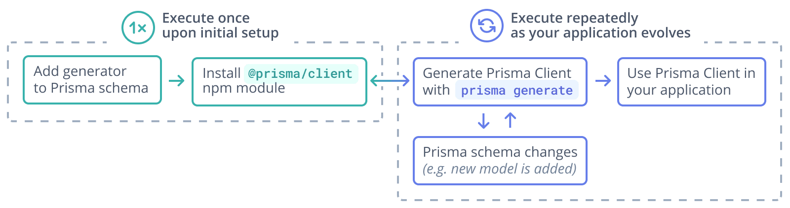
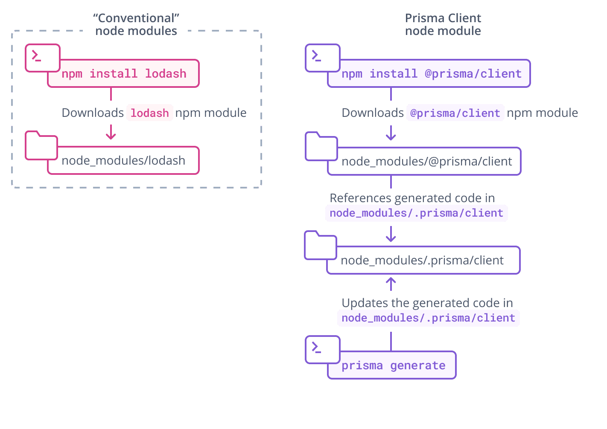

Prisma Client is a generated database client that's tailored to your database schema. By default, Prisma Client is generated into the `node_modules/.prisma/client` folder, but we highly recommend [you specify an output location](#using-a-custom-output-path).

:::warning

In Prisma ORM 7, Prisma Client will no longer be generated in `node_modules` by default and will require an output path to be defined. [Learn more below on how to define an output path](#using-a-custom-output-path).

:::

:::tip Use Prisma ORM without Rust binaries

If Prisma ORM's Rust engine binaries cause large bundle sizes, slow builds, or deployment issues (for example, in serverless or edge environments), you can use it without them using this configuration of your `generator` block:

```prisma
generator client {
  provider   = "prisma-client"
  output     = "./generated"
  engineType = "client"
}
``` 

Prisma ORM without Rust binaries has been [Generally Available](/orm/more/releases#generally-available-ga) since [v6.16.0](https://pris.ly/release/6.16.0).

Note that you need to use a [driver adapter](/orm/overview/databases/database-drivers#driver-adapters) in this case.

When using this architecture:

- No Rust query engine binary is downloaded or shipped.
- The database connection pool is maintained by the native JS database driver you install (e.g., `@prisma/adapter-pg` for PostgreSQL).

This setup can simplify deployments in serverless or edge runtimes. Learn more in the [docs here](/orm/prisma-client/setup-and-configuration/no-rust-engine). 

:::


To generate and instantiate Prisma Client:

1. Ensure that you have [Prisma CLI installed on your machine](/orm/tools/prisma-cli#installation).

   ```terminal
   npm install prisma --save-dev
   ```

1. Add the following `generator` definition to your Prisma schema:

   ```prisma
   generator client {
     provider = "prisma-client"
     output   = "./generated"
   }
   ```

   :::note

   Feel free to customize the output location to match your application. Common directories are `prisma`, `src`, or even the root of your project.

   :::

1. Install the `@prisma/client` npm package:

   ```terminal
   npm install @prisma/client
   ```

1. Generate Prisma Client with the following command:

   ```terminal
   npx prisma generate
   ```

1. You can now [instantiate Prisma Client](/orm/prisma-client/setup-and-configuration/instantiate-prisma-client) in your code:

    ```ts
    import { PrismaClient } from './prisma/generated/client'
    const prisma = new PrismaClient()
    // use `prisma` in your application to read and write data in your DB
    ```

> **Important**: You need to re-run the `prisma generate` command after every change that's made to your Prisma schema to update the generated Prisma Client code.

Here is a graphical illustration of the typical workflow for generation of Prisma Client:



## The location of Prisma Client

:::warning

We strongly recommend you define a custom `output` path. In Prisma ORM version `6.6.0`, not defining an `output` path will result in a warning. In Prisma ORM 7, the field will be required.

:::

### Using a custom `output` path

You can also specify a custom `output` path on the `generator` configuration, for example (assuming your `schema.prisma` file is located at the default `prisma` subfolder):

```prisma
generator client {
  provider = "prisma-client"
  output   = "../src/generated/"
}
```

After running `prisma generate` for that schema file, the Prisma Client package will be located in:

```
./src/generated/client
```

To import the `PrismaClient` from a custom location (for example, from a file named `./src/script.ts`):

```ts
import { PrismaClient } from './generated/client'
```

:::note 


For improved compatibility with ECMAScript modules (ESM) and to ensure consistent behaviour of Prisma ORM across different Node.js runtimes, you can also use the newer [`prisma-client`](/orm/prisma-schema/overview/generators#prisma-client) generator. This generator is specifically designed to handle common challenges with module resolution and runtime variations, providing a smoother integration experience and less friction with bundlers.

:::

## Loading environment variables

To load environment variables in your Prisma application, you can use the `prisma.config.ts` file along with the `env` helper from `prisma/config`. This approach provides better type safety and configuration management.

1. First, install the required dependency:

   ```bash
   npm install dotenv --save-dev
   ```

2. Create a `.env` file in your project root (if it doesn't exist) and add your database connection string:

   ```env
   DATABASE_URL="your_database_connection_string_here"
   ```

3. Update your `prisma.config.ts` file in your project root:

   ```ts
   import "dotenv/config";
   import { defineConfig, env } from "prisma/config";

   export default defineConfig({
      schema: "prisma/schema.prisma",
      migrations: {
        path: "prisma/migrations"
      },
      datasource: {
         url: env("DATABASE_URL"),
      },
   });
   ```

## The `@prisma/client` npm package

The `@prisma/client` npm package consists of two key parts:

- The `@prisma/client` module itself, which only changes when you re-install the package
- The `.prisma/client` folder, which is the [default location](#using-a-custom-output-path) for the unique Prisma Client generated from your schema

`@prisma/client/index.d.ts` exports `.prisma/client`:

```ts
export * from '.prisma/client'
```

This means that you still import `@prisma/client` in your own `.ts` files:

```ts
import { PrismaClient } from '@prisma/client'
```

Prisma Client is generated from your Prisma schema and is unique to your project. Each time you change the schema (for example, by performing a [schema migration](/orm/prisma-migrate)) and run `prisma generate`, Prisma Client's code changes:



The `.prisma` folder is unaffected by [pruning](https://docs.npmjs.com/cli/prune.html) in Node.js package managers.