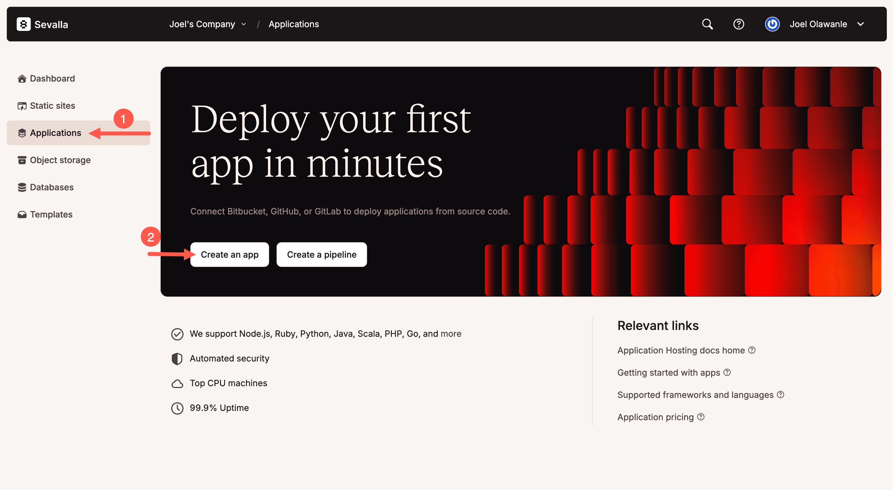
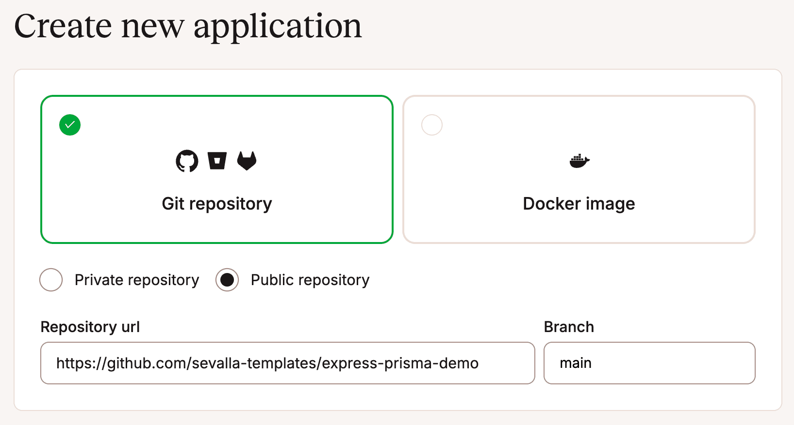
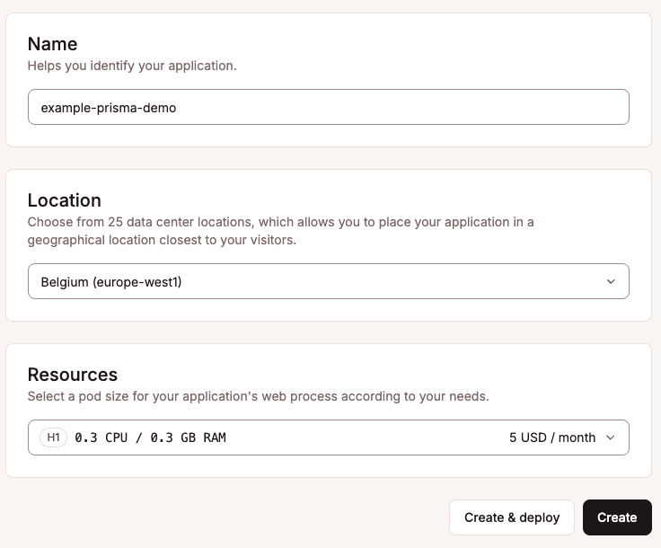
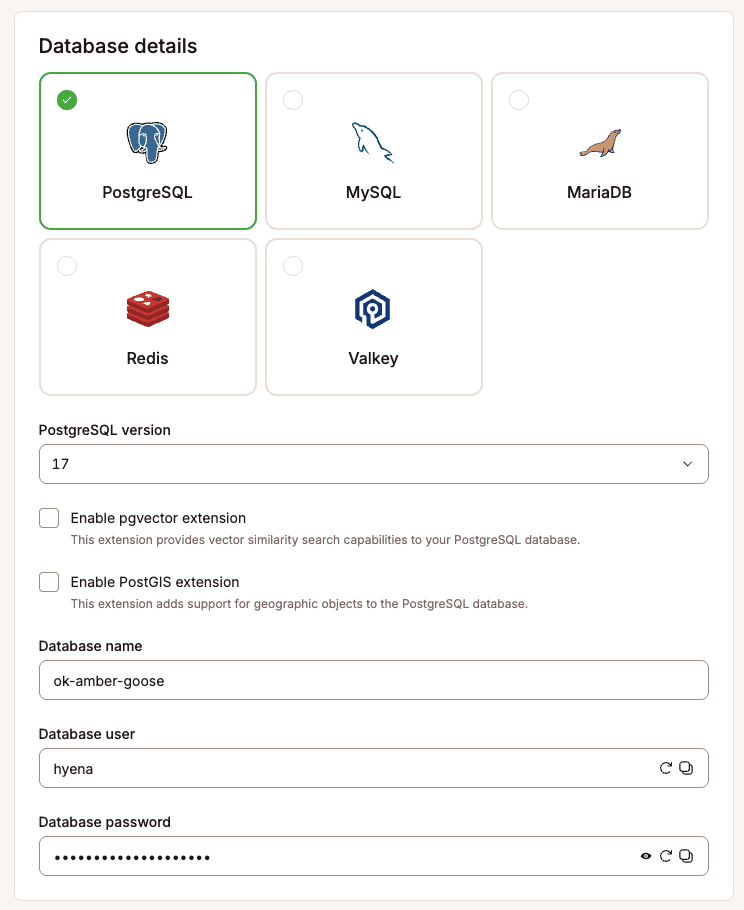
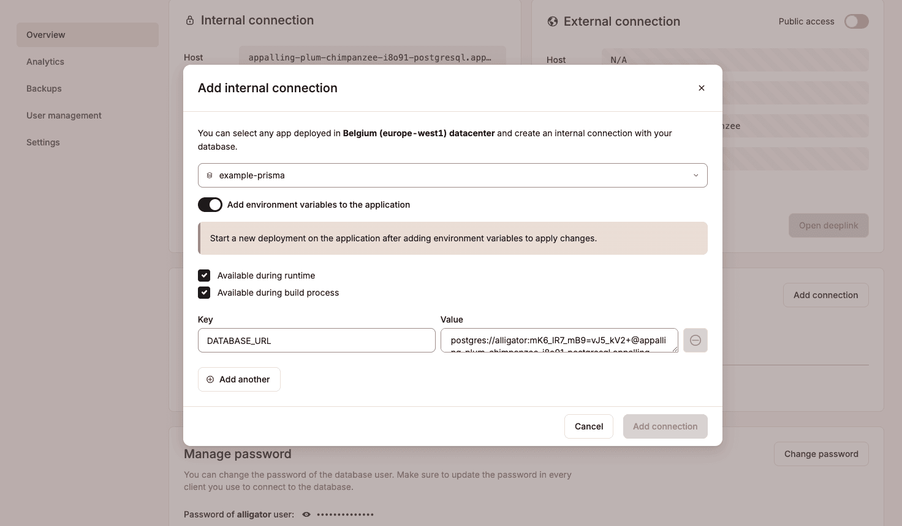

This guide explains how to deploy a Node.js server that uses Prisma ORM and PostgreSQL to [Sevalla](https://sevalla.com). The app exposes a REST API and uses Prisma Client to query a PostgreSQL database. Both the app and database will be hosted on Sevalla.

Sevalla is a developer-focused PaaS platform designed to simplify application and server deployment. You can easily host your applications, databases, object storage and static sites.

It supports Git-based deployments, Dockerfiles, and Procfiles and runs on Google Kubernetes Engine with global delivery via Cloudflare.

For this example, it's helpful to know:

* Sevalla supports long-running “serverful” applications with built-in autoscaling and flexible pod sizes.  
* Git-based deployments are integrated with GitHub, GitLab, and Bitbucket.  
* PostgreSQL, MySQL, MariaDB, Redis, and Valkey databases are natively supported.  
* Applications and databases can be securely connected through private networking with automatic environment variable injection.

## Prerequisites

To get started, all you need is:

* A [Sevalla account](https://sevalla.com) (comes with $50 in free credits)  
* A GitHub repository with your application code.

> **Note:** If you don't have a project ready, you can use our [example Prisma project](https://github.com/sevalla-templates/express-prisma-demo). It's a simple Express.js application that uses Prisma ORM and includes a REST API, a frontend for testing endpoints, a defined Prisma schema with migrations, and an optional database seeding script.

## Create an app on Sevalla

First, create a new application on your Sevalla dashboard. Click **Applications** on the sidebar and then click the **Create an app** button, as shown below.



Next, select your Git repository. Sevalla supports deploying from both private and public repositories. If you're using our example project, there's no need to fork — simply enter the URL `https://github.com/sevalla-templates/express-prisma-demo`.



Choose the appropriate branch (usually `main` or `master`), set your application's name, select the desired deployment region, and pick your pod size. (You can start with 0.5 CPU / 1GB RAM using your free credits)



Click **Create**, but skip the deploy step for now, so it does not fail since we have not added the database.

## Set up the database on Sevalla

On your Sevalla dashboard, click **Databases** \> **Add database**. Select **PostgreSQL** (or your preferred configured database type), and then provide a database name, username, and password, or simply use the default generated details.



Next, give the database a recognizable name for easy identification within your Sevalla dashboard. Ensure you select the **same region** as your application, choose an appropriate database size, and click **Create**.

Once your database has been created, scroll down to the **Connected Applications** section and click **Add Connection**.

Select the application you created previously and enable "Add environment variables". Make sure the variable name is set to `DATABASE_URL` (if it defaults to `DB_URL`, change it accordingly).



Finally, click **Add connection**. This securely links your application to your database and configures the necessary environment variable.

## Trigger deployment

Now that your application and database are connected, return to your application's **Deployment** tab and click **Deploy**.

> **Note:** Sevalla automatically builds your application using Nixpacks, detecting your project's `package.json` and `start` script. If you'd rather use a Dockerfile or Buildpacks, navigate to **Settings** \> **Build**, and click **Update Settings** under the **Build environment** section to customize your build method.

## Seed the database (optional)

If your project includes a seed script (typically located at `prisma/seed.js`), you can populate your database with initial or demo data after deploying your application.

To do this, navigate to your application's **Web Terminal** (under **Applications** \> **\[Your App\]** \> **Web Terminal**) and run the following command:

```shell
npx prisma db seed
```

This is what the web terminal looks like:


Once this is done, you can manage and interact with your database directly via Sevalla's built-in interactive studio. As shown below, we can see the seeded data:


Congratulations\! You've successfully deployed a Node.js application using Prisma ORM to Sevalla. Your app and database are now connected, secure, and production-ready\!