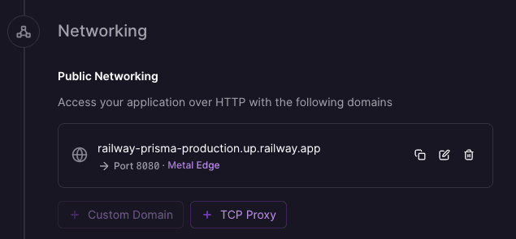

This guide explains how to deploy an app that uses Prisma ORM and Prisma Postgres to [Railway](https://railway.com?utm_medium=integration&utm_source=docs&utm_campaign=prisma). The app exposes a REST API and uses Prisma Client to query a Prisma Postgres database. Your app will run on Railway and connect to a managed Prisma Postgres database.

Railway is a deployment platform that simplifies the software development lifecycle with instant deployments, built-in observability, and effortless scaling. It supports code repositories and container images from popular registries. Railway handles configuration management, environment variables, and provides private networking between services.

To get a pre-wired Next.js Project with Prisma ORM, Prisma Postgres, and Railway, use the [Official Prisma Railway Template](https://railway.com/deploy/prisma-postgres?utm_medium=integration&utm_source=docs&utm_campaign=prisma).

This template automates the provisioning and setup of a Prisma Postgres database, linking it directly to your Next.js application upon deployment, making the entire project ready with just one click.

## Prerequisites

To get started, all you need is:

* A [Railway account](https://railway.com?utm_medium=integration&utm_source=docs&utm_campaign=prisma)
* A GitHub repository with your application code.

:::note
If you don't have a project ready, you can use our [example Prisma project](https://github.com/prisma/prisma-examples/tree/latest/deployment-platforms/railway). It's a simple Hono application that uses Prisma ORM and includes a REST API, a frontend for testing endpoints, and a defined Prisma schema with migrations.
:::

## Deploy your application

### 1. Create a new Railway project

1. Go to the [Railway dashboard](https://railway.com/dashboard?utm_medium=integration&utm_source=docs&utm_campaign=prisma)
2. Click **Create a New Project**
3. Select **GitHub Repo**
4. Click **Configure GitHub App** and authorize Railway
5. Select your repository

Your application is now deploying to Railway, but it won't properly run without a database connection.

In the next section, you'll configure a database and set the `DATABASE_URL` environment variable in Railway.

## Configure your database

### 1. Get your database connection string

You'll need a Prisma Postgres connection string. There are two ways to obtain one:

- Create a new database on [Prisma Data Platform](https://console.prisma.io)
- Run `npx create-db` for a temporary database _(no account required)_

### 2. Add the database URL to Railway

1. In your Railway project, open your service
2. Go to the **Variables** tab
3. Click **New Variable**
4. Set the name to `DATABASE_URL`
5. Paste your database connection string as the value
6. Click **Deploy** to redeploy your application with the new environment variable

### 3. Access your application

Once the deployment completes with the database URL configured:

1. Navigate to the **Settings** tab
2. Under **Networking**, click **Generate Domain**
3. Your application will be available at the generated URL

Go to the generated URL and you'll see your deployed app!

If you used the example project, you should see three api endpoints already set up:
- Check API status (`/api`)
- Load feed (`/api/feed`)
- Seed data (`/api/seed`)

If you see any errors:
- Wait a minute and refresh
- Ensure `DATABASE_URL` is set
- Check the service logs
- Redeploy

To learn more about the various features Railway offers for your application, visit the [Railway documentation](https://docs.railway.app?utm_medium=integration&utm_source=docs&utm_campaign=prisma).