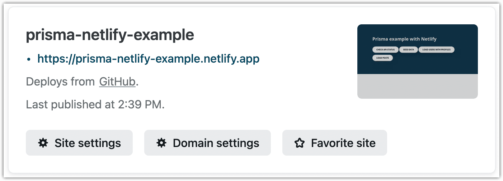
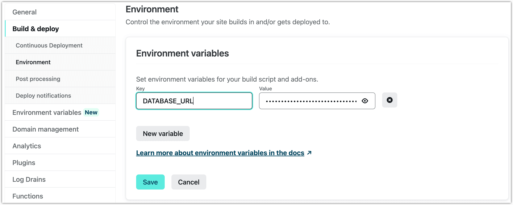

<TopBlock>

This guide covers the steps you will need to take in order to deploy your application that uses Prisma to [Netlify](https://www.netlify.com/).

Netlify is a cloud platform for continuous deployment, static sites, and serverless functions. Netlify integrates seamlessly with GitHub for automatic deployments upon commits. When you follow the steps below, you will use that approach to create a CI/CD pipeline that deploys your application from a GitHub repository.

</TopBlock>

## Prerequisites

Before you can follow this guide, you will need to set up your application to begin deploying to Netlify. We recommend the ["Get started with Netlify"](https://docs.netlify.com/get-started/) guide for a quick overview and ["Deploy functions"](https://docs.netlify.com/functions/deploy/?fn-language=ts) for an in-depth look at your deployment options.

## Binary targets in <inlinecode>schema.prisma</inlinecode>

Since your code is being deployed to Netlify's environment, which isn't necessarily the same as your development environment, you will need to set [`binaryTargets`](/orm/reference/prisma-schema-reference#binarytargets-options) in order to download the query engine that is compatible with the Netlify runtime during your build step. If you do not set this option, your deployed code will have an incorrect query engine deployed with it and will not function.

You should update your Prisma schema to contain the following in the `generator` block:

```prisma
binaryTargets = ["native", "rhel-openssl-1.0.x"]
```

## Store environment variables in Netlify

We recommend keeping `.env` files in your `.gitignore` in order to prevent leakage of sensitives connection strings. Instead, you can use the Netlify CLI to [import values into netlify directly](https://docs.netlify.com/environment-variables/get-started/#import-variables-with-the-netlify-cli).

Assuming you have a file like the following:

```env file=.env
# Connect to DB
DATABASE_URL="postgresql://postgres:__PASSWORD__@__HOST__:__PORT__/__DB_NAME__"
```

You can upload the file as environment variables using the `env:import` command

```terminal no-break-terminal
❯ netlify env:import .env
site: my-very-very-cool-site
---------------------------------------------------------------------------------.
                         Imported environment variables                          |
---------------------------------------------------------------------------------|
     Key      |                              Value                               |
--------------|------------------------------------------------------------------|
 DATABASE_URL | postgresql://postgres:__PASSWORD__@__HOST__:__PORT__/__DB_NAME__ |
---------------------------------------------------------------------------------'
```

<details>
<summary>If you are not using an <inlinecode>.env</inlinecode> file</summary>

If you are storing your database connection string and other environment variables in a different method, you will need to manually upload your environment variables to Netlify. These options are [discussed in Netlfiy's documentation](https://docs.netlify.com/environment-variables/get-started/) and one method, uploading via the UI, is described below.

1. Open the Netlify admin UI for the site. You can use Netlify CLI as follows:
   ```terminal
   netlify open --admin
   ```
2. Click **Site settings**:
   
3. Navigate to **Build & deploy** in the sidebar on the left and select **Environment**.
4. Click **Edit variables** and create a variable with the key `DATABASE_URL` and set its value to your database connection string.
   
5. Click **Save**.

</details>

Now start a new Netlify build and deployment so that the new build can use the newly uploaded environment variables.

```terminal no-copy
netlify deploy
```

You can now test the deployed application.

## Connection pooling

When you use a Function-as-a-Service provider, like Netlify, it is beneficial to pool database connections for performance reasons. This is because every function invocation may result in a new connection to your database which can quickly run out of open connections.

You can use [Accelerate](/accelerate) for connection pooling, to reduce your Prisma Client bundle size, and to avoid cold starts.

For more information on connection management for serverless environments, refer to our [connection management guide](/orm/prisma-client/setup-and-configuration/databases-connections#serverless-environments-faas).
