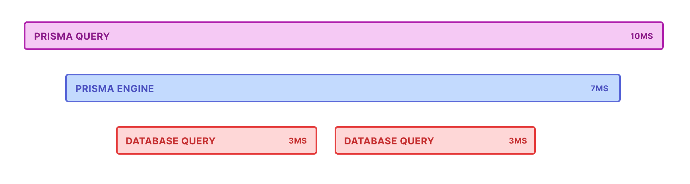
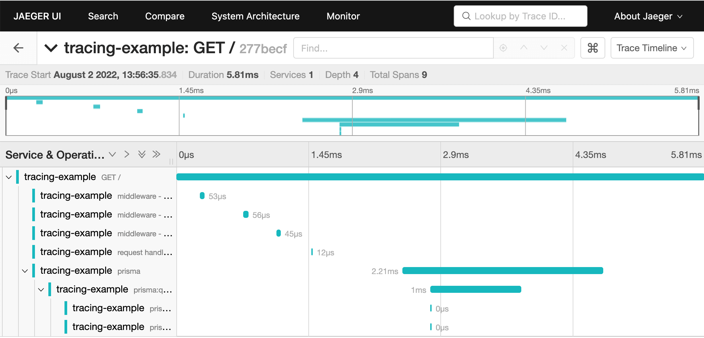

Tracing provides a detailed log of the activity that Prisma Client carries out, at an operation level, including the time taken to execute each query. It helps you analyze your application's performance and identify bottlenecks. Tracing is fully compliant with [OpenTelemetry](https://opentelemetry.io/), so you can use it as part of your end-to-end application tracing system.

:::info

Tracing gives you a highly detailed, operation-level insight into your Prisma ORM project.

:::

:::tip Correlate database queries with traces

You can add the `traceparent` header to your SQL queries as comments using the [`@prisma/sqlcommenter-trace-context`](/orm/prisma-client/observability-and-logging/sql-comments#trace-context) plugin. This enables correlation between distributed traces and database queries in your monitoring tools.

:::


## About tracing

When you enable tracing, Prisma Client outputs the following:

- One trace for each operation (e.g. findMany) that Prisma Client makes.
- In each trace, one or more [spans](https://opentelemetry.io/docs/specs/otel/trace/api/#span). Each span represents the length of time that one stage of the operation takes, such as serialization, or a database query. Spans are represented in a tree structure, where child spans indicate that execution is happening within a larger parent span.

The number and type of spans in a trace depends on the type of operation the trace covers, but an example is as follows:



You can [send tracing output to the console](#send-tracing-output-to-the-console), or analyze it in any OpenTelemetry-compatible tracing system, such as [Jaeger](https://www.jaegertracing.io/), [Honeycomb](https://www.honeycomb.io/distributed-tracing) and [Datadog](https://www.datadoghq.com/). On this page, we give an example of how to send tracing output to Jaeger, which you can [run locally](#visualize-traces-with-jaeger).

## Trace output

For each trace, Prisma Client outputs a series of spans. The number and type of these spans depends on the Prisma Client operation. A typical Prisma trace has the following spans:

- `prisma:client:operation`: Represents the entire Prisma Client operation, from Prisma Client to the database and back. It contains details such as the model and method called by Prisma Client. Depending on the Prisma operation, it contains one or more of the following spans:
  - `prisma:client:connect`: Represents how long it takes for Prisma Client to connect to the database.
  - `prisma:client:serialize`: Represents how long it takes to validate and transform a Prisma Client operation into a query for the [query engine](/orm/more/under-the-hood/engines).
  - `prisma:engine:query`: Represents how long a query takes in the query engine.
    - `prisma:engine:connection`: Represents how long it takes for Prisma Client to get a database connection.
    - `prisma:engine:db_query`: Represents the database query that was executed against the database. It includes the query in the tags, and how long the query took to run.
    - `prisma:engine:serialize`: Represents how long it takes to transform a raw response from the database into a typed result.
    - `prisma:engine:response_json_serialization`: Represents how long it takes to serialize the database query result into a JSON response to the Prisma Client.

For example, given the following Prisma Client code:

```ts
prisma.user.findMany({
  where: {
    email: email,
  },
  include: {
    posts: true,
  },
})
```

The trace is structured as follows:

- `prisma:client:operation`
  - `prisma:client:serialize`
  - `prisma:engine:query`
    - `prisma:engine:connection`
    - `prisma:engine:db_query`: details of the first SQL query or command...
    - `prisma:engine:db_query`: ...details of the next SQL query or command...
    - `prisma:engine:serialize`
    - `prisma:engine:response_json_serialization`

## Considerations and prerequisites

If your application sends a large number of spans to a [collector](https://opentelemetry.io/docs/collector/), this can have a significant performance impact. For information on how to minimize this impact, see [Reducing performance impact](#reduce-performance-impact).

To use tracing, you must do the following:

1. [Install the appropriate dependencies](#step-1-install-up-to-date-prisma-orm-dependencies).
1. [Install OpenTelemetry packages](#step-2-install-opentelemetry-packages).
1. [Register tracing in your application](#step-3-register-tracing-in-your-application).

## Get started with tracing in Prisma ORM

This section explains how to install and register tracing in your application.

### Step 1. Install up-to-date Prisma ORM dependencies

Use version `6.1.0` or later of the `prisma`, `@prisma/client`, and `@prisma/instrumentation` npm packages. You will also need to install the `@opentelemetry/api` package as it's a peer dependency.

```terminal
npm install prisma@latest --save-dev
npm install @prisma/client@latest --save
npm install @prisma/instrumentation@latest --save
npm install @opentelemetry/api@latest --save
```

<details>
<summary>Tracing on previous versions of Prisma ORM</summary>

Tracing was added in version `4.2.0` of Prisma ORM as a Preview feature. For versions of Prisma ORM between `4.2.0` and `6.1.0`, you need to enable the `tracing` Preview feature in your Prisma schema file.

```prisma
generator client {
  provider        = "prisma-client"
  output          = "./generated"
  previewFeatures = ["tracing"]
}
```

</details>

### Step 2: Install OpenTelemetry packages

Now install the appropriate OpenTelemetry packages, as follows:

```console
npm install @opentelemetry/semantic-conventions @opentelemetry/exporter-trace-otlp-http @opentelemetry/sdk-trace-base @opentelemetry/sdk-trace-node @opentelemetry/resources
```

### Step 3: Register tracing in your application

The following code provides two examples of configuring OpenTelemetry tracing in Prisma: 

1. Using `@opentelemetry/sdk-trace-node` (existing example), which gives fine-grained control over tracing setup.
2. Using `@opentelemetry/sdk-node`, which offers a simpler configuration and aligns with OpenTelemetry's JavaScript getting started guide.

---

#### Option 1: Using `@opentelemetry/sdk-trace-node`

This setup gives you fine-grained control over instrumentation and tracing. You need to customize this configuration for your specific application. This approach is concise and easier for users who need a quick setup for sending traces to OTLP-compatible backends, such as Honeycomb, Jaeger, or Datadog.

```ts
// Imports
import { ATTR_SERVICE_NAME, ATTR_SERVICE_VERSION } from '@opentelemetry/semantic-conventions'
import { OTLPTraceExporter } from '@opentelemetry/exporter-trace-otlp-http'
import { SimpleSpanProcessor } from '@opentelemetry/sdk-trace-base'
import { NodeTracerProvider } from '@opentelemetry/sdk-trace-node'
import { PrismaInstrumentation, registerInstrumentations } from '@prisma/instrumentation'
import { resourceFromAttributes } from '@opentelemetry/resources'

// Configure the trace provider
const provider = new NodeTracerProvider({
  resource: resourceFromAttributes({
    [ATTR_SERVICE_NAME]: 'example application', // Replace with your service name
    [ATTR_SERVICE_VERSION]: '0.0.1', // Replace with your service version
  }),
  spanProcessors: [
    // Configure how spans are processed and exported. In this case, we're sending spans
    // as we receive them to an OTLP-compatible collector (e.g., Jaeger).
    new SimpleSpanProcessor(new OTLPTraceExporter()),
  ],
});

// Register your auto-instrumentors
registerInstrumentations({
  tracerProvider: provider,
  instrumentations: [new PrismaInstrumentation()],
})

// Register the provider globally
provider.register()
```

This approach provides maximum flexibility but may involve additional configuration steps.

#### Option 2: Using `@opentelemetry/sdk-node`

For many users, especially beginners, the `NodeSDK` class simplifies OpenTelemetry setup by bundling common defaults into a single, unified configuration.

```ts
// Imports
import { OTLPTraceExporter } from '@opentelemetry/exporter-trace-otlp-proto'
import { NodeSDK } from '@opentelemetry/sdk-node'
import { PrismaInstrumentation } from '@prisma/instrumentation'

// Configure the OTLP trace exporter
const traceExporter = new OTLPTraceExporter({
  url: 'https://api.honeycomb.io/v1/traces', // Replace with your collector's endpoint
  headers: {
    'x-honeycomb-team': 'HONEYCOMB_API_KEY', // Replace with your Honeycomb API key or collector auth header
  },
})

// Initialize the NodeSDK
const sdk = new NodeSDK({
  serviceName: 'my-service-name', // Replace with your service name
  traceExporter,
  instrumentations: [
    new PrismaInstrumentation(),
  ],
})

// Start the SDK
sdk.start()

// Handle graceful shutdown
process.on('SIGTERM', async () => {
  try {
    await sdk.shutdown()
    console.log('Tracing shut down successfully')
  } catch (err) {
    console.error('Error shutting down tracing', err)
  } finally {
    process.exit(0)
  }
})
```

Choose the `NodeSDK` approach if:
- You are starting with OpenTelemetry and want a simplified setup.
- You need to quickly integrate tracing with minimal boilerplate.
- You are using an OTLP-compatible tracing backend like Honeycomb, Jaeger, or Datadog.

Choose the `NodeTracerProvider` approach if:
- You need detailed control over how spans are created, processed, and exported.
- You are using custom span processors or exporters.
- Your application requires specific instrumentation or sampling strategies.

OpenTelemetry is highly configurable. You can customize the resource attributes, what components gets instrumented, how spans are processed, and where spans are sent.

You can find a complete example that includes metrics in [this sample application](https://github.com/garrensmith/prisma-metrics-sample).

## Tracing how-tos

### Visualize traces with Jaeger

[Jaeger](https://www.jaegertracing.io/) is a free and open source OpenTelemetry collector and dashboard that you can use to visualize your traces.

The following screenshot shows an example trace visualization:



To run Jaeger locally, use the following [Docker](https://www.docker.com/) command:

```console
docker run --rm --name jaeger -d -e COLLECTOR_OTLP_ENABLED=true -p 16686:16686 -p 4318:4318 jaegertracing/all-in-one:latest
```

You'll now find the tracing dashboard available at `http://localhost:16686/`. When you use your application with tracing enabled, you'll start to see traces in this dashboard.

### Send tracing output to the console

The following example sends output tracing to the console with `ConsoleSpanExporter` from `@opentelemetry/sdk-trace-base`.

```ts
// Imports
import { ATTR_SERVICE_NAME, ATTR_SERVICE_VERSION } from '@opentelemetry/semantic-conventions';
import { ConsoleSpanExporter, SimpleSpanProcessor } from '@opentelemetry/sdk-trace-base';
import { NodeTracerProvider } from '@opentelemetry/sdk-trace-node';
import { AsyncHooksContextManager } from '@opentelemetry/context-async-hooks';
import * as api from '@opentelemetry/api';
import {
  PrismaInstrumentation,
  registerInstrumentations,
} from '@prisma/instrumentation';
import { resourceFromAttributes } from '@opentelemetry/resources';

// Export the tracing
export function otelSetup() {
  const contextManager = new AsyncHooksContextManager().enable();

  api.context.setGlobalContextManager(contextManager);

  //Configure the console exporter
  const consoleExporter = new ConsoleSpanExporter();

  // Configure the trace provider
  const provider = new NodeTracerProvider({
    resource: resourceFromAttributes({
      [ATTR_SERVICE_NAME]: 'example application', // Replace with your service name
      [ATTR_SERVICE_VERSION]: '0.0.1', // Replace with your service version
    }),
    spanProcessors: [
      // Configure how spans are processed and exported. In this case, we're sending spans
      // as we receive them to the console
      new SimpleSpanProcessor(consoleExporter),
    ],
  });

  // Register your auto-instrumentors
  registerInstrumentations({
    tracerProvider: provider,
    instrumentations: [new PrismaInstrumentation()],
  });

  // Register the provider
  provider.register();
}
```

### Trace interactive transactions

When you perform an interactive transaction, you'll see the following spans in addition to the [standard spans](#trace-output):

- `prisma:client:transaction`: A [root span](https://opentelemetry.io/docs/concepts/observability-primer/#distributed-traces) that wraps the `prisma` span.
  - `prisma:engine:itx_runner`: Represents how long an interactive transaction takes in the [query engine](/orm/more/under-the-hood/engines).
  - `prisma:engine:itx_query_builder`: Represents the time it takes to build an interactive transaction.

As an example, take the following Prisma schema:

```prisma file=schema.prisma showLineNumbers
generator client {
  provider        = "prisma-client"
  output          = "./generated"
}

datasource db {
  provider = "postgresql"
}

model User {
  id    Int    @id @default(autoincrement())
  email String @unique
}

model Audit {
  id     Int    @id
  table  String
  action String
}
```

Given the following interactive transaction:

```ts
await prisma.$transaction(async (tx) => {
  const user = await tx.user.create({
    data: {
      email: email,
    },
  })

  await tx.audit.create({
    data: {
      table: 'user',
      action: 'create',
      id: user.id,
    },
  })

  return user
})
```

The trace is structured as follows:

- `prisma:client:transaction`
- `prisma:client:connect`
- `prisma:engine:itx_runner`
  - `prisma:engine:connection`
  - `prisma:engine:db_query`
  - `prisma:engine:itx_query_builder`
    - `prisma:engine:db_query`
    - `prisma:engine:db_query`
    - `prisma:engine:serialize`
  - `prisma:engine:itx_query_builder`
    - `prisma:engine:db_query`
    - `prisma:engine:db_query`
    - `prisma:engine:serialize`
- `prisma:client:operation`
  - `prisma:client:serialize`
- `prisma:client:operation`
  - `prisma:client:serialize`

### Add more instrumentation

A nice benefit of OpenTelemetry is the ability to add more instrumentation with only minimal changes to your application code.

For example, to add HTTP and [ExpressJS](https://expressjs.com/) tracing, add the following instrumentations to your OpenTelemetry configuration. These instrumentations add spans for the full request-response lifecycle. These spans show you how long your HTTP requests take.

```js
// Imports
import { ExpressInstrumentation } from '@opentelemetry/instrumentation-express'
import { HttpInstrumentation } from '@opentelemetry/instrumentation-http'

// Register your auto-instrumentors
registerInstrumentations({
  tracerProvider: provider,
  instrumentations: [
    new HttpInstrumentation(),
    new ExpressInstrumentation(),
    new PrismaInstrumentation(),
  ],
})
```

For a full list of available instrumentation, take a look at the [OpenTelemetry Registry](https://opentelemetry.io/ecosystem/registry/?language=js&component=instrumentation).

### Customize resource attributes

You can adjust how your application's traces are grouped by changing the resource attributes to be more specific to your application:

```js
const provider = new NodeTracerProvider({
  resource: new Resource({
    [ATTR_SERVICE_NAME]: 'weblog',
    [ATTR_SERVICE_VERSION]: '1.0.0',
  }),
})
```

There is an ongoing effort to standardize common resource attributes. Whenever possible, it's a good idea to follow the [standard attribute names](https://github.com/open-telemetry/semantic-conventions/blob/main/docs/general/trace.md).

### Reduce performance impact

If your application sends a large number of spans to a collector, this can have a significant performance impact. You can use the following approaches to reduce this impact:

- [Use the BatchSpanProcessor](#send-traces-in-batches-using-the-batchspanprocessor)
- [Send fewer spans to the collector](#send-fewer-spans-to-the-collector-with-sampling)

#### Send traces in batches using the `BatchSpanProcessor`

In a production environment, you can use OpenTelemetry's `BatchSpanProcessor` to send the spans to a collector in batches rather than one at a time. However, during development and testing, you might not want to send spans in batches. In this situation, you might prefer to use the `SimpleSpanProcessor`.

You can configure your tracing configuration to use the appropriate span processor, depending on the environment, as follows:

```ts
import {
  SimpleSpanProcessor,
  BatchSpanProcessor,
} from '@opentelemetry/sdk-trace-base';
import { NodeTracerProvider } from '@opentelemetry/sdk-trace-node';

const spanProcessors = [];
if (process.env.NODE_ENV === 'production') {
  spanProcessors.push(new BatchSpanProcessor(otlpTraceExporter));
} else {
  spanProcessors.push(new SimpleSpanProcessor(otlpTraceExporter));
}

const provider = new NodeTracerProvider({
  spanProcessors,
  // ...other configurations
});
```

#### Send fewer spans to the collector with sampling

Another way to reduce the performance impact is to [use probability sampling](https://opentelemetry.io/docs/specs/otel/trace/tracestate-probability-sampling/) to send fewer spans to the collector. This reduces the collection cost of tracing but still gives a good representation of what is happening in your application.

An example implementation looks like this:

```ts highlight=3,7;add
import { ATTR_SERVICE_NAME, ATTR_SERVICE_VERSION } from '@opentelemetry/semantic-conventions';
import { NodeTracerProvider } from '@opentelemetry/sdk-trace-node';
import { TraceIdRatioBasedSampler } from '@opentelemetry/core';
import { resourceFromAttributes } from '@opentelemetry/resources';

const provider = new NodeTracerProvider({
  //add-next-line
  sampler: new TraceIdRatioBasedSampler(0.1),
  resource: resourceFromAttributes({
    // we can define some metadata about the trace resource
    [ATTR_SERVICE_NAME]: 'test-tracing-service',
    [ATTR_SERVICE_VERSION]: '1.0.0',
  }),
});

```

## Troubleshoot tracing

### My traces aren't showing up

The order in which you set up tracing matters. In your application, ensure that you register tracing and instrumentation before you import any instrumented dependencies. For example:

```ts
import { registerTracing } from './tracing'

registerTracing({
  name: 'tracing-example',
  version: '0.0.1',
})

// You must import any dependencies after you register tracing.
import { PrismaClient } from '../prisma/generated/client'
import async from 'express-async-handler'
import express from 'express'
```