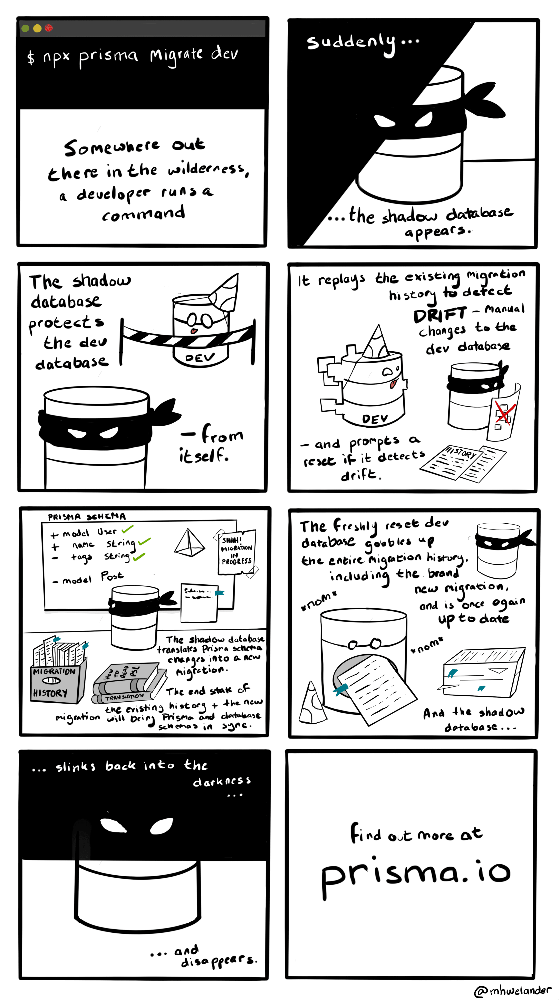

<TopBlock>

The shadow database is a second, _temporary_ database that is **created and deleted automatically**\* each time you run `prisma migrate dev` and is primarily used to **detect problems** such as schema drift or potential data loss of the generated migration.

[`migrate diff` command](/orm/reference/prisma-cli-reference#migrate-diff) also requires a shadow database when diffing against a local `migrations` directory with `--from-migrations` or `--to-migrations`.

* If your database does not allow creation and deleting of databases (e.g. in a cloud-hosted environment), you need to [create and configure the shadow database manually](#cloud-hosted-shadow-databases-must-be-created-manually).


:::warning

The shadow database is **not** required in production, and is not used by production-focused commands such as `prisma migrate resolve` and `prisma migrate deploy`.

:::

:::note

A shadow database is never used for MongoDB as `migrate dev` is not used there.

:::

</TopBlock>

## How the shadow database works

When you run `prisma migrate dev` to create a new migration, Prisma Migrate uses the shadow database to:

- [Detect schema drift](#detecting-schema-drift), which means checking that no **unexpected changes** have been made to the development database
- [Generate new migrations](#generating-new-migrations) and evaluate if those could lead to **data loss** when applied

<details>

<summary>🎨 Expand to see the shadow database explained as a cartoon.</summary>



</details>

### Detecting schema drift

To detect drift in development, Prisma Migrate:

1. Creates a fresh copy of the shadow database (or performs a soft reset if the shadow database is configured via [`shadowDatabaseUrl`](/orm/reference/prisma-schema-reference#datasource))
1. Reruns the **current**, existing migration history in the shadow database.
1. **Introspects** the shadow database to generate the 'current state' of your Prisma schema.
1. Compares the end state of the current migration history to the development database.
1. Reports **schema drift** if the end state of the current migration history (via the shadow database) does not match the development database (for example, due to a manual change)

If Prisma Migrate does not detect schema drift, it moves on to [generating new migrations](#generating-new-migrations).

> **Note**: The shadow database is not responsible for checking if a migration file has been **edited or deleted**. This is done using the `checksum` field in the `_prisma_migrations` table.

If Prisma Migrate detects schema drift, it outputs detailed information about which parts of the database have drifted. The following example output could be shown when the development database has been modified manually: The `Color` enum is missing the expected variant `RED` and includes the unexpected variant `TRANSPARENT`:

```
[*] Changed the `Color` enum
  [+] Added variant `TRANSPARENT`
  [-] Removed variant `RED`
```

### Generating new migrations

Assuming Prisma Migrate did not [detect schema drift](#detecting-schema-drift), it moves on to generating new migrations from Prisma schema changes. To generate new migrations, Prisma Migrate:

1. Calculates the target database schema as a function of the current Prisma schema.
1. Compares the end state of the existing migration history and the target schema, and generates steps to get from one to the other.
1. Renders these steps to a SQL string and saves it in the new migration file.
1. Evaluate data loss caused by the SQL and warns about that.
1. Applies the generated migration to the development database (assuming you have not specified the `--create-only` flag)
1. Drops the shadow database (shadow databases configured via [`shadowDatabaseUrl`](/orm/reference/prisma-schema-reference#datasource) are not dropped, but are reset at the start of the `migrate dev` command)

## Manually configuring the shadow database

In some cases it might make sense (e.g. when [creating and dropping databases is not allowed on cloud-hosted databases](#cloud-hosted-shadow-databases-must-be-created-manually)) to manually define the connection string and name of the database that should be used as the shadow database for `migrate dev`. In such a case you can:

1. Create a dedicated database that should be used as the shadow database
2. Add the connection string of that database your environment variable `SHADOW_DATABASE_URL` (or `.env` file)
3. In Prisma 7, configure the `shadowDatabaseUrl` field in `prisma.config.ts` under the `datasource` object. In Prisma 6 and below, add the `shadowDatabaseUrl` field to the `datasource` block in your `schema.prisma` file.

<TabbedContent code>
<TabItem value="Prisma 7 (prisma.config.ts)">

```ts
import "dotenv/config";
import { defineConfig, env } from "prisma/config";

export default defineConfig({
  schema: "prisma/schema.prisma",
  migrations: {
    path: "prisma/migrations",
  },
  datasource: {
    url: env("DATABASE_URL"),
    //highlight-next-line
    shadowDatabaseUrl: env("SHADOW_DATABASE_URL"),
  },
});
```

</TabItem>
<TabItem value="Prisma 6 and below (schema.prisma)">

```prisma
datasource db {
  provider          = "postgresql"
  //highlight-next-line
  shadowDatabaseUrl = env("SHADOW_DATABASE_URL")
}
```

</TabItem>
</TabbedContent>

> **Important**: Do not use the exact same values for `url` and `shadowDatabaseUrl` as that might delete all the data in your database.

## Cloud-hosted shadow databases must be created manually

Some cloud providers do not allow you to drop and create databases with SQL. Some require to create or drop the database via an online interface, and some really limit you to 1 database. If you **develop** in such a cloud-hosted environment, you must:

1. Create a dedicated cloud-hosted shadow database
2. Add the URL to your environment variable `SHADOW_DATABASE_URL`
3. In Prisma 7, configure the `shadowDatabaseUrl` field in `prisma.config.ts` under the `datasource` object. In Prisma 6 and below, add the `shadowDatabaseUrl` field to the `datasource` block in your `schema.prisma` file.

<TabbedContent code>
<TabItem value="Prisma 7 (prisma.config.ts)">

```ts
import "dotenv/config";
import { defineConfig, env } from "prisma/config";

export default defineConfig({
  schema: "prisma/schema.prisma",
  migrations: {
    path: "prisma/migrations",
  },
  datasource: {
    url: env("DATABASE_URL"),
    //highlight-next-line
    shadowDatabaseUrl: env("SHADOW_DATABASE_URL"),
  },
});
```

</TabItem>
<TabItem value="Prisma 6 and below (schema.prisma)">

```prisma
datasource db {
  provider          = "postgresql"
  //highlight-next-line
  shadowDatabaseUrl = env("SHADOW_DATABASE_URL")
}
```

</TabItem>
</TabbedContent>

> **Important**: Do not use the same values for `url` and `shadowDatabaseUrl`.

## Shadow database user permissions

In order to create and delete the shadow database when using `migrate dev`, Prisma Migrate currently requires that the database user defined in your `datasource` has permission to **create databases**.

| Database             | Database user requirements                                                                                                                                                                                            |
| -------------------- | --------------------------------------------------------------------------------------------------------------------------------------------------------------------------------------------------------------------- |
| SQLite               | No special requirements.                                                                                                                                                                                              |
| MySQL/MariaDB        | Database user must have `CREATE, ALTER, DROP, REFERENCES ON *.*` privileges                                                                                                                                           |
| PostgreSQL           | The user must be a super user or have `CREATEDB` privilege. See `CREATE ROLE` ([PostgreSQL official documentation](https://www.postgresql.org/docs/12/sql-createrole.html))                                           |
| Microsoft SQL Server | The user must be a site admin or have the `SERVER` securable. See the [official documentation](https://learn.microsoft.com/en-us/sql/relational-databases/security/permissions-database-engine?view=sql-server-ver15). |

> If you use a cloud-hosted database for development and can not use these permissions, see: [Cloud-hosted shadow databases](#cloud-hosted-shadow-databases-must-be-created-manually)

> Note: The automatic creation of shadow databases is disabled on Azure SQL for example.

Prisma Migrate throws the following error if it cannot create the shadow database with the credentials your connection URL supplied:

```
Error: A migration failed when applied to the shadow database
Database error: Error querying the database: db error: ERROR: permission denied to create database
```

To resolve this error:

- If you are working locally, we recommend that you update the database user's privileges.
- If you are developing against a database that does not allow creating and dropping databases (for any reason) see [Manually configuring the shadow database](#manually-configuring-the-shadow-database)
- If you are developing against a cloud-based database (for example, on Heroku, Digital Ocean, or Vercel Postgres) see: [Cloud-hosted shadow databases](#cloud-hosted-shadow-databases-must-be-created-manually).
- If you are developing against a cloud-based database (for example, on Heroku, Digital Ocean, or Vercel Postgres) and are currently **prototyping** such that you don't care about generated migration files and only need to apply your Prisma schema to the database schema, you can run [`prisma db push`](/orm/reference/prisma-cli-reference#db) instead of the `prisma migrate dev` command.

> **Important**: The shadow database is _only_ required in a development environment (specifically for the `prisma migrate dev` command) - you **do not** need to make any changes to your production environment.
