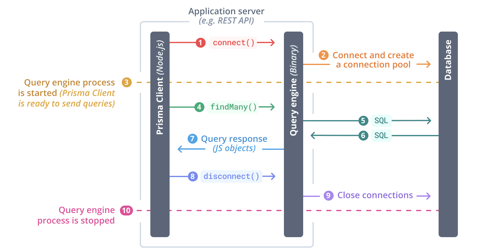

:::warning[Prisma ORM v7 is Rust binary-free by default]

As of **Prisma ORM v7**, Prisma ORM runs without Rust engines by default. This means:

- No Rust binary-based query engine binary is included in your generated code
- Queries are compiled to SQL using a TypeScript-based query compiler
- [Driver adapters](/orm/overview/databases/database-drivers#driver-adapters) are required for database connectivity
- The generated code is smaller and more portable across different JavaScript environments

This page documents the legacy Rust-based engine architecture. For the modern Rust-free approach (default in v7), see [Prisma ORM without Rust engines](/orm/prisma-client/setup-and-configuration/no-rust-engine).

:::

:::info[Default generator in Prisma ORM v7]

The `prisma-client` generator is now the default in Prisma ORM v7. It generates TypeScript code into a custom directory you specify (via the `output` field).

Learn more about the [`prisma-client` generator](/orm/prisma-schema/overview/generators#prisma-client).

:::

From a technical perspective, when using **Rust-based engines** (legacy approach), Prisma Client consists of three major components:

- JavaScript client library
- TypeScript type definitions
- A query engine (Rust-based)

All of these components are located in the generated output folder after you run `prisma generate`.

This page covers relevant technical details about the **Rust-based query engine architecture**, which is now optional and primarily used for:
- Legacy `prisma-client-js` generator users
- Users who explicitly set `engineType = "library"` or `engineType = "binary"` with the `prisma-client` generator


## Prisma engines

:::warning

This section describes the **legacy Rust-based engine architecture**. In Prisma ORM v7, the default architecture uses a TypeScript-based query compiler without Rust engines.

:::

At the core of each module, there typically is a [Prisma engine](https://github.com/prisma/prisma-engines) that implements the core set of functionality. Engines are implemented in [Rust](https://www.rust-lang.org/) and expose a low-level API that is used by the higher-level interfaces.

A Prisma engine is the **direct interface to the database**, any higher-level interfaces always communicate with the database _through_ the engine-layer.

As an example, when using Rust-based engines, Prisma Client connects to the query engine in order to read and write data in a database:



### Using custom engine libraries or binaries

:::warning

This section applies **only to Rust-based engines**. Prisma ORM v7 defaults to the TypeScript-based query compiler without Rust engine binaries.

:::

When using Rust-based engines, all engine files are automatically downloaded into the `node_modules/@prisma/engines` folder when you install or update `prisma`, the Prisma CLI package. The [query engine](/orm/more/under-the-hood/engines) is also copied to the generated Prisma Client when you call `prisma generate`.

You might want to use a [custom library or binary](https://github.com/prisma/prisma-engines) file if:

- Automated download of engine files is not possible.
- You have created your own engine library or binary for testing purposes, or for an OS that is not officially supported.

Use the following environment variables to specify custom locations for your Rust engine binaries:

- [`PRISMA_QUERY_ENGINE_LIBRARY`](/orm/reference/environment-variables-reference#prisma_query_engine_library) (Query engine, library) — **Not supported in Prisma ORM v7**
- [`PRISMA_QUERY_ENGINE_BINARY`](/orm/reference/environment-variables-reference#prisma_query_engine_binary) (Query engine, binary) — **Not supported in Prisma ORM v7**
- [`PRISMA_SCHEMA_ENGINE_BINARY`](/orm/reference/environment-variables-reference#prisma_schema_engine_binary) (Schema engine)
- [`PRISMA_MIGRATION_ENGINE_BINARY`](/orm/reference/environment-variables-reference#prisma_migration_engine_binary) (Migration engine)
- [`PRISMA_INTROSPECTION_ENGINE_BINARY`](/orm/reference/environment-variables-reference#prisma_introspection_engine_binary) (Introspection engine) — **Not supported in Prisma ORM v7**

:::warning

**Prisma ORM v7 changes:**

- `PRISMA_QUERY_ENGINE_LIBRARY` and `PRISMA_QUERY_ENGINE_BINARY` are not supported in Prisma ORM v7.
- `PRISMA_INTROSPECTION_ENGINE_BINARY` is not supported in Prisma ORM v7.

**Earlier deprecations:**

- `PRISMA_MIGRATION_ENGINE_BINARY` variable is deprecated in [5.0.0](https://github.com/prisma/prisma/releases/tag/5.0.0) because the Migration engine was renamed to Schema Engine.
- The Introspection Engine is served by the Schema Engine from [4.9.0](https://github.com/prisma/prisma/releases/tag/4.9.0). Therefore, the `PRISMA_INTROSPECTION_ENGINE` environment variable will not be used.
- The `PRISMA_FMT_BINARY` variable is used in versions [4.2.0](https://github.com/prisma/prisma/releases/tag/4.2.0) or lower.

:::

#### Setting the environment variable

You can define environment variables globally on your machine or in the `.env` file.

##### a) The `.env` file

Add the environment variable to the [`.env` file](/orm/more/development-environment/environment-variables).

<TabbedContent code>

<TabItem value="Linux, Unix, macOS">

```
PRISMA_QUERY_ENGINE_BINARY=custom/my-query-engine-unix
```

</TabItem>
<TabItem value="Windows">

```
PRISMA_QUERY_ENGINE_BINARY=c:\custom\path\my-query-engine-binary.exe
```

</TabItem>
</TabbedContent>

> **Note**: It is possible to [use an `.env` file in a location outside the `prisma` folder](/orm/more/development-environment/environment-variables).

##### b) Global environment variable

Run the following command to set the environment variable globally (in this example, `PRISMA_QUERY_ENGINE_BINARY`):

<TabbedContent code terminal>

   <TabItem value="Linux, Unix, macOS">

```terminal
export PRISMA_QUERY_ENGINE_BINARY=/custom/my-query-engine-unix
```

   </TabItem>

   <TabItem value="Windows">

```terminal
set PRISMA_QUERY_ENGINE_BINARY=c:\custom\my-query-engine-windows.exe
```

   </TabItem>

</TabbedContent>

#### Test your environment variable

Run the following command to output the paths to all binaries:

```terminal
npx prisma -v
```

The output shows that the query engine path comes from the `PRISMA_QUERY_ENGINE_BINARY` environment variable:

<TabbedContent code terminal>

   <TabItem value="Linux, Unix, macOS">
```terminal highlight=2;normal
Current platform     : darwin
Query Engine         : query-engine d6ff7119649922b84e413b3b69660e2f49e2ddf3 (at /custom/my-query-engine-unix)
Migration Engine     : migration-engine-cli d6ff7119649922b84e413b3b69660e2f49e2ddf3 (at /myproject/node_modules/@prisma/engines/migration-engine-unix)
Introspection Engine : introspection-core d6ff7119649922b84e413b3b69660e2f49e2ddf3 (at /myproject/node_modules/@prisma/engines/introspection-engine-unix)
```

   </TabItem>
   <TabItem value="Windows">

```terminal highlight=2;normal
Current platform     : windows
Query Engine         : query-engine d6ff7119649922b84e413b3b69660e2f49e2ddf3 (at c:\custom\my-query-engine-windows.exe)
Migration Engine     : migration-engine-cli d6ff7119649922b84e413b3b69660e2f49e2ddf3 (at c:\myproject\node_modules\@prisma\engines\migration-engine-windows.exe)
Introspection Engine : introspection-core d6ff7119649922b84e413b3b69660e2f49e2ddf3 (at c:\myproject\node_modules\@prisma\engines\introspection-engine-windows.exe)
```

   </TabItem>

</TabbedContent>

### Hosting engines

:::warning

This section applies **only to Rust-based engines**. Prisma ORM v7 defaults to the TypeScript-based query compiler without Rust engine binaries.

:::

The [`PRISMA_ENGINES_MIRROR`](/orm/reference/environment-variables-reference#prisma_engines_mirror) environment variable allows you to host engine files via a private server, AWS bucket or other cloud storage.
This can be useful if you have a custom OS that requires custom-built engines.

```terminal
PRISMA_ENGINES_MIRROR=https://my-aws-bucket
```

## The query engine file

:::warning

This section applies **only to Rust-based engines**. Prisma ORM v7 defaults to the TypeScript-based query compiler without Rust engine binaries.

:::

The **query engine file** is different for each operating system. It is named `query-engine-PLATFORM` or `libquery_engine-PLATFORM` where `PLATFORM` corresponds to the name of a compile target. Query engine file extensions depend on the platform as well. As an example, if the query engine must run on a [Darwin](<https://en.wikipedia.org/wiki/Darwin_(operating_system)>) operating system such as macOS Intel, it is called `libquery_engine-darwin.dylib.node` or `query-engine-darwin`. You can find an overview of all supported platforms [here](/orm/reference/prisma-schema-reference#binarytargets-options).

The query engine file is downloaded into the `runtime` directory of the generated Prisma Client when `prisma generate` is called.

Note that the query engine is implemented in Rust. The source code is located in the [`prisma-engines`](https://github.com/prisma/prisma-engines/) repository.

## The query engine at runtime

:::warning

This section applies **only to Rust-based engines**. Prisma ORM v7 defaults to the TypeScript-based query compiler without Rust engine binaries.

:::

When using Rust-based engines, Prisma Client loads the query engine as a [Node-API library](https://nodejs.org/api/n-api.html) by default. You can alternatively [configure Prisma to use the query engine compiled as an executable binary](#configuring-the-query-engine), which is run as a sidecar process alongside your application.
The Node-API library approach is recommended since it reduces the communication overhead between Prisma Client and the query engine.


The query engine is started when the first Prisma Client query is invoked or when the [`$connect()`](/orm/prisma-client/setup-and-configuration/databases-connections/connection-management) method is called on your `PrismaClient` instance. Once the query engine is started, it creates a [connection pool](/orm/prisma-client/setup-and-configuration/databases-connections/connection-pool) and manages the physical connections to the database. From that point onwards, Prisma Client is ready to send [queries](/orm/prisma-client/queries/crud) to the database (e.g. `findUnique()`, `findMany`, `create`, ...).

The query engine is stopped and the database connections are closed when [`$disconnect()`](/orm/prisma-client/setup-and-configuration/databases-connections/connection-management) is invoked.

The following diagram depicts a "typical flow":

1. `$connect()` is invoked on Prisma Client
1. The query engine is started
1. The query engine establishes connections to the database and creates connection pool
1. Prisma Client is now ready to send queries to the database
1. Prisma Client sends a `findMany()` query to the query engine
1. The query engine translates the query into SQL and sends it to the database
1. The query engine receives the SQL response from the database
1. The query engine returns the result as plain old JavaScript objects to Prisma Client
1. `$disconnect()` is invoked on Prisma Client
1. The query engine closes the database connections
1. The query engine is stopped


## Responsibilities of the query engine

:::warning

This section applies **only to Rust-based engines**. Prisma ORM v7 defaults to the TypeScript-based query compiler without Rust engine binaries.

:::

The Rust-based query engine has the following responsibilities in an application that uses Prisma Client:

- manage physical database connections in connection pool
- receive incoming queries from the Prisma Client Node.js process
- generate SQL queries
- send SQL queries to the database
- process responses from the database and send them back to Prisma Client

## Debugging the query engine

:::warning

This section applies only to Rust-based engines. Prisma ORM v7 defaults to the TypeScript-based query compiler without Rust engine binaries.

:::

You can access the logs of the Rust-based query engine by setting the [`DEBUG`](/orm/prisma-client/debugging-and-troubleshooting/debugging) environment variable to `engine`:

```terminal
export DEBUG="engine"
```

You can also get more visibility into the SQL queries that are generated by the query engine by setting the [`query` log level](/orm/reference/prisma-client-reference#log-levels) in Prisma Client:

```ts showLineNumbers
const prisma = new PrismaClient({
  log: ['query'],
})
```

Learn more about [Debugging](/orm/prisma-client/debugging-and-troubleshooting/debugging) and [Logging](/orm/prisma-client/observability-and-logging/logging).

## Configuring the query engine

:::warning

The configuration options in this section apply **only to Rust-based engines** used in Prisma ORM v6.19 and earlier. Prisma ORM v7 uses the TypeScript-based query compiler by default and does not use these Rust engine configurations.

:::

### Defining the query engine type for Prisma Client

When using Rust-based engines, you can choose between a Node-API library or an executable binary. Configure the query engine type by providing the `engineType` property to the Prisma Client `generator`:

```prisma
generator client {
  provider   = "prisma-client"
  output     = "./generated"
  engineType = "binary"
}
```

Valid values for `engineType` are:
- `binary` - Executable binary that runs as a sidecar process (Rust-based)
- `library` - Node-API library loaded into Prisma Client (Rust-based, default for v6 and earlier)

:::warning

The environment variable `PRISMA_CLIENT_ENGINE_TYPE` is not supported in Prisma ORM v7 because Prisma Client now defaults to the TypeScript-based query compiler without Rust engine binaries. See [Prisma ORM without Rust engines](/orm/prisma-client/setup-and-configuration/no-rust-engine) for more information.

:::

:::info[Historical context]

- Until Prisma 3.x the default and only engine type available was `binary`, so there was no way to configure the engine type to be used by Prisma Client and Prisma CLI.
- From versions [2.20.0](https://github.com/prisma/prisma/releases/2.20.0) to 3.x the `library` engine type was available and used by default by [activating the preview feature flag](/orm/reference/preview-features/client-preview-features#enabling-a-prisma-client-preview-feature) "`nApi`" or using the `PRISMA_FORCE_NAPI=true` environment variable.
- As of Prisma ORM v7, the TypeScript-based query compiler (no Rust binaries) is the default and `engineType` does not need to be set.

:::

### Defining the query engine type for Prisma CLI

When using Rust-based engines, Prisma CLI also uses its own query engine. You can configure it to use the binary version of the query engine by defining the environment variable [`PRISMA_CLI_QUERY_ENGINE_TYPE=binary`](/orm/reference/environment-variables-reference#prisma_cli_query_engine_type).

:::warning

The environment variable `PRISMA_CLI_QUERY_ENGINE_TYPE` is not supported in Prisma ORM v7 because Prisma CLI now defaults to the TypeScript-based query compiler without Rust engine binaries. See [Prisma ORM without Rust engines](/orm/prisma-client/setup-and-configuration/no-rust-engine) for more information.

:::
