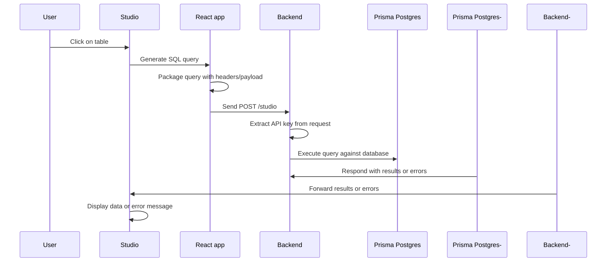

## Embed Prisma Studio in your own application

Prisma Studio can be embedded in your own application via the [`@prisma/studio-core`](https://www.npmjs.com/package/@prisma/studio-core) package.

It gives you `Studio` a React component which renders Prisma Studio for your database. The `Studio` component accepts an _executor_ which accesses a `/studio` endpoint in your backend. The backend uses your API key to identify the correct Prisma Postgres instance and sends the SQL query to it.

:::tip
If you want to see what embedded Studio looks like, **[check out the demo](https://github.com/prisma/studio-core-demo) on GitHub**!
:::

## Use cases

You can embed Prisma Studio in your own app in various scenarios:

- Create an quick admin dashboard for editing data
- Multi-tenant application where every user has their own DB
- Provide an easy way to view and edit data to your users

## Prerequisites

- Frontend: A React application
- Backend:
  - A server-side application to expose the `/studio` endpoint (e.g. with Express or Hono)
  - A Prisma Postgres instance (you can create one with `npx prisma init --db`)

## Installation

Install the npm package:

```terminal
npm install @prisma/studio-core
```

## Frontend setup

In your React app, you can use the `Studio` component to render the tables in your database via Prisma Studio. It receives an _executor_ which is responsible for packaging the current SQL query in an HTTP request (also allowing for custom headers/payloads) and sending it to the `/studio` endpoint in your backend.

> Check out the [demo](https://github.com/prisma/studio-core-demo/blob/main/frontend/index.tsx) on GitHub for a full reference implementation.

### Minimal implementation

Here's what a minimal implementation looks like:

```tsx
import { Studio } from "@prisma/studio-core/ui";
import { createPostgresAdapter } from "@prisma/studio-core/data/postgres-core";
import { createStudioBFFClient } from "@prisma/studio-core/data/bff";

function App() {
  const adapter = useMemo(() => {
    // 1. Create a client that points to your backend endpoint
    const executor = createStudioBFFClient({
      url: "http://localhost:4242/studio",
    });

    // 2. Create a Postgres adapter with the executor
    const adapter = createPostgresAdapter({ executor });
    return adapter;
  }, []);

  return (
    <Layout>
      <Studio adapter={adapter} />
    </Layout>
  );
}
```

### Customer headers/payload implementation

Here's what an implementation with custom headers/payload looks like:

```tsx
import { Studio } from "@prisma/studio-core/ui";
import { createPostgresAdapter } from "@prisma/studio-core/data/postgres-core";
import { createStudioBFFClient } from "@prisma/studio-core/data/bff";

function App() {
  const adapter = useMemo(() => {
    // 1. Create a client that points to your backend endpoint
    const executor = createStudioBFFClient({
      url: "http://localhost:4242/studio",
      customHeaders: {
        "X-Custom-Header": "example-value", // Pass any custom headers
      },
      customPayload: {
        customValue: "example-value" // Pass any custom data
      }
    });

    // 2. Create a Postgres adapter with the executor
    const adapter = createPostgresAdapter({ executor });
    return adapter;
  }, []);

  return (
    <Layout>
      <Studio adapter={adapter} />
    </Layout>
  );
}
```

### Concepts

Here's an overview of the key concepts in your frontend:
- **Executor**: The bridge between Studio and your backend, it's created using the `createStudioBFFClient` function
- **Adapter**: Handles Postgres-specific query formatting
- **Custom headers**: Pass authentication tokens, user info, etc.
- **Custom payload**: Send additional context/data with each request

## Backend setup

Your backend needs to expose a `/studio` endpoint, that's where the frontend sends its requests. The implementation of this endpoint uses the `createAccelerateHttpClient` function that can be imported from the `@prisma/studio-core`.

The backend also needs to have access to the Prisma Postgres API key, we recommend setting it as an environment variable as a best practice.

> Check out the [demo](https://github.com/prisma/studio-core-demo/blob/main/server/index.ts) on GitHub for a full reference implementation.

### Minimal implementation

Here's what a minimal implementation for the `/studio` endpoint looks like with [Hono](https://hono.dev/). This assumes that your API key is available as an `API_KEY` env var: 

```ts
// server/index.ts
import { Hono } from "hono";
import { createAccelerateHttpClient } from "@prisma/studio-core/data/accelerate";
import { serializeError } from "@prisma/studio-core/data/bff";

const app = new Hono().use("*", cors());

// Expose a `/studio` endpoint in your API
app.post("/studio", async (c) => {
  // 1. Extract the query from the request
  const { query } = await c.req.json();

  // 2. Determine the API key (this is where you'd implement your auth logic)
  const apiKey = process.env.API_KEY;

  // 3. Execute the query using Prisma Postgres or Prisma Accelerate
  const [error, results] = await createAccelerateHttpClient({
    apiKey,
    provider: "postgres",
    clientVersion: "6.10.1",
    engineHash: "9b628578b3b7cae625e8c927178f15a170e74a9c",
  }).execute(query);

  // 4. Return results or errors
  if (error) {
    return c.json([serializeError(error)]);
  }

  return c.json([null, results]);
});
```

### Customer headers/payload implementation

Here's what a minimal implementation for the `/studio` endpoint looks like with [Hono](https://hono.dev/). In this case, a multi-tenant scenario is assumed where the frontend sends over a user ID and authentication token which is used on the backend to determine the Prisma Postgres instance that belongs to that user via a hypothetical `determineApiKeyFromContext` function"

```ts
import { Hono } from "hono";
import { createAccelerateHttpClient } from "@prisma/studio-core/data/accelerate";
import { serializeError } from "@prisma/studio-core/data/bff";

const app = new Hono().use("*", cors());

app.post("/studio", async (c) => {
  // 1. Extract the query and custom data from the request
  const { query, customPayload } = await c.req.json();
  
  // 2. Access custom headers (great for auth!)
  const customHeader = c.req.header("X-Custom-Header");
  console.log("Received headers:", { customHeader });
  
  // 3. Use custom payload data
  console.log("Received value:", customPayload.customValue);
  
  // 4. Determine the API key (this is where you'd implement your auth logic)
  const apiKey = determineApiKeyFromContext(customHeader, customPayload);
  
  // 5. Execute the query using Prisma Postgres or Prisma Accelerate
  const [error, results] = await createAccelerateHttpClient({
    apiKey,
    provider: "postgres",
    clientVersion: "6.10.1",
    engineHash: "9b628578b3b7cae625e8c927178f15a170e74a9c",
  }).execute(query);
  
  // 6. Return results or errors
  if (error) {
    return c.json([serializeError(error)]);
  }
  
  return c.json([null, results]);
});
```

### Concepts

- Query object: Contains the SQL query and parameters from Studio
- Custom payload: Additional data sent with each request
- Prisma Postgres client: Executes queries against your database
- Error handling: Properly serialize errors for Studio to display

## Execution flow

Here's an overview of the execution flow in your embedded Prisma Studio version:


<!--

-->

## Adding user authentication

When you want to authenticate the users of your app against Prisma Studio, you can do that by adding custom logic around your embedded Prisma Studio version.

On the frontend, you xan ensure yo pass the `Authorization` header and other data (e.g. a user ID) when creating the executor:

```tsx
const executor = createStudioBFFClient({
  url: "http://localhost:4242/studio",
  customHeaders: {
    "X-User-ID": currentUser.id,
    "Authorization": `Bearer ${userToken}`,
  },
});
```

In your server-side implementation, you can then retrieve these values from the incoming request and extract the Prisma Postgres API key that's needed for this user's query:

```typescript
const userId = c.req.header("X-User-ID");
const token = c.req.header("Authorization");

const userApiKey = await getUserApiKey(userId, token);
```

## Licensing

TBD