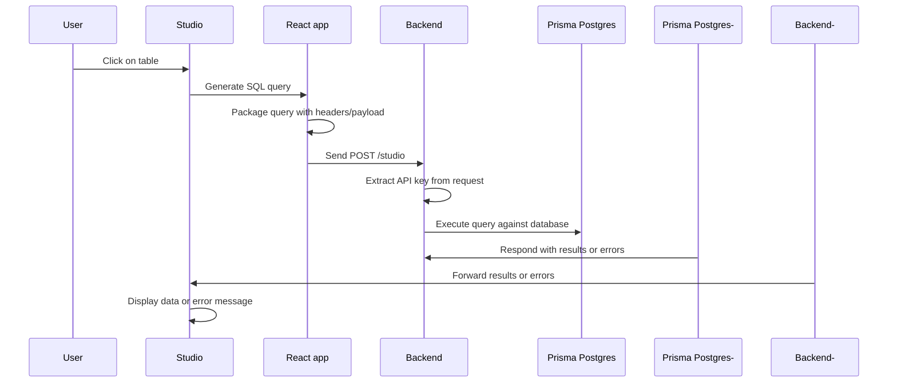

## Embed Prisma Studio in your own application

Prisma Studio can be embedded in your own application via the [`@prisma/studio-core`](https://www.npmjs.com/package/@prisma/studio-core) package.

It provides `Studio`, a React component which renders Prisma Studio for your database. The `Studio` component accepts an executor that calls a `/studio` endpoint in your backend. The backend uses your `DATABASE_URL` (connection string) to connect to the correct database instance (PostgreSQL, SQLite, or MySQL) and execute the SQL query.

:::tip
If you want to see what embedded Studio looks like, **[check out the demo](https://github.com/prisma/studio-core-demo) on GitHub**!
:::

## Use cases

You can embed Prisma Studio in your own app in various scenarios:

- Create an quick admin dashboard for editing data
- Multi-tenant application where every user has their own DB
- Provide an easy way to view and edit data to your users

## Prerequisites

- Frontend: A React application
- Backend:
  - A server-side application to expose the `/studio` endpoint (e.g. with Express or Hono)
  - A database instance (PostgreSQL, SQLite, or MySQL)

## Database support

Embedded Prisma Studio supports the following databases:

- **PostgreSQL**
- **SQLite**
- **MySQL**

:::note
The implementation pattern is similar across all databases - you just need to use the appropriate executor and adapter for your database type.
:::

## Installation

Install the npm package:

```bash
npm install @prisma/studio-core
```

### Additional dependencies

Depending on your database type, you may need additional packages:

```bash
# For SQLite support
npm install better-sqlite3

# For MySQL support  
npm install mysql2
```

PostgreSQL support is included with `@prisma/studio-core` and requires no additional dependencies.

## Frontend setup

In your React app, you can use the `Studio` component to render the tables in your database via Prisma Studio. It receives an _executor_ which is responsible for packaging the current SQL query in an HTTP request (also allowing for custom headers/payloads) and sending it to the `/studio` endpoint in your backend.

The implementation varies slightly depending on your database type. Choose the appropriate section below:

> Check out the [demo](https://github.com/prisma/studio-core-demo/blob/main/frontend/index.tsx) on GitHub for a full reference implementation.

### PostgreSQL implementation

Here's what a minimal implementation looks like for PostgreSQL:

```tsx
import { Studio } from "@prisma/studio-core/ui";
import { createPostgresAdapter } from "@prisma/studio-core/data/postgres-core";
import { createStudioBFFClient } from "@prisma/studio-core/data/bff";
import "@prisma/studio-core/ui/index.css"

function App() {
  const adapter = useMemo(() => {
    // 1. Create a client that points to your backend endpoint
    const executor = createStudioBFFClient({
      url: "http://localhost:4242/studio",
    });

    // 2. Create a Postgres adapter with the executor
    const adapter = createPostgresAdapter({ executor });
    return adapter;
  }, []);

  return (
    <Layout>
      <Studio adapter={adapter} />
    </Layout>
  );
}
```

### SQLite implementation

Here's what a minimal implementation looks like for SQLite:

```tsx
import { Studio } from "@prisma/studio-core/ui";
import { createSQLiteAdapter } from "@prisma/studio-core/data/sqlite-core";
import { createStudioBFFClient } from "@prisma/studio-core/data/bff";
import "@prisma/studio-core/ui/index.css"

function App() {
  const adapter = useMemo(() => {
    // 1. Create a client that points to your backend endpoint
    const executor = createStudioBFFClient({
      url: "http://localhost:4242/studio",
    });

    // 2. Create a SQLite adapter with the executor
    const adapter = createSQLiteAdapter({ executor });
    return adapter;
  }, []);

  return (
    <Layout>
      <Studio adapter={adapter} />
    </Layout>
  );
}
```

### MySQL implementation

Here's what a minimal implementation looks like for MySQL:

```tsx
import { Studio } from "@prisma/studio-core/ui";
import { createMySQLAdapter } from "@prisma/studio-core/data/mysql-core";
import { createStudioBFFClient } from "@prisma/studio-core/data/bff";
import "@prisma/studio-core/ui/index.css"

function App() {
  const adapter = useMemo(() => {
    // 1. Create a client that points to your backend endpoint
    const executor = createStudioBFFClient({
      url: "http://localhost:4242/studio",
    });

    // 2. Create a MySQL adapter with the executor
    const adapter = createMySQLAdapter({ executor });
    return adapter;
  }, []);

  return (
    <Layout>
      <Studio adapter={adapter} />
    </Layout>
  );
}
```

### Custom headers/payload implementation

Here's what an implementation with custom headers/payload looks like (works for all database types):

```tsx
import { Studio } from "@prisma/studio-core/ui";
import { createPostgresAdapter } from "@prisma/studio-core/data/postgres-core";
import { createStudioBFFClient } from "@prisma/studio-core/data/bff";
import "@prisma/studio-core/ui/index.css"

function App() {
  const adapter = useMemo(() => {
    // 1. Create a client that points to your backend endpoint
    const executor = createStudioBFFClient({
      url: "http://localhost:4242/studio",
      customHeaders: {
        "X-Custom-Header": "example-value", // Pass any custom headers
      },
      customPayload: {
        customValue: "example-value" // Pass any custom data
      }
    });

    // 2. Create a database adapter with the executor
    const adapter = createPostgresAdapter({ executor }); // PostgreSQL
    // const adapter = createSQLiteAdapter({ executor }); // SQLite
    // const adapter = createMySQLAdapter({ executor }); // MySQL
    return adapter;
  }, []);

  return (
    <Layout>
      <Studio adapter={adapter} />
    </Layout>
  );
}
```

### Custom styling

You can customize the look and feel of Prisma Studio so that it matches your application’s design. This is done by passing a custom theme to the `Studio` component. A theme is simply a set of CSS variables that define colors, spacing, and other style properties for both light and dark modes.

Here's an example of applying a custom theme:

```tsx
import { Studio } from "@prisma/studio-core/ui";
import { createPostgresAdapter } from "@prisma/studio-core/data/postgres-core";
import { createStudioBFFClient } from "@prisma/studio-core/data/bff";
import "@prisma/studio-core/ui/index.css";

const customTheme = `
@layer base {
  :root {
    --background: 0 0% 100%;
    --foreground: 20 14.3% 4.1%;
    --primary: 47.9 95.8% 53.1%;
    --primary-foreground: 26 83.3% 14.1%;
    --border: 20 5.9% 90%;
    --input: 20 5.9% 90%;
    --ring: 20 14.3% 4.1%;
    --radius: 0rem;
  }

  .dark {
    --background: 20 14.3% 4.1%;
    --foreground: 60 9.1% 97.8%;
    --primary: 47.9 95.8% 53.1%;
    --primary-foreground: 26 83.3% 14.1%;
    --border: 12 6.5% 15.1%;
    --input: 12 6.5% 15.1%;
    --ring: 35.5 91.7% 32.9%;
  }
}
`;

function App() {
  const adapter = useMemo(() => {
    const executor = createStudioBFFClient({
      url: "http://localhost:4242/studio",
    });
    return createPostgresAdapter({ executor });
  }, []);

  return (
    <Layout>
      <Studio theme={customTheme} adapter={adapter} />
    </Layout>
  );
}
```

With this setup, Studio inherits your custom colors, borders, and typography rules, making it feel like a natural part of your app rather than a separate tool. You can define as many or as few variables as you need depending on the level of customization you want.

### Concepts

Here's an overview of the key concepts in your frontend:
- **Executor**: The bridge between Studio and your backend, it's created using the `createStudioBFFClient` function
- **Adapter**: Handles database-specific query formatting (PostgreSQL, SQLite, or MySQL)
- **Custom headers**: Pass authentication tokens, user info, etc.
- **Custom payload**: Send additional context/data with each request

## Backend setup

Your backend needs to expose a `/studio` endpoint where the frontend sends its requests. The implementation varies depending on your database type. Choose the appropriate section below:

### PostgreSQL backend implementation

The PostgreSQL implementation uses `createPrismaPostgresHttpClient` from `@prisma/studio-core`. This works with Prisma Postgres or any PostgreSQL instance.

> Check out the [demo](https://github.com/prisma/studio-core-demo/blob/main/server/index.ts) on GitHub for a full reference implementation.

### Minimal implementation

Here's what a minimal implementation for the `/studio` endpoint looks like with [Hono](https://hono.dev/). This assumes that your connection URL is available via the `DATABASE_URL` env var: 

```ts
import { Hono } from "hono";
import { createPrismaPostgresHttpClient } from "@prisma/studio-core/data/ppg";
import { serializeError } from "@prisma/studio-core/data/bff";

const app = new Hono().use("*", cors());

app.post("/studio", async (c) => {
  // 1. Extract the query and custom data from the request
  const { query } = await c.req.json();
  
  // 2. Read DB URL from env vars
  const url = process.env.DATABASE_URL;
  
  // 3. Execute the query against Prisma Postgres
  const [error, results] = await createPrismaPostgresHttpClient({ url }).execute(query);
  
  // 6. Return results or errors
  if (error) {
    return c.json([serializeError(error)]);
  }
  
  return c.json([null, results]);
});
```

### SQLite backend implementation

The SQLite implementation uses `createNodeSQLiteExecutor` from `@prisma/studio-core` and requires the `better-sqlite3` package. This works with local SQLite database files.

```ts
import { Hono } from "hono";
import { createNodeSQLiteExecutor } from "@prisma/studio-core/data/node-sqlite";
import { serializeError } from "@prisma/studio-core/data/bff";
import DatabaseSync from "better-sqlite3";

const app = new Hono().use("*", cors());

app.post("/studio", async (c) => {
  try {
    // 1. Extract the query from the request
    const { query } = await c.req.json();
    
    // 2. Read DB URL from env vars (should be a file path)
    const url = process.env.DATABASE_URL;
    
    if (!url) {
      return c.json([serializeError(new Error("DATABASE_URL is missing"))], 500);
    }
    
    // 3. Extract file path from URL and create database connection
    const dbPath = url.replace("file:", "");
    const database = new DatabaseSync(dbPath);
    
    // 4. Execute the query against SQLite
    const [error, results] = await createNodeSQLiteExecutor(database).execute(query);
    
    // 5. Return results or errors
    if (error) {
      return c.json([serializeError(error)]);
    }
    
    return c.json([null, results]);
  } catch (err) {
    return c.json([serializeError(err)], 400);
  }
});
```

### MySQL backend implementation

The MySQL implementation uses `createMySQL2Executor` from `@prisma/studio-core` and requires the `mysql2` package. This works with MySQL instances.

```ts
import { Hono } from "hono";
import { createMySQL2Executor } from "@prisma/studio-core/data/mysql2";
import { serializeError } from "@prisma/studio-core/data/bff";
import mysql from "mysql2/promise";

const app = new Hono().use("*", cors());

app.post("/studio", async (c) => {
  try {
    // 1. Extract the query from the request
    const { query } = await c.req.json();
    
    // 2. Read DB URL from env vars
    const url = process.env.DATABASE_URL;
    
    if (!url) {
      return c.json([serializeError(new Error("DATABASE_URL is missing"))], 500);
    }
    
    // 3. Create MySQL connection pool
    const pool = mysql.createPool(url);
    
    // 4. Execute the query against MySQL
    const [error, results] = await createMySQL2Executor(pool).execute(query);
    
    // 5. Return results or errors
    if (error) {
      return c.json([serializeError(error)]);
    }
    
    return c.json([null, results]);
  } catch (err) {
    return c.json([serializeError(err)], 400);
  }
});
```

### Custom headers/payload implementation

Here's what a slightly more advanced implementation for the `/studio` endpoint looks like with [Hono](https://hono.dev/). In this case, a multi-tenant scenario is assumed where the frontend sends over a user ID and authentication token which is used on the backend to determine the database instance that belongs to that user via a hypothetical `determineUrlFromContext` function:

```ts
// server/index.ts
import { Hono } from "hono";
import { createPrismaPostgresHttpClient } from "@prisma/studio-core/data/ppg";
import { serializeError } from "@prisma/studio-core/data/bff";

const app = new Hono().use("*", cors());

app.post("/studio", async (c) => {
  // 1. Extract the query and custom data from the request
  const { query, customPayload } = await c.req.json();
  
  // 2. Access custom headers (great for auth!)
  const customHeader = c.req.header("X-Custom-Header");
  console.log("Received headers:", { customHeader });
  
  // 3. Use custom payload data
  console.log("Received value:", customPayload.customValue);
  
  // 4. Determine the URL (this is where you'd implement your auth logic)
  const url = determineUrlFromContext(customHeader, customPayload);
  
  // 5. Execute the query using the appropriate database client
  // PostgreSQL:
  const [error, results] = await createPrismaPostgresHttpClient({ url }).execute(query);
  // SQLite: (requires additional setup with better-sqlite3)
  // MySQL: (requires additional setup with mysql2)
  
  // 6. Return results or errors
  if (error) {
    return c.json([serializeError(error)]);
  }
  
  return c.json([null, results]);
});
```

### Concepts

- Query object: Contains the SQL query and parameters from Studio
- Custom payload: Additional data sent with each request
- Database client: Executes queries against your database (PostgreSQL, SQLite, or MySQL)
- Error handling: Properly serialize errors for Studio to display

## Execution flow

Here's an overview of the execution flow in your embedded Prisma Studio version:


<!--

-->

## Adding user authentication

When you want to authenticate the users of your app against Prisma Studio, you can do that by adding custom logic around your embedded Prisma Studio version.

On the frontend, you can ensure to pass the `Authorization` header and other data (e.g. a user ID) when creating the executor:

```tsx
const executor = createStudioBFFClient({
  url: "http://localhost:4242/studio",
  customHeaders: {
    "X-User-ID": currentUser.id,
    "Authorization": `Bearer ${userToken}`,
  },
});
```

In your server-side implementation, you can then retrieve these values from the incoming request and extract the Prisma Postgres API key that's needed for this user's query:

```typescript
const userId = c.req.header("X-User-ID");
const token = c.req.header("Authorization");

const userApiKey = await getUserApiKey(userId, token);
```

## Licensing

Embeddable Prisma Studio (Free) is licensed under Apache 2.0.

✔️ Free for production use  
⚠️ Prisma branding must remain visible and unaltered  
🔐 To remove our branding or to inquire about upcoming partner-only features, ping us here: [partnerships@prisma.io](mailto:partnerships@prisma.io)

## Telemetry

This package includes anonymized telemetry to help us improve Prisma Studio.  
Use implies consent. Learn more in our [Privacy Policy](https://www.prisma.io/privacy).

