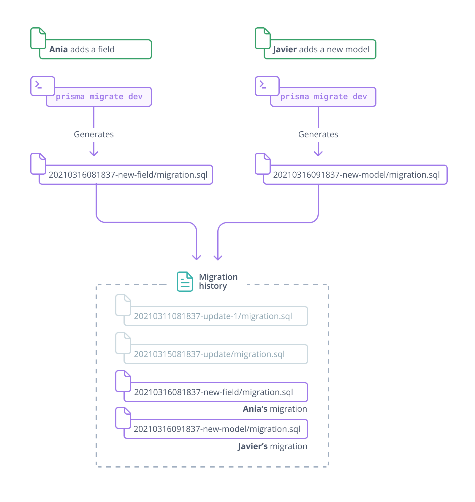
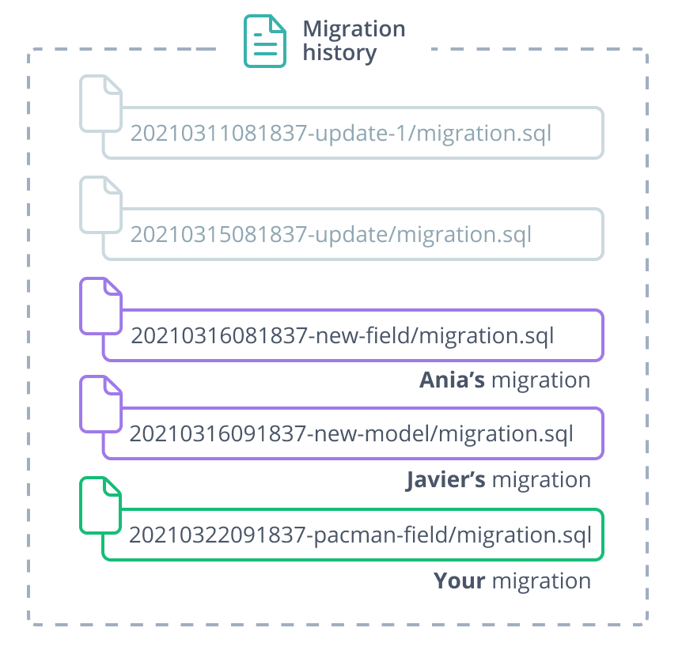

<TopBlock>

<Admonition type="warning">

**MongoDB not supported** <br />
Prisma Migrate does not currently support the [MongoDB connector](../../../concepts/database-connectors/mongodb).

</Admonition>

To incorporate changes from collaborators:

1. Pull the changed Prisma schema and `./prisma/migrations` folder
1. Run the `migrate dev` command to apply new migrations:

   ```terminal
   npx prisma migrate dev
   ```

Migrations are **applied in the same order as they were created**. The creation date is part of the migration subfolder name - for example, `20210316081837-updated-fields` was created on `2021-03-16-08:08:37`.

</TopBlock>

## Example: Incorporating your team's changes

The following sample scenario demonstrates how a team of three developers share and incorporate changes to the Prisma schema and the migration history.

The following tabs show the team's Prisma schema before and after a round of changes:

<TabbedContent tabs={[<FileWithIcon text="schema.prisma before" icon="prisma"/>, <FileWithIcon text="schema.prisma after" icon="prisma"/>]}>

<tab>

```prisma
model Post {
  id        Int     @id @default(autoincrement())
  title     String
  content   String?
  published Boolean @default(false)
  author    User?   @relation(fields: [authorId], references: [id])
  authorId  Int?
}

model User {
  id               Int     @id @default(autoincrement())
  email            String  @unique
  name             String?
  posts Post[]
}
```

</tab>

<tab>

```prisma highlight=14,15,19-23;add
model Post {
  id        Int     @id @default(autoincrement())
  title     String
  content   String?
  published Boolean @default(false)
  author    User?   @relation(fields: [authorId], references: [id])
  authorId  Int?
}

model User {
  id               Int     @id @default(autoincrement())
  email            String  @unique
  name             String?
  favoriteColor    String? // Added by Ania
  bestPacmanScore  Int? // Added by you
  posts Post[]
}

// Added by Javier
model Tag {
   tagName      String @id
   tagCategory  Category
}
```

</tab>
</TabbedContent>

### The team's changes

Your team members Ania and Javier make additive changes to the schema in their local environment and generate migrations.

**Ania** makes the following changes:

1. Adds a model field:

   ```prisma highlight=3;add
   model User {
      /* ... */
      favoriteColor     String?
   }
   ```

1. Generates a migration:

   ```terminal
   npx prisma migrate dev --name new-field
   ```

1. Commits the changed schema and the new migration:

   - `./prisma/schema.prisma`
   - `./prisma/migrations/20210316081837-new-field/migration.sql`

**Javier** makes the following changes:

1. Adds a new model to the schema:

   ```prisma highlight=1-4;add
   model Tag {
      tagName      String @id
      tagCategory  Category
   }
   ```

1. Generates a migration:

   ```terminal
   npx prisma migrate dev --name new-model
   ```

1. Commits the changed schema and the new migration:

   - `./prisma/schema.prisma`
   - `./prisma/migrations/20210316091837-new-model/migration.sql`

The migration history now has **two** new migrations:



### Integrating changes

**You** want to incorporate your team's changes. To do that, you:

1. Pull the most recent changes from your team, including:

   - Two new migrations:

     - `./prisma/migrations/20210316081837-new-field/migration.sql`
     - `./prisma/migrations/20210316091837-new-model/migration.sql`

   - An updated schema file. Git automatically merges the updated schema with _your_ local schema changes (a new `bestPacmanScore` field):

     ```prisma highlight=3,7-11;add
     model User {
        /* ... */
        favoriteColor      String?
        bestPacmanScore    Int?
     }

     model Tag {
        tagName      String @id
        tagCategory  Category
        posts        Post[]
     }
     ```

1. Run the `migrate dev` command:

   ```terminal
   npx prisma migrate dev
   ```

   1. Applies Ania and Javier's migrations to your local database.

      - `./prisma/migrations/20210316081837-new-field/migration.sql`
      - `./prisma/migrations/20210316091837-new-model/migration.sql`

   1. Creates a new migration with your changes, prompts you to name it (`pacman-field`), and applies the new migration to your local database:

      - `./prisma/migrations/20210322081837-pacman-field/migration.sql`

1. Commit the merged `schema.prisma` and your new migration: `./prisma/migrations/20210322081837-pacman-field/migration.sql`

Your `schema.prisma` and local database now include your team's changes, and the migration history includes your migration:



## Source control

You should commit the following files to source control:

- The contents of the `.prisma/migrations` folder, including the `migration_lock.toml` file
- The Prisma schema file (`schema.prisma`)

Source-controlling the `schema.prisma` file is not enough - you must include your migration history. This is because:

- As you start to [customize migrations](customizing-migrations), your migration history contains **information that cannot be represented in the Prisma schema**. For example, you can customize a migration to mitigate data loss that would be caused by a breaking change.
- The `prisma migrate deploy` command, which is used to deploy changes to staging, testing, and production environments, _only_ runs migration files. Prisma Migrate only uses the schema file to read the `url` and `provider` fields, not models and fields.
