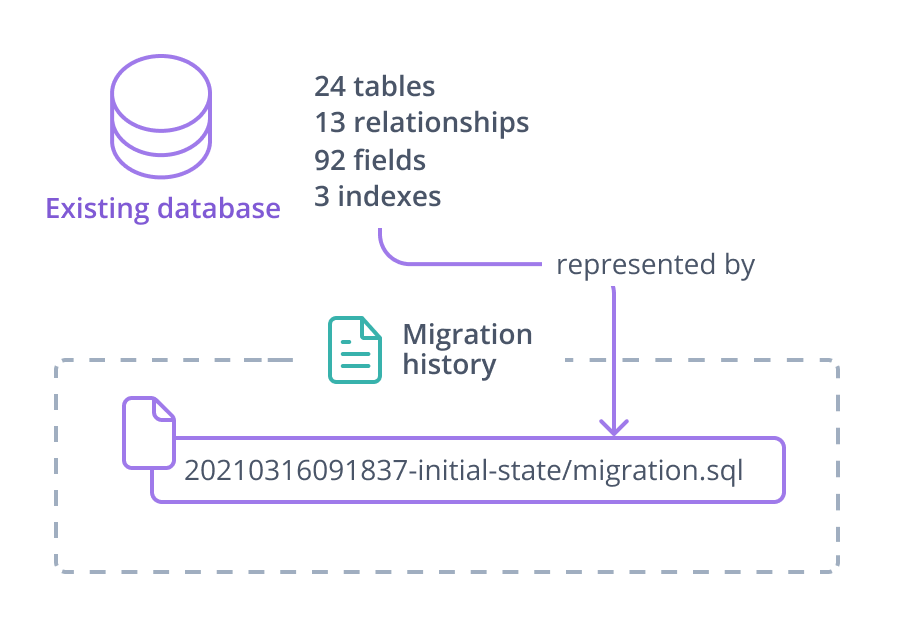
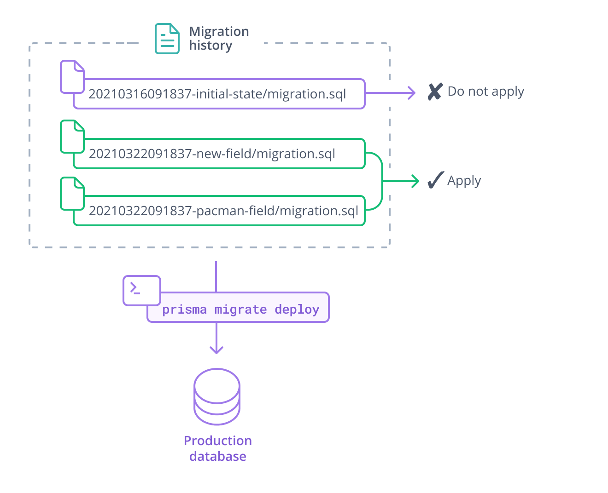

<TopBlock>

Baselining is the process of initializing a migration history for a database that:

* ✔ Existed before you started using Prisma Migrate
* ✔ Contains data that must be maintained

For example, the production database or any staging database used by stakeholders to create and preview content should be baselined.

> **Note**: We assume it is acceptable to reset and seed development databases.

When you add Prisma Migrate to an existing project, your initial migration(s) contain all the SQL required to recreate the state of the database **before you started using Prisma Migrate**:



You need this initial migration to create and reset **development environments**.


Conversely, when you **baseline** a database, you tell Prisma Migrate to **pretend that the initial migration(s) have already been applied**. The target database is already in the state represented by the initial migrations:



</TopBlock>

## Generating initial migrations

Consider the following example - you are adding Prisma Migrate to a database with 20 tables. In your development environment:

1. You introspect a local copy of the database to create a schema:

    ```terminal
    npx prisma introspect
    ```

1. You generate a migration to represent the initial state of the database:

    ```terminal
    npx prisma migrate dev --name existing-database-init
    ```

1. You [create a seeding script](../seed-database) that adds sample content to the database.

1. You commit the `schema.prisma` file, the migration history, and the seed script to source control.

1. Other members of your team check out the schema and migration history, and run the following command to create a clean local copy of the database:

    ```terminal
    npx prisma migrate dev
    ```

1. You and your team continue to evolve the database by changing the **Prisma schema** and generating migrations.

Baselining is part of [adding Prisma Migrate to a project with an existing database](add-prisma-migrate-to-a-project).

## Baselining a database

Baselining is for introducing Prisma Migrate to existing databases / brownfield projects. Concretely it's to tell Prisma Migrate to assume that one or more migration(s) were already executed so the generated migration(s) won't fail when they will try to create tables that already exist.

Assuming you started a new migration history in your repository using `prisma migrate dev`, you now need to **baseline** any database that contains important data – such as production or staging. Trying to apply this new migration history with `prisma migrate deploy` will normally fail as the migrations are trying to re-create a state that is already there. Instead, the database should be baselined.

In development, we assume it is acceptable to reset and seed your database to make sure your migration files are in sync with your database schema. This is not acceptable in a production environment, or any other environment where data must be maintained.

You will need to use `prisma migrate resolve --applied "MIGRATION_NAME"` (see example below) to register migration(s) in the `_prisma_migrations` table as "already applied", this table will be created if it does not exist.
This will cause Prisma Migrate to ignore the "applied" migrations in your deployments.
When running `prisma migrate deploy`:
* Any "applied" migrations, whether actually applied or baselined (marked as applied) will be skipped.
* Any new migrations that come _after_ baselined migrations will be applied.


## Something