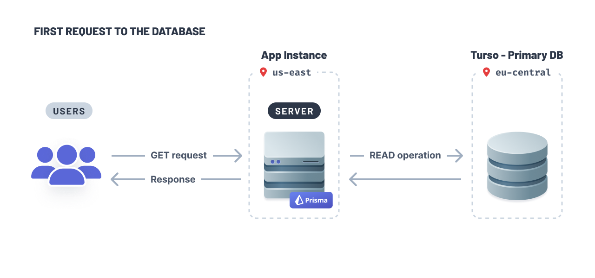
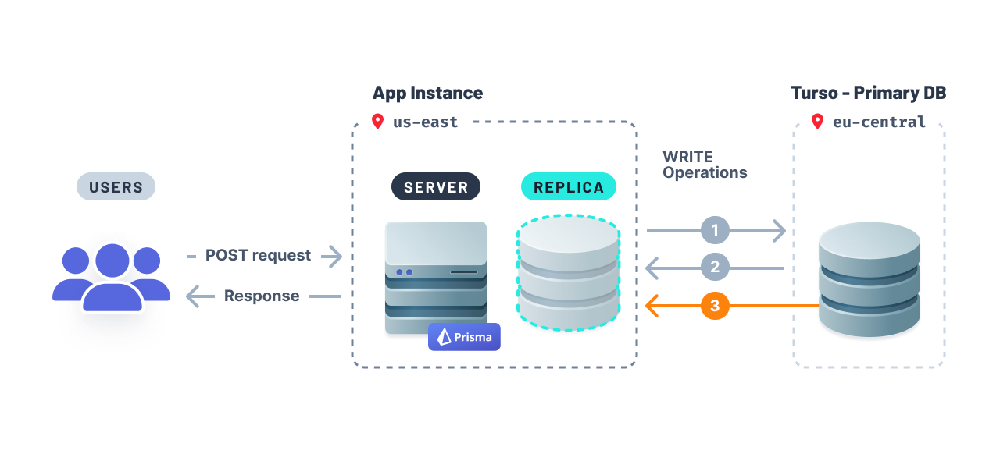

<TopBlock>

This guide discusses the concepts behind using Prisma and Turso, explains the commonalities and differences between Turso and other database providers, and leads you through the process for configuring your application to integrate with Turso

</TopBlock>

## What is Turso?

[Turso](https://turso.tech/) is an edge-hosted, distributed database that's based on [libSQL](https://turso.tech/libsql), an open-source and open-contribution fork of [SQLite](https://sqlite.org/), enabling you to bring data closer to your application and minimize query latency.

## Commonalities with other database providers

Many aspects of using Prisma with Turso are just like using Prisma with any other relational database. You can still:

- model your database with the [Prisma Schema Language](/concepts/components/prisma-schema)
- use Prisma's existing [`sqlite` database connector](/concepts/database-connectors/sqlite) in your schema
- use [Prisma Client](/concepts/components/prisma-client) in your application to talk to the database server at Neon

## Differences to consider

There are a number of differences between Turso and SQLite to consider. You should be aware of the following when deciding to use Turso and Prisma:

- **Remote and embedded SQLite databases**. libSQL uses HTTP to connect to the database and uses a remote file over a local file. libSQL also supports remote database replicas and embedded replicas. Embedded replicas enable you to replicate your primary database inside your application.
- **Making schema changes**. Since libSQL uses HTTP to connect to the remote database, this makes it incompatible with Prisma Migrate. However, you can use [`prisma migrate diff`](/reference/api-reference/command-reference#migrate-diff) <span class="api"></span> to create a schema migration and then apply the changes to your database using [Turso's CLI](https://docs.turso.tech/reference/turso-cli).

### Connect and query your primary database

1. Create an authentication token that will allow you to connect to the database:

```sh
turso db tokens create turso-prisma
```

1. Retrieve your database's connection string:

```sh
turso db show turso-prisma
```

1. Update your `.env` file with the authentication token and connection string:

```text
TURSO_AUTH_TOKEN="eyJhbGciOiJFZERTQSIsInR5cCI6IkpXVCJ9..."
TURSO_DATABASE_URL="libsql://turso-prisma-user.turso.io"
```

1. Enable the `driverAdapters` Preview feature flag:

```prisma
generator client {
  provider        = "prisma-client-js"
  previewFeatures = ["driverAdapters"]
}

datasource db {
  provider = "sqlite"
  url      = "file:./dev.db"
}
```

1. Generate Prisma Client:

```sh
npx prisma generate
```

Install the libSQL database client and Prisma adapter for libSQL:

```sh
npm install @libsql/client @prisma/adapter-libsql
```

Update your Prisma Client instance with the following snippet:

```ts
import { PrismaClient } from '@prisma/client'
import { PrismaLibSQL } from '@prisma/adapter-libsql'
import { createClient } from '@libsql/client'

const libsql = createClient({
  url: `${process.env.TURSO_DATABASE_URL}`,
  authToken: `${process.env.TURSO_AUTH_TOKEN}`,
})

const adapter = new PrismaLibSQL(libsql)
const prisma = new PrismaClient({ adapter })
```

You can use Prisma Client as you normally would with full type-safety as you normally would in your project.

<!-- TODO: how to connect to a remote database replica -->

### How to connect and query from an embedded replica

Turso supports [embedded replicas](https://blog.turso.tech/introducing-embedded-replicas-deploy-turso-anywhere-2085aa0dc242). Turso's embedded replicas enable you to have a copy of your primary, remote database _inside_ your application. This is similar to having an embedded or SQLite database.

When your app initially establishes a connection to your database, the primary database will fulfill the query:



Turso will (1) create an embedded replica inside your application and (2) copy data from your primary database to the replica so it is locally available:


The embedded replica will fulfill subsequent read queries. The libSQL client provides a [`sync()`](<https://docs.turso.tech/libsql/client-access/javascript-typescript-sdk#client-capability-summary:~:text=an%20interactive%20transaction-,sync(),-Synchronize%20the%20embedded>) method which you can invoke to ensure the embedded replica's data remains fresh.


With embedded replicas, this setup guarantees your app is fast because the data will be readily available locally.

Like a read replica setup you may be familiar with, write operations are forwarded to the primary remote database and executed before being propagated to all embedded replicas.



1. Write operations propagation are forwarded to the database.
1. Database responds to the server with the updates from 1.
1. Write operations are propagated to the database replica.

To get started using embedded replicas with Prisma, update your Prisma Client instance with the following changes:

```ts highlight=6,7,11,15;add
import { PrismaClient } from '@prisma/client'
import { PrismaLibSQL } from '@prisma/adapter-libsql'
import { createClient } from '@libsql/client'

const libsql = createClient({
  url: 'file:replica.db',
  syncUrl: `${process.env.TURSO_DATABASE_URL}`,
  authToken: `${process.env.TURSO_AUTH_TOKEN}`,
})

const sync = async () => await libsql.sync()

const adapter = new PrismaLibSQL(libsql)

const prismaClientSingleton = () => {
  sync()
  return new PrismaClient({ adapter })
}
```

### How to manage schema changes

Generate a SQL migration file using the `prisma migrate diff` command:

<!-- TODO: figure out how this would work with subsequent migrations -->

```sh
npx prisma migrate diff --from-empty --to-schema-datamodel prisma/schema.prisma --script > baseline.sql
```

Apply the generated migration file to your database:

```sh
turso db shell project_name < path/to/migration-file.sql
```
