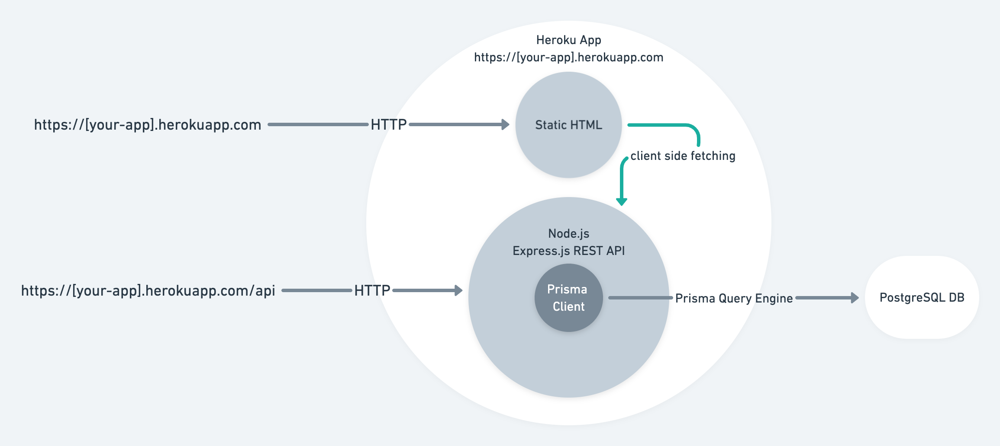
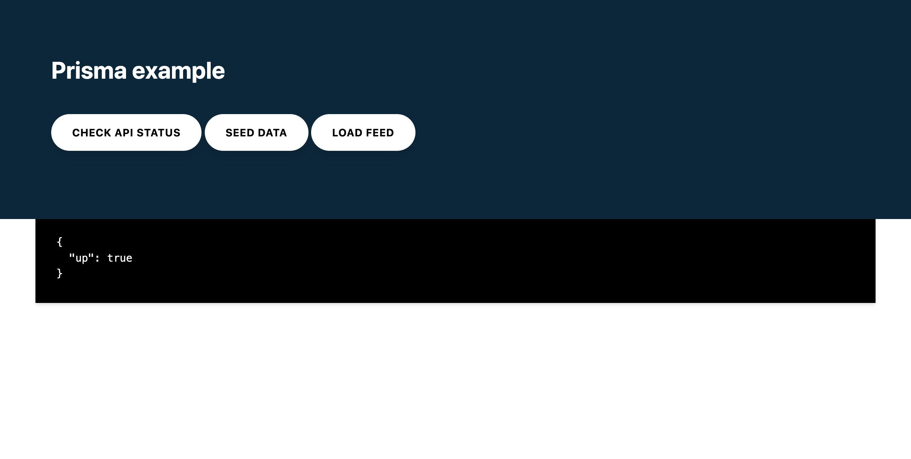

<TopBlock>

In this guide, you will set up and deploy a Node.js server that uses Prisma with PostgreSQL to [Heroku](https://www.heroku.com). The application exposes a REST API and uses Prisma Client to handle fetching, creating, and deleting records from a database.

Heroku is a cloud platform as a service (PaaS). In contrast to the popular serverless deployment model, with Heroku, your application is constantly running even if no requests are made to it. This has several benefits due to the connection limits of a PostgreSQL database. For more information, check out the [general deployment documentation](/guides/deployment)

Typically Heroku integrates with a Git repository for automatic deployments upon commits. You can deploy to Heroku from a GitHub repository or by pushing your source to a [Git repository that Heroku creates per app](https://devcenter.heroku.com/articles/git). This guide uses the latter approach whereby you push your code to the app's repository on Heroku, which triggers a build and deploys the application.

The application has the following components:

- **Backend**: Node.js REST API built with Express.js with resource endpoints that use Prisma Client to handle database operations against a PostgreSQL database (e.g., hosted on Heroku).
- **Frontend**: Static HTML page to interact with the API.



The focus of this guide is showing how to deploy projects using Prisma to Heroku. The starting point will be the [Prisma Heroku example](https://github.com/prisma/prisma-examples/tree/latest/deployment-platforms/heroku), which contains an Express.js server with a couple of preconfigured REST endpoints and a simple frontend.

> **Note:** The various **checkpoints** throughout the guide allowing you to validate whether you performed the steps correctly.

</TopBlock>

## A note on deploying GraphQL servers to Heroku

While the example uses REST, the same principles apply to a GraphQL server, with the main difference being that you typically have a single GraphQL API endpoint rather than a route for every resource as with REST.

## Prerequisites

- [Heroku](https://www.heroku.com) account.
- [Heroku CLI](https://devcenter.heroku.com/articles/heroku-cli) installed.
- Node.js installed.
- PostgreSQL CLI `psql` installed.

> **Note:** Heroku doesn't provide a free plan, so billing information is required.

## Prisma workflow

At the core of Prisma is the [Prisma schema](/concepts/components/prisma-schema) – a declarative configuration where you define your data model and other Prisma-related configuration. The Prisma schema is also a single source of truth for both Prisma Client and Prisma Migrate.

In this guide, you will use [Prisma Migrate](/concepts/components/prisma-migrate) to create the database schema. Prisma Migrate is based on the Prisma schema and works by generating `.sql` migration files that are executed against the database.

Migrate comes with two primary workflows:

- Creating migrations and applying during local development with `prisma migrate dev`
- Applying generated migration to production with `prisma migrate deploy`

For brevity, the guide does not cover how migrations are created with `prisma migrate dev`. Rather, it focuses on the production workflow and uses the Prisma schema and SQL migration that are included in the example code.

You will use Heroku's [release phase](https://devcenter.heroku.com/articles/release-phase) to run the `prisma migrate deploy` command so that the migrations are applied before the application starts.

To learn more about how migrations are created with Prisma Migrate, check out the [start from scratch guide](/getting-started/setup-prisma/start-from-scratch/relational-databases-typescript-postgres)

## 1. Download the example and install dependencies

Open your terminal and navigate to a location of your choice. Create the directory that will hold the application code and download the example code:

```no-lines
mkdir prisma-heroku
cd prisma-heroku
curl https://codeload.github.com/prisma/prisma-examples/tar.gz/latest | tar -xz --strip=3 prisma-examples-latest/deployment-platforms/heroku
```

<!-- tar strip folder is a concatenation of the REPOSITORY-BRANCH/REF, e.g. prisma-examples-latest -->

**Checkpoint:** `ls -1` should show:

```no-lines
ls -1
Procfile
README.md
package.json
prisma
public
src
```

Install the dependencies:

```no-lines
npm install
```

> **Note:** The `Procfile` tells Heroku the command needed to start the application, i.e. `npm start`, and the command to run during the release phase, i.e., `npx prisma migrate deploy`

## 2. Create a Git repository for the application

In the previous step, you downloaded the code. In this step, you will create a repository from the code so that you can push it to Heroku for deployment.

To do so, run `git init` from the source code folder:

```no-lines
git init
> Initialized empty Git repository in /Users/alice/prisma-heroku/.git/
```

To use the `main` branch as the default branch, run the following command:

```no-lines
git branch -M main
```

With the repository initialized, add and commit the files:

```no-lines
git add .
git commit -m 'Initial commit'
```

**Checkpoint:** `git log -1` should show the commit:

```no-lines
git log -1
commit 895534590fdd260acee6396e2e1c0438d1be7fed (HEAD -> main)
```

## 3. Heroku CLI login

Make sure you're logged in to Heroku with the CLI:

```no-lines
heroku login
```

This will allow you to deploy to Heroku from the terminal.

**Checkpoint:** `heroku auth:whoami` should show your username:

```no-lines
heroku auth:whoami
> your-email
```

## 4. Create a Heroku app

To deploy an application to Heroku, you need to create an app. You can do so with the following command:

```no-lines
heroku apps:create your-app-name
```

> **Note:** Use a unique name of your choice instead of `your-app-name`.

**Checkpoint:** You should see the URL and the repository for your Heroku app:

```no-lines
heroku apps:create your-app-name
> Creating ⬢ your-app-name... done
> https://your-app-name.herokuapp.com/ | https://git.heroku.com/your-app-name.git
```

Creating the Heroku app will add the git remote Heroku created to your local repository. Pushing commits to this remote will trigger a deploy.

**Checkpoint:** `git remote -v` should show the Heroku git remote for your application:

```no-lines
heroku https://git.heroku.com/your-app-name.git (fetch)
heroku https://git.heroku.com/your-app-name.git (push)
```

If you don't see the heroku remote, use the following command to add it:

```no-lines
heroku git:remote --app your-app-name
```

## 5. Add a PostgreSQL database to your application

Heroku allows your to provision a PostgreSQL database as part of an application.

Create the database with the following command:

```no-lines
heroku addons:create heroku-postgresql:hobby-dev
```

**Checkpoint:** To verify the database was created you should see the following:

```no-lines
Creating heroku-postgresql:hobby-dev on ⬢ your-app-name... free
Database has been created and is available
 ! This database is empty. If upgrading, you can transfer
 ! data from another database with pg:copy
Created postgresql-parallel-73780 as DATABASE_URL
```

> **Note:** Heroku automatically sets the `DATABASE_URL` environment variable when the app is running on Heroku. Prisma uses this environment variable because it's declared in the _datasource_ block of the Prisma schema (`prisma/schema.prisma`) with `env("DATABASE_URL")`.

## 6. Push to deploy

Deploy the app by pushing the changes to the Heroku app repository:

```no-lines
git push heroku main
```

This will trigger a build and deploy your application to Heroku. Heroku will also run the `npx prisma migrate deploy` command which executes the migrations to create the database schema before deploying the app (as defined in the `release` step of the `Procfile`).

**Checkpoint:** `git push` will emit the logs from the build and release phase and display the URL of the deployed app:

```no-lines
remote: -----> Launching...
remote:  !     Release command declared: this new release will not be available until the command succeeds.
remote:        Released v5
remote:        https://your-app-name.herokuapp.com/ deployed to Heroku
remote:
remote: Verifying deploy... done.
remote: Running release command...
remote:
remote: Prisma schema loaded from prisma/schema.prisma
remote: Datasource "db": PostgreSQL database "your-db-name", schema "public" at "your-db-host.compute-1.amazonaws.com:5432"
remote:
remote: 1 migration found in prisma/migrations
remote:
remote: The following migration have been applied:
remote:
remote: migrations/
remote:   └─ 20210310152103_init/
remote:     └─ migration.sql
remote:
remote: All migrations have been successfully applied.
remote: Waiting for release.... done.
```

> **Note:** Heroku will also set the `PORT` environment variable to which your application is bound.

## 7. Test your deployed application

You can use the static frontend to interact with the API you deployed via the preview URL.

Open up the preview URL in your browser, the URL should like this: `https://APP_NAME.herokuapp.com`. You should see the following:



The buttons allow you to make requests to the REST API and view the response:

- **Check API status**: Will call the REST API status endpoint that returns `{"up":true}`.
- **Seed data**: Will seed the database with a test `user` and `post`. Returns the created users.
- **Load feed**: Will load all `users` in the database with their related `profiles`.

For more insight into Prisma Client's API, look at the route handlers in the `src/index.js` file.

You can view the application's logs with the `heroku logs --tail` command:

```no-lines
2020-07-07T14:39:07.396544+00:00 app[web.1]:
2020-07-07T14:39:07.396569+00:00 app[web.1]: > prisma-heroku@1.0.0 start /app
2020-07-07T14:39:07.396569+00:00 app[web.1]: > node src/index.js
2020-07-07T14:39:07.396570+00:00 app[web.1]:
2020-07-07T14:39:07.657505+00:00 app[web.1]: 🚀 Server ready at: http://localhost:12516
2020-07-07T14:39:07.657526+00:00 app[web.1]: ⭐️ See sample requests: http://pris.ly/e/ts/rest-express#3-using-the-rest-api
2020-07-07T14:39:07.842546+00:00 heroku[web.1]: State changed from starting to up
```

## Heroku specific notes

There are some implementation details relating to Heroku that this guide addresses and are worth reiterating:

- **Port binding**: web servers bind to a port so that they can accept connections. When deploying to Heroku The `PORT` environment variable is set by Heroku. Ensure you bind to `process.env.PORT` so that your application can accept requests once deployed. A common pattern is to try binding to try `process.env.PORT` and fallback to a preset port as follows:

```js
const PORT = process.env.PORT || 3000
const server = app.listen(PORT, () => {
  console.log(`app running on port ${PORT}`)
})
```

- **Database URL**: As part of Heroku's provisioning process, a `DATABASE_URL` config var is added to your app’s configuration. This contains the URL your app uses to access the database. Ensure that your `schema.prisma` file uses `env("DATABASE_URL")` so that Prisma Client can successfully connect to the database.

## Summary

Congratulations! You have successfully deployed a Node.js app with Prisma to Heroku.

You can find the source code for the example in [this GitHub repository](https://github.com/prisma/prisma-examples/tree/latest/deployment-platforms/heroku).

For more insight into Prisma Client's API, look at the route handlers in the `src/index.js` file.
