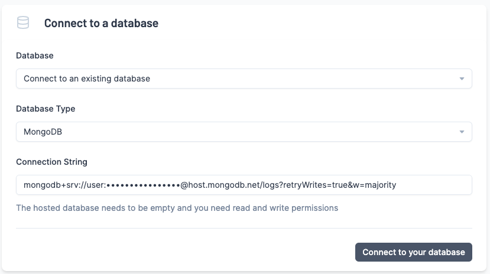
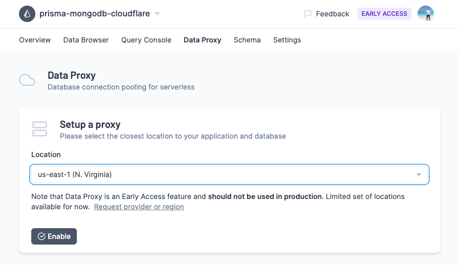
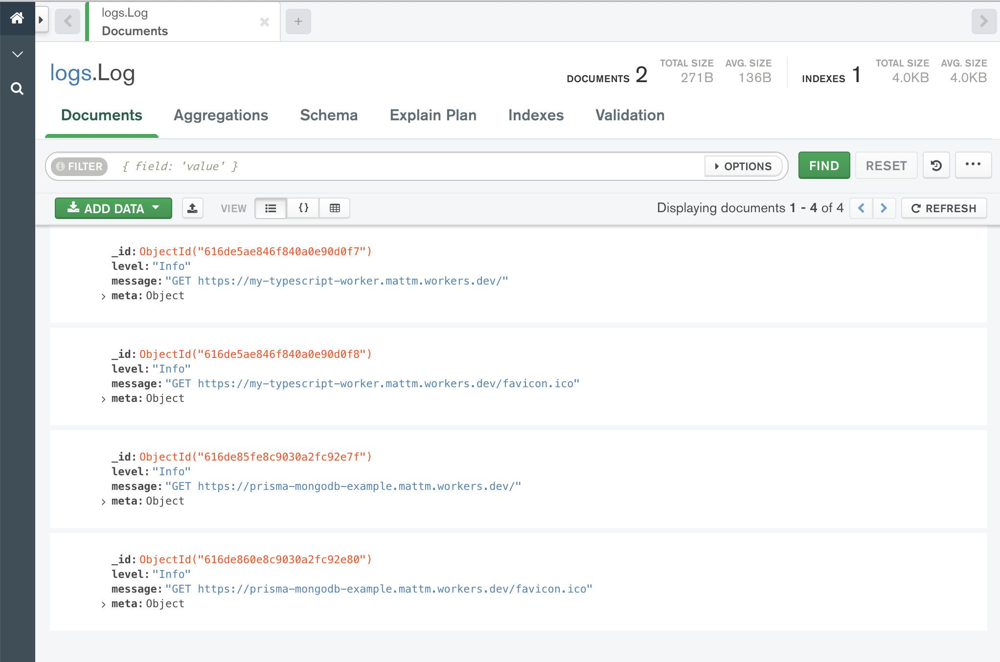

<TopBlock>

Today you'll be building and deploying a Cloudflare Worker that uses Prisma to save every request to a MongoDB database for inspection later.

This guide will cover Prisma, Typescript, MongoDB, Prisma Data Proxy and Cloudflare Workers from the ground up. Let's get started!

</TopBlock>

<Admonition type="warning">
  Please be aware that the Data Proxy is in Early Access and should not be used in production
</Admonition>

## Prerequisites

- Free [MongoDB Atlas](https://www.mongodb.com/cloud/atlas) database with an accessible URL
  - e.g. `mongodb+srv://<user>:<password>@cluster.mongodb.net`.
- Free [Cloudflare Worker](https://workers.cloudflare.com/) account.
- Free [GitHub](https://github.com/) account.
- Node.js & NPM installed.
- Git installed.

## 1. Setup your Application

Open your terminal and navigate to a location of your choice. Run the following to commands to setup your application.

```terminal
mkdir prisma-mongodb-cloudflare
cd prisma-mongodb-cloudflare
npm init -y
npm install -D prisma typescript @cloudflare/wrangler
```

## 3. Setup Wrangler

Wrangler is the official Cloudflare Worker CLI. You'll use it to develop and deploy Cloudflare Workers.

```terminal
npx wrangler init
```

This will create a `wrangler.toml` with some initial configuration.

Next, you'll want to authenticate the Wrangler CLI with your Cloudflare Worker account. To do this, run the following command in your terminal:

```terminal
npx wrangler login
Allow Wrangler to open a page in your browser? [y/n] y
```

You can verify that you're logged in by running `npx wrangler whoami`.

## 4. Setup Typescript

The Cloudflare Worker environment natively supports Javascript, Rust, C, and C++. To get Typescript working on Cloudflare Workers, you need to compile Typescript to Javascript before deploying to a Worker.

To setup this up, create a `tsconfig.json` in your project root with the following:

```json
{
  "compilerOptions": {
    "outDir": "./dist",
    "module": "commonjs",
    "target": "esnext",
    "lib": ["esnext"],
    "alwaysStrict": true,
    "strict": true,
    "preserveConstEnums": true,
    "moduleResolution": "node",
    "sourceMap": true,
    "esModuleInterop": true,
    "types": ["@cloudflare/workers-types"]
  },
  "include": ["src"],
  "exclude": ["node_modules", "dist"]
}
```

And install `@cloudflare/workers-types` with npm:

```terminal
npm install -D @cloudflare/workers-types ts-loader@8.3.0
```

<Admonition type="info">
  You need to pin `ts-loader` for the Wrangler CLI to work properly. See [this
  issue](https://github.com/cloudflare/wrangler/issues/1927) for more details.
</Admonition>

## 5. Setup Webpack

Wrangler has built-in webpack support that can be used to compile your code in development and before publishing on Cloudflare.

To set this up, first create a `webpack.config.js` in the project root with the following code:

```js
const path = require('path')

module.exports = {
  entry: './src/index.ts',
  output: {
    filename: 'worker.js',
    path: path.join(__dirname, 'dist'),
  },
  // Cloudflare Worker environment is similar to a webworker
  target: 'webworker',
  resolve: {
    extensions: ['.ts', '.tsx', '.js'],
    // Alias to tell resolve the Prisma Client properly
    alias: {
      '@prisma/client$': require.resolve('@prisma/client'),
    },
  },
  mode: 'development',
  // Wrangler doesn't like eval which devtools use in development.
  devtool: 'none',
  module: {
    rules: [
      {
        // Compile Typescript code
        test: /\.tsx?$/,
        loader: 'ts-loader',
        options: {
          transpileOnly: true,
        },
      },
    ],
  },
}
```

## 6. Setup Prisma

Now you're ready to add Prisma to the project.

```terminal
npx prisma init
```

This will create a Prisma Schema in `prisma/schema.prisma` and an `.env` file.

Inside `prisma/schema.prisma`, add the following schema:

```prisma
generator client {
  provider        = "prisma-client-js"
  previewFeatures = ["mongoDb", "dataProxy"]
}

datasource db {
  provider = "mongodb"
  url      = env("DATABASE_URL")
}

model Log {
  id      String @id @default(dbgenerated()) @map("_id") @db.ObjectId
  level   Level
  message String
  meta    Json
}

enum Level {
  Info
  Warn
  Error
}
```

This data model will be used to store incoming requests from your Worker.

## 7. Create Repository and Push to GitHub

To prepare for the steps ahead, let's [create a private repository](https://github.com/new) on GitHub.


Next, initialize your repository, then push your changes up to GitHub.

```terminal
git init -b main
git remote add origin https://github.com/<username>/prisma-mongodb-cloudflare
git add .
git commit -m "initial commit"
git push -u origin main
```

You're ready to import your project into the Prisma Data Platform.

## 8. Importing your Project into the Prisma Data Platform

With Cloudflare Workers, you can't directly access your database because there is no TCP support. Fortunately, Prisma has your back with the Prisma Data Proxy.

To get started, signup for a free [Prisma Data Platform account](https://cloud.prisma.io/).


Once you're in, Click on a **New Project**, then **Import a Project**. Fill in the following details:


And click **Create Project**. If all goes well, you will be asked to connect your database:


<Admonition type="info">
  If you're seeing errors, double-check that the repository exists on GitHub,
  and the branch and paths are correct.
</Admonition>

Next, you'll connect to the Prisma Data Platform with your MongoDB Atlas database:



<Admonition type="warning">
  If you see, "The database needs to be empty to proceed", you can simply use a
  different database name. Using the screenshot above, that would be renaming
  logs to something else.
</Admonition>

## 9. Enable the Prisma Data Proxy

Now you're ready to enable the Data Proxy, head over to **Data Proxy** tab and setup the Proxy in a location near you.



Once you click **Enable**, you'll be greeted with a new connection string that starts with `prisma://`. Copy this connection string to your clipboard.

Hop back into your code editor and paste that connection string into your `.env` file:

```env
DATABASE_URL="prisma://aws-us-east-1.prisma-data.com/?api_key=•••••••••••••••••"
```

You're all setup and ready to generate a Prisma Client!

<Admonition type="warning">
  Please be aware that the Data Proxy is in Early Access and should not be used in production
</Admonition>

## 10. Generate a Prisma Client

Next you'll generate a Prisma Client that connects through the Data Proxy over HTTP.

```terminal
PRISMA_CLIENT_ENGINE_TYPE=dataproxy npx prisma generate
```

This client is optimized for edge environments like Cloudflare Workers.

<Admonition type="warning">
  Please be aware that the proxy-enabled Prisma Client is in Early Access and
  subject to change.
</Admonition>

## 11. Develop the Cloudflare Worker function

You're ready to create a Cloudflare Worker. Create an `src/index.ts` with the following code:

```ts
import { PrismaClient } from '@prisma/client'
const prisma = new PrismaClient()

addEventListener('fetch', (event) => {
  event.respondWith(handleRequest(event.request))
})

async function handleRequest(request: Request): Promise<Response> {
  await prisma.log.create({
    data: {
      level: 'Info',
      message: `${request.method} ${request.url}`,
      meta: {
        headers: JSON.stringify(request.headers),
      },
    },
  })
  return new Response(`request method: ${request.method}!`)
}
```

Run `npx wrangler dev` to see your worker in development:

```
👂  Listening on http://127.0.0.1:8787
```

Go ahead an open `http://127.0.0.1:8787`. If all goes well, you should see:

```
request method: GET!
```

And if you check you're database, you should see info logs written to your database



It's working locally!

## 11. Publishing to Cloudflare Workers

You're now ready to deploy to Cloudflare Workers. Run the following command

```terminal
npx wrangler publish
```

This will pack your application with webpack and upload to Cloudflare. With a bit of luck, you'll see the following:

```
✨  Built successfully, built project size is 94 KiB.
✨  Successfully published your script to
https://prisma-mongodb-cloudflare.mattm.workers.dev
```

Visit your deployment URL and you'll again see:

```
request method: GET!
```

You're all set! You've successfully deployed a Cloudflare Worker written in Typescript that uses Prisma to talk to your MongoDB database.

Give yourself a pat on the back, you deserve it!
