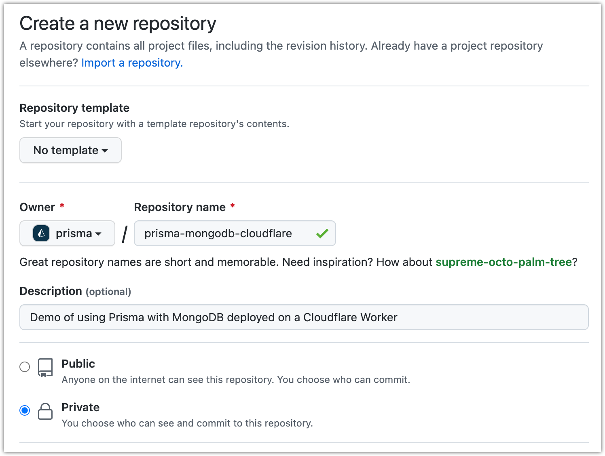
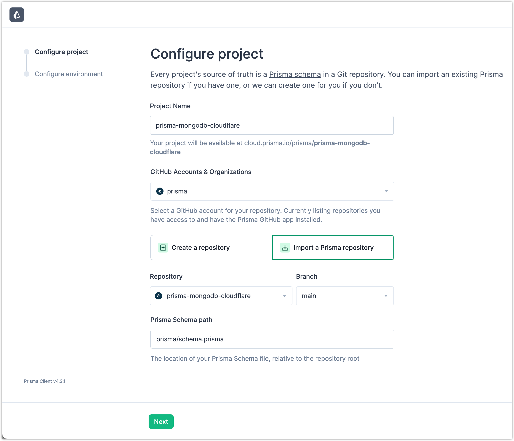
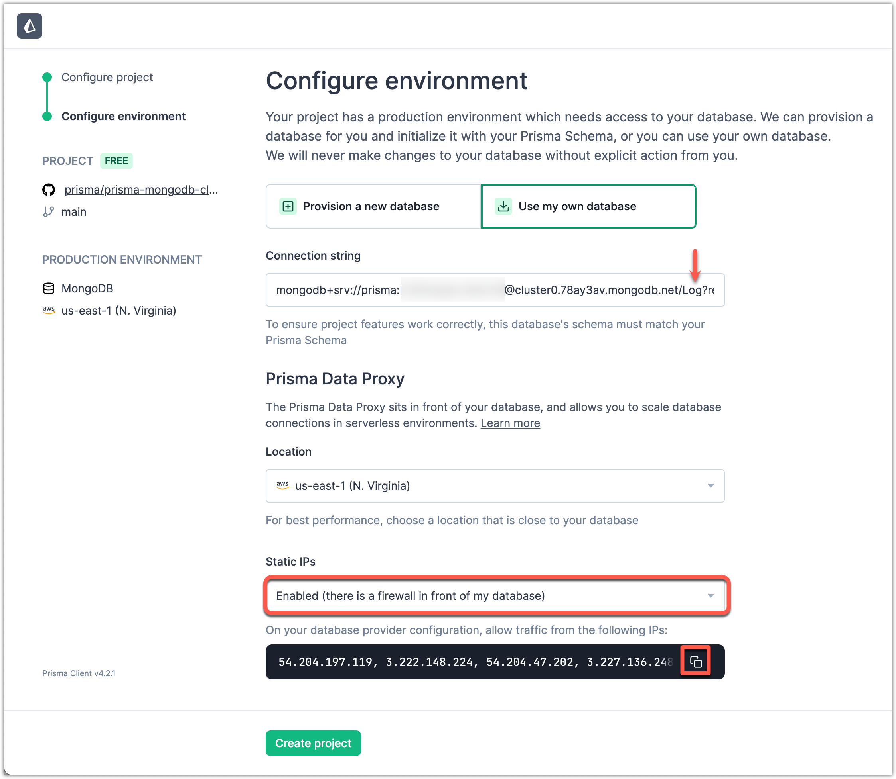
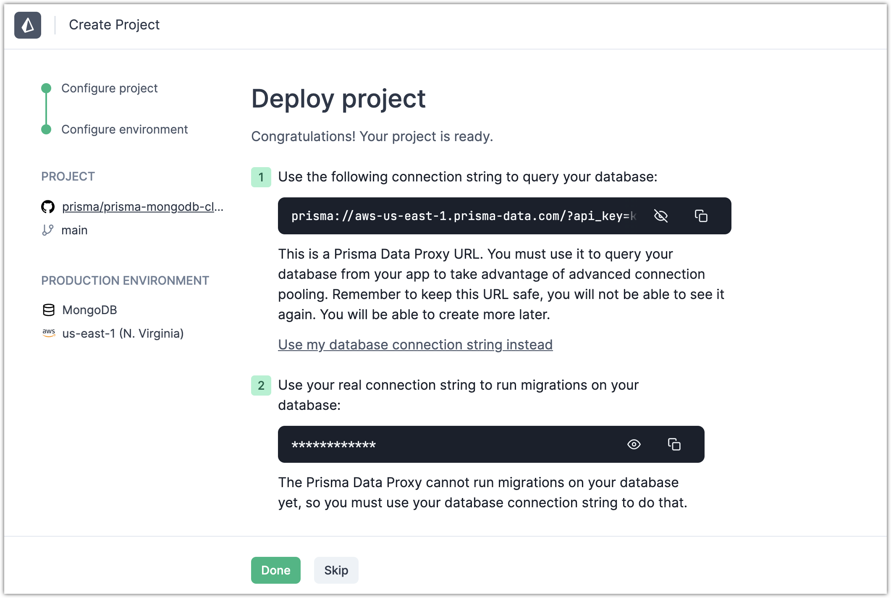
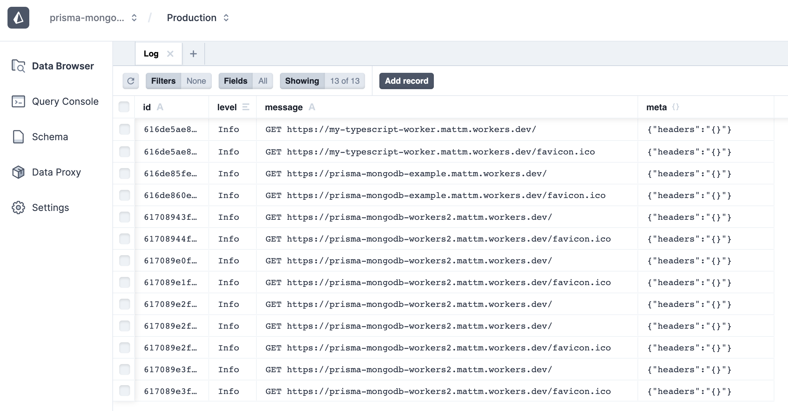

<TopBlock>

Today you'll be building and deploying a Cloudflare Worker that uses Prisma to save every request to a MongoDB database for inspection later.

This guide will cover Prisma, TypeScript, MongoDB, Data Proxy and Cloudflare Workers from the ground up. Let's get started!

<Admonition type="warning">

**Note**<br /><br />
We are continuously testing the Data Proxy with Cloudflare Workers. [Open an issue](https://github.com/prisma/prisma/issues/new/choose) if you run into problems or have questions about deploying to Cloudflare Workers.

</Admonition>

</TopBlock>


## Prerequisites

- Free [MongoDB Atlas](https://www.mongodb.com/cloud/atlas) database with an accessible URL
  - e.g. `mongodb+srv://<user>:<password>@cluster.mongodb.net`.
- Free [Cloudflare Worker](https://workers.cloudflare.com/) account.
- Free [GitHub](https://github.com/) account.
- Node.js & NPM installed.
- Git installed.

## 1. Set up your Application

Open your terminal and navigate to a location of your choice. Run the following commands to set up your application.

```terminal
mkdir prisma-mongodb-cloudflare
cd prisma-mongodb-cloudflare
npm init -y
npm install -D prisma typescript @cloudflare/wrangler webpack
```

## 2. Set up Wrangler

Wrangler is the official Cloudflare Worker CLI. You'll use it to develop and deploy Cloudflare Workers.

```terminal
npx wrangler init
```

This will create a `wrangler.toml` file with some initial configuration.

Next, you'll want to authenticate the Wrangler CLI with your Cloudflare Worker account. To do this, run the following command in your terminal:

```terminal
npx wrangler login
Allow Wrangler to open a page in your browser? [y/n] y
```

You can verify that you're logged in by running `npx wrangler whoami`.

## 3. Set up TypeScript

The Cloudflare Worker environment natively supports Javascript, Rust, C, and C++. To get TypeScript working on Cloudflare Workers, you need to compile TypeScript to JavaScript before deploying to a Worker.

To setup this up, create a `tsconfig.json` in your project root with the following content:

```json
{
  "compilerOptions": {
    "outDir": "./dist",
    "module": "commonjs",
    "target": "esnext",
    "lib": ["esnext"],
    "alwaysStrict": true,
    "strict": true,
    "preserveConstEnums": true,
    "moduleResolution": "node",
    "sourceMap": true,
    "esModuleInterop": true,
    "types": ["@cloudflare/workers-types"]
  },
  "include": ["src"],
  "exclude": ["node_modules", "dist"]
}
```

And then install `@cloudflare/workers-types` with npm:

```terminal
npm install -D @cloudflare/workers-types ts-loader@8.3.0
```

<Admonition type="info">

You need to pin `ts-loader` for the Wrangler CLI to work properly. See [this issue](https://github.com/cloudflare/wrangler/issues/1927) for more details.

</Admonition>

## 4. Set up Webpack

Wrangler has built-in webpack support that can be used to compile your code in development and before publishing on Cloudflare.

To configure webpack support, first create a `webpack.config.js` in the project root with the following code:

```js
const path = require('path')

module.exports = {
  entry: './src/index.ts',
  output: {
    filename: 'worker.js',
    path: path.join(__dirname, 'dist'),
  },
  // Cloudflare Worker environment is similar to a webworker
  target: 'webworker',
  resolve: {
    extensions: ['.ts', '.tsx', '.js'],
  },
  mode: 'development',
  // wrangler doesn't like eval which devtools use in development
  devtool: 'none',
  module: {
    rules: [
      {
        // Compile Typescript code
        test: /\.tsx?$/,
        loader: 'ts-loader',
        options: {
          transpileOnly: true,
        },
      },
    ],
  },
}
```

Next, add the following line to your `wrangler.toml` file to point Wrangler to use this webpack configuration:

```diff
  name = "prisma-mongodb-cloudflare"
  type = "webpack"
+ webpack_config = "webpack.config.js"
```

## 5. Set up Prisma

Now you're ready to add Prisma to the project.

```terminal
npx prisma init
```

This creates a Prisma Schema in `prisma/schema.prisma`.

**Note:** This process also creates an `.env` file, but this file has no effect when you use Cloudflare Workers.

Inside `prisma/schema.prisma`, add the following schema:

```prisma
generator client {
  provider = "prisma-client-js"
}

datasource db {
  provider = "mongodb"
  url      = env("DATABASE_URL")
}

model Log {
  id      String @id @default(auto()) @map("_id") @db.ObjectId
  level   Level
  message String
  meta    Json
}

enum Level {
  Info
  Warn
  Error
}
```

This data model will be used to store incoming requests from your Worker.

## 6. Create Repository and Push to GitHub

To prepare for the steps ahead, let's [create a private repository](https://github.com/new) on GitHub.



Next, initialize your repository, then push your changes up to GitHub.

```terminal
git init -b main
git remote add origin https://github.com/<username>/prisma-mongodb-cloudflare
git add .
git commit -m "initial commit"
git push -u origin main
```

You're ready to import your project into the Prisma Data Platform.

## 7. Importing your Project into the Prisma Data Platform

With Cloudflare Workers, you can't directly access your database because there is no TCP support. Fortunately, Prisma has your back with the [Data Proxy](/data-platform/data-proxy).

To get started, sign up for a free [Prisma Data Platform account](https://cloud.prisma.io/).


Once you're in, click **New Project**, then **Import a Project**. Fill in the repository and project details, and then click **Create Project**.



Next, you'll connect the Prisma Data Platform to MongoDB Atlas database and set up the Data Proxy:



Click **Create Project** to test the connection and set up the Data Proxy.

<Admonition type="warning">

If you see, "The database needs to be empty to proceed", you can simply use a
different database name. Using the screenshot above, that would be renaming
`logs` to something else.

</Admonition>

If all goes well, you'll be greeted with a new connection string that starts with `prisma://`. Copy this connection string to your clipboard.



Then you can hop back into your code editor and paste the connection string into your `wrangler.toml` file:

```diff
  name = "prisma-mongodb-cloudflare"
  type = "webpack"
  webpack_config = "webpack.config.js"

+ [vars]
+ DATABASE_URL = "prisma://aws-us-east-1.prisma-data.com/?api_key=•••••••••••••••••"
```

You're all setup and ready to generate a Prisma Client!

## 9. Generate a Prisma Client

Next you'll generate a Prisma Client that connects through the [Data Proxy](/data-platform/data-proxy) over HTTP.

```terminal
npx prisma generate --data-proxy
```

This client is optimized for edge environments like Cloudflare Workers.

## 10. Develop the Cloudflare Worker function

You're now ready to create a Cloudflare Worker. Create a `src/index.ts` file with the following code:

```ts
import { PrismaClient } from '@prisma/client/edge'
const prisma = new PrismaClient()

addEventListener('fetch', (event) => {
  event.respondWith(handleEvent(event))
})

async function handleEvent(event: FetchEvent): Promise<Response> {
  const { request } = event

  // waitUntil method is used for sending logs, after response is sent
  event.waitUntil(
    prisma.log.create({
      data: {
        level: 'Info',
        message: `${request.method} ${request.url}`,
        meta: {
          headers: JSON.stringify(request.headers),
        },
      },
    })
  )

  return new Response(`request method: ${request.method}!`)
}
```

Run `npx wrangler dev` to see your worker in development:

```
👂  Listening on http://127.0.0.1:8787
```

Go ahead and open `http://127.0.0.1:8787`. If all goes well, you should see:

```
request method: GET!
```

Refresh the page a couple times to verify that it's working. Now if you click on the **Data Browser** tab on your Prisma Cloud project, you should see `Info` logs written to your database.



It's working locally!

## 11. Publishing to Cloudflare Workers

You're now ready to deploy to Cloudflare Workers. Run the following command:

```terminal
npx wrangler publish
```

This will pack your application with webpack and upload to Cloudflare. With a bit of luck, you'll see the following:

```
✨  Built successfully, built project size is 94 KiB.
✨  Successfully published your script to
https://prisma-mongodb-cloudflare.mattm.workers.dev
```

Visit your deployment URL and you'll again see:

```
request method: GET!
```

You're all set! You've successfully deployed a Cloudflare Worker written in TypeScript that uses Prisma to talk to your MongoDB database.

Give yourself a pat on the back, you deserve it!
