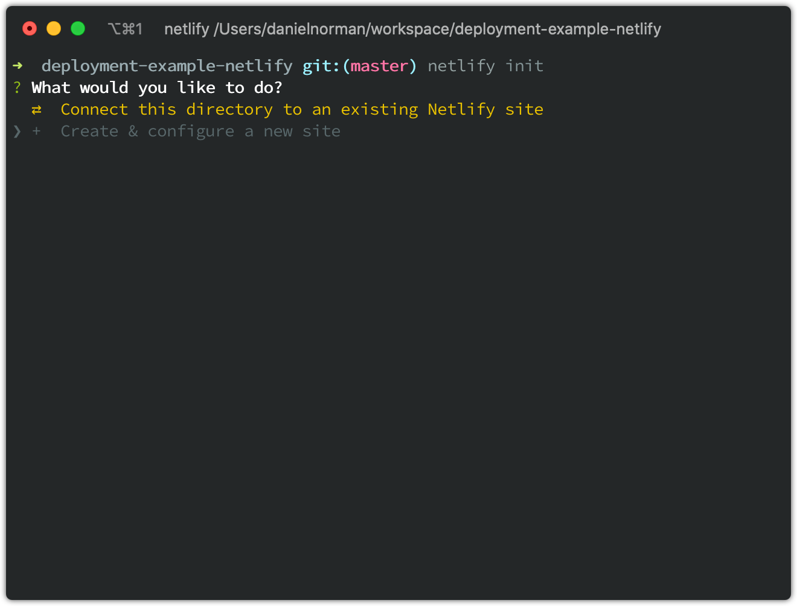
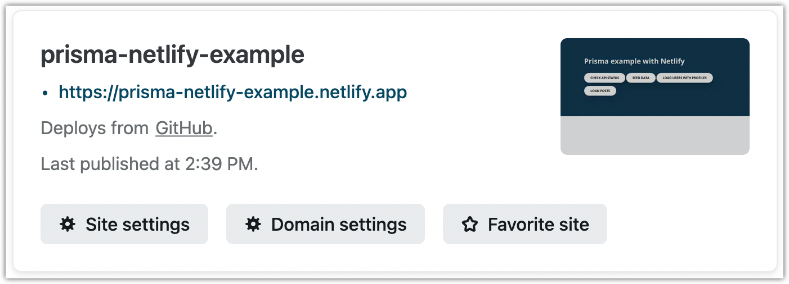
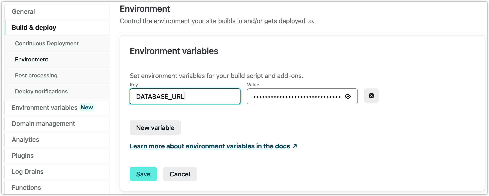

<TopBlock>

This guide shows how to deploy a Node.js application that uses Prisma to [Netlify](https://www.netlify.com/).

Netlify is a cloud platform for continuous deployment, static sites, and serverless functions. Netlify integrates seamlessly with GitHub for automatic deployments upon commits. When you follow the steps below, you will use that approach to create a CI/CD pipeline that deploys your application from a GitHub repository.

With Netlify, the fundamental building block is a [**Site**](https://docs.netlify.com/configure-builds/get-started/). Sites are typically connected to a Git repository and have a publicly accessible URL that looks like `https://site-name.netlify.app`. In this guide, you will connect a GitHub repository to a Netlify site.

</TopBlock>

## Prerequisites

- An existing project using Prisma (this example uses a Next.js application, but can be applied to any application using Prisma)
- A [Netlify](https://www.netlify.com/) account connected to your GitHub account (Netlify needs access to the repository you will deploy as part of this guide).
- [Netlify CLI](https://docs.netlify.com/cli/get-started/) installed

## 1. Log in to Netlify

To use Netlify CLI to create your site, you must first log in to Netlify from the CLI.

### Steps

1. Log in with the Netlify CLI.

   ```terminal
   netlify login
   ```

   In your default browser, a new tab is redirected to a Netlify page where you can authorize Netlify CLI to access Netlify on your behalf.

2. Click **Authorize**.

Make sure `netlify status` in your terminal returns your account name and email.

```terminal
netlify status
──────────────────────┐
 Current Netlify User │
──────────────────────┘
Name: your name
Email: your@email.com
Teams:
  ....
```

## 2. Configure Netlify

You can now create your Netlify site and configure continuous deployments for it.

### Steps

1. From your project root, run `netlify init`.

   ```terminal
   netlify init
   ```

2. Use the configuration prompts to configure your Netlify site.

   

   1. Select `Create & configure a new site`.
   2. If prompted to select your team, pick the one in which Netlify will create the site.
   3. Give the site a unique name, or use the default. It can be updated in the future.
   4. Authorize Netlify with your GitHub account. Netlify uses your GitHub account to configure notification webhooks and deploy keys. It uses these to configure the continuous integration for the app.
   5. _Your build command_: The command you use to build your project. Common examples include `npm run build`, `yarn run build`, `next build`, etc.
   6. _Directory to deploy_: Generally, the directory that your `build` command outputs to. Common examples include `dist/`, `build/`, `.next`, etc.
   7. Allow Netlify to create a `netlify.toml` file.

Netlify has now setup your site and connected your GitHub repo to it! You should now be able to use `netlify open` to view the Admin page of your newly created Site.

If your Prisma schema tries to load a connection string from `env`, you will be able to open your app but you will see errors when queries are attempted against the database. This is because Netlify does not bundle the `.env` file with your application on deployment. You will need to make sure that your environment variables are uploaded to Netlify during your build/deploy process [as discussed in the Netlify documentation](https://docs.netlify.com/environment-variables/get-started/#work-with-env-files) and summarized below.

## 8. Store environment variables in Netlify

We recommend keeping `.env` files in your `.gitignore` in order to prevent leakage of sensitives connection strings. Instead, you can use the Netlify CLI to [import values into netlify directly](https://docs.netlify.com/environment-variables/get-started/#import-variables-with-the-netlify-cli).

Assuming you have a file like the following:

```env file=.env
# Connect to DB
DATABASE_URL="postgresql://postgres:__PASSWORD__@__HOST__:__PORT__/__DB_NAME__"
```

You can upload the file as environment variables using the `env:import` command

```terminal
❯ netlify env:import .env
site: my-very-very-cool-site
.---------------------------------------------------------------------------------.
|                         Imported environment variables                          |
|---------------------------------------------------------------------------------|
|     Key      |                              Value                               |
|--------------|------------------------------------------------------------------|
| DATABASE_URL | postgresql://postgres:__PASSWORD__@__HOST__:__PORT__/__DB_NAME__ |
'---------------------------------------------------------------------------------'
```

<details>
<summary>If you are not using an <inlinecode>.env</inlinecode> file</summary>

If you are storing your database connection string and other environment variables in a different method, you will need to manually upload your environment variables to Netlify. These options are [discussed in Netlfiy's documentation](https://docs.netlify.com/environment-variables/get-started/) and one method, uploading via the UI, is described below.

1. Open the Netlify admin UI for the site. You can use Netlify CLI as follows:
   ```terminal
   netlify open --admin
   ```
2. Click **Site settings**:
   
3. Navigate to **Build & deploy** in the sidebar on the left and select **Environment**.
4. Click **Edit variables** and create a variable with the key `DATABASE_URL` and set its value to your database connection string.
   
5. Click **Save**.

</details>

Now start a new Netlify build and deployment so that the new build can use the newly uploaded environment variables.

```terminal no-copy
netlify deploy
```

You can now test the deployed application.

## Summary

You have successfully configured continuous deployments and integration with Netlify for an application that uses Prisma.

Every time you push changes to the `main` branch of the repository, Netlify starts a new production build and deployment. If you push changes to another branch, Netlify starts preview builds and deployments.

When you use a FaaS (function as a service) environment to interact with a database, it is beneficial to pool database connections for performance reasons. This is because every function invocation may result in a new connection to the database (this is not a problem with a constantly running node.js server).

You can use the [Data Proxy](/data-platform/data-proxy) for connection pooling, to reduce your Prisma Client bundle size, and to avoid cold starts.

For more information on the rest of the existing solutions, refer to the [connection management guide for serverless environments](/guides/performance-and-optimization/connection-management#serverless-environments-faas).
