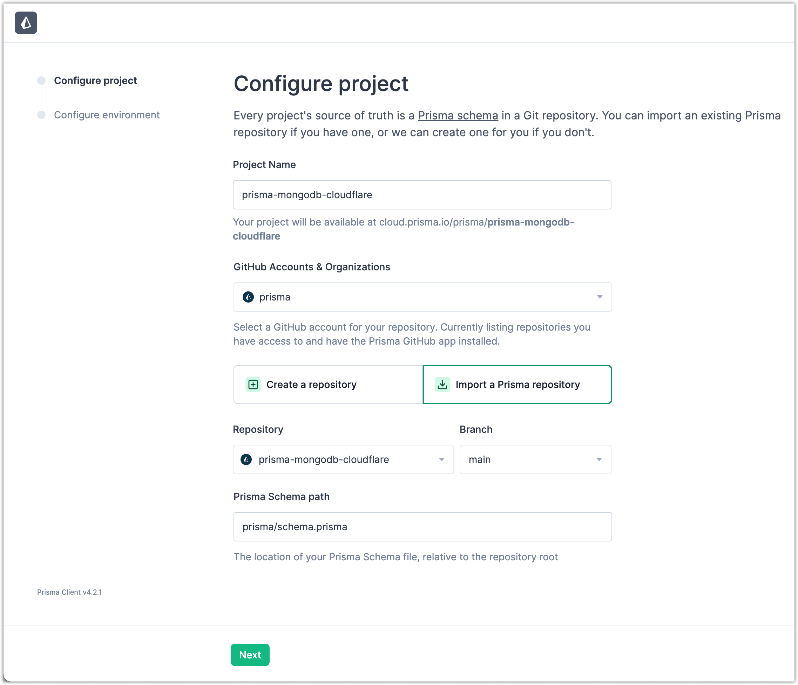
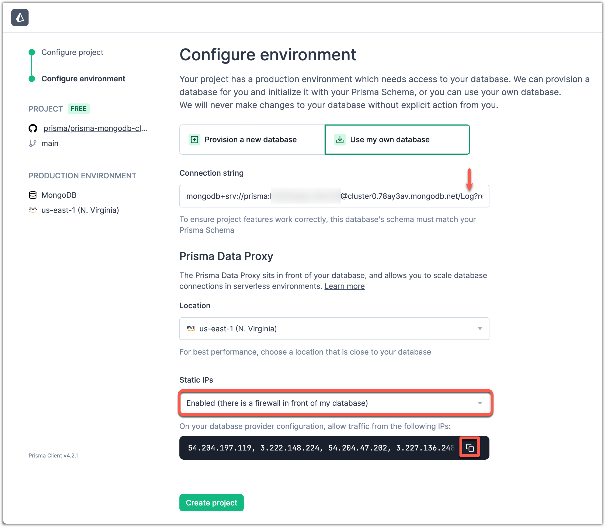
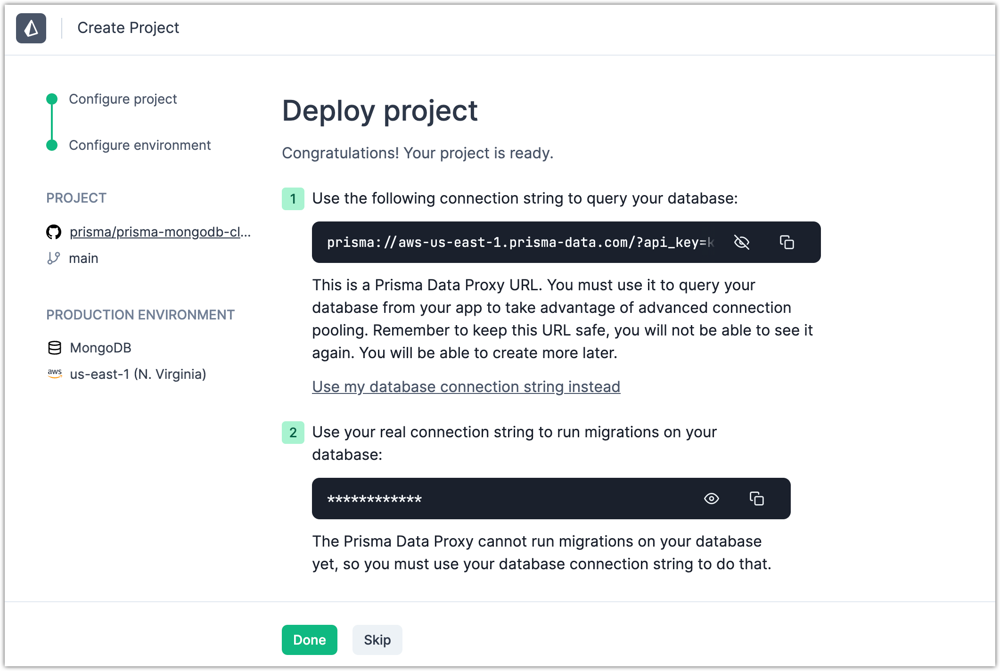

<TopBlock>

Today you'll be building and deploying a Cloudflare Worker that uses Prisma to save every request to a MongoDB database for inspection later.

This guide covers Prisma, TypeScript, MongoDB, Data Proxy, and Cloudflare Workers from the ground up. Let's get started!

<Admonition type="warning">

**Note**<br /><br />
We are continuously testing the Data Proxy with Cloudflare Workers. [Open an issue](https://github.com/prisma/prisma/issues/new/choose) if you run into problems or have questions about deploying to Cloudflare Workers.

</Admonition>

</TopBlock>

## Prerequisites

- Free [MongoDB Atlas](https://www.mongodb.com/cloud/atlas) account
- Free [Cloudflare Workers](https://workers.cloudflare.com/) account
- Free [GitHub](https://github.com/) account
- Node.js & NPM installed
- Git installed

## 1. Get a MongoDB Atlas connection string

After you create a MongoDB Atlas database cluster, you can get its connection string. By default, that connection string does not include a database name.

When you import your project in the Prisma Data Platform at [step 6](#6-import-your-project-into-the-prisma-data-platform), you must provide a connection string that includes a database name.

However, you do not need to manually create a database in MongoDB Atlas. The project creation workflow in the Prisma Data Platform will create a database with the name you define in the connection string.

1. [Create a free shared cluster](https://www.mongodb.com/docs/atlas/tutorial/create-new-cluster/) in MongoDB Atlas.
2. On the _Security Quickstart_ screen, complete the initial security configuration.
   1. Add a new database user.
   2. Click **Add My Current IP Address** so that you can connect to the MongoDB shared cluster from your current system.
   3. Click **Finish and Close**.
3. [Get the database cluster connection string](https://www.mongodb.com/docs/guides/atlas/connection-string/).
4. Paste the connection string in a text editor and add the collection name `Log`.

   The code sample below shows a connection string, that is originally provided by MongoDB Atlas, with the database name now added.

   ```diff
   # The first line is a default-style MongoDB Atlas connection string.
   # The second line includes the inserted `Log` database name.
   - mongodb+srv://<user>:<password>@cluster.mongodb.net/?retryWrites=true&w=majority
   + mongodb+srv://<user>:<password>@cluster.mongodb.net/Log?retryWrites=true&w=majority
   ```

You now have a complete connection string. You will paste the connection string when you create your project in [6. Import your project into the Prisma Data Platform](#6-import-your-project-into-the-prisma-data-platform).

For security reasons, do not keep the connection string in the text editor or save it in a text file.

## 2. Set up your application

Open your terminal and navigate to a location of your choice. Run the following commands to set up your application.

```terminal
mkdir prisma-mongodb-cloudflare
cd prisma-mongodb-cloudflare
npm init -y
npm install -D prisma typescript wrangler
```

## 3. Set up Wrangler

Wrangler is the official Cloudflare Worker CLI. You will use it to develop and deploy to Cloudflare Workers. This guide uses [Wrangler v2](https://developers.cloudflare.com/workers/wrangler/).

First, initialize Wrangler. To do this, run the following command in your terminal:

```terminal
npx wrangler init
```

This will ask you a few questions.

```terminal
Would you like to use git to manage this Worker? (y/n)
```

We want to use Git, so answer yes.

```terminal
Would you like to use TypeScript? (y/n)
```

We also want to use TypeScript, so answer yes.

```terminal
Would you like to create a Worker at src/index.ts?
```

Select the `Fetch Handler` option.

Once you're done, this will create a `wrangler.toml` file with some initial configuration.

Next, authenticate the Wrangler CLI with your Cloudflare Workers account. To do this, run the following command in your terminal:

```terminal
npx wrangler login
```

You can now verify that you're logged in by running `npx wrangler whoami`.

```terminal
npx wrangler whoami
```

## 4. Set up Prisma

Now you're ready to add Prisma to the project.

```terminal
npx prisma init
```

This creates a Prisma schema in `prisma/schema.prisma`.

<Admonition>

**Note:**<br /><br />

This process also creates an `.env` file, but this file has no effect when you use Cloudflare Workers.

</Admonition>

Inside `prisma/schema.prisma`, add the following schema:

```prisma
generator client {
  provider = "prisma-client-js"
}

datasource db {
  provider = "mongodb"
  url      = env("DATABASE_URL")
}

model Log {
  id      String @id @default(auto()) @map("_id") @db.ObjectId
  level   Level
  message String
  meta    Json
}

enum Level {
  Info
  Warn
  Error
}
```

This data model will be used to store incoming requests from your Worker.

## 5. Create a repository and push to GitHub

To prepare for the steps ahead, let's [create a private repository](https://github.com/new) on GitHub.


Next, initialize your repository, then push your changes up to GitHub.

```terminal
git remote add origin https://github.com/<username>/prisma-mongodb-cloudflare
git add .
git commit -m "initial commit"
git push -u origin main
```

You're ready to import your project into the Prisma Data Platform.

## 6. Import your Project into the Prisma Data Platform

With Cloudflare Workers, you can't directly access your database because there is no TCP support. Fortunately, Prisma has your back with the [Data Proxy](/data-platform/classic-projects/data-proxy).

1. To get started, sign up for a free [Prisma Data Platform account](https://cloud.prisma.io/).

   <Admonition type="info">

   **Note**<br /><br />
   A GitHub account is required to sign up for the Prisma Data Platform.

   </Admonition>

   

2. Click **New Project** and then select **Import a Prisma repository**.
3. Fill in the repository and project details, and click **Next**.

   

4. Next, you connect the Prisma Data Platform to the MongoDB Atlas database and set up the Data Proxy.

   1. Paste the MongoDB Atlas connection string which also includes the database name as described in [1. Get a MongoDB Atlas connection string](#1-get-a-mongodb-atlas-connection-string).
   2. Under **Location**, select a Data Proxy location that is geographically close to your MongoDB database location.
   3. Enable **Static IPs** and copy and paste them in the _Network Access_ screen in MongoDB Atlas.

      

   4. Click **Create Project** to test the connection and set up the Data Proxy.

      <Admonition type="warning">

      If you see, "The database needs to be empty to proceed", you can simply use a different database name. Using the screenshot above, that would be renaming `Log` to something else.

      </Admonition>

      If all goes well, you'll be greeted with a new connection string that starts with `prisma://`.

   5. Copy the `prisma://` connection string to your clipboard.

      

## 7. Set the Data Proxy Connection string in your environment

1. Add the Data Proxy connection string to your local environment `.env` file.

   ```diff file=.env
   - DATABASE_URL = "mongodb+srv://<user>:<password>@cluster.mongodb.net/Log?retryWrites=true&w=majority"
   + DATABASE_URL = "prisma://aws-us-east-1.prisma-data.com/?api_key=•••••••••••••••••"
   ```

2. In your code editor, add the connection string in the `wrangler.toml` file.

   ```diff file=wrangler.toml
     name = "prisma-mongodb-cloudflare"
     main = "src/main.ts"
     compatibility_date = "2022-11-07"

   + [vars]
   + DATABASE_URL = "prisma://aws-us-east-1.prisma-data.com/?api_key=•••••••••••••••••"
   ```

You are now ready to generate a Prisma Client.

## 8. Generate a Prisma Client

Next, you'll generate a Prisma Client that connects through the [Data Proxy](/data-platform/classic-projects/data-proxy) over HTTP.

```terminal
npx prisma generate --no-engine
```

<Admonition>

Prior to Prisma 5.2.0, the `--no-engine` flag is not available. Instead, use the `--data-proxy` flag.

```terminal
npx prisma generate --data-proxy
```

</Admonition>

The generated Client has a smaller bundle size and is optimized for edge environments like Cloudflare Workers.

The smaller bundle size is due to the fact that the interfaces talking to the database (the [Prisma engines](/concepts/components/prisma-engines)) are no longer bundled with Prisma Client as this logic is now handled by the Data Proxy.

## 9. Develop the Cloudflare Worker function

You're now ready to create a Cloudflare Worker. Create a `src/index.ts` file with the following code:

```ts
import { PrismaClient } from '@prisma/client/edge'
const prisma = new PrismaClient()

addEventListener('fetch', (event) => {
  event.respondWith(handleEvent(event))
})

async function handleEvent(event: FetchEvent): Promise<Response> {
  const { request } = event

  // waitUntil method is used for sending logs, after response is sent
  event.waitUntil(
    prisma.log
      .create({
        data: {
          level: 'Info',
          message: `${request.method} ${request.url}`,
          meta: {
            headers: JSON.stringify(request.headers),
          },
        },
      })
      .then()
  )

  return new Response(`request method: ${request.method}!`)
}
```

Run `npx wrangler dev` to see your worker in development:

```
👂  Listening on http://127.0.0.1:8787
```

Go ahead and open `http://127.0.0.1:8787`. If all goes well, you should see:

```
request method: GET!
```

Refresh the page a couple times to verify that it's working. Now if you click on the **Data Browser** tab on your Prisma Cloud project, you should see `Info` logs written to your database.


It's working locally!

## 10. Publish to Cloudflare Workers

You're now ready to deploy to Cloudflare Workers. Run the following command:

```terminal
npx wrangler publish
```

This will pack your application with webpack and upload to Cloudflare. With a bit of luck, you'll see the following:

```
✨  Built successfully, built project size is 94 KiB.
✨  Successfully published your script to
https://prisma-mongodb-cloudflare.mattm.workers.dev
```

Visit your deployment URL and you'll again see:

```
request method: GET!
```

You're all set! You've successfully deployed a Cloudflare Worker written in TypeScript that uses Prisma to talk to your MongoDB database.

Give yourself a pat on the back, you deserve it!
