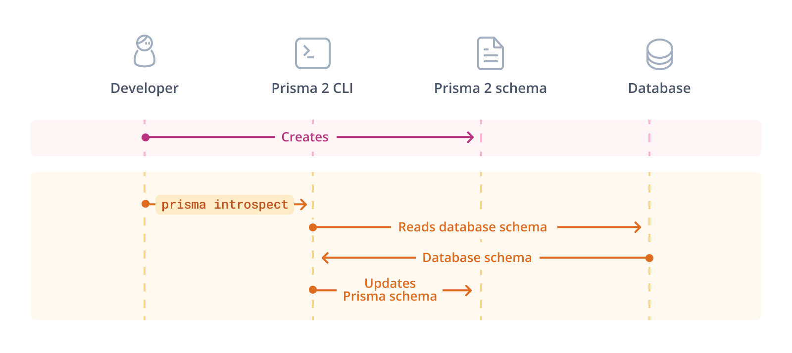
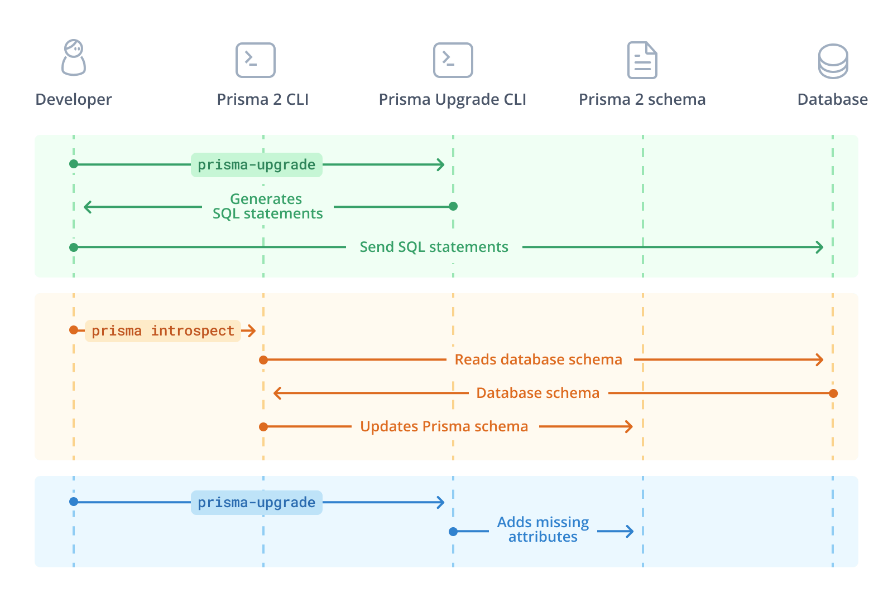

## Overview

This page helps you make an informed decision on when and how to upgrade from Prisma 1 to Prisma version 2._x_ and later.

## Upgrade documentation

The upgrade documentation consists of several pages, here's an overview of how to use them:

- **How to upgrade** (_you are here_): Starting point to learn about the upgrade process in general.
- [Schema incompatibilities](/guides/upgrade-guides/upgrade-from-prisma-1/schema-incompatibilities-postgres): A _reference_ page about the schema incompatibilities between Prisma 1 and Prisma 2._x_ (and later versions). Reading this page is optional but it will give you a better understanding of certain steps in the upgrade process.

In addition to these two pages, there are various _practical guides_ that walk you through an example scenario of the upgrade process:

- [Upgrading the Prisma layer](/guides/upgrade-guides/upgrade-from-prisma-1/upgrading-the-prisma-layer-postgres): No matter what your Prisma 1 setup looks like, you should **always start your upgrade process by following this guide**.

Once you're done with that guide, you can choose **one of the following four guides to upgrade your application layer**:

- [Old to new Nexus](./upgrading-nexus-prisma-to-nexus): Choose this guide if you're currently running Prisma 1 with GraphQL Nexus.
- [prisma-binding to Nexus](./upgrading-prisma-binding-to-nexus): Choose this guide if you're currently running Prisma 1 with `prisma-binding` and want to upgrade to [Nexus](https://www.nexusjs.org/#/).
- [prisma-binding to SDL-first](./upgrading-prisma-binding-to-sdl-first): Choose this guide if you're currently running Prisma 1 with `prisma-binding` and want to upgrade to an [SDL-first](https://www.prisma.io/blog/the-problems-of-schema-first-graphql-development-x1mn4cb0tyl3) GraphQL server.
- [REST API](./upgrading-a-rest-api): Choose this guide if you're currently running Prisma 1 using Prisma client 1 and are building a REST API.

## Main differences between Prisma 1 and Prisma version 2._x_ and later

On a high-level, the biggest differences between Prisma 1 and Prisma versions 2._x_ and later are summarized below.

Prisma 2._x_ and later versions:

- don't require hosting a database proxy server (i.e., the [Prisma server](https://v1.prisma.io/docs/1.34/prisma-server/)).
- make the features of Prisma 1 more modular and splits them into dedicated tools:
  - Prisma Client: An improved version of Prisma client 1.0
  - Prisma Migrate: Data modeling and migrations (formerly `prisma deploy`).
- use the [Prisma schema](/concepts/components/prisma-schema), a merge of Prisma 1 datamodel and `prisma.yml`.
- use its own [modeling language](https://github.com/prisma/specs/tree/master/schema) instead of being based on GraphQL SDL.
- don't expose ["a GraphQL API for your database"](https://www.prisma.io/blog/prisma-and-graphql-mfl5y2r7t49c) anymore, but only allows for _programmatic access_ via the Prisma Client API.
  - [don't support Prisma binding](/about/prisma/faq#does-prisma-client-support-graphql-schema-delegation-and-graphql-binding) any more.
- allows connecting Prisma 2._x_ and later version to any existing database, via more powerful introspection

## Feature parity

Prisma 2._x_ and later versions do not yet have full feature parity with Prisma 1. The biggest feature that is still missing from Prisma versions 2._x_ and later is real-time subscriptions.

- **Real-time API (Subscriptions)**: Prisma version 2._x_ and later currently [doesn't have a way to subscribe to events happening in the database](https://github.com/prisma/prisma/issues/298) and get notified in real time. It is currently unclear if, when, and in what form a real-time API will be added to Prisma versions 2._x_ and later. For the time being, you can implement real-time functionality using native database triggers, or if you're using GraphQL subscriptions you can consider triggering subscriptions manually inside your _mutation resolvers_.

## Schema incompatibilities

The database schema that is created when running `prisma deploy` in Prisma 1 is only partially compatible with the one that Prisma versions 2._x_ and later creates. This section gives a quick overview of the general incompatibilities and the potential workarounds.

> **Note**: For a detailed explanation of the problems and respective workarounds, please refer to the [Schema incompatibilities](/guides/upgrade-guides/upgrade-from-prisma-1/schema-incompatibilities-postgres) page.

Here's an overview of the different columns:

- **Problem**: A short description of the problem when upgrading from Prisma 1 to Prisma versions 2._x_ and later
- **SQL**: Can this be solved by making a non-breaking change to the SQL schema?
- **Prisma schema**: Can this be solved by making a non-breaking change to the schema in Prisma versions 2._x_ and later?
- **Breaking Prisma 1**: Do the SQL statements break the Prisma 1 setup? This is only relevant when you're choosing the gradual side-by-side [upgrade strategy](#upgrade-strategies).

| Problem                                                                  | SQL     | Prisma schema | Breaking Prisma 1                  |
| ------------------------------------------------------------------------ | ------- | ------------- | ---------------------------------- |
| Default values aren't represented in database                            | Yes     | Yes           | No                                 |
| Generated CUIDs as ID values aren't represented in database              | No      | Yes           | No                                 |
| `@createdAt` isn't represented in database                               | Yes     | Yes           | No                                 |
| `@updatedAt` isn't represented in database                               | No      | Yes           | No                                 |
| Inline 1-1 relations are recognized as 1-n (missing `UNIQUE` constraint) | Yes     | No            | No                                 |
| _All_ non-inline relations are recognized as m-n                         | Yes     | No            | Yes                                |
| Json type is represented as `TEXT` in database                           | Yes     | No            | No (MySQL)   Yes (PostgreSQL) |
| Enums are represented as `TEXT` in database                              | Yes     | No            | No (MySQL)   Yes (PostgreSQL) |
| Required 1-1 relations are not represented in database                   | No      | Yes           | No                                 |
| `@db` attributes from Prisma 1 are not transferred to the Prisma schema  | No      | Yes           | No                                 |
| Mismatching CUID length                                                  | Yes     | No            | No                                 |
| Scalar lists (arrays) are maintained with extra table                    | Depends | No            | Depends                            |

> **Note**: A general drawback with the workarounds in the Prisma schema is that [changes to the Prisma schema get lost after re-introspecting the database](https://github.com/prisma/prisma/issues/2425) and need to be re-added manually after each introspection run.

## Prisma Upgrade CLI

The [Prisma Upgrade CLI](https://github.com/prisma/upgrade) helps you apply the workarounds that are explained on the [Schema incompatibilities](/guides/upgrade-guides/upgrade-from-prisma-1/schema-incompatibilities-postgres) page. It generates the SQL statements to fix the database schema and make it compatible with Prisma versions 2._x_ and later. Note that you are in full control over the operations that are executed against your database, the Upgrade CLI only generates and prints the statements for you. The Upgrade CLI also takes care of the workarounds in the Prisma schema.

On a high-level, the upgrade workflow using the Upgrade CLI looks as follows.

For the **initial setup**:

1. You set up Prisma by installing the Prisma versions 2._x_ and later CLI and running `npx prisma init`.
1. You connect to your database and introspect it with `npx prisma db pull`.

For **fixing the schema incompatibilities**:

1. You invoke the Upgrade CLI with `npx prisma-upgrade`.
1. The Upgrade CLI generates SQL commands for you to run on your database.
1. You run the SQL commands against your database.
1. You run the `prisma db pull` command again.
1. You run the `npx prisma-upgrade` command again.
1. The Upgrade CLI adjusts the Prisma schema (version 2._x_ and later) by adding missing attributes.

Note that the Upgrade CLI is designed in a way that **you can stop and re-start the process at any time**. Once you ran a SQL command that was generated by the Upgrade CLI against your database, the SQL command will not show up the next time you invoke the Upgrade CLI. That way, you can gradually resolve all schema incompatibilities when it's convenient for you.

## Upgrade strategies

There are two main upgrade strategies:

- **Upgrade all at once**: Entirely remove Prisma 1 from your project and move everything over to Prisma version 2._x_ or later at once.
- **Gradual upgrade side-by-side**: Add Prisma version 2._x_ and later to the existing Prisma 1 project and gradually replace existing Prisma 1 features with the newer Prisma features while running them side-by-side.

Note that if you are planning to run Prisma 1 and Prisma 2._x_ or later version side-by-side, you must not yet resolve the [schema compatibilities](#schema-incompatibilities) that are breaking the Prisma 1 setup.

### When to choose which strategy

If your project is not yet running in production or has little traffic and user data, the **all at once** strategy is recommended.

In case your project already sees a lot of traffic and has a lot of user data stored in the database, you might want to consider the **gradual** upgrade strategy where you're running Prisma 1 and Prisma 2 or later side-by-side for a certain amount of time until you've replace all former Prisma 1 functionality with Prisma 2 or later version.

Note that you won't be able to fix the [schema incompatibilities](#schema-incompatibilities) that require a "Breaking Prisma 1" change if you choose the gradual upgrade strategy and intend to run Prisma 1 and Prisma version 2._x_ or later side-by-side. That's because these data migrations are breaking the schema that Prisma 1 expects. This means that your Prisma Client API might not feel as idiomatic as it could, but you still get the full feature set of Prisma Client.

### Upgrade path

No matter which of the strategies you choose, on a high-level the envisioned upgrade path looks as follows:

1. Install the new Prisma version 2._x_ or later CLI as a development dependency
1. Create your Prisma schema and configure the database connection URL
1. Use the Prisma version 2._x_ or later CLI to introspect your Prisma 1 database and generate your Prisma schema
1. Run the [Prisma Upgrade CLI](https://github.com/prisma/upgrade) to "fix" the Prisma schema
1. Install and generate Prisma Client version 2._x_ or later
1. Adjust your application code, specifically replace the API calls from the Prisma client 1.0 with those of Prisma Client version 2._x_ or later

## Next steps

Once you've made the decision to upgrade, continue with the [Upgrading the Prisma layer](/guides/upgrade-guides/upgrade-from-prisma-1/upgrading-the-prisma-layer-postgres) guide.
