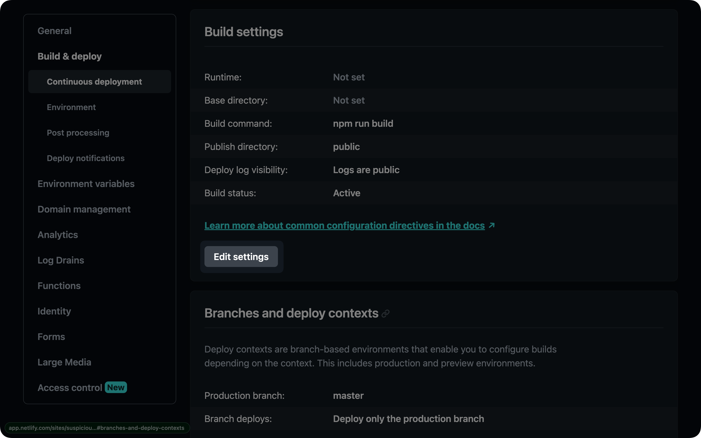
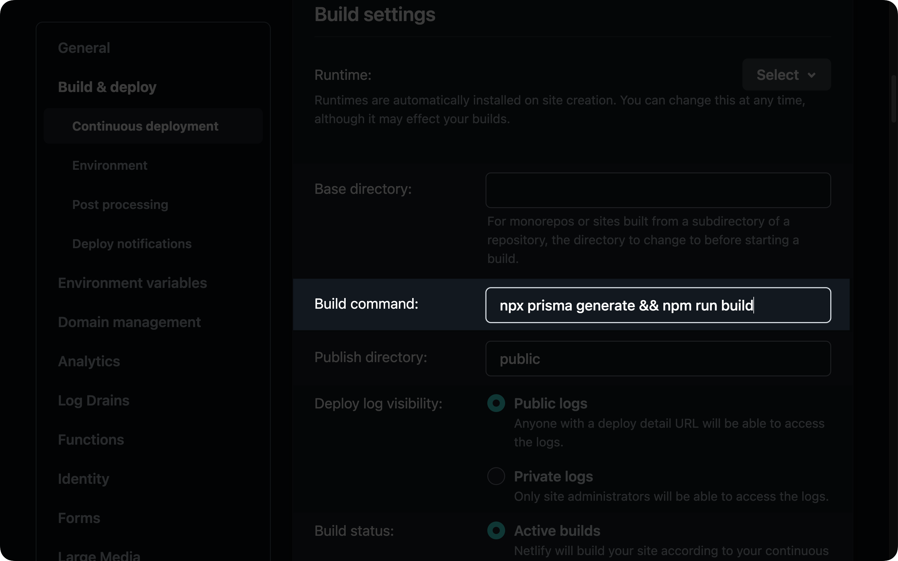

## Problem

If you deploy an application using Prisma to [Netlify](https://www.netlify.com/), you may run into strange issues as you iterate on your Prisma schema and deploy updates to your app.

These issues occur because of the fact that Netlify caches the dependencies of your project until one of those dependencies changes. It does this to allow faster builds, and while this is typically a good thing, it causes some problems for Prisma Client.

Prisma uses a `postinstall` hook to generate Prisma Client when dependencies are installed. Because Netlify uses cached modules, this `postinstall` hook never gets run during a deployment after the initial deployment. This results in Prisma Client becoming out of sync with your database schema.

## Solution

This issue can be solved by explicitly generating Prisma Client on every deployment. Running `npx prisma generate` before each deployment will ensure Prisma Client is up-to-date.

You can configure the deployment to run this command in a few different places:

### The application's `build` script in `package.json`

<Admonition type="info">

This is the preferred method as it is a universal solution.

</Admonition>

Within the `scripts` section of your project's `package.json` file, if there is not already a script named `build`, add one and run `npx prisma generate` in that script:

```json highlight=4;add
{
  ...
  "scripts" {
    "build": "npx prisma generate"
  }
  ...
}
```

<Admonition type="info">

If you already have a `build` script with existing commands, you can append the `prisma generate` by running `npx prisma generate && <your-existing-scripts>`.

</Admonition>

### Netlify UI's build script field

Another way to configure `npx prisma generate` to be run on every deployment is to add the command to the build settings via Netlify's UI.

Within your project's dashboard, go to the **Site Settings** tab and find the **Build & deploy** section. In that section, enter the **Continuous deployment** subsection.

Find the box in that section labeled **Build settings** and click the **Edit settings** button:



Clicking that button will open a form with various fields. Find the **Build command** field and append `npx prisma generate` to the existing script:


