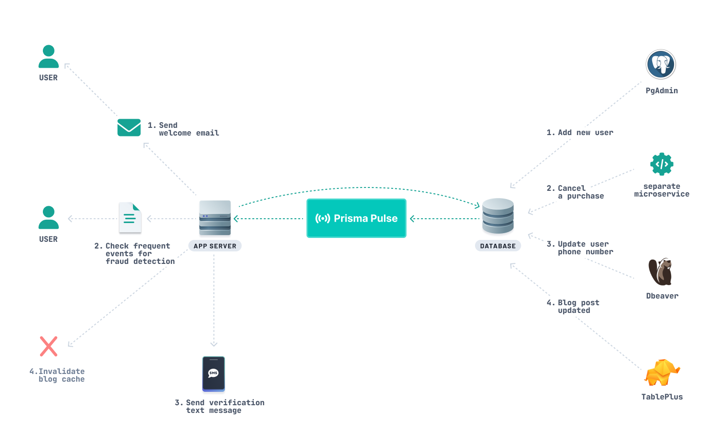

<TopBlock>

[Prisma Pulse](https://www.prisma.io/data-platform/pulse) is managed database-event infrastructure that captures and distributes your database events to your application. It simplifies subscribing to type-safe data changes with an extended [Prisma Client](/orm/prisma-client) to power real-time functionality.

</TopBlock>

## How does it work?

Prisma Pulse leverages Change Data Capture (CDC) to efficiently observe and capture database changes as they occur. By monitoring the database's transaction log, Prisma Pulse identifies change events like inserts, updates, and deletes without impacting the database's performance.

The captured events are processed, evaluated, and swiftly distributed to relevant client subscriptions ensuring your applications stay synchornized with the latest database state.

This eliminates the need for complex polling or manual data synchronization, saving you development time and effort.

## What can I build with it?

Prisma Pulse can power real-time functionality like chat, notifications, data broadcast, data synchronization, and more.

It's ideal for ensuring data consistency in distributed systems, enhancing real-time user experiences.

## Examples

Here are a few example projects using Prisma Pulse:

| Project                                                          | Description                                                                                        |
| :--------------------------------------------------------------- | -------------------------------------------------------------------------------------------------- |
| [pulse-starter](https://github.com/prisma/pulse-starter)         | General Pulse starter project.                                                                     |
| [pulse-resend-demo](https://github.com/prisma/pulse-resend-demo) | Optimize your onboarding with Pulse by triggering welcome emails via Resend for new user sign-ups. |
